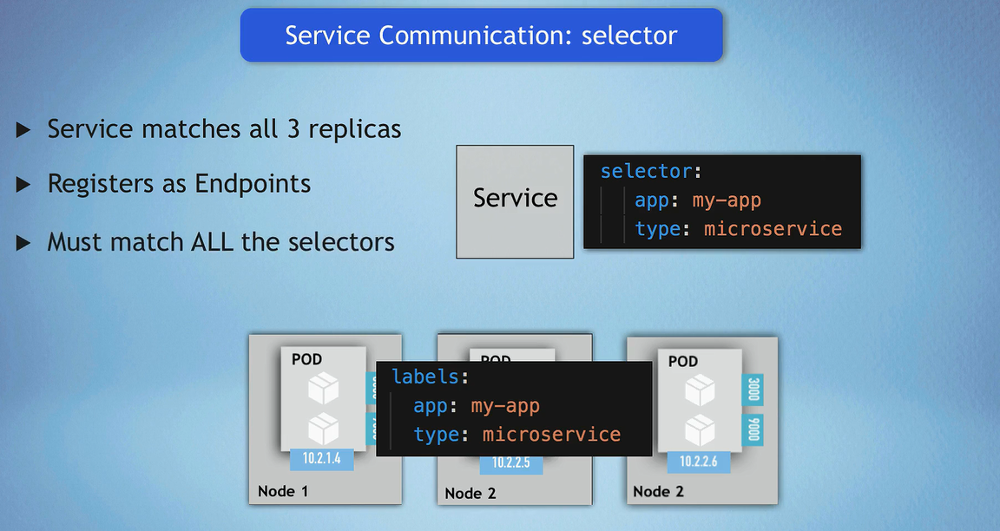
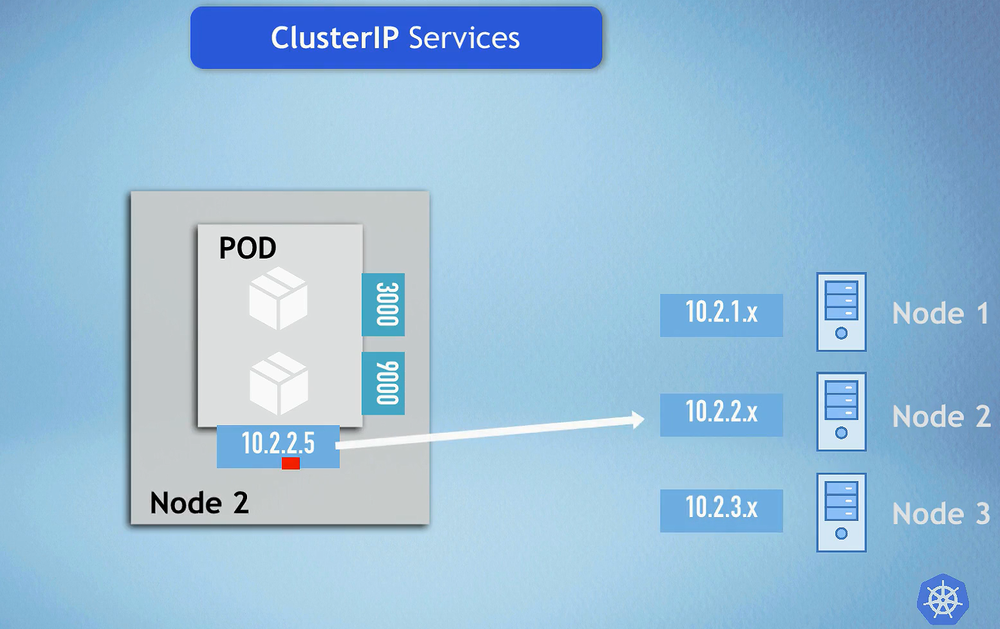
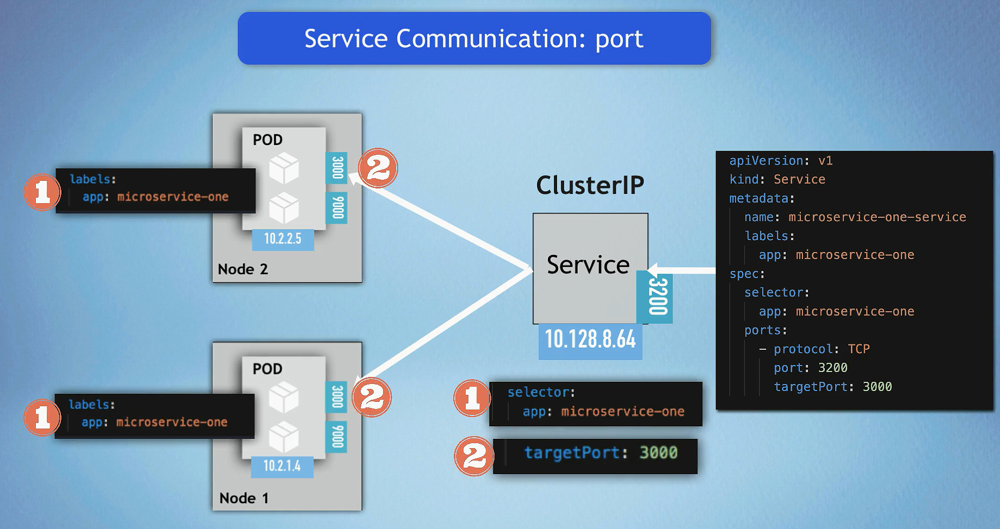
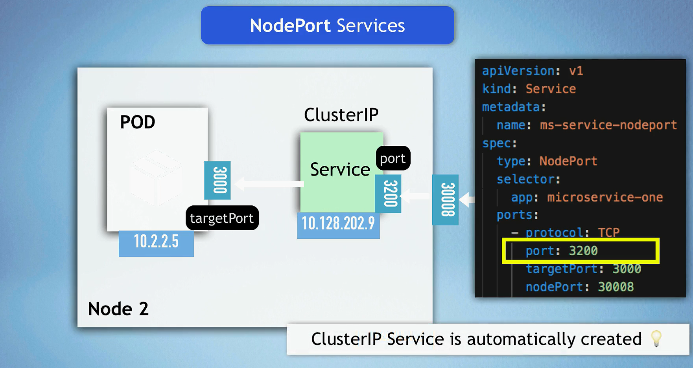
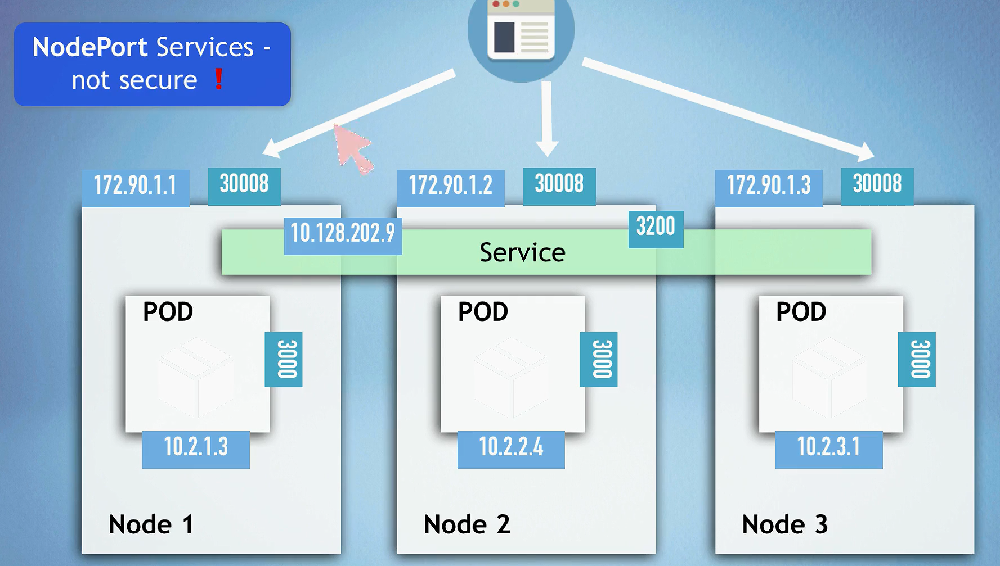
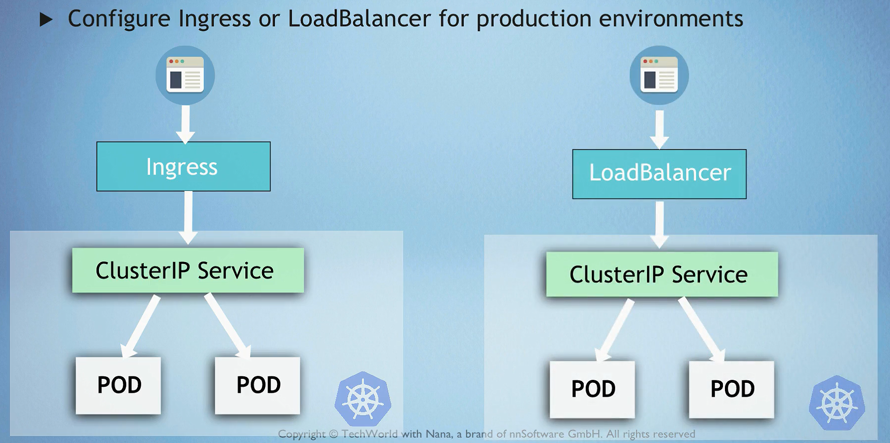
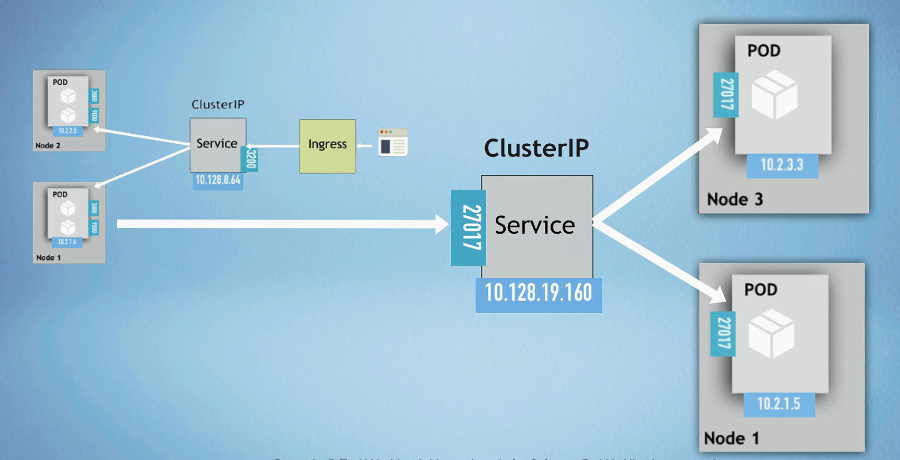
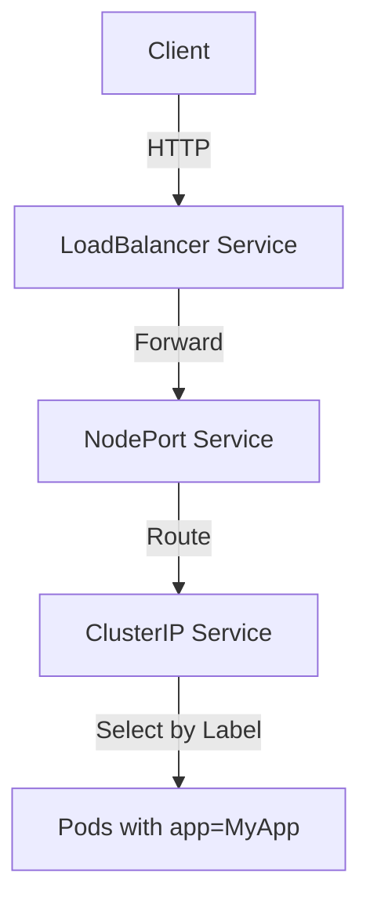

# 🧩 **Kubernetes Services — The Smart Traffic Managers**

In **Kubernetes**, a **Service** is an abstraction that provides **stable networking** for dynamic, ever-changing Pods.
It defines **how clients reach your Pods**, even as Pods are created, destroyed, or replaced.

---

## 🌟 **Core Concept**

> Services act as a _permanent gateway_ for temporary Pods.

### 🧠 Key Principles

- 🏷️ **Pods are labeled**, and Services **select** Pods using **label selectors**.
- 🌐 Each Service has a **stable IP** and **DNS name** (e.g., `my-service.default.svc.cluster.local`).
- ⚙️ **kube-proxy**, running on every node, maintains service endpoints and routes traffic.
- 🔁 **NodePort** extends **ClusterIP**, and **LoadBalancer** extends **NodePort**.
- 🧩 Services **decouple** clients from Pod details, enabling smooth scaling and restarts.

<div align="left" style="margin-left: 30px">
  
</div>

---

## 🎯 **Why We Need Services**

<div align="center" style="background-color: #141a19ff;color: #a8a5a5ff; border-radius: 10px; border: 2px solid">

| Purpose                       | Description                                                  |
| ----------------------------- | ------------------------------------------------------------ |
| 🔄 **Dynamic Pod Management** | Pods are ephemeral; Services ensure consistent access.       |
| ⚖️ **Load Balancing**         | Traffic is distributed evenly across healthy Pods.           |
| 🧱 **Decoupling**             | Clients call a single Service endpoint, not individual Pods. |

</div>

---

## ⚙️ **Service Types**

Kubernetes supports **four types of Services**, each for different exposure levels 👇

---

### 1️⃣ **ClusterIP (default)** — _Internal Access Only_

- 📘 **Definition:** Creates an internal virtual IP to reach Pods **within the cluster**.
- 🔒 Not accessible externally.
- 🧩 Used for microservices communicating privately.

<div align="left" style="margin-left: 30px">
  
</div>
<div align="left" style="margin-left: 30px">
  
</div>
<div align="left" style="margin-left: 30px">
  
</div>

#### 🧾 Example

```yaml
apiVersion: v1
kind: Service
metadata:
  name: my-service
spec:
  selector:
    app: MyApp
  ports:
    - protocol: TCP
      port: 80
      targetPort: 8080
  type: ClusterIP
```

#### ✅ Use Case

Internal APIs (e.g., backend → database).

---

### 2️⃣ **NodePort** — _External Access via Node IP_

- 📘 **Definition:** Exposes the Service on **each Node’s IP** at a specific port (30000–32767).
- 🌍 Accessible using `<NodeIP>:<NodePort>`.
- 🔁 Automatically creates a **ClusterIP** behind the scenes.

<div align="left" style="margin-left: 30px">
  
</div>
<div align="left" style="margin-left: 30px">
  
</div>

#### 🧾 Example

```yaml
apiVersion: v1
kind: Service
metadata:
  name: my-service
spec:
  type: NodePort
  selector:
    app: MyApp
  ports:
    - protocol: TCP
      port: 80
      targetPort: 8080
      nodePort: 30007
```

#### ✅ Use Case

Quick testing or limited external access (e.g., QA environment).

---

### 3️⃣ **LoadBalancer** — _External Access with Cloud Integration_

- 📘 **Definition:** Integrates with the cloud provider’s Load Balancer to expose the service publicly.
- ☁️ The cloud assigns an **external IP** automatically.
- 🔁 Creates both **ClusterIP** and **NodePort** underneath.

<div align="left" style="margin-left: 30px">
  
</div>
<div align="left" style="margin-left: 30px">
  
</div>

#### 🧾 Example

```yaml
apiVersion: v1
kind: Service
metadata:
  name: my-service
spec:
  type: LoadBalancer
  selector:
    app: MyApp
  ports:
    - protocol: TCP
      port: 80
      targetPort: 8080
```

#### ✅ Use Case

Production web apps needing internet access (e.g., `example.com`).

---

### 4️⃣ **ExternalName** — _DNS Alias Service_

- 📘 **Definition:** Maps a Service name to an **external DNS name** via a CNAME record.
- 🧭 Does **not** create a cluster IP.
- 🧩 Used to access external resources transparently.

#### 🧾 Example

```yaml
apiVersion: v1
kind: Service
metadata:
  name: my-service
spec:
  type: ExternalName
  externalName: my.database.example.com
```

#### ✅ Use Case

Connecting internal Pods to an external database or SaaS API.

---

## 🔢 **Multi-Port Services**

When a Pod exposes multiple ports (e.g., HTTP + HTTPS), a single Service can define multiple mappings.

<div align="left" style="margin-left: 30px">
  
</div>
<div align="left" style="margin-left: 30px">
  
</div>

### 🧾 Example

```yaml
apiVersion: v1
kind: Service
metadata:
  name: my-service
spec:
  selector:
    app: MyApp
  ports:
    - protocol: TCP
      port: 80
      targetPort: 8080
    - protocol: TCP
      port: 443
      targetPort: 8443
  type: ClusterIP
```

---

## 🧩 **Real-World Scenarios**

<div align="center" style="background-color: #141a19ff;color: #a8a5a5ff; border-radius: 10px; border: 2px solid">

| Scenario                 | Service Type | Description                                      |
| ------------------------ | ------------ | ------------------------------------------------ |
| 🏗️ Internal microservice | ClusterIP    | Backend accessible only to other Pods            |
| 🌍 Public web app        | LoadBalancer | Cloud load balancer provides external IP         |
| 🧪 Testing environment   | NodePort     | Access via Node IP and NodePort                  |
| ☁️ External database     | ExternalName | Kubernetes-native DNS alias for external service |

</div>

---

## 🚀 **Benefits Summary**

<div align="center" style="background-color: #141a19ff;color: #a8a5a5ff; border-radius: 10px; border: 2px solid">

| Service Type     | Benefits                                     | Typical Use                     |
| ---------------- | -------------------------------------------- | ------------------------------- |
| **ClusterIP**    | Simple internal communication                | Internal APIs, backend services |
| **NodePort**     | External access without LB                   | Dev/test environments           |
| **LoadBalancer** | External access with built-in load balancing | Production workloads            |
| **ExternalName** | Seamless external service integration        | External DBs or APIs            |

</div>

---

## 🧭 **How It All Connects (Visual Flow)**

<div align="center" style="background-color: #141a19ff;color: #a8a5a5ff; border-radius: 10px; border: 2px solid">



</div>

---

## 🏁 **Conclusion**

Kubernetes **Services** are the glue that holds the dynamic world of Pods together.
They ensure **stability, scalability, and accessibility** — without exposing Pod internals.

By choosing the right Service type (`ClusterIP`, `NodePort`, `LoadBalancer`, or `ExternalName`),
you control **who can access your app**, **how traffic flows**, and **how it scales** — all the magic of cloud-native networking ✨
