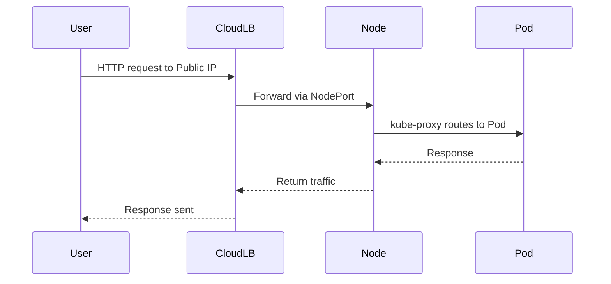

# ☁️ **Kubernetes LoadBalancer Service — Exposing Apps to the Internet (the Cloud-Native Way)**

## 📖 **What Is a LoadBalancer Service?**

A **LoadBalancer** service is the cloud-native way to expose your Kubernetes application to the **public Internet**.

When you create a `Service` of type `LoadBalancer`, Kubernetes:

1. Automatically creates a **NodePort** behind the scenes.
2. Asks the **Cloud Controller Manager (CCM)** (AWS, Azure, GCP, etc.) to provision a **real load balancer** in your cloud provider.
3. Assigns a **public IP or DNS name** to that load balancer.

That means external users can access your app directly at a stable, managed address.

---

## 🌐 **Internal Flow Summary**

```mermaid
---
config:
  theme: dark
  look: handDrawn
title: "🌐 Kubernetes LoadBalancer Service Flow"
---

flowchart LR
  A[🧑‍💻 Internet User] --> |🌍 Public_LB_IP:80| B[🌩️ Cloud LB]

  B -->|🔗 NodeIP1:30001| C["🧱 Node (Worker1)"]
  B -->|🔗 NodeIP2:30002| D["🧱 Node (Worker2)"]

  C -->|🎯 ClusterIP:8080| X1[📦 kube-proxy]
  D -->|🎯 ClusterIP:8080| X2[📦 kube-proxy]

  X1 -->|📡 PodIP1:80| E[🧩 Pod1: app=web]
  X1 -->|📡 PodIP2:80 ✅ | F[🧩 Pod2: app=web]
  X2 -->|📡 PodIP1:80| E
  X2 -->|📡 PodIP2:80| F
```

<div align="center" style="background-color: #141a19ff;color: #a8a5a5ff; border-radius: 10px; border: 2px solid">



</div>

### So:

- Client hits **Public IP** → Cloud Load Balancer.
- LB sends traffic to **NodePort** on worker nodes.
- `kube-proxy` forwards traffic to one of the **Pods**.

---

## 📝 **Example Manifest**

Let’s expose the same app publicly this time.

```yaml
apiVersion: v1
kind: Service
metadata:
  name: web-lb
spec:
  selector:
    app: web
  type: LoadBalancer
  ports:
    - port: 80
      targetPort: 80
```

Apply:

```bash
kubectl apply -f web-lb.yaml
kubectl get svc
```

Output (after a few seconds/minutes):

```ini
NAME       TYPE           CLUSTER-IP      EXTERNAL-IP       PORT(S)        AGE
web-lb     LoadBalancer   10.0.26.45      a1b2c3d4.elb.amazonaws.com   80:32123/TCP   2m
```

✅ Kubernetes automatically provisioned:

- A **ClusterIP** (internal)
- A **NodePort** (for node-level routing)
- A **Cloud Load Balancer** (with external IP/DNS)

---

## 🧭 **Accessing the App**

Now it’s public 🎉

```ini
curl http://a1b2c3d4.elb.amazonaws.com
```

You’ll get:

```ini
<html>
<head><title>Welcome to nginx!</title></head>
...
```

---

## ☁️ **Cloud-Specific Behavior**

<div align="center" style="background-color: #141a19ff;color: #a8a5a5ff; border-radius: 10px; border: 2px solid">

| Cloud          | Load Balancer Type | IP Type            | Notes                       |
| -------------- | ------------------ | ------------------ | --------------------------- |
| **AWS**        | Classic or NLB     | Public or Internal | Created via ELB API         |
| **Azure**      | Azure Standard LB  | Public or Internal | Public IP from Azure LB     |
| **GCP**        | Network LB         | Public             | Managed via GCE LB API      |
| **Bare-metal** | None (no CCM)      | —                  | Must use MetalLB or similar |

</div>

---

## ⚙️ **Internal vs External LoadBalancer**

### ✅ External (default)

- Creates a public IP.
- Accessible from the Internet.
- Example:

  ```yaml
  type: LoadBalancer
  ```

### 🔒 Internal-only LoadBalancer

Use annotation to limit exposure within your VPC/subnet:

**AWS:**

```yaml
annotations:
  service.beta.kubernetes.io/aws-load-balancer-internal: "true"
```

**Azure:**

```yaml
annotations:
  service.beta.kubernetes.io/azure-load-balancer-internal: "true"
```

**GCP:**

```yaml
annotations:
  cloud.google.com/load-balancer-type: "Internal"
```

---

## 🧰 **Useful Annotations (Cloud-Specific)**

<div align="center" style="background-color: #141a19ff;color: #a8a5a5ff; border-radius: 10px; border: 2px solid">

| Cloud | Annotation                                                      | Purpose                |
| ----- | --------------------------------------------------------------- | ---------------------- |
| AWS   | `service.beta.kubernetes.io/aws-load-balancer-type: nlb`        | Use NLB instead of CLB |
| AWS   | `aws-load-balancer-scheme: internal`                            | Make it internal       |
| Azure | `service.beta.kubernetes.io/azure-load-balancer-resource-group` | Use custom LB RG       |
| GCP   | `cloud.google.com/load-balancer-type: Internal`                 | Internal LB            |
| All   | `service.beta.kubernetes.io/load-balancer-source-ranges`        | Restrict source IPs    |

</div>

---

Example (restrict access):

```yaml
annotations:
  service.beta.kubernetes.io/load-balancer-source-ranges: "203.0.113.0/24"
```

---

## 🗝️ **Key Flow Recap**

Let’s trace what happens step by step:

<div align="center" style="background-color: #141a19ff;color: #a8a5a5ff; border-radius: 10px; border: 2px solid">



</div>

---

## ❤️‍🩹 **Health Checks**

The **cloud load balancer** periodically checks Node health using NodePorts.

- If a node is unhealthy, it stops sending traffic there.
- Readiness probes ensure only **ready Pods** receive traffic.

You can customize the health check path with annotations (cloud-specific).
Example (AWS ALB Ingress):

```yaml
service.beta.kubernetes.io/aws-load-balancer-healthcheck-path: /healthz
```

---

## 🧪 **Troubleshooting LoadBalancer Services**

<div align="center" style="background-color: #141a19ff;color: #a8a5a5ff; border-radius: 10px; border: 2px solid">

| Symptom                             | Likely Cause                                   | Fix                                |
| ----------------------------------- | ---------------------------------------------- | ---------------------------------- |
| `EXTERNAL-IP` = `<pending>`         | Cloud Controller not running or no permissions | Check CCM logs                     |
| DNS resolves but no response        | Security group/firewall blocked                | Open inbound port                  |
| Works internally but not externally | Internal-only LB                               | Remove internal annotation         |
| Load balancing uneven               | Pod readiness failing                          | Check readinessProbe               |
| Load balancer recreated repeatedly  | Spec mismatch or annotation changes            | Avoid changing type after creation |

</div>

### Logs to inspect

```bash
kubectl logs -n kube-system -l k8s-app=kube-controller-manager
kubectl logs -n kube-system -l app=kube-proxy
```

---

## 🤔 **When to Use LoadBalancer**

✅ **Best for production-grade external access**  
✅ Ideal for web apps, APIs, or public endpoints  
✅ Supports managed IPs, SSL termination, and scaling  
✅ Integrates with cloud-native features like WAF, firewall rules, and global routing

---

## ⚖️ **NodePort vs LoadBalancer Comparison**

<div align="center" style="background-color: #141a19ff;color: #a8a5a5ff; border-radius: 10px; border: 2px solid">

| Feature           | NodePort              | LoadBalancer         |
| ----------------- | --------------------- | -------------------- |
| External IP       | Node IP               | Cloud LB Public IP   |
| Port Range        | 30000–32767           | 80, 443, etc.        |
| Load balancing    | Basic (kube-proxy)    | Cloud-managed        |
| Cloud integration | None                  | Yes                  |
| Best for          | Simple/local clusters | Production workloads |

</div>

---

## ✅ **Best Practices**

- Use `LoadBalancer` **only for edge-facing services**.
- Use **Ingress** for routing multiple apps through one LB (more efficient).
- Restrict public access via `load-balancer-source-ranges`.
- Prefer **internal** LBs for private systems (databases, backends).
- Always verify **Pod readiness** and **security groups**.
