# 🌐 **Ingress in Kubernetes (Core Concept)**

> _The Smart Entry Point for HTTP/HTTPS Traffic_

---

## 📖 **What Is Ingress?**

**Ingress** is a **Kubernetes API object** that defines **rules for routing external HTTP(S) traffic** to internal **Services** within your cluster.

Unlike `NodePort` or `LoadBalancer` Services — which expose only **one Service per IP** — an **Ingress** lets you expose **multiple Services** via **one public endpoint**, using smart rules like:

- **Host-based routing** (`app1.example.com` → frontend)
- **Path-based routing** (`/api` → backend)
- **TLS termination** (HTTPS at the edge)
- **Redirects & rewrites**

---

## 🤔 **Why Ingress Exists**

Without Ingress, if you have 10 services, you’d need **10 separate LoadBalancers** (and 10 public IPs) 😱

With Ingress, you can have **one single LoadBalancer** (or even just one public IP) handling traffic to all internal services, intelligently.

---

## ⚙️ **Ingress Core Structure (YAML)**

Here’s the **basic Ingress object** structure (independent of any controller):

```yaml
apiVersion: networking.k8s.io/v1
kind: Ingress
metadata:
  name: my-ingress
spec:
  rules:
    - host: example.com
      http:
        paths:
          - path: /
            pathType: Prefix
            backend:
              service:
                name: frontend-svc
                port:
                  number: 80
          - path: /api
            pathType: Prefix
            backend:
              service:
                name: backend-svc
                port:
                  number: 8080
```

---

### 🔍 Key Fields

<div align="center" style="background-color: #141a19ff;color: #a8a5a5ff; border-radius: 10px; border: 2px solid">

| Field                         | Description                                                   |
| ----------------------------- | ------------------------------------------------------------- |
| `host`                        | Domain name handled by this rule                              |
| `path`                        | URL path pattern to match                                     |
| `pathType`                    | Matching type: `Prefix`, `Exact`, or `ImplementationSpecific` |
| `backend.service.name`        | Target Kubernetes Service                                     |
| `backend.service.port.number` | Target Service port                                           |

</div>

---

## 🧭 **Routing Logic (Behind the Scenes)**

```mermaid
flowchart LR
  A[🌐 External Client] --> B[☁️ Ingress Entry Point]
  B -->|Host: example.com| C[Ingress Rules]
  C -->|Path /api| D[Service: backend-svc]
  C -->|Path /| E[Service: frontend-svc]
  D --> Pod1((Pod))
  E --> Pod2((Pod))
```

<div align="center" style="background-color: #141a19ff;color: #a8a5a5ff; border-radius: 10px; border: 2px solid">



</div>

---

🧩 Here’s what happens:

1. The client sends a request to `example.com/api`.
2. Kubernetes checks the Ingress resource rules.
3. It matches `/api` → forwards to `backend-svc`.
4. `backend-svc` → forwards to one of its Pods (via kube-proxy or CNI).
5. Response goes back through the same chain.

---

## 🤹🏻 **Path Types Explained**

<div align="center" style="background-color: #141a19ff;color: #a8a5a5ff; border-radius: 10px; border: 2px solid">

| Type                       | Description                                                             |
| -------------------------- | ----------------------------------------------------------------------- |
| **Prefix**                 | Matches all paths starting with the prefix (e.g. `/api` → `/api/users`) |
| **Exact**                  | Matches only the exact path `/api`                                      |
| **ImplementationSpecific** | Controller-specific logic (not portable; avoid in production)           |

</div>

---

## 🔐 **TLS Support (HTTPS at the Edge)**

Ingress can terminate SSL using a Kubernetes **Secret** of type `tls`.

Example:

```yaml
apiVersion: networking.k8s.io/v1
kind: Ingress
metadata:
  name: secure-app
spec:
  tls:
    - hosts:
        - myapp.example.com
      secretName: myapp-tls
  rules:
    - host: myapp.example.com
      http:
        paths:
          - path: /
            pathType: Prefix
            backend:
              service:
                name: web-svc
                port:
                  number: 80
```

Create TLS secret:

```bash
kubectl create secret tls myapp-tls \
  --cert=cert.crt \
  --key=cert.key
```

This lets your Ingress terminate HTTPS at the controller level.

---

## ⚡ **IngressClass (Selecting the Controller)**

Kubernetes allows multiple Ingress implementations (e.g., `NGINX`, `Traefik`, AWS ALB).

To specify which controller should handle your Ingress:

```yaml
spec:
  ingressClassName: nginx
```

Each controller registers its **IngressClass** when installed.

List available classes:

```bash
kubectl get ingressclass
```

Output:

```ini
NAME      CONTROLLER
nginx     k8s.io/ingress-nginx
traefik   traefik.io/ingress-controller
alb       alb.ingress.k8s.aws
```

---

## 🧰 **Managing Ingress Resources**

### Create

```bash
kubectl apply -f ingress.yaml
```

### List

```bash
kubectl get ingress
```

### Describe

```bash
kubectl describe ingress my-ingress
```

### Delete

```bash
kubectl delete ingress my-ingress
```

---

## 🌐 **Practical DNS Integration**

Your DNS record (e.g. `myapp.example.com`) should point to:

- The **external IP** of your Ingress Controller’s LoadBalancer service.

Check it:

```bash
kubectl get svc -A | grep ingress
```

Then in DNS:

```ini
myapp.example.com → 52.14.55.23
```

---

## 😣 **Common Misunderstandings**

<div align="center" style="background-color: #141a19ff;color: #a8a5a5ff; border-radius: 10px; border: 2px solid">

| Misconception                        | Reality                                                               |
| ------------------------------------ | --------------------------------------------------------------------- |
| “Ingress itself handles traffic.”    | ❌ Ingress is just configuration — the controller does the real work. |
| “Ingress can handle TCP/UDP apps.”   | ❌ Ingress is for **HTTP/HTTPS** only. Use `Service` for TCP/UDP.     |
| “I don’t need LoadBalancer anymore.” | ❌ You still need one **entry LoadBalancer** for the controller.      |
| “Each Ingress gives a new IP.”       | ❌ All Ingresses under one controller share the same IP.              |

</div>

---

## 🎯 **When to Use Ingress**

✅ Use when:

- You have **multiple web services** (microservices).
- You need **TLS termination**.
- You want **path/host routing**.
- You’re running in a **cloud provider** or have **MetalLB** for external IPs.

❌ Don’t use when:

- You’re exposing **TCP/UDP-only** apps (e.g., databases, MQs).
- You don’t have an Ingress Controller installed.

---

## 🔴 **Common Problems & Fixes**

<div align="center" style="background-color: #141a19ff;color: #a8a5a5ff; border-radius: 10px; border: 2px solid">

| Problem                       | Likely Cause                       | Fix                             |
| ----------------------------- | ---------------------------------- | ------------------------------- |
| `ADDRESS` = `<pending>`       | No Ingress Controller              | Deploy one (e.g. NGINX)         |
| 404 on access                 | Rule mismatch or Service name typo | `kubectl describe ingress`      |
| HTTPS fails                   | Secret missing or host mismatch    | Check TLS secret                |
| One route works, others don’t | Path type mismatch                 | Use `Prefix` instead of `Exact` |
| Internal-only routing fails   | Missing DNS or IP rule             | Map DNS to correct IP           |

</div>

---

## 🧾 **Quick Recap**

- **Ingress** = Routing rules object (L7)
- **Controller** = The actual proxy engine
- **IngressClass** = Defines which controller handles the Ingress
- **Rules** = Map host + path → Service
- **TLS** = Terminate HTTPS connections
- **DNS** = Points external hostname → controller’s LoadBalancer IP

---

## ✍🏻 **Example Multi-App Ingress Setup**

```yaml
apiVersion: networking.k8s.io/v1
kind: Ingress
metadata:
  name: multi-app
spec:
  rules:
    - host: shop.example.com
      http:
        paths:
          - path: /cart
            pathType: Prefix
            backend:
              service:
                name: cart-svc
                port:
                  number: 80
          - path: /checkout
            pathType: Prefix
            backend:
              service:
                name: checkout-svc
                port:
                  number: 80
    - host: blog.example.com
      http:
        paths:
          - path: /
            pathType: Prefix
            backend:
              service:
                name: blog-svc
                port:
                  number: 80
```

✅ Two domains — one Ingress object — one LoadBalancer IP.

---

## 🥳 **Ingress Command Line Interface (CLI)**

Now, in k8s version 1.20+, we can create an Ingress resource in the imperative way like this:-

```bash
kubectl create ingress name  --rule="host/path=service:port"
```

```bash
kubectl create ingress ingress-test --rule="wear.my-online-store.com/wear*=wear-service:80"
```

Find more information and examples in the below reference link:-

- <https://kubernetes.io/docs/reference/generated/kubectl/kubectl-commands#-em-ingress-em->

References:-

- <https://kubernetes.io/docs/concepts/services-networking/ingress>
- <https://kubernetes.io/docs/concepts/services-networking/ingress/#path-types>

---

## 🏁 **Summary Table**

<div align="center" style="background-color: #141a19ff;color: #a8a5a5ff; border-radius: 10px; border: 2px solid">

| Layer | Object               | Responsibility                      |
| ----- | -------------------- | ----------------------------------- |
| L4    | LoadBalancer Service | Provides public entry IP            |
| L7    | Ingress              | Defines routing rules               |
| L7    | Ingress Controller   | Applies rules and forwards requests |
| L7    | Service              | Exposes backend Pods                |
| L7    | Pod                  | Runs your application               |

</div>
