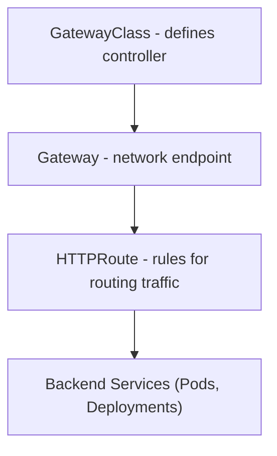
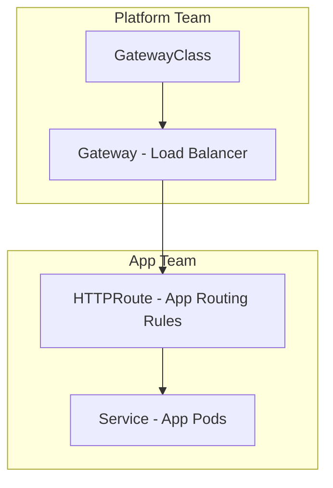

# 🌉 **Kubernetes Gateway API — The Future of Networking**

> _Think of Gateway API as “Ingress 2.0”: more flexible, secure, and controller-neutral, built for multi-team and multi-tenant clusters._

---

## 🤔 **Why Gateway API?**

The **Ingress API** was simple but limited:

- It bundled routing, TLS, and controller behavior all in one resource.
- It didn’t support advanced use cases like cross-namespace routing, granular ownership, or different traffic types.

**Gateway API** solves this by splitting concerns across multiple CRDs (Custom Resource Definitions), giving better:

- **Separation of roles** (network, app, security teams)
- **Extensibility** (custom filters, multiple controllers)
- **Multi-tenancy support**
- **Protocol flexibility (HTTP, TCP, TLS)**

---

## 🧩 **Core Resources**

<div align="center" style="background-color: #141a19ff;color: #a8a5a5ff; border-radius: 10px; border: 2px solid">

| Resource                            | Purpose                                                 | Similar to                 |
| ----------------------------------- | ------------------------------------------------------- | -------------------------- |
| **GatewayClass**                    | Defines the type of gateway (controller implementation) | IngressClass               |
| **Gateway**                         | Represents the actual load balancer or entry point      | Ingress controller Service |
| **HTTPRoute**                       | Defines HTTP routing rules                              | Ingress                    |
| **TCPRoute / TLSRoute / GRPCRoute** | Handle non-HTTP traffic                                 | —                          |
| **ReferencePolicy**                 | Allows cross-namespace linking                          | —                          |

</div>

---

### 📘 Concept Diagram

<div align="center" style="background-color: #141a19ff;color: #a8a5a5ff; border-radius: 10px; border: 2px solid">



</div>

---

## ⚙️ **Example Overview**

### Step 1️⃣ — Define GatewayClass

```yaml
apiVersion: gateway.networking.k8s.io/v1
kind: GatewayClass
metadata:
  name: nginx
spec:
  controllerName: k8s.io/ingress-nginx
```

This tells Kubernetes:

> “All Gateways using this class are managed by the NGINX controller.”

---

### Step 2️⃣ — Create a Gateway

```yaml
apiVersion: gateway.networking.k8s.io/v1
kind: Gateway
metadata:
  name: web-gateway
  namespace: networking
spec:
  gatewayClassName: nginx
  listeners:
    - name: web
      port: 80
      protocol: HTTP
      allowedRoutes:
        namespaces:
          from: All
```

**This creates the actual network entry point** — think of it as the LoadBalancer or reverse proxy.

---

### Step 3️⃣ — Define HTTPRoute

```yaml
apiVersion: gateway.networking.k8s.io/v1
kind: HTTPRoute
metadata:
  name: app-route
  namespace: appspace
spec:
  parentRefs:
    - name: web-gateway
      namespace: networking
  hostnames:
    - "app.example.com"
  rules:
    - matches:
        - path:
            type: PathPrefix
            value: /api
      backendRefs:
        - name: app-service
          port: 80
```

This defines the **routing logic**:

- `Host` → `app.example.com`
- `Path` → `/api`
- `Backend` → `app-service:80`

✅ You can attach multiple routes to one Gateway.

---

## 🔐 **TLS Configuration**

TLS is configured at the **Gateway** level, not per-route.

```yaml
listeners:
  - name: websecure
    port: 443
    protocol: HTTPS
    tls:
      mode: Terminate
      certificateRefs:
        - name: tls-cert
          kind: Secret
```

Gateway API supports multiple certificates, SNI routing, and mutual TLS (mTLS) in advanced setups.

---

## 🧱 **Multi-Tenancy with ReferencePolicy**

By default, one namespace cannot bind its route to another namespace’s Gateway for security reasons.

You must explicitly allow it:

```yaml
apiVersion: gateway.networking.k8s.io/v1
kind: ReferencePolicy
metadata:
  name: allow-appspace
  namespace: networking
spec:
  from:
    - group: gateway.networking.k8s.io
      kind: HTTPRoute
      namespace: appspace
  to:
    - group: ""
      kind: Service
```

✅ This enables **safe cross-namespace routing** — one of the biggest improvements over Ingress.

---

## ⚡ **Advanced Routing**

<div align="center" style="background-color: #141a19ff;color: #a8a5a5ff; border-radius: 10px; border: 2px solid">

| Feature                  | Description                                              |
| ------------------------ | -------------------------------------------------------- |
| **Header Matching**      | Route by header name/value                               |
| **Query Param Matching** | Route by query string                                    |
| **Method Matching**      | GET/POST routing                                         |
| **Filters**              | Modify requests/responses (add headers, redirects, etc.) |
| **Traffic Splitting**    | Split across multiple backends with weights              |

</div>

---

Example:

```yaml
rules:
  - matches:
      - headers:
          - type: Exact
            name: X-Version
            value: beta
    backendRefs:
      - name: beta-service
        port: 80
      - name: stable-service
        port: 80
        weight: 80
```

---

## 🧩 **Filters (like Middlewares)**

Filters replace Ingress annotations or Traefik middlewares.
They modify requests or responses **at the route level**.

Common filters:

- `RequestHeaderModifier`
- `ResponseHeaderModifier`
- `RequestRedirect`
- `URLRewrite`

Example:

```yaml
filters:
  - type: RequestHeaderModifier
    requestHeaderModifier:
      add:
        X-Env: "staging"
```

---

## 🧰 **Gateway API vs Ingress**

<div align="center" style="background-color: #141a19ff;color: #a8a5a5ff; border-radius: 10px; border: 2px solid">

| Feature                     | Ingress                 | Gateway API                |
| --------------------------- | ----------------------- | -------------------------- |
| **Scope**                   | Single object           | Modular resources          |
| **Cross-namespace Routing** | ❌                      | ✅ (with ReferencePolicy)  |
| **Protocol Support**        | HTTP/HTTPS              | HTTP, TCP, TLS, gRPC, UDP  |
| **Ownership Model**         | Single team             | Multi-team (infra + app)   |
| **Controller Neutral**      | No                      | Yes                        |
| **Extensibility**           | Annotations             | Filters, CRDs              |
| **GatewayClass**            | IngressClass equivalent | More flexible and powerful |

</div>

---

## 🧱 **GatewayClass Implementations**

Gateway API is **controller-neutral** — many controllers implement it:

<div align="center" style="background-color: #141a19ff;color: #a8a5a5ff; border-radius: 10px; border: 2px solid">

| Controller                 | Type                     |
| -------------------------- | ------------------------ |
| **NGINX Gateway Fabric**   | NGINX-based              |
| **Traefik v3**             | Full Gateway API support |
| **Istio**                  | Gateway API-compliant    |
| **Kong Gateway**           | Supported                |
| **GKE Gateway Controller** | Native on Google Cloud   |
| **AWS Gateway Controller** | Works with ALB           |

</div>

---

So you can switch controllers **without rewriting YAMLs** — just change the `GatewayClass`.

---

## 🧩 **Visualization: Multi-Layer Ownership**

<div align="center" style="background-color: #141a19ff;color: #a8a5a5ff; border-radius: 10px; border: 2px solid">



</div>

---

- Platform team controls Gateways (infrastructure).
- Application team manages HTTPRoutes (apps).
- Everyone works safely in parallel.

---

## ⚙️ **Observability**

- **Events:** Each resource emits detailed events (`kubectl describe gateway httproute`)
- **Status fields:** Report which routes are attached, rejected, or invalid
- **Metrics:** Controllers like Traefik and NGINX expose Prometheus metrics

---

## 🧠 **Troubleshooting Commands**

<div align="center" style="background-color: #141a19ff;color: #a8a5a5ff; border-radius: 10px; border: 2px solid">

| Check           | Command                           |
| --------------- | --------------------------------- |
| Gateway classes | `kubectl get gatewayclass`        |
| Active gateways | `kubectl get gateway -A`          |
| HTTP routes     | `kubectl get httproute -A`        |
| Events          | `kubectl describe gateway <name>` |
| Controller logs | `kubectl logs -n <controller-ns>` |

</div>

---

## 🧩 **Example Full Setup (End-to-End)**

```yaml
---
apiVersion: gateway.networking.k8s.io/v1
kind: GatewayClass
metadata:
  name: traefik-gateway
spec:
  controllerName: traefik.io/gateway-controller
---
apiVersion: gateway.networking.k8s.io/v1
kind: Gateway
metadata:
  name: prod-gateway
  namespace: networking
spec:
  gatewayClassName: traefik-gateway
  listeners:
    - name: https
      port: 443
      protocol: HTTPS
      tls:
        mode: Terminate
        certificateRefs:
          - name: tls-secret
            kind: Secret
---
apiVersion: gateway.networking.k8s.io/v1
kind: HTTPRoute
metadata:
  name: webapp-route
  namespace: web
spec:
  parentRefs:
    - name: prod-gateway
      namespace: networking
  hostnames:
    - "app.example.com"
  rules:
    - matches:
        - path:
            type: PathPrefix
            value: /
      backendRefs:
        - name: webapp-svc
          port: 80
```

✅ Complete multi-namespace Gateway API setup  
✅ Secure HTTPS  
✅ Modular design

---

## 🧭 **Future of Ingress → Gateway API**

- Kubernetes 1.31+ marks Gateway API as **GA (Generally Available)**.
- Over time, major controllers will **deprecate legacy Ingress** in favor of Gateway API.
- Helm charts and cloud services are adopting it (e.g., Istio, Traefik, AWS).

---

## 🧩 **Summary**

<div align="center" style="background-color: #141a19ff;color: #a8a5a5ff; border-radius: 10px; border: 2px solid">

| Concept             | Description                                                 |
| ------------------- | ----------------------------------------------------------- |
| **GatewayClass**    | Defines controller behavior                                 |
| **Gateway**         | Creates entry point (Load Balancer)                         |
| **HTTPRoute**       | Defines app routing                                         |
| **Filters**         | Modify traffic (headers, redirects)                         |
| **ReferencePolicy** | Enables cross-namespace access                              |
| **Goal**            | Controller-neutral, modular, modern replacement for Ingress |

</div>
