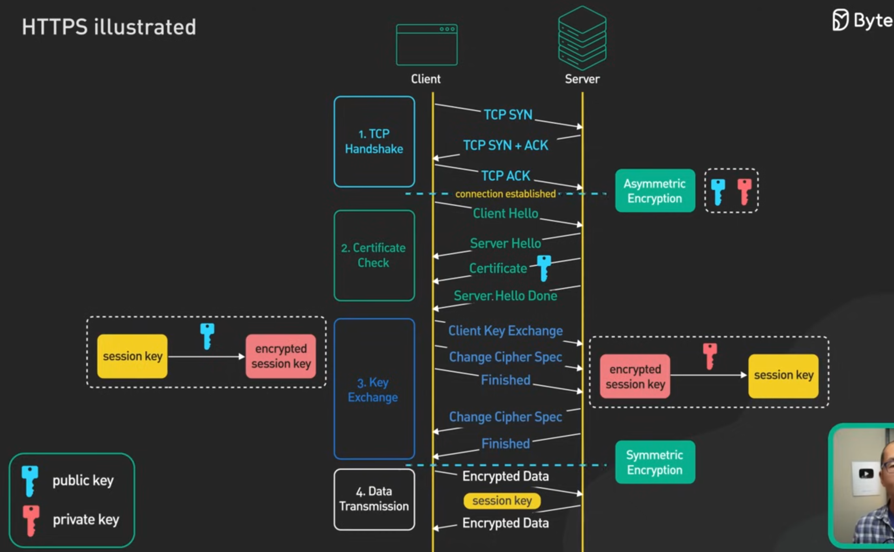

# TLS Handshake

## Step-by-Step Flow

### Step 1: Client Hello

- Client sends `ClientHello` to server with
  - supported ciphers,
  - supported list of TLS version
  - random nonce

> Notes:  
> ciphers is a list of supported encryption algorithms
> TLS max supported version is the highest version supported by the client
> random nonce is a randomly generated number used to ensure the handshake process is unique

### Step 2: Server Hello

- Server receives `ClientHello` and choose a specific
  - version of TLS that client supports.
  - ciphers that client supports.
- Server sends `ServerHello` to client with its selected tls version and ciphers.
