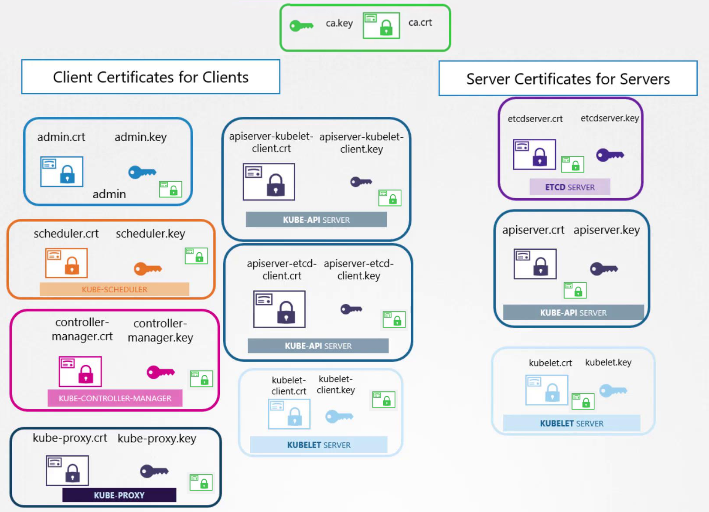
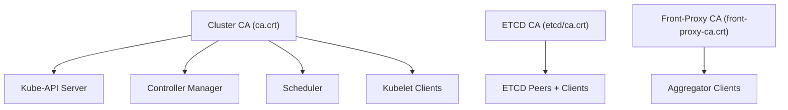
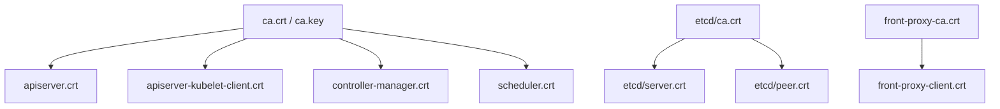

# 🔐 Kubernetes Control Plane TLS (`tls-cluster`)

> This document explains every certificate and CA used inside the Kubernetes control plane — who owns it, where it’s stored, who uses it, and how mutual TLS (mTLS) secures all internal traffic.

---

<div align="center" style="background-color:#F1F1F1; border-radius: 10px; border: 2px solid">
  
</div>

---

## 🧠 **Why Control Plane TLS Exists**

The **control plane** runs several high-privilege components that constantly exchange data:

<div align="center" style="background-color: #141a19ff;color: #a8a5a5ff; border-radius: 10px; border: 2px solid">

| Component                   | Purpose                                      |
| --------------------------- | -------------------------------------------- |
| **kube-apiserver**          | Central hub for all cluster communication    |
| **etcd**                    | Secure data store for cluster state          |
| **kube-controller-manager** | Controls cluster background loops            |
| **kube-scheduler**          | Assigns Pods to nodes                        |
| **kubelet**                 | Node agent that runs Pods and reports status |

</div>

---

> Each of these must authenticate and encrypt their connections — done via **TLS + certificates signed by one or more Cluster CAs**.

---

## 🏗️ **Certificate Authority (CA) Hierarchy**

Kubernetes uses **three separate Certificate Authorities** for security isolation.

<div align="center" style="background-color: #141a19ff;color: #a8a5a5ff; border-radius: 10px; border: 2px solid">



</div>

---

<div align="center" style="background-color: #141a19ff;color: #a8a5a5ff; border-radius: 10px; border: 2px solid">

| CA Name            | Location                                 | Purpose                    | Signs Certificates For                             |
| ------------------ | ---------------------------------------- | -------------------------- | -------------------------------------------------- |
| **Cluster CA**     | `/etc/kubernetes/pki/ca.crt`             | Core Kubernetes components | API Server, Kubelet clients, Controller, Scheduler |
| **etcd CA**        | `/etc/kubernetes/pki/etcd/ca.crt`        | etcd internal comms        | etcd peers, API server etcd client                 |
| **Front-Proxy CA** | `/etc/kubernetes/pki/front-proxy-ca.crt` | Aggregated APIs            | Metrics-server, Aggregator proxy                   |

</div>

---

## 🧩 **Per-Component Certificate Matrix**

Here’s the organized “who-has-what” view 👇

<div align="center" style="background-color: #141a19ff;color: #a8a5a5ff; border-radius: 10px; border: 2px solid">

| Component              | Certificate Type                       | Role                  | File Path                   | Signed By      | Used For                             |
| ---------------------- | -------------------------------------- | --------------------- | --------------------------- | -------------- | ------------------------------------ |
| **Kube API Server**    | `apiserver.crt`, `apiserver.key`       | server                | `/etc/kubernetes/pki/`      | Cluster CA     | Serves HTTPS (port 6443)             |
|                        | `apiserver-kubelet-client.crt`, `.key` | client for kubelet    | `/etc/kubernetes/pki/`      | Cluster CA     | Connects securely to kubelets        |
|                        | `apiserver-etcd-client.crt`, `.key`    | client for etcd       | `/etc/kubernetes/pki/`      | etcd CA        | Talks to etcd over TLS               |
| **Controller Manager** | `controller-manager.crt`, `.key`       | client for API server | `/etc/kubernetes/pki/`      | Cluster CA     | Auth to API Server                   |
| **Scheduler**          | `scheduler.crt`, `.key`                | client for API server | `/etc/kubernetes/pki/`      | Cluster CA     | Auth to API Server                   |
| **Kubelet**            | `kubelet-client-current.pem`           | client for API server | `/var/lib/kubelet/pki/`     | Cluster CA     | Client cert to API server            |
|                        | `kubelet.crt`, `.key`                  | server                | `/var/lib/kubelet/pki/`     | Cluster CA     | Server cert for API server callbacks |
| **etcd**               | `etcd/server.crt`, `.key`              | server                | `/etc/kubernetes/pki/etcd/` | etcd CA        | Serve API over port 2379             |
|                        | `etcd/peer.crt`, `.key`                | server + client       | `/etc/kubernetes/pki/etcd/` | etcd CA        | Peer-to-peer mTLS                    |
|                        | `etcd/healthcheck-client.crt`          | client for etcd       | `/etc/kubernetes/pki/etcd/` | etcd CA        | Health checks                        |
| **Front Proxy Client** | `front-proxy-client.crt`, `.key`       | client for API server | `/etc/kubernetes/pki/`      | Front-Proxy CA | Aggregated API calls                 |

</div>

---

## 🔐 **Why Some Kubernetes Components Have Both Server and Client Certificates**

In Kubernetes, components often act in **multiple roles** — sometimes as a **server**, sometimes as a **client**. Each role requires a distinct TLS identity to ensure secure, authenticated communication.

> 🔁 That’s why components like the API server and kubelet have **multiple cert/key pairs**, each tailored to a specific trust direction.

---

### 🧩 TLS Roles Explained

<div align="center" style="background-color: #141a19ff;color: #a8a5a5ff; border-radius: 10px; border: 2px solid">

| Role   | Certificate Type        | Purpose                                      |
| ------ | ----------------------- | -------------------------------------------- |
| Server | `*.crt` / `*.key`       | Accept incoming TLS connections              |
| Client | `*-client.crt` / `.key` | Authenticate when initiating TLS connections |

</div>

---

### 📦 Real Examples

#### ✅ API Server

<div align="center" style="background-color: #141a19ff;color: #a8a5a5ff; border-radius: 10px; border: 2px solid">

| File                           | Role   | Purpose                                           |
| ------------------------------ | ------ | ------------------------------------------------- |
| `apiserver.crt` / `.key`       | Server | Accepts connections from kubectl, kubelet, etc.   |
| `apiserver-kubelet-client.crt` | Client | Authenticates to kubelet for `kubectl exec/logs`  |
| `apiserver-etcd-client.crt`    | Client | Authenticates to etcd to read/write cluster state |

</div>

> 🔁 The API server is a **server** to users and components, but a **client** to etcd and kubelet.

---

#### ✅ Kubelet

<div align="center" style="background-color: #141a19ff;color: #a8a5a5ff; border-radius: 10px; border: 2px solid">

| File                         | Role   | Purpose                                            |
| ---------------------------- | ------ | -------------------------------------------------- |
| `kubelet.crt` / `.key`       | Server | Accepts connections from API server for logs/exec  |
| `kubelet-client-current.pem` | Client | Authenticates to API server to register and report |

</div>

> 🔁 The kubelet is a **client** to the API server, but a **server** when the API server connects to it.

---

#### ✅ etcd

<div align="center" style="background-color: #141a19ff;color: #a8a5a5ff; border-radius: 10px; border: 2px solid">

| File                              | Role   | Purpose                                                                                                                  |
| --------------------------------- | ------ | ------------------------------------------------------------------------------------------------------------------------ |
| `server.crt` / `.key`             | Server | Accepts connections from API server and etcdctl                                                                          |
| `peer.crt` / `.key`               | Peer   | Authenticates to and accepts connections from other etcd nodes                                                           |
| `healthcheck-client.crt` / `.key` | Client | Used by external monitoring agents (e.g., Prometheus, custom probes) to securely query etcd’s /health endpoint over TLS. |

</div>

> 🔁 etcd is a **server** to the API server, a **peer** to other etcd nodes, and a **client** when checking health or joining clusters.

---

### 🧠 Why This Matters

<div align="center" style="background-color: #141a19ff;color: #a8a5a5ff; border-radius: 10px; border: 2px solid">

| Reason                  | Benefit                                          |
| ----------------------- | ------------------------------------------------ |
| **Role separation**     | Clear identity per trust direction               |
| **Auditability**        | Easier to track which cert is used for what      |
| **Revocation control**  | Can revoke client certs without affecting server |
| **Security boundaries** | Prevents privilege escalation across roles       |

</div>

---

### ✅ Best Practice

Even if all certs are signed by the same CA:

- Use **separate certs per role**
- Keep **client certs scoped to their purpose**
- Rotate and audit certs independently

---

## 🧱 **How Each Component Uses TLS**

### 🧩 A. API Server

File: `/etc/kubernetes/manifests/kube-apiserver.yaml`

```yaml
- command:
    - kube-apiserver
    - --tls-cert-file=/etc/kubernetes/pki/apiserver.crt
    - --tls-private-key-file=/etc/kubernetes/pki/apiserver.key
    - --client-ca-file=/etc/kubernetes/pki/ca.crt
    - --kubelet-client-certificate=/etc/kubernetes/pki/apiserver-kubelet-client.crt
    - --kubelet-client-key=/etc/kubernetes/pki/apiserver-kubelet-client.key
    - --etcd-cafile=/etc/kubernetes/pki/etcd/ca.crt
    - --etcd-certfile=/etc/kubernetes/pki/apiserver-etcd-client.crt
    - --etcd-keyfile=/etc/kubernetes/pki/apiserver-etcd-client.key
```

✅ **Server cert:** used to serve HTTPS (6443)  
✅ **Client certs:** used to call kubelet & etcd securely  
✅ **CA certs:** define which clients are trusted

---

### 🧩 B. Controller Manager

File: `/etc/kubernetes/manifests/kube-controller-manager.yaml`

```yaml
- --authentication-kubeconfig=/etc/kubernetes/controller-manager.conf
- --client-ca-file=/etc/kubernetes/pki/ca.crt
```

✅ Uses kubeconfig:

```yaml
user:
  client-certificate: /etc/kubernetes/pki/controller-manager.crt
  client-key: /etc/kubernetes/pki/controller-manager.key
```

Purpose: authenticates to API server for resource management.

---

### 🧩 C. Scheduler

File: `/etc/kubernetes/manifests/kube-scheduler.yaml`

```yaml
- --kubeconfig=/etc/kubernetes/scheduler.conf
```

✅ Uses kubeconfig with:

```yaml
client-certificate: /etc/kubernetes/pki/scheduler.crt
client-key: /etc/kubernetes/pki/scheduler.key
```

Purpose: authenticate scheduling actions to API.

---

### 🧩 D. Kubelet

- **Client cert (for API server)**:
  `/var/lib/kubelet/pki/kubelet-client-current.pem`
- **Server cert (for API callbacks)**:
  `/var/lib/kubelet/pki/kubelet.crt`
- **CA trust:**
  `/etc/kubernetes/pki/ca.crt`

Auto-rotated by kubelet with:

```yaml
rotateCertificates: true
```

---

### 🧩 E. etcd

File: `/etc/kubernetes/manifests/etcd.yaml`

```yaml
- --cert-file=/etc/kubernetes/pki/etcd/server.crt
- --key-file=/etc/kubernetes/pki/etcd/server.key
- --peer-cert-file=/etc/kubernetes/pki/etcd/peer.crt
- --peer-key-file=/etc/kubernetes/pki/etcd/peer.key
- --trusted-ca-file=/etc/kubernetes/pki/etcd/ca.crt
- --peer-trusted-ca-file=/etc/kubernetes/pki/etcd/ca.crt
```

✅ Ensures mTLS between etcd peers and clients.

---

## 🏗️ 4. Certificate Lifecycle (End-to-End)

### Step 1️⃣ — Cluster CA Creation

When you run:

```bash
sudo kubeadm init
```

Kubeadm generates the root CA:

```ini
/etc/kubernetes/pki/ca.crt
/etc/kubernetes/pki/ca.key
```

- **ca.key** → private root used to sign all others
- **ca.crt** → distributed to all components for verification

---

### Step 2️⃣ — Component Certificates Generation

Each major component gets its own pair signed by `ca.crt`.

<div align="center" style="background-color: #141a19ff;color: #a8a5a5ff; border-radius: 10px; border: 2px solid">

| Component          | Cert Path                                          | Signed By            | Purpose                             |
| ------------------ | -------------------------------------------------- | -------------------- | ----------------------------------- |
| API Server         | `/etc/kubernetes/pki/apiserver.crt`                | `ca.crt`             | Serves HTTPS on port 6443           |
| Kubelet Client     | `/etc/kubernetes/pki/apiserver-kubelet-client.crt` | `ca.crt`             | API server authenticates to kubelet |
| Controller Manager | `/etc/kubernetes/pki/controller-manager.crt`       | `ca.crt`             | Auth to API server                  |
| Scheduler          | `/etc/kubernetes/pki/scheduler.crt`                | `ca.crt`             | Auth to API server                  |
| Front Proxy        | `/etc/kubernetes/pki/front-proxy-client.crt`       | `front-proxy-ca.crt` | Aggregated APIs                     |
| etcd               | `/etc/kubernetes/pki/etcd/server.crt`              | `etcd/ca.crt`        | Encrypt etcd client/server traffic  |
| Service Account    | `/etc/kubernetes/pki/sa.key`                       | none                 | Signs ServiceAccount tokens         |

</div>

---

### Step 3️⃣ — Component Communication

**Example 1: API Server ↔ Kubelet:**

- API server connects to each node to check health, logs, and metrics.
- Uses client certificate:
  `/etc/kubernetes/pki/apiserver-kubelet-client.crt`

Kubelet validates it using its own trusted `ca.crt` (usually in `/var/lib/kubelet/pki/`).

**Example 2: API Server ↔ etcd:**

- Uses:

  ```yaml
  --etcd-cafile=/etc/kubernetes/pki/etcd/ca.crt
  --etcd-certfile=/etc/kubernetes/pki/apiserver-etcd-client.crt
  --etcd-keyfile=/etc/kubernetes/pki/apiserver-etcd-client.key
  ```

**Example 3: Controller ↔ API Server:**

- Controller Manager connects to the API using:
  `/etc/kubernetes/controller-manager.conf`
  which embeds:

  ```yaml
  client-certificate: /etc/kubernetes/pki/controller-manager.crt
  client-key: /etc/kubernetes/pki/controller-manager.key
  ```

---

## 🧪 5. Inspecting Certificates

To read a certificate:

```bash
openssl x509 -in /etc/kubernetes/pki/apiserver.crt -text -noout
```

Key sections:

```ini
Subject: CN = kube-apiserver
Issuer: CN = kubernetes
Not After : Aug 12 11:20:34 2025 GMT
X509v3 Subject Alternative Name:
    DNS: kubernetes, DNS: kubernetes.default, IP Address:10.96.0.1
```

Verify it’s valid:

```bash
openssl verify -CAfile /etc/kubernetes/pki/ca.crt /etc/kubernetes/pki/apiserver.crt
```

✅ Expected output:

```ini
/etc/kubernetes/pki/apiserver.crt: OK
```

---

## 🧩 6. TLS in Static Pod Manifests

Let’s open `/etc/kubernetes/manifests/kube-apiserver.yaml`
(These are **self-hosted static pods** created by kubeadm.)

```yaml
spec:
  containers:
    - command:
        - kube-apiserver
        - --advertise-address=10.0.0.10
        - --tls-cert-file=/etc/kubernetes/pki/apiserver.crt
        - --tls-private-key-file=/etc/kubernetes/pki/apiserver.key
        - --client-ca-file=/etc/kubernetes/pki/ca.crt
        - --kubelet-client-certificate=/etc/kubernetes/pki/apiserver-kubelet-client.crt
        - --kubelet-client-key=/etc/kubernetes/pki/apiserver-kubelet-client.key
```

✅ TLS Certs here control:

- how the API server **authenticates itself**
- which CA is used to **trust clients**

---

## 🧰 7. Real Verification Commands

### 🔎 Test API Server TLS (port 6443)

```bash
openssl s_client -connect 127.0.0.1:6443 -CAfile /etc/kubernetes/pki/ca.crt
```

Expected:

```ini
Verify return code: 0 (ok)
```

### 🔎 Test etcd TLS

```bash
ETCDCTL_API=3 etcdctl --cacert=/etc/kubernetes/pki/etcd/ca.crt \
  --cert=/etc/kubernetes/pki/etcd/server.crt \
  --key=/etc/kubernetes/pki/etcd/server.key \
  endpoint health
```

Output:

```ini
127.0.0.1:2379 is healthy: successfully committed proposal
```

---

## 🔄 8. Certificate Rotation

Certificates expire in 1 year by default.
Use `kubeadm` for renewal and inspection.

### 🔍 Check Expiration

```bash
sudo kubeadm cert check-expiration
```

Example:

```ini
CERTIFICATE                EXPIRES                  RESIDUAL TIME
apiserver.crt              Jul 18, 2025 12:00 UTC   364d
etcd/server.crt            Jul 18, 2025 12:00 UTC   364d
```

### 🔁 Renew All

```bash
sudo kubeadm cert renew all
```

Restart kubelet to re-read updated certs:

```bash
sudo systemctl restart kubelet
```

---

### 🧠 Auto-Rotation (Kubelet)

Kubelet has its own mechanism:

- Configured in `/var/lib/kubelet/config.yaml`

  ```yaml
  rotateCertificates: true
  ```

- Auto-renews its cert before expiry
- New certs stored in `/var/lib/kubelet/pki/`

---

## 💥 9. Common Failures & Fixes

<div align="center" style="background-color: #141a19ff;color: #a8a5a5ff; border-radius: 10px; border: 2px solid">

| Problem                                         | Cause                           | Fix                                                      |
| ----------------------------------------------- | ------------------------------- | -------------------------------------------------------- |
| `x509: certificate signed by unknown authority` | Missing or wrong CA             | Ensure `--client-ca-file` and CA paths match             |
| API server not starting                         | Wrong key/cert path             | Check static pod YAML                                    |
| Node shows “NotReady”                           | Expired kubelet client cert     | Restart kubelet / rejoin node                            |
| etcd unhealthy                                  | Incorrect etcd cert permissions | `chown etcd:etcd /etc/kubernetes/pki/etcd/*`             |
| API server “unauthorized” to kubelet            | Wrong client cert               | Check `/etc/kubernetes/pki/apiserver-kubelet-client.crt` |

</div>

---

## 🧱 10. Rebuilding or Replacing Certificates

If you ever delete `/etc/kubernetes/pki`, you can regenerate all certs.

```bash
sudo kubeadm init phase certs all --cert-dir /etc/kubernetes/pki
```

To regenerate only API cert:

```bash
sudo kubeadm cert renew apiserver
```

Restart affected static pods:

```bash
sudo systemctl restart kubelet
```

---

## 🔐 11. Verify Mutual TLS Between Components

### Example: API Server ↔ Kubelet

```bash
curl -v https://127.0.0.1:10250/healthz \
  --key /etc/kubernetes/pki/apiserver-kubelet-client.key \
  --cert /etc/kubernetes/pki/apiserver-kubelet-client.crt \
  --cacert /etc/kubernetes/pki/ca.crt
```

✅ Should return:

```ini
* SSL connection using TLSv1.3
< HTTP/1.1 200 OK
ok
```

If you omit the cert:

```ini
HTTP/1.1 401 Unauthorized
```

→ proves that **mTLS** is working.

---

## 🧩 12. Example: Verify etcd Peer Authentication

On control plane node:

```bash
ETCDCTL_API=3 etcdctl --endpoints=https://127.0.0.1:2379 \
  --cacert=/etc/kubernetes/pki/etcd/ca.crt \
  --cert=/etc/kubernetes/pki/etcd/peer.crt \
  --key=/etc/kubernetes/pki/etcd/peer.key \
  member list
```

Each peer must have valid certs signed by `etcd/ca.crt`.

---

## 🧠 13. Understanding All CA Relationships

<div align="center" style="background-color: #141a19ff;color: #a8a5a5ff; border-radius: 10px; border: 2px solid">



</div>

🧩 There are **three distinct CA roots**:

1. `ca.crt` → Main cluster CA
2. `etcd/ca.crt` → etcd CA
3. `front-proxy-ca.crt` → aggregator CA

Each serves a different trust domain.

---

## 🧰 14. Checking TLS in Cluster Configuration Files

You can verify TLS settings inside kubeconfig files:

```bash
cat /etc/kubernetes/controller-manager.conf
```

Output:

```yaml
apiVersion: v1
clusters:
  - cluster:
      certificate-authority-data: LS0tLS1CRUdJTiBDRVJUSU...==
      server: https://127.0.0.1:6443
    name: kubernetes
users:
  - name: system:kube-controller-manager
    user:
      client-certificate-data: LS0tLS1CRUdJTiBDRVJUSU...==
      client-key-data: LS0tLS1CRUdJTiBSU0EgUFJ...==
```

These base64 blobs are TLS certs embedded directly into the kubeconfig.

Decode one:

```bash
echo "<blob>" | base64 -d | openssl x509 -text -noout
```

---

## 🧱 15. Control Plane TLS Audit Checklist

<div align="center" style="background-color: #141a19ff;color: #a8a5a5ff; border-radius: 10px; border: 2px solid">

| Item            | Check              | Command                                           |
| --------------- | ------------------ | ------------------------------------------------- |
| CA valid        | Root cert readable | `openssl x509 -in ca.crt -noout -subject -issuer` |
| API cert valid  | API port 6443      | `openssl s_client -connect 127.0.0.1:6443`        |
| etcd cert valid | etcdctl health     | `etcdctl endpoint health`                         |
| Kubelet auth    | 401 w/out cert     | `curl -v https://localhost:10250/healthz`         |
| Expiration      | Less than 1y?      | `kubeadm cert check-expiration`                   |

</div>

---

## 🛡️ 16. Hardening Best Practices (for CKS)

<div align="center" style="background-color: #141a19ff;color: #a8a5a5ff; border-radius: 10px; border: 2px solid">

| Area             | Recommendation                                | Reason                               |
| ---------------- | --------------------------------------------- | ------------------------------------ |
| API Server       | `--anonymous-auth=false`                      | Prevent unauthenticated access       |
| API Server       | `--client-ca-file=/etc/kubernetes/pki/ca.crt` | Enforce mTLS                         |
| etcd             | `--peer-client-cert-auth=true`                | Require mTLS between peers           |
| File Permissions | `chmod 600` all key files                     | Prevent leaks                        |
| Key Owner        | `chown root:root` (etcd:etcd for etcd)        | Enforce principle of least privilege |
| Service Account  | Rotate `sa.key` periodically                  | Reduce JWT replay risk               |
| CA Isolation     | Never copy `ca.key` to worker nodes           | Prevent cluster compromise           |

</div>

---

## 🧰 17. Replacing the Root CA (Advanced)

If your `ca.key` is compromised:

1. Generate a new CA:

   ```bash
   openssl genrsa -out new-ca.key 2048
   openssl req -x509 -new -nodes -key new-ca.key -subj "/CN=kubernetes" -days 365 -out new-ca.crt
   ```

2. Re-sign all certs with new CA.
3. Replace all `/etc/kubernetes/pki/*.crt` files with re-signed versions.
4. Restart all control plane components.
5. Distribute new `ca.crt` to kubelets and clients.

---

## 🧩 18. Troubleshooting Scenarios

### 🚨 API server crashloop due to TLS

Check logs:

```bash
docker logs kube-apiserver-controlplane
```

If you see:

```ini
failed to load key pair: tls: private key does not match public key
```

Fix:

```bash
openssl x509 -noout -modulus -in apiserver.crt | openssl md5
openssl rsa -noout -modulus -in apiserver.key | openssl md5
```

Ensure both hashes match.

---

### 🚨 etcd Unhealthy

```bash
ETCDCTL_API=3 etcdctl endpoint health
```

If invalid cert:

```ini
remote error: tls: bad certificate
```

Verify ownership:

```bash
chown etcd:etcd /etc/kubernetes/pki/etcd/*
chmod 600 /etc/kubernetes/pki/etcd/*.key
```

---

### 🚨 Expired Certs

API Server log:

```ini
x509: certificate has expired or is not yet valid
```

Fix:

```bash
kubeadm cert renew all && systemctl restart kubelet
```

---

## 🧾 19. Practical Lab (CKS Practice)

- 1️⃣ Check cluster TLS setup:

  ```bash
  ls /etc/kubernetes/pki/
  ```

- 2️⃣ Validate API server certificate:

  ```bash
  openssl x509 -in /etc/kubernetes/pki/apiserver.crt -noout -dates
  ```

- 3️⃣ Verify API server client CA:

  ```bash
  grep client-ca-file /etc/kubernetes/manifests/kube-apiserver.yaml
  ```

- 4️⃣ Test anonymous auth disabled:

  ```bash
  curl -k https://127.0.0.1:6443/api
  ```

  Expected:

  ```ini
  Unauthorized
  ```

- 5️⃣ Confirm mTLS works:

  ```bash
  curl --cert /etc/kubernetes/pki/apiserver-kubelet-client.crt \
      --key /etc/kubernetes/pki/apiserver-kubelet-client.key \
      --cacert /etc/kubernetes/pki/ca.crt \
      -v https://127.0.0.1:10250/healthz
  ```

---

## 🧩 20. Quick Reference Commands

<div align="center" style="background-color: #141a19ff;color: #a8a5a5ff; border-radius: 10px; border: 2px solid">

| Task                    | Command                                            |
| ----------------------- | -------------------------------------------------- |
| List all certs          | `sudo kubeadm certs list`                          |
| Check expiration        | `sudo kubeadm cert check-expiration`               |
| Renew all               | `sudo kubeadm cert renew all`                      |
| Verify API cert         | `openssl verify -CAfile ca.crt apiserver.crt`      |
| Check API server health | `kubectl get --raw='/healthz'`                     |
| Inspect cert SANs       | `openssl x509 -in apiserver.crt -text \| grep DNS` |

</div>

---

## ✅ Final Summary

<div align="center" style="background-color: #141a19ff;color: #a8a5a5ff; border-radius: 10px; border: 2px solid">

| Function     | Component           | Cert Path                             | TLS Mode   |
| ------------ | ------------------- | ------------------------------------- | ---------- |
| API endpoint | kube-apiserver      | `/etc/kubernetes/pki/apiserver.crt`   | server TLS |
| etcd storage | etcd                | `/etc/kubernetes/pki/etcd/server.crt` | mutual TLS |
| kubelet API  | kubelet ↔ apiserver |                                       |            |

</div>
