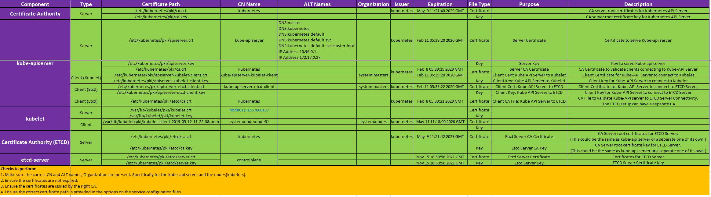
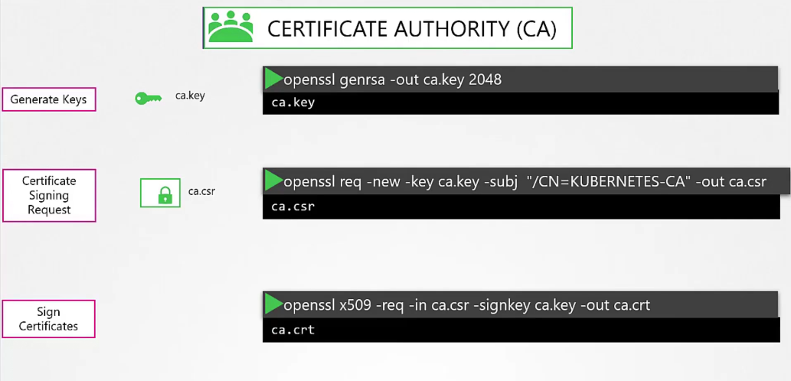
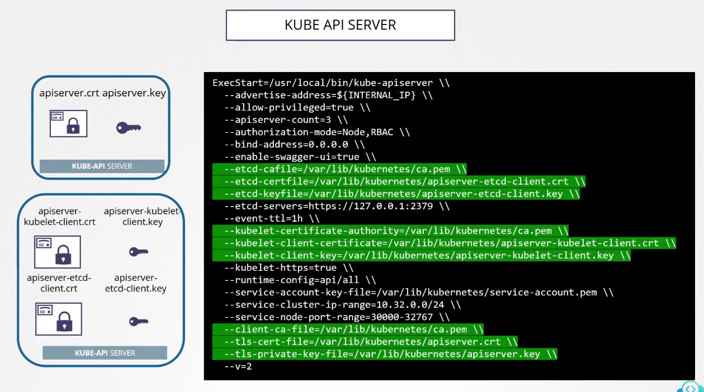
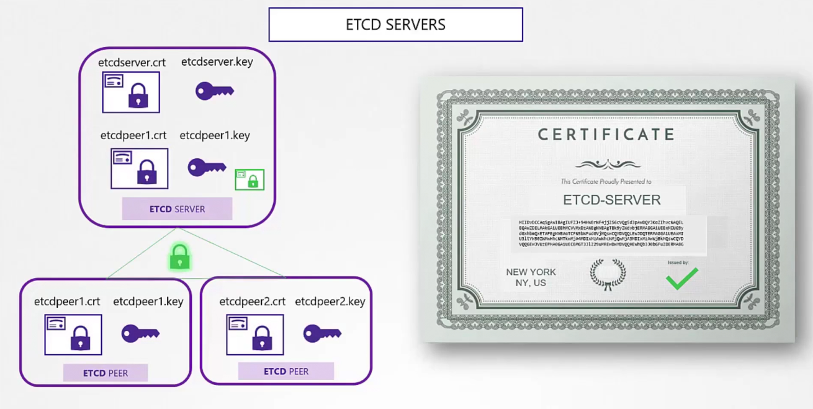
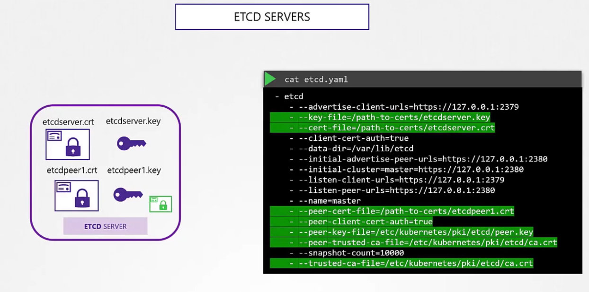

# 🧭 **What kubeadm actually creates** (TLS inventory)

Under `/etc/kubernetes/pki`:

- **Cluster CA**: `ca.crt`, `ca.key`
- **Front-Proxy CA**: `front-proxy-ca.crt`, `front-proxy-ca.key`
- **API Server (server)**: `apiserver.crt`, `apiserver.key` (SANs include service DNS + control-plane IP/hostnames)
- **API Server → Kubelet (client)**: `apiserver-kubelet-client.crt`, `apiserver-kubelet-client.key`

  - **Subject**: `CN=kube-apiserver-kubelet-client`, `O=system:masters`
  - **EKU**: clientAuth

- **Front-Proxy client** (for aggregated apis): `front-proxy-client.crt`, `front-proxy-client.key`

  - **Subject**: `CN=front-proxy-client`
  - **EKU**: clientAuth

- **ServiceAccount keypair**: `sa.key`, `sa.pub` (RSA key pair, not X.509)

Under `/etc/kubernetes/pki/etcd` (even for stacked etcd):

- **etcd CA**: `ca.crt`, `ca.key`
- **etcd server**: `server.crt`, `server.key` (SANs: node’s etcd advertise client URLs host/IPs)
- **etcd peer**: `peer.crt`, `peer.key` (SANs: peer URLs host/IPs)
- **apiserver → etcd (client)**: `healthcheck-client.crt/key` (optional) and **kube-apiserver etcd client** in root pki: `apiserver-etcd-client.crt/key`

  - **Subject**: `CN=kube-apiserver-etcd-client`
  - **EKU**: clientAuth

Per **node** (often under `/var/lib/kubelet/pki` or fed via bootstrap/CSR rotation):

- **kubelet client + serving cert**:

  - **Subject**: `CN=system:node:<NODE_NAME>`, `O=system:nodes`
  - Serving cert SANs: node hostname + IPs
  - EKUs: serverAuth (serving), clientAuth (client). kubeadm typically issues one cert with both usages.

**Other client identities** (signed by Cluster CA):

- **Controller manager**: `CN=system:kube-controller-manager`
- **Scheduler**: `CN=system:kube-scheduler`
- **Kube-proxy**: `CN=system:kube-proxy`
- **Admin**: `CN=kubernetes-admin`, `O=system:masters` (kubectl admin kubeconfig)

---

<div align="center" style="background-color:#F1F1F1; border-radius: 10px; border: 2px solid">
  
</div>

## 📁 Directory layout to use

```bash
sudo mkdir -p /etc/kubernetes/pki/etcd
cd /etc/kubernetes/pki
```

---

## 🔧 Set your variables (EDIT THESE!)

```bash
# cluster dns domain and service cidr
export CLUSTER_DOMAIN="cluster.local"
export SERVICE_CIDR="10.96.0.0/12"
export SERVICE_IP="10.96.0.1"    # first IP in SERVICE_CIDR by convention

# control-plane node identifiers (add all CP hostnames/IPs you expose the apiserver on)
export CP_HOSTNAME_1="cp-1"
export CP_IP_1="192.0.2.10"

# optional extra names (LB DNS, public DNS, etc.)
export API_DNS_1="kubernetes"
export API_DNS_2="kubernetes.default"
export API_DNS_3="kubernetes.default.svc"
export API_DNS_4="kubernetes.default.svc.${CLUSTER_DOMAIN}"
export API_DNS_5="api.my-cluster.example.com"

# etcd advertise addresses for THIS node
export ETCD_NAME="cp-1"
export ETCD_HOSTNAME="$CP_HOSTNAME_1"
export ETCD_IP="$CP_IP_1"

# one worker example
export NODE1_NAME="node01"
export NODE1_HOSTNAME="node01"
export NODE1_IP="192.0.2.20"
```

---

## 🧾 Reusable OpenSSL config snippets

Create these small files once and reuse.

### 1) `ca-openssl.cnf` (generic CA v3 profile)

```ini
[ req ]
distinguished_name = dn
x509_extensions = v3_ca
prompt = no

[ dn ]
CN = kubernetes

[ v3_ca ]
basicConstraints = critical, CA:TRUE
keyUsage = critical, keyCertSign, cRLSign
subjectKeyIdentifier = hash
```

### 2) `server-openssl.cnf` (generic server profile; add SANs per cert)

```ini
[ req ]
distinguished_name = dn
req_extensions = v3_req
prompt = no

[ dn ]
CN = placeholder

[ v3_req ]
basicConstraints = CA:FALSE
keyUsage = critical, digitalSignature, keyEncipherment
extendedKeyUsage = serverAuth
subjectAltName = @alt_names

[ alt_names ]
# filled per-cert
```

### 3) `client-openssl.cnf` (generic client profile)

```ini
[ req ]
distinguished_name = dn
req_extensions = v3_req
prompt = no

[ dn ]
CN = placeholder
O = placeholder

[ v3_req ]
basicConstraints = CA:FALSE
keyUsage = critical, digitalSignature, keyEncipherment
extendedKeyUsage = clientAuth
```

### 4) `client-server-openssl.cnf` (both usages, for kubelet serving+client)

```ini
[ req ]
distinguished_name = dn
req_extensions = v3_req
prompt = no

[ dn ]
CN = placeholder
O = placeholder

[ v3_req ]
basicConstraints = CA:FALSE
keyUsage = critical, digitalSignature, keyEncipherment
extendedKeyUsage = serverAuth, clientAuth
subjectAltName = @alt_names

[ alt_names ]
# filled per-cert
```

---

## 🏛️ 1) Create CAs

<div align="center" style="background-color:#F1F1F1; border-radius: 10px; border: 2px solid">
  
</div>

### Cluster CA

```bash
cd /etc/kubernetes/pki

openssl genrsa -out ca.key 4096
openssl req -x509 -new -nodes -key ca.key -days 36500 \
  -out ca.crt -config ca-openssl.cnf
```

### Front-Proxy CA

```bash
openssl genrsa -out front-proxy-ca.key 4096
# reuse same ca profile, just change CN inline:
openssl req -x509 -new -nodes -key front-proxy-ca.key -days 36500 \
  -out front-proxy-ca.crt \
  -subj "/CN=front-proxy-ca"
```

### etcd CA

```bash
cd /etc/kubernetes/pki/etcd

openssl genrsa -out ca.key 4096
openssl req -x509 -new -nodes -key ca.key -days 36500 \
  -out ca.crt -subj "/CN=etcd-ca"
```

---

## 🧩 2) API Server (server cert)

<div align="center" style="background-color:#F1F1F1; border-radius: 10px; border: 2px solid">
  
</div>

Create a **per-cert** config with SANs:

`/etc/kubernetes/pki/apiserver-openssl.cnf`

```ini
[ req ]
distinguished_name = dn
req_extensions = v3_req
prompt = no

[ dn ]
CN = kube-apiserver

[ v3_req ]
basicConstraints = CA:FALSE
keyUsage = critical, digitalSignature, keyEncipherment
extendedKeyUsage = serverAuth
subjectAltName = @alt_names

[ alt_names ]
DNS.1 = ${API_DNS_1}
DNS.2 = ${API_DNS_2}
DNS.3 = ${API_DNS_3}
DNS.4 = ${API_DNS_4}
DNS.5 = ${API_DNS_5}
DNS.6 = ${CP_HOSTNAME_1}
IP.1  = ${SERVICE_IP}
IP.2  = ${CP_IP_1}
```

> Add all CP IPs/hostnames/LB IPs as needed (and keep `SERVICE_IP` in SANs!).

Generate/sign:

```bash
cd /etc/kubernetes/pki

openssl genrsa -out apiserver.key 4096
# shell-expand vars inside config:
envsubst < apiserver-openssl.cnf > /tmp/apiserver.cnf

openssl req -new -key apiserver.key -out apiserver.csr -config /tmp/apiserver.cnf

openssl x509 -req -in apiserver.csr -CA ca.crt -CAkey ca.key -CAcreateserial \
  -out apiserver.crt -days 36500 -extensions v3_req -extfile /tmp/apiserver.cnf
```

---

## 🤝 3) API Server → Kubelet (client)

- **Subject**: `CN=kube-apiserver-kubelet-client`, `O=system:masters`
- **EKU**: clientAuth

```bash
openssl genrsa -out apiserver-kubelet-client.key 4096

# use client profile and set DN via -subj:
openssl req -new -key apiserver-kubelet-client.key -out apiserver-kubelet-client.csr \
  -subj "/CN=kube-apiserver-kubelet-client/O=system:masters"

openssl x509 -req -in apiserver-kubelet-client.csr -CA ca.crt -CAkey ca.key -CAcreateserial \
  -out apiserver-kubelet-client.crt -days 36500 \
  -extensions v3_req -extfile client-openssl.cnf
```

---

## 🧩 4) API Server → etcd (client)

- **Subject**: `CN=kube-apiserver-etcd-client`
- **EKU**: clientAuth

```bash
cd /etc/kubernetes/pki

openssl genrsa -out apiserver-etcd-client.key 4096
openssl req -new -key apiserver-etcd-client.key -out apiserver-etcd-client.csr \
  -subj "/CN=kube-apiserver-etcd-client"

# signed by ETCD CA (note the path):
openssl x509 -req -in apiserver-etcd-client.csr \
  -CA etcd/ca.crt -CAkey etcd/ca.key -CAcreateserial \
  -out apiserver-etcd-client.crt -days 36500 \
  -extensions v3_req -extfile client-openssl.cnf
```

---

## 🪪 5) Front-Proxy client (aggregator)

- **Subject**: `CN=front-proxy-client`
- **EKU**: clientAuth
- **Signed by**: Front-Proxy CA

```bash
openssl genrsa -out front-proxy-client.key 4096
openssl req -new -key front-proxy-client.key -out front-proxy-client.csr \
  -subj "/CN=front-proxy-client"

openssl x509 -req -in front-proxy-client.csr \
  -CA front-proxy-ca.crt -CAkey front-proxy-ca.key -CAcreateserial \
  -out front-proxy-client.crt -days 36500 \
  -extensions v3_req -extfile client-openssl.cnf
```

---

## 🔑 6) ServiceAccount keypair (no cert)

```bash
openssl genrsa -out sa.key 4096
openssl rsa -in sa.key -pubout -out sa.pub
```

---

## 🧱 7) etcd (server + peer)

<div align="center" style="background-color:#F1F1F1; border-radius: 10px; border: 2px solid">
  
</div>

<div align="center" style="background-color:#F1F1F1; border-radius: 10px; border: 2px solid">
  
</div>

Create per-cert configs to include the **right SANs**. For single CP node, SANs usually include the node’s hostname and IP.

`/etc/kubernetes/pki/etcd/server-openssl.cnf`

```ini
[ req ]
distinguished_name = dn
req_extensions = v3_req
prompt = no

[ dn ]
CN = ${ETCD_HOSTNAME}

[ v3_req ]
basicConstraints = CA:FALSE
keyUsage = critical, digitalSignature, keyEncipherment
extendedKeyUsage = serverAuth
subjectAltName = @alt_names

[ alt_names ]
DNS.1 = ${ETCD_HOSTNAME}
IP.1  = ${ETCD_IP}
```

`/etc/kubernetes/pki/etcd/peer-openssl.cnf`

```ini
[ req ]
distinguished_name = dn
req_extensions = v3_req
prompt = no

[ dn ]
CN = ${ETCD_NAME}

[ v3_req ]
basicConstraints = CA:FALSE
keyUsage = critical, digitalSignature, keyEncipherment
extendedKeyUsage = serverAuth, clientAuth
subjectAltName = @alt_names

[ alt_names ]
DNS.1 = ${ETCD_HOSTNAME}
IP.1  = ${ETCD_IP}
```

Generate/sign:

```bash
cd /etc/kubernetes/pki/etcd

# server
openssl genrsa -out server.key 4096
envsubst < server-openssl.cnf > /tmp/etcd-server.cnf
openssl req -new -key server.key -out server.csr -config /tmp/etcd-server.cnf
openssl x509 -req -in server.csr -CA ca.crt -CAkey ca.key -CAcreateserial \
  -out server.crt -days 36500 -extensions v3_req -extfile /tmp/etcd-server.cnf

# peer
openssl genrsa -out peer.key 4096
envsubst < peer-openssl.cnf > /tmp/etcd-peer.cnf
openssl req -new -key peer.key -out peer.csr -config /tmp/etcd-peer.cnf
openssl x509 -req -in peer.csr -CA ca.crt -CAkey ca.key -CAcreateserial \
  -out peer.crt -days 36500 -extensions v3_req -extfile /tmp/etcd-peer.cnf
```

> For multi-node etcd, add **all** peer DNS/IPs to each peer/server cert’s SANs.

---

## 🖥️ 8) kubelet (per node)

- **Subject**: `CN=system:node:<NODE_NAME>`, `O=system:nodes`
- **SANs**: node’s hostname(s) and IPs
- **EKUs**: both serverAuth and clientAuth

Create config for the node:

`/etc/kubernetes/pki/kubelet-${NODE1_NAME}.cnf`

```ini
[ req ]
distinguished_name = dn
req_extensions = v3_req
prompt = no

[ dn ]
CN = system:node:${NODE1_NAME}
O  = system:nodes

[ v3_req ]
basicConstraints = CA:FALSE
keyUsage = critical, digitalSignature, keyEncipherment
extendedKeyUsage = serverAuth, clientAuth
subjectAltName = @alt_names

[ alt_names ]
DNS.1 = ${NODE1_HOSTNAME}
IP.1  = ${NODE1_IP}
```

Generate/sign:

```bash
cd /etc/kubernetes/pki

envsubst < kubelet-${NODE1_NAME}.cnf > /tmp/kubelet-${NODE1_NAME}.cnf
openssl genrsa -out kubelet-${NODE1_NAME}.key 4096
openssl req -new -key kubelet-${NODE1_NAME}.key -out kubelet-${NODE1_NAME}.csr \
  -config /tmp/kubelet-${NODE1_NAME}.cnf

openssl x509 -req -in kubelet-${NODE1_NAME}.csr -CA ca.crt -CAkey ca.key -CAcreateserial \
  -out kubelet-${NODE1_NAME}.crt -days 36500 \
  -extensions v3_req -extfile /tmp/kubelet-${NODE1_NAME}.cnf
```

> Repeat for each node (change `${NODE1_*}`).

---

## 🧑‍💼 9) Other standard clients (optional but kubeadm makes them)

All signed by **Cluster CA**, with **clientAuth** EKU:

```bash
# controller-manager
openssl genrsa -out controller-manager.key 4096
openssl req -new -key controller-manager.key -out controller-manager.csr \
  -subj "/CN=system:kube-controller-manager"
openssl x509 -req -in controller-manager.csr -CA ca.crt -CAkey ca.key -CAcreateserial \
  -out controller-manager.crt -days 36500 -extensions v3_req -extfile client-openssl.cnf

# scheduler
openssl genrsa -out scheduler.key 4096
openssl req -new -key scheduler.key -out scheduler.csr \
  -subj "/CN=system:kube-scheduler"
openssl x509 -req -in scheduler.csr -CA ca.crt -CAkey ca.key -CAcreateserial \
  -out scheduler.crt -days 36500 -extensions v3_req -extfile client-openssl.cnf

# kube-proxy
openssl genrsa -out kube-proxy.key 4096
openssl req -new -key kube-proxy.key -out kube-proxy.csr \
  -subj "/CN=system:kube-proxy"
openssl x509 -req -in kube-proxy.csr -CA ca.crt -CAkey ca.key -CAcreateserial \
  -out kube-proxy.crt -days 36500 -extensions v3_req -extfile client-openssl.cnf

# admin (kubectl)
openssl genrsa -out admin.key 4096
openssl req -new -key admin.key -out admin.csr \
  -subj "/CN=kubernetes-admin/O=system:masters"
openssl x509 -req -in admin.csr -CA ca.crt -CAkey ca.key -CAcreateserial \
  -out admin.crt -days 36500 -extensions v3_req -extfile client-openssl.cnf
```

---

## ✅ Your original issues fixed

- **Wrong CN/O pairs**

  - API server server: `CN=kube-apiserver` (no O)
  - API->kubelet client: `CN=kube-apiserver-kubelet-client`, `O=system:masters`
  - kubelet (both serving and client): `CN=system:node:<node>`, `O=system:nodes`
  - etcd client for apiserver: `CN=kube-apiserver-etcd-client`
  - controller manager / scheduler / proxy / admin as above

- **Proper SANs**

  - API server must include **`SERVICE_IP` (10.96.0.1)** plus **kubernetes.\* DNS** and **all control-plane/LB names/IPs**.
  - kubelet serving must include **node hostname + IPs**.
  - etcd server/peer must include their **advertise addresses**.

- **Proper EKUs**

  - server certs: `serverAuth`
  - client certs: `clientAuth`
  - kubelet combo: `serverAuth, clientAuth`

- **CAs separated** (cluster CA, front-proxy CA, etcd CA).
- **ServiceAccount keys** generated (no cert).

---

## 🧪 Quick sanity checks

```bash
# check SANs/EKUs
openssl x509 -in /etc/kubernetes/pki/apiserver.crt -noout -text | egrep -A1 "Subject:|DNS:|IP Address|Extended Key Usage"
openssl x509 -in /etc/kubernetes/pki/apiserver-kubelet-client.crt -noout -text | grep -A1 "Extended Key Usage"
openssl x509 -in /etc/kubernetes/pki/etcd/server.crt -noout -text | egrep -A1 "Subject:|DNS:|IP Address"
```

---

## 🧩 Wiring flags (so components use these files)

Typical (non-kubeadm) systemd args (examples):

- **kube-apiserver**:

  ```ini
  --client-ca-file=/etc/kubernetes/pki/ca.crt \
  --tls-cert-file=/etc/kubernetes/pki/apiserver.crt \
  --tls-private-key-file=/etc/kubernetes/pki/apiserver.key \
  --kubelet-client-certificate=/etc/kubernetes/pki/apiserver-kubelet-client.crt \
  --kubelet-client-key=/etc/kubernetes/pki/apiserver-kubelet-client.key \
  --etcd-cafile=/etc/kubernetes/pki/etcd/ca.crt \
  --etcd-certfile=/etc/kubernetes/pki/apiserver-etcd-client.crt \
  --etcd-keyfile=/etc/kubernetes/pki/apiserver-etcd-client.key \
  --service-account-key-file=/etc/kubernetes/pki/sa.pub \
  --service-account-signing-key-file=/etc/kubernetes/pki/sa.key \
  --service-account-issuer=https://kubernetes.default.svc.cluster.local
  ```

- **etcd** (stacked):

  ```ini
  --cert-file=/etc/kubernetes/pki/etcd/server.crt \
  --key-file=/etc/kubernetes/pki/etcd/server.key \
  --trusted-ca-file=/etc/kubernetes/pki/etcd/ca.crt \
  --peer-cert-file=/etc/kubernetes/pki/etcd/peer.crt \
  --peer-key-file=/etc/kubernetes/pki/etcd/peer.key \
  --peer-trusted-ca-file=/etc/kubernetes/pki/etcd/ca.crt
  ```

- **kubelet** (serving/client from same cert):

  ```ini
  --tls-cert-file=/var/lib/kubelet/pki/kubelet.crt \
  --tls-private-key-file=/var/lib/kubelet/pki/kubelet.key \
  --client-ca-file=/etc/kubernetes/pki/ca.crt
  ```

(Or let kubelet **bootstrap** with a token and rotate certs—this manual path is for full static installs.)
