# 🔐 **K8s Security Foundation**

> _Before RBAC or Pod Security Policies — everything starts with understanding “Who are you?”_

---

<div align="center" style="background-color:#fff; border-radius: 10px; border: 2px solid">
  
</div>

---

## 🧠 **Security Pillars in Kubernetes**

Kubernetes security is built on **four main layers**:

<div align="center" style="background-color: #141a19ff;color: #a8a5a5ff; border-radius: 10px; border: 2px solid">

| Layer                      | Responsibility                      | Mechanism                         |
| -------------------------- | ----------------------------------- | --------------------------------- |
| **Authentication (AuthN)** | Who are you?                        | Certificates, tokens, identities  |
| **Authorization (AuthZ)**  | What can you do?                    | RBAC, ABAC, Webhooks              |
| **Admission Control**      | Can this request enter the cluster? | Admission plugins, OPA Gatekeeper |
| **Auditing**               | What did you do?                    | Audit logs                        |

</div>

Today, we’ll start with **Authentication & Authorization**, which form the base of everything else (including RBAC).

---

## 👤 **Types of Accounts in Kubernetes**

Kubernetes recognizes **two major types of identities**:

<div align="center" style="background-color: #141a19ff;color: #a8a5a5ff; border-radius: 10px; border: 2px solid">

| Type                   | Used By      | Purpose                                              |
| ---------------------- | ------------ | ---------------------------------------------------- |
| **👩‍💻 User Account**    | Humans       | Cluster admins, developers, CI/CD users              |
| **🤖 Service Account** | Applications | Pods, controllers, and automation inside the cluster |

</div>

---

### 👩‍💻 1. User Accounts (External Identities)

Kubernetes **does not manage user accounts** by itself.
Instead, it relies on **external identity providers**, such as:

- Certificates issued by admins (for local users)
- Cloud IAM systems (e.g., AWS IAM, Azure AD, GCP IAM)
- OIDC (OpenID Connect) identity providers (Okta, Keycloak, Entra ID)
- kubeconfig credentials (for CLI users)

Example:
When you run `kubectl get pods`, your `~/.kube/config` might contain:

```yaml
users:
  - name: admin
    user:
      client-certificate: /home/admin/.kube/admin.crt
      client-key: /home/admin/.kube/admin.key
```

➡️ This identifies you as **admin**, authenticated using TLS certificates.

---

### 🤖 2. Service Accounts (Internal Identities)

Service Accounts are managed **inside the cluster**.

They represent **Pods or controllers** (like Deployments or Jobs) `that need to talk to the Kubernetes API`.

Example:

```bash
kubectl create serviceaccount app-sa
```

This creates a ServiceAccount object:

```yaml
apiVersion: v1
kind: ServiceAccount
metadata:
  name: app-sa
```

Then, when a Pod uses it:

```yaml
apiVersion: v1
kind: Pod
metadata:
  name: demo
spec:
  serviceAccountName: app-sa
  containers:
    - name: demo
      image: busybox
      command: ["sleep", "3600"]
```

✅ Kubernetes **injects a token** (JWT) into

- `/var/run/secrets/kubernetes.io/serviceaccount/token`.
- That token lets the Pod authenticate to the API server.

---

## 🔐 **Authentication (AuthN)**

When any request hits the API server, Kubernetes checks _who sent it_.

### 3️⃣ Main authentication mechanisms:

1. **Client Certificates** – used by admins/devs
2. **Bearer Tokens** – used by Pods or CI/CD tools
3. **Authentication Plugins / Webhooks / OIDC** – for enterprise systems

---

### 🔹 Client Certificate Example

When you create a cluster (e.g., via `kubeadm`), it issues admin certificates.

To create your own:

```bash
openssl genrsa 2048  -out dev.key

openssl req -new \
-subj "/CN=dev/O=devteam" \
-key dev.key \
-out dev.csr

openssl x509 -req -in dev.csr \
-CA ca.crt -CAkey ca.key -CAcreateserial \
-out dev.crt -days 365
```

Then update `~/.kube/config`:

```yaml
users:
  - name: dev
    user:
      client-certificate: dev.crt
      client-key: dev.key
```

The API server then authenticates you using the CA-signed certificate.

---

### 🔹 Token Authentication Example

When a Pod runs with a service account:

```bash
cat /var/run/secrets/kubernetes.io/serviceaccount/token
```

The token looks like this:

```ini
eyJhbGciOiJSUzI1NiIsInR5cCI6IkpXVCJ9...
```

If you decode it (base64 JWT), it contains:

```json
{
  "iss": "kubernetes/serviceaccount",
  "sub": "system:serviceaccount:default:app-sa"
}
```

So the API server can tell:

- This is a **service account**
- It belongs to namespace `default`
- Its name is `app-sa`

---

## 🛂 **Authorization (AuthZ)**

After authentication succeeds, Kubernetes must decide:

> “Now that I know who you are — what are you allowed to do?”

This is **Authorization**.

There are several **authorization modes**, configured on the API server:

<div align="center" style="background-color: #141a19ff;color: #a8a5a5ff; border-radius: 10px; border: 2px solid">

| Mode                                 | Description                                |
| ------------------------------------ | ------------------------------------------ |
| **RBAC** (Role-Based Access Control) | Uses roles and bindings (default & modern) |
| **ABAC** (Attribute-Based)           | Old method, JSON policy files              |
| **Node**                             | Controls kubelet permissions               |
| **Webhook**                          | External authorization service (e.g., OPA) |
| **AlwaysAllow / AlwaysDeny**         | Testing/debug only                         |

</div>

In production → **RBAC is the standard.**

---

## 🧱 **RBAC (Preview Before Deep Dive)**

RBAC defines:

- **Roles** → what actions are allowed (`verbs` like get, list, delete)
- **RoleBindings** → who can use those roles

Simple example:

```yaml
kind: Role
apiVersion: rbac.authorization.k8s.io/v1
metadata:
  name: pod-reader
  namespace: dev
rules:
  - apiGroups: [""]
    resources: ["pods"]
    verbs: ["get", "list"]

---
kind: RoleBinding
apiVersion: rbac.authorization.k8s.io/v1
metadata:
  name: read-pods
  namespace: dev
subjects:
  - kind: User
    name: dev
roleRef:
  kind: Role
  name: pod-reader
  apiGroup: rbac.authorization.k8s.io
```

✅ User `dev` can only `get` and `list` Pods in the `dev` namespace.

We’ll go deep into **RBAC design, ClusterRoles, impersonation, and service accounts** next.

---

## 🧩 **Flow Behind the Scenes**

Here’s how a single API request flows:

```mermaid
sequenceDiagram
    participant User
    participant API_Server
    participant AuthN
    participant AuthZ
    participant Admission
    User->>API_Server: kubectl get pods
    API_Server->>AuthN: Verify identity (cert, token, OIDC)
    AuthN-->>API_Server: ✅ Authenticated as "dev"
    API_Server->>AuthZ: Check permissions (RBAC)
    AuthZ-->>API_Server: ✅ Allowed (get/list pods)
    API_Server->>Admission: Validate policies (optional)
    Admission-->>API_Server: ✅ Pass
    API_Server-->>User: 🟢 List of pods
```

<div align="center" style="background-color: #141a19ff;color: #a8a5a5ff; border-radius: 10px; border: 2px solid">



</div>

---

## 🧠 **Common Kubernetes Identities (Cheat Sheet)**

<div align="center" style="background-color: #141a19ff;color: #a8a5a5ff; border-radius: 10px; border: 2px solid">

| Name                   | Description              | Example Identity                      |
| ---------------------- | ------------------------ | ------------------------------------- |
| **Admin user**         | Cluster administrator    | `system:admin`                        |
| **Kubelet**            | Node agent               | `system:node:<nodename>`              |
| **Service Account**    | Pod identity             | `system:serviceaccount:default:my-sa` |
| **Controller Manager** | Internal control loop    | `system:kube-controller-manager`      |
| **Anonymous**          | Unauthenticated requests | `system:anonymous`                    |

</div>

---

## 🧰 **Commands to Inspect Identities**

<div align="center" style="background-color: #141a19ff;color: #a8a5a5ff; border-radius: 10px; border: 2px solid">

| Command                                 | Purpose                     |
| --------------------------------------- | --------------------------- |
| `kubectl config view`                   | Show all contexts and users |
| `kubectl config current-context`        | Current user/cluster        |
| `kubectl config get-contexts`           | List all contexts           |
| `kubectl auth whoami`                   | Show current user           |
| `kubectl auth can-i <verb> <resource>`  | Check authorization         |
| `kubectl auth can-i list pods --as dev` | Test impersonation          |

</div>

---

## 🧩 **Authentication & Authorization Summary**

<div align="center" style="background-color: #141a19ff;color: #a8a5a5ff; border-radius: 10px; border: 2px solid">

| Concept                    | Description                             |
| -------------------------- | --------------------------------------- |
| **Authentication (AuthN)** | Proves identity                         |
| **Authorization (AuthZ)**  | Validates permissions                   |
| **User Accounts**          | Managed externally                      |
| **Service Accounts**       | Managed internally                      |
| **RBAC**                   | Modern authorization model              |
| **Admission Controllers**  | Validate or mutate requests after AuthZ |

</div>

---
