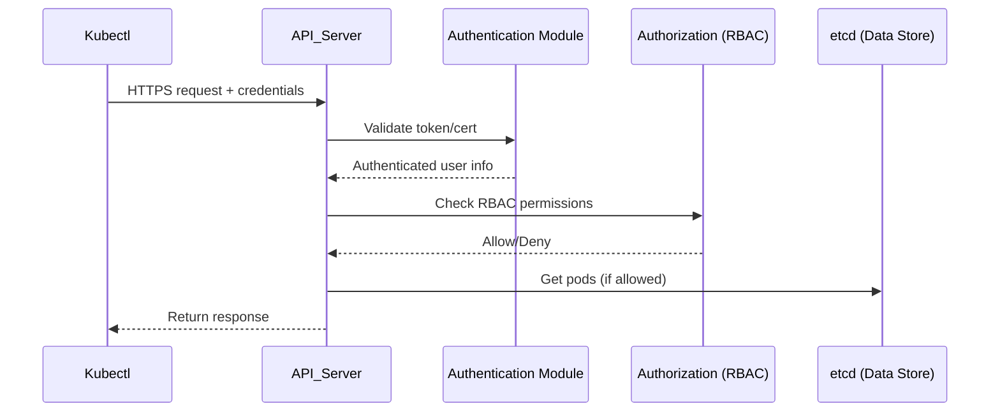
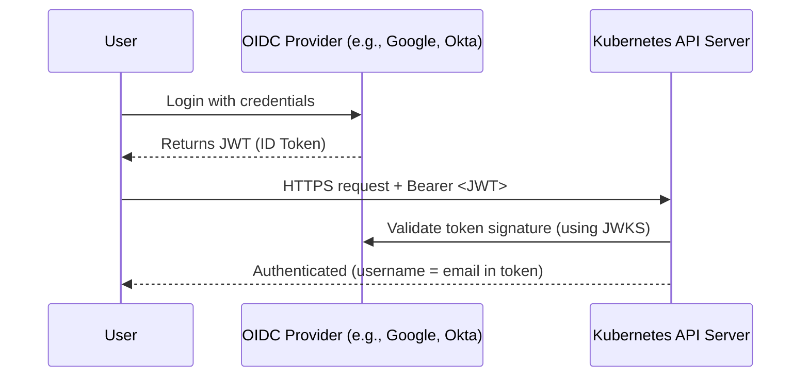

# 🧍‍♂️ **User Accounts in Kubernetes — How Authentication Really Works**

> _“If Kubernetes doesn’t manage users, how does it know who you are when you run `kubectl get pods`?”_

---

## 🚪 **Kubernetes API Server = The Only Gatekeeper**

Everything in Kubernetes — even the `kubectl` CLI — ultimately talks to:

```ini
https://<api-server-endpoint>:6443
```

Every request must go through **authentication** → **authorization** → **admission**.

When you run:

```bash
kubectl get pods
```

this happens internally:

<div align="center" style="background-color: #141a19ff;color: #a8a5a5ff; border-radius: 10px; border: 2px solid">



</div>

---

## 🧩 **Two Main Account Types in Kubernetes**

<div align="center" style="background-color: #141a19ff;color: #a8a5a5ff; border-radius: 10px; border: 2px solid">

| Type                | Managed by Kubernetes?                | Typical Use                        |
| ------------------- | ------------------------------------- | ---------------------------------- |
| **User Account**    | ❌ No (external identity provider)    | Humans, CI/CD tools                |
| **Service Account** | ✅ Yes (built-in Kubernetes resource) | Pods, controllers, in-cluster apps |

</div>

So while **ServiceAccounts** live as Kubernetes resources,
**User Accounts** are **external** — they exist only in your **authentication provider** (e.g., certs, OIDC, or token file).

---

## 🔐 **How Kubernetes Authenticates Users (Mechanisms)**

Kubernetes doesn’t store users in `etcd`.
Instead, the **API server delegates authentication** to configured **authenticators**.

Let’s explore the main ones.

---

## 📌 **A. Static Password/Token File Authentication** (⚠️ Deprecated)

This is useful for **small clusters or bootstrapping** but insecure:

- Passwords/Tokens are **static** (never expire)
- Must be **manually distributed**
- Not recommended for production

### 🔑 Static Password File `--basic-auth-file`

You provide a CSV password file to the API server via `--basic-auth-file`:

```ini
<username>,<password>,<uid>,<groups>
```

Example: `/etc/kubernetes/password.csv`

```ini
myuser,1234567890abcdef,uid123,dev,system:authenticated
```

Start API server with:

```ini
--basic-auth-file=/etc/kubernetes/password.csv
```

#### 🔹 Usage in `kubeconfig`

in your `kubeconfig` user section:

```yaml
users:
  - name: myuser
    user:
      password: 1234567890abcdef
```

When `kubectl` calls the API:

```ini
Authorization: Basic myuser:1234567890abcdef
```

The API server:

1. Looks up the password in the CSV file.
2. Finds the associated username and groups.
3. Authenticates the request as `myuser`.

#### 🔹 Usage using curl

```bash
curl -k -u myuser:1234567890abcdef "https://<k8s-api-server>/api/v1/pods"
```

---

### 💳 Static Token File `--token-auth-file`

You provide a CSV token file to the API server via `--token-auth-file`:

```ini
<token>,<username>,<uid>,<groups>
```

Example: `/etc/kubernetes/token.csv`

```ini
1234567890abcdef,myuser,uid123,dev,system:authenticated
```

Start API server with:

```ini
--token-auth-file=/etc/kubernetes/token.csv
```

#### 🔹 Usage in `kubeconfig`

in your `kubeconfig` user section:

```yaml
users:
  - name: myuser
    user:
      token: 1234567890abcdef
```

When `kubectl` calls the API:

```ini
Authorization: Bearer 1234567890abcdef
```

The API server:

1. Looks up the token in the CSV file.
2. Finds the associated username and groups.
3. Authenticates the request as `myuser`.

#### 🔹 Usage using curl

```bash
curl -k -H "Authorization: Bearer 1234567890abcdef" "https://<k8s-api-server>/api/v1/pods"
```

## 📌 **B. Client Certificates** (Common in Admins / kubeconfig)

### 🧠 Concept

- The client presents an **X.509 certificate** signed by a **trusted Certificate Authority (CA)**.
- The API server verifies that the cert is valid and signed by a CA it trusts.
- The **Common Name (CN)** or **Organization (O)** fields in the certificate identify the user and groups.

### ⚙️ How It Works

Your `kubeconfig` might look like this:

```yaml
users:
  - name: admin
    user:
      client-certificate: /etc/kubernetes/pki/admin.crt
      client-key: /etc/kubernetes/pki/admin.key
```

When you run:

```bash
kubectl get pods
```

The `kubectl` client performs mutual TLS:

1. Sends the client certificate during TLS handshake.
2. API server verifies certificate signature using its CA.
3. Extracts identity:

   ```ini
   user: CN=admin, O=system:masters
   ```

4. The user’s group (`system:masters`) has full admin privileges by default.

### ✍🏻 Example: Creating a New User with a Certificate

Generate key and CSR:

```bash
openssl genrsa -out dev.key 2048
openssl req -new -key dev.key -out dev.csr -subj "/CN=dev-user/O=dev-team"
```

Sign it using the Kubernetes CA:

```bash
openssl x509 -req -in dev.csr -CA /etc/kubernetes/pki/ca.crt \
-CAkey /etc/kubernetes/pki/ca.key -CAcreateserial -out dev.crt -days 365
```

Add it to kubeconfig:

```yaml
users:
  - name: dev-user
    user:
      client-certificate: ./dev.crt
      client-key: ./dev.key
```

✅ When this user connects, the API server authenticates it as:

```ini
User: dev-user
Groups: dev-team
```

> 🚨 **Kubernetes now recommends using the built-in `CertificateSigningRequest` (CSR) API to sign user certificates instead of manually accessing the cluster CA.**, This approach is more secure, auditable, and aligns with modern RBAC and automation practices.

---

### 🔐 Recommended Kubernetes CSR Workflow (API-based)

Instead of manually signing with `openssl`, you can let Kubernetes sign the CSR via its API:

- ✅ 1. **Generate Private Key and CSR**

  ```bash
  openssl genrsa -out dev.key 2048
  openssl req -new -key dev.key -out dev.csr -subj "/CN=dev/O=devteam"
  ```

- ✅ 2. **Base64 Encode the CSR**

  ```bash
  cat dev.csr | base64 | tr -d '\n' > dev.csr.base64
  ```

- ✅ 3. **Create a Kubernetes CSR Resource**

  ```yaml
  apiVersion: certificates.k8s.io/v1
  kind: CertificateSigningRequest
  metadata:
    name: dev-user-csr
  spec:
    request: <base64-encoded-csr>
    signerName: kubernetes.io/kube-apiserver-client
    expirationSeconds: 31536000 # Optional: 1 year
    usages:
      - client auth
  ```

  > Replace `<base64-encoded-csr>` with the contents of `dev.csr.base64`.

  Apply it:

  ```bash
  kubectl apply -f dev-user-csr.yaml
  ```

- ✅ 4. **Approve the CSR**

  ```bash
  kubectl certificate approve dev-user-csr
  ```

- ✅ 5. **Fetch the Signed Certificate**

  ```bash
  kubectl get csr dev-user-csr -o jsonpath='{.status.certificate}' | base64 -d > dev.crt
  ```

---

**⁉️ Why This Is Recommended:**

- **Auditable**: CSR approval is logged and can be gated by RBAC.
- **Secure**: No direct access to CA keys.
- **Automatable**: Integrates with GitOps, onboarding flows, and cert-manager.
- **Scoped**: You can restrict signers (`kubernetes.io/kube-apiserver-client`) and usages (`client auth`).

---

> Now you have `dev.key` and `dev.crt` for authentication.

Now, you add it to your kubeconfig:

```yaml
users:
  - name: dev
    user:
      client-certificate: /home/dev/dev.crt
      client-key: /home/dev/dev.key
```

When `kubectl` sends a request:

- It presents this cert over HTTPS.
- The API Server checks it against the CA (`--client-ca-file` flag in `kube-apiserver`).
- If valid, it authenticates the user as `dev` in group `devteam`.

You can verify:

```bash
kubectl auth whoami
# → USER: dev
#   GROUPS: devteam
```

---

## 📌 **C. OIDC (OpenID Connect)** — Most Common for Cloud & Enterprises

> This is how Kubernetes integrates with real identity providers like **Google, Azure AD, Okta, Keycloak, or AWS IAM**.

---

### 🧠 Concept

OIDC = OAuth 2.0 + ID Token (JWT)

The authentication happens _outside_ Kubernetes, and the API server **trusts** tokens issued by your OIDC provider.

---

### 🔹 1. Setup (API Server Flags)

Example API server startup flags:

```ini
--oidc-issuer-url=https://accounts.google.com
--oidc-client-id=kubernetes
--oidc-username-claim=email
--oidc-groups-claim=groups
--oidc-ca-file=/etc/kubernetes/oidc-ca.crt
```

This tells Kubernetes:

> “If you see a valid JWT from `https://accounts.google.com` with `aud=kubernetes`, trust it.”

---

### 🔹 2. Authentication Flow (OIDC)

<div align="center" style="background-color: #141a19ff;color: #a8a5a5ff; border-radius: 10px; border: 2px solid">



</div>

---

### ✍🏻 3. Example ID Token Payload

Decoded JWT might look like:

```json
{
  "iss": "https://accounts.google.com",
  "aud": "kubernetes",
  "sub": "1234567890",
  "email": "user@company.com",
  "groups": ["dev-team", "qa"]
}
```

Kubernetes reads:

- `iss` → trusted issuer
- `aud` → must match `--oidc-client-id`
- `email` → used as username
- `groups` → optional group mapping

✅ Once validated, Kubernetes authenticates the user as:

```ini
User: user@company.com
Groups: dev-team, qa
```

Then RBAC rules determine access.

---

### ✍🏻 4. Example kubeconfig using OIDC

```yaml
users:
  - name: oidc-user
    user:
      auth-provider:
        name: oidc
        config:
          idp-issuer-url: https://accounts.google.com
          client-id: kubernetes
          client-secret: secret123
          id-token: eyJhbGciOiJSUzI1NiIsInR5cCI6IkpXVCJ9...
          refresh-token: 1//0gX...
```

You can use tools like `kubelogin` to refresh tokens automatically.

---

## 📌 **Other Authenticators (less common but supported)**

<div align="center" style="background-color: #141a19ff;color: #a8a5a5ff; border-radius: 10px; border: 2px solid">

| Method                          | Description                                                                                   |
| ------------------------------- | --------------------------------------------------------------------------------------------- |
| **Webhook Token Authenticator** | API server sends tokens to an external authentication webhook                                 |
| **Authentication Proxy**        | API server trusts identity headers from an external reverse proxy (e.g., Istio, OAuth2 Proxy) |
| **Keystone Auth**               | Used with OpenStack environments                                                              |
| **AWS IAM Authenticator**       | Auth via IAM role assumption                                                                  |
| **Azure AD Auth Plugin**        | Microsoft Entra ID (OAuth2) integration                                                       |
| **GCP Auth Plugin**             | Uses Google OAuth tokens                                                                      |

</div>

---

## 🔎 **How the API Server Validates Any Credential**

No matter the method, every request includes credentials:

```http
GET /api/v1/namespaces
Authorization: Bearer <token or jwt>
```

API server checks authenticators **in sequence** (as configured):

1. Client certificate authenticator
2. Static token authenticator
3. Webhook authenticator
4. OIDC authenticator
5. etc.

The **first successful authenticator** wins.
If none succeed → HTTP 401 Unauthorized.

Once authenticated, the API server passes the identity to the **RBAC authorizer**.

---

## 🚩 **Summary Table**

<div align="center" style="background-color: #141a19ff;color: #a8a5a5ff; border-radius: 10px; border: 2px solid">

| Auth Method        | Managed By    | Credential Type | Validated How              | Typical Use           |
| ------------------ | ------------- | --------------- | -------------------------- | --------------------- |
| Client Certificate | Cluster Admin | X.509 Cert      | TLS handshake + CA verify  | Admins, kubelets      |
| Static Token File  | Admin         | Plain token     | CSV lookup                 | Simple clusters       |
| Service Account    | Kubernetes    | JWT             | Cluster’s signing key      | Pods / CI/CD          |
| OIDC / OAuth2      | External IDP  | JWT             | Signature + audience check | Enterprise users      |
| Webhook            | External API  | Custom          | External validation API    | Integration use cases |

</div>

---

## ✍🏻 **Example Authentication Chain in a Real Cluster**

Your cluster might have this combination:

- `--client-ca-file=/etc/kubernetes/pki/ca.crt`
- `--token-auth-file=/etc/kubernetes/tokens.csv`
- `--oidc-issuer-url=https://login.microsoftonline.com/...`
- `--authorization-mode=RBAC`

So:

- Admins use **certs**
- CI/CD uses **tokens**
- Developers use **OIDC logins**
- RBAC rules decide what each can do

---

## ✍🏻 **Quick Demo: Simulate Auth Flows**

<div align="center" style="background-color: #141a19ff;color: #a8a5a5ff; border-radius: 10px; border: 2px solid">

| Auth Type       | Command Example                                                         | Description               |
| --------------- | ----------------------------------------------------------------------- | ------------------------- |
| **Client cert** | `kubectl --kubeconfig dev.yaml auth whoami`                             | Uses X.509                |
| **Token**       | `curl -H "Authorization: Bearer <token>" https://api:6443/api/v1/nodes` | Uses static or OIDC token |
| **OIDC**        | `kubectl oidc-login get-token`                                          | Uses OAuth flow           |

</div>

---

## 🧭 **TL;DR Summary**

<div align="center" style="background-color: #141a19ff;color: #a8a5a5ff; border-radius: 10px; border: 2px solid">

| Concept                                                       | Summary                                                  |
| ------------------------------------------------------------- | -------------------------------------------------------- |
| Kubernetes doesn’t store or manage users.                     | You define _where they come from_ (certs, tokens, OIDC). |
| API server authenticates users via configured authenticators. | It validates certs or JWTs according to trusted sources. |
| Client certs use mutual TLS.                                  | Secure and simple for admins.                            |
| Static tokens are legacy.                                     | Use only for labs.                                       |
| OIDC is the enterprise standard.                              | Integrates with SSO providers.                           |
| Once authenticated, RBAC applies.                             | Determines allowed actions.                              |

</div>
