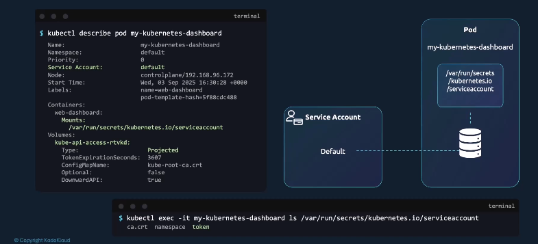
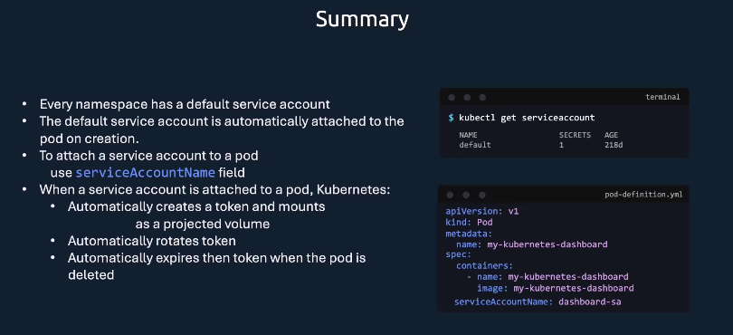

# 🤖 **Service Accounts in Kubernetes (Deep Dive for Admins)**

> _“How Pods, Jobs, and external CI/CD tools actually authenticate to the Kubernetes API — and how Kubernetes automates that behind the scenes.”_

---

## 📖 **What Is a Service Account?**

A **ServiceAccount (SA)** is a **non-human identity** used by:

- Pods and controllers **inside the cluster**, and
- external automation tools **outside the cluster** (like Jenkins, GitHub Actions, or ArgoCD)

It’s how “machines” (not people) prove who they are to the Kubernetes API.

Each SA provides:

- A **name** (identity)
- An automatically managed **JWT token**
- An associated **CA certificate**
- (Optionally) **RBAC permissions**

---

## 🎭 **Two Main Use Cases of ServiceAccounts**

<div align="center" style="background-color: #141a19ff;color: #a8a5a5ff; border-radius: 10px; border: 2px solid">

| Usage Type                      | Description                                                                                     | Typical Identity                                          | Token Handling                                                                        | Example Use Case                                                                    |
| ------------------------------- | ----------------------------------------------------------------------------------------------- | --------------------------------------------------------- | ------------------------------------------------------------------------------------- | ----------------------------------------------------------------------------------- |
| 🧩 **Internal Service Account** | Used **inside the cluster** — assigned automatically to Pods, Deployments, Jobs, or DaemonSets. | `system:serviceaccount:<namespace>:<serviceaccount-name>` | Token automatically injected at `/var/run/secrets/kubernetes.io/serviceaccount/token` | A backend Pod calling the Kubernetes API to read ConfigMaps or scale Deployments.   |
| 🌐 **External Service Account** | Used **outside the cluster** — for automation tools that need API access.                       | `system:serviceaccount:<namespace>:<serviceaccount-name>` | Token created manually via `kubectl create token <sa-name>` and stored in kubeconfig. | CI/CD tool (GitHub Actions, Jenkins, Terraform) deploying manifests to the cluster. |

</div>

---

### ⚙️ **1. Internal Flow (In-Cluster Pods)**

1. Pod is created → assigned a ServiceAccount (default or custom).
2. Kubernetes automatically mounts the token + CA cert inside the Pod.
3. SDKs like `client-go` or `kubectl` in that Pod use the token to call the API.
4. The API server authenticates it and applies RBAC rules tied to that SA.

> ✅ **You don’t need to manually configure anything** — Kubernetes handles token mounting and rotation automatically.

---

### 🌐 **2. External Flow (Outside-Cluster Tools)**

1. Create a ServiceAccount in the target namespace.
2. Bind it to the proper RBAC role (e.g., `ClusterRoleBinding` for admin access).
3. Manually create a token (Kubernetes ≥1.24 uses `kubectl create token`).
4. Embed that token in a kubeconfig and give it to your automation tool.

> ✅ This lets external tools **authenticate just like a Pod would**, but from outside the cluster.

---

## ⚙️ **1. Service Accounts for Internal Pods**

Let’s go step-by-step with what actually happens behind the scenes 👇

---

<div align="center" style="background-color:#121F2E; border-radius: 10px; border: 2px solid">
  
</div>

---

### 🔹 **Step 1 — Default ServiceAccount Per Namespace**

When you create a new namespace:

```bash
kubectl create namespace dev
```

Kubernetes automatically creates a default ServiceAccount:

```bash
kubectl get serviceaccounts -n dev
```

Output:

```ini
NAME      SECRETS   AGE
default   1         5s
```

This means:

> Every Pod in this namespace will **automatically use** this `default` ServiceAccount unless you specify another one.

---

### 🔹 **Step 2 — ServiceAccount Token Secret**

When Kubernetes creates that ServiceAccount, it automatically creates a **Secret** containing:

- A **JWT token** (for API authentication)
- The **CA certificate**
- The **namespace name**

Example:

```bash
kubectl get secrets -n dev
```

Output:

```ini
NAME                    TYPE                                  AGE
default-token-z9lm2     kubernetes.io/service-account-token   5s
```

Let’s decode it:

```bash
kubectl describe secret default-token-z9lm2 -n dev
```

Output:

```ini
Type:  kubernetes.io/service-account-token
Data
====
ca.crt:     1066 bytes
namespace:  3 bytes
token:      eyJhbGciOiJSUzI1NiIsInR5cCI6IkpXVCJ9...
```

✅ This token is how Kubernetes knows that a Pod using this ServiceAccount is who it says it is.

---

### 🔹 **Step 3 — Token Injection Into Pods**

When you create a Pod, Kubernetes automatically mounts this Secret as files under:

```ini
/var/run/secrets/kubernetes.io/serviceaccount/
```

Inside a Pod:

```bash
kubectl exec -it mypod -- ls /var/run/secrets/kubernetes.io/serviceaccount
```

Output:

```ini
ca.crt
namespace
token
```

The **Kubernetes client libraries** (in Python, Go, etc.) automatically use these credentials when a Pod tries to call the API.

---

### 🔹 **Step 4 — Identity of the Pod**

Each Pod authenticates to the API as:

```ini
system:serviceaccount:<namespace>:<serviceaccount-name>
```

Example:

```ini
system:serviceaccount:dev:default
```

You can verify this using:

```bash
kubectl auth whoami
```

Output:

```ini
USER: system:serviceaccount:dev:default
GROUPS:
- system:serviceaccounts
- system:serviceaccounts:dev
- system:authenticated
```

---

### 🤝 **Linking a Custom ServiceAccount to a Pod**

You can create your own SA instead of using `default`.

**Example:**

```bash
kubectl create serviceaccount webapp-sa -n dev
```

Then use it in a Pod:

```yaml
apiVersion: v1
kind: Pod
metadata:
  name: webapp
  namespace: dev
spec:
  serviceAccountName: webapp-sa
  containers:
    - name: nginx
      image: nginx
```

Kubernetes automatically mounts:

```ini
/var/run/secrets/kubernetes.io/serviceaccount/token
```

specific to `webapp-sa`.

✅ The Pod now authenticates as:
`system:serviceaccount:dev:webapp-sa`

---

## 🌐 **2. Service Accounts for External CI/CD Tools**

Now let’s discuss **how to use ServiceAccounts outside the cluster**, such as from:

- Jenkins
- GitHub Actions
- ArgoCD
- Terraform

---

### 1️⃣ **Why We Need External Access**

CI/CD pipelines need to apply manifests:

```bash
kubectl apply -f deployment.yaml
```

They are **outside** the cluster → no automatic token injection.

So we must **manually generate a token** for a ServiceAccount.

---

### 2️⃣ **Create a CI/CD ServiceAccount**

```bash
kubectl create serviceaccount cicd-bot -n dev
```

Give it permissions:

```yaml
apiVersion: rbac.authorization.k8s.io/v1
kind: ClusterRoleBinding
metadata:
  name: cicd-admin
roleRef:
  kind: ClusterRole
  name: cluster-admin
  apiGroup: rbac.authorization.k8s.io
subjects:
  - kind: ServiceAccount
    name: cicd-bot
    namespace: dev
```

---

### 3️⃣ **Create Token for External Access (v1.24+)**

Kubernetes 1.24+ uses:

```bash
kubectl create token cicd-bot -n dev
```

Output:

```ini
eyJhbGciOiJSUzI1NiIsInR5cCI6IkpXVCJ9...
```

Use this token in your `kubeconfig`:

```yaml
apiVersion: v1
kind: Config
clusters:
  - name: mycluster
    cluster:
      certificate-authority-data: LS0tLS1CRUdJTiBDRVJUSUZ...
      server: https://mycluster.example.com
users:
  - name: cicd-bot
    user:
      token: eyJhbGciOiJSUzI1NiIsInR5cCI6IkpXVCJ9...
contexts:
  - name: cicd
    context:
      cluster: mycluster
      namespace: dev
      user: cicd-bot
current-context: cicd
```

✅ This allows your CI/CD runner to authenticate as `system:serviceaccount:dev:cicd-bot`.

---

### 4️⃣ **Using It in Jenkins / GitHub Actions**

**Example: GitHub Actions:**

```yaml
- name: Setup kubeconfig
  run: |
    echo "$KUBECONFIG_DATA" > kubeconfig
    export KUBECONFIG=$(pwd)/kubeconfig
    kubectl get nodes
  env:
    KUBECONFIG_DATA: ${{ secrets.KUBECONFIG }}
```

The secret `KUBECONFIG` contains the same config YAML with your `cicd-bot` token.

---

## 🧰 **ServiceAccount Permissions (RBAC Connection)**

A ServiceAccount alone has **no permissions** by default.
You must bind it to a **Role** or **ClusterRole** using **RoleBinding**.

### Example: Allow this SA to list Pods

```yaml
apiVersion: v1
kind: ServiceAccount
metadata:
  name: reader
  namespace: dev
---
apiVersion: rbac.authorization.k8s.io/v1
kind: Role
metadata:
  name: pod-reader
  namespace: dev
rules:
  - apiGroups: [""]
    resources: ["pods"]
    verbs: ["get", "list"]
---
apiVersion: rbac.authorization.k8s.io/v1
kind: RoleBinding
metadata:
  name: read-pods
  namespace: dev
subjects:
  - kind: ServiceAccount
    name: reader
    namespace: dev
roleRef:
  kind: Role
  name: pod-reader
  apiGroup: rbac.authorization.k8s.io
```

✅ The `reader` SA can now `get` and `list` Pods in namespace `dev`.

---

## 🧠 **Modern Token Types**

### 🧩 Legacy Tokens (Old Behavior)

- Static token stored as a **Secret**
- Never expires (risky)
- Was default before Kubernetes v1.24

### 🧩 Bound ServiceAccount Tokens (New Default)

Introduced in v1.24+ for security:

- **Auto-generated** and **short-lived**
- Automatically rotated by Kubernetes
- Not stored as Secrets
- **Bound** to a specific Pod → cannot be reused elsewhere

To enable or inspect:

```bash
kubectl describe pod webapp
```

Look for annotation:

```ini
kubernetes.io/service-account.name: webapp-sa
```

---

## 🧩 **Advanced: Projected ServiceAccount Tokens**

These are **custom-scoped tokens** you can manually request with a limited lifetime and audience (like a custom API).

For example, to authenticate from a Pod to an external system (e.g., Vault or CI/CD runner):

```yaml
apiVersion: v1
kind: Pod
metadata:
  name: projector
spec:
  serviceAccountName: webapp-sa
  volumes:
    - name: token
      projected:
        sources:
          - serviceAccountToken:
              path: token
              expirationSeconds: 3600
              audience: vault
  containers:
    - name: app
      image: busybox
      command: ["sleep", "3600"]
      volumeMounts:
        - name: token
          mountPath: /var/run/secrets/tokens
```

✅ This creates a **custom token** that expires after 1 hour and can only be used by systems trusting the `vault` audience.

---

## 🧠 **How Kubernetes Validates the Token Internally**

1. Client (Pod or CI/CD) sends HTTPS request with:

   ```ini
   Authorization: Bearer eyJhbGciOi...
   ```

2. API server verifies:

   - Token signature matches cluster’s ServiceAccount signing key.
   - Token audience matches.
   - Token hasn’t expired.

3. Identity extracted:

   ```ini
   system:serviceaccount:<namespace>:<serviceaccount-name>
   ```

4. RBAC rules applied → allow or deny.

---

## 🧰 **Commands You Should Know**

| Command                                                               | Description                       |
| --------------------------------------------------------------------- | --------------------------------- |
| `kubectl get sa -A`                                                   | List all ServiceAccounts          |
| `kubectl describe sa <name>`                                          | Show token Secret and annotations |
| `kubectl create serviceaccount <name>`                                | Create new SA                     |
| `kubectl delete sa <name>`                                            | Delete                            |
| `kubectl create token <name>`                                         | Generate JWT for external usage   |
| `kubectl auth can-i --as system:serviceaccount:<ns>:<name> list pods` | Simulate access                   |

---

## ✅ **Best Practices for Admins**

- ✅ Create **dedicated SAs** per app — never reuse “default”
- ✅ Use **namespaces** to scope access
- ✅ Rotate external tokens regularly
- ✅ Prefer **short-lived bound tokens** over static ones
- ✅ Never store tokens in code or git
- ✅ Combine with **RBAC** for least privilege
- ✅ Disable automatic mounting for Pods that don’t need it:

```yaml
automountServiceAccountToken: false
```

---

## 🏁 **Summary**

<div align="center" style="background-color: #141a19ff;color: #a8a5a5ff; border-radius: 10px; border: 2px solid">

| Concept              | Description                                           |
| -------------------- | ----------------------------------------------------- |
| **Internal SAs**     | Used automatically by Pods                            |
| **External SAs**     | Used by CI/CD and automation                          |
| **Token Mount Path** | `/var/run/secrets/kubernetes.io/serviceaccount/token` |
| **Modern Tokens**    | Bound, short-lived, auto-rotated                      |
| **RBAC Integration** | Defines what SAs can do                               |
| **External Access**  | Use `kubectl create token` + kubeconfig               |
| **Security Tip**     | Disable `automountServiceAccountToken` if not needed  |

</div>

---

<div align="center" style="background-color:#121F2E; border-radius: 10px; border: 2px solid">
  
</div>
