# 🔒 **Authorization (AuthZ) in Kubernetes — Deep Dive for Admins**

> _“AuthN asks: Who are you? 🔐 — AuthZ asks: What can you do?”_

---

## 🧩 **What Is Authorization in Kubernetes?**

**Authorization (AuthZ)** in Kubernetes is the process of determining **whether an authenticated request is allowed** to perform a specific operation on a resource.

After Authentication (AuthN) succeeds, the API Server knows **who** is making the request (like `system:serviceaccount:dev:webapp-sa`).
Then it checks:

> “Is this identity allowed to perform this action (`verb`) on this resource (`object`) in this scope (`namespace`)?”

---

## 🧠 **The Big Picture: API Server Decision Pipeline**

Here’s how a single API request is processed inside Kubernetes:

```mermaid
sequenceDiagram
    participant Client as User / Pod / Tool
    participant APIServer as API Server
    participant AuthN as Authentication
    participant AuthZ as Authorization
    participant Admission as Admission Controllers
    participant etcd as etcd (Cluster State)

    Client->>APIServer: HTTPS Request (e.g. kubectl get pods)
    APIServer->>AuthN: Validate identity (cert, token, etc.)
    AuthN-->>APIServer: ✅ User = system:serviceaccount:dev:webapp-sa
    APIServer->>AuthZ: Check if allowed (verb + resource + namespace)
    AuthZ-->>APIServer: ✅ Allow or ❌ Deny
    APIServer->>Admission: Validate / mutate request
    Admission->>etcd: Persist changes
    etcd-->>Client: Response (200 OK or 403 Forbidden)
```

<div align="center" style="background-color: #141a19ff;color: #a8a5a5ff; border-radius: 10px; border: 2px solid">



</div>

---

> So, **AuthZ** is the **second gate** that determines whether an authenticated identity can proceed.

---

## ⚙️ **Authorization Inputs — What Kubernetes Evaluates**

When the API Server performs authorization, it checks:

<div align="center" style="background-color: #141a19ff;color: #a8a5a5ff; border-radius: 10px; border: 2px solid">

| Parameter         | Description                  | Example                                    |
| ----------------- | ---------------------------- | ------------------------------------------ |
| **User/Group**    | Who made the request         | `system:serviceaccount:dev:webapp-sa`      |
| **Verb**          | The action being attempted   | `get`, `list`, `create`, `delete`, `patch` |
| **API Group**     | Which API resource group     | `""` (core), `apps`, `batch`, etc.         |
| **Resource**      | The type of object           | `pods`, `deployments`, `configmaps`        |
| **Namespace**     | Where it applies             | `dev`, `prod`                              |
| **Resource Name** | (Optional) Specific resource | `webapp-pod`                               |
| **Subresource**   | (Optional) Special endpoint  | `pods/log`                                 |

</div>

---

Example request:

```ini
User: system:serviceaccount:dev:webapp-sa
Verb: get
API Group: ""
Resource: pods
Namespace: dev
ResourceName: mypod
```

---

## 🧩 **Kubernetes Authorization Modes**

Kubernetes can use multiple **authorization modules** simultaneously.
They’re configured in the API server with:

```bash
--authorization-mode=Node,RBAC,Webhook
```

Each module checks the request; if any authorizer **allows** it, the request passes.

Let’s look at the major ones 👇

<div align="center" style="background-color: #141a19ff;color: #a8a5a5ff; border-radius: 10px; border: 2px solid">

| Mode            | Description                                            | Common Use                        |
| --------------- | ------------------------------------------------------ | --------------------------------- |
| **RBAC**        | Role-Based Access Control (default in modern clusters) | Fine-grained permissions          |
| **ABAC**        | Attribute-Based Access Control (deprecated)            | Legacy static rules via JSON      |
| **Webhook**     | External API for dynamic authorization decisions       | Integrate with enterprise systems |
| **Node**        | Special authorizer for kubelets                        | Node-to-API communication         |
| **AlwaysAllow** | Allows all requests (unsafe, testing only)             | Development                       |
| **AlwaysDeny**  | Denies all requests (testing only)                     | Development                       |

</div>

---

> ✅ In production clusters, `RBAC` + `Node` (and sometimes `Webhook`) are standard.

---

## 🧱 **RBAC — The Primary Authorizer**

As you learned, **RBAC (Role-Based Access Control)** is the default and most flexible authorizer.

It matches the request against:

- `Role` or `ClusterRole` rules
- `RoleBinding` or `ClusterRoleBinding` assignments

If a matching rule is found → ✅ allow
Otherwise → ❌ forbidden

### Example Request Check

| Input                                                                     |
| ------------------------------------------------------------------------- |
| **User:** `system:serviceaccount:dev:webapp-sa`                           |
| **Action:** `list pods`                                                   |
| **RBAC Rule:** `apiGroups=[""], resources=["pods"], verbs=["get","list"]` |

✅ Allowed if a RoleBinding or ClusterRoleBinding grants this permission.

---

## 🧱 **Node Authorization (for Kubelets)**

The **Node Authorizer** handles requests made by the **kubelet** running on each node.

- Node identity → `system:node:<nodename>`
- Belongs to → `system:nodes` group

It allows limited operations like:

- Reading/writing Pod status for Pods scheduled on that node
- Reading ConfigMaps or Secrets only for its Pods

✅ Prevents one node from reading Secrets belonging to Pods on another node.

---

## 🧩 **Webhook Authorization**

For enterprise or custom setups, you can delegate authorization decisions to an **external service**.

Example API server flags:

```bash
--authorization-mode=Webhook,RBAC
--authorization-webhook-config-file=/etc/kubernetes/webhook-config.yaml
```

Webhook sends a JSON payload:

```json
{
  "apiVersion": "authorization.k8s.io/v1",
  "kind": "SubjectAccessReview",
  "spec": {
    "user": "john@example.com",
    "resourceAttributes": {
      "namespace": "dev",
      "verb": "get",
      "resource": "pods"
    }
  }
}
```

External service replies:

```json
{
  "apiVersion": "authorization.k8s.io/v1",
  "kind": "SubjectAccessReview",
  "status": {
    "allowed": true,
    "reason": "User john@example.com is in group devs"
  }
}
```

✅ Great for plugging Kubernetes into central corporate policy engines like **OPA (Open Policy Agent)** or **AuthZ microservices**.

---

## 🧠 **Authorization for Kubelet-to-API Communication**

- Each node’s kubelet must authenticate and then be authorized to act on cluster resources.
- Node authorizer ensures:

  - Node A cannot read Pods from Node B
  - Node can only modify its own status
  - Node can fetch Secrets/ConfigMaps **only** for its running Pods

✅ This prevents lateral privilege escalation between nodes.

---

## 🧩 **The “SubjectAccessReview” API**

You can programmatically check authorization with the Kubernetes **SubjectAccessReview API**.

Example:

```bash
kubectl auth can-i create pods -n dev
```

Under the hood, this executes a SubjectAccessReview object:

```yaml
apiVersion: authorization.k8s.io/v1
kind: SubjectAccessReview
spec:
  user: system:serviceaccount:dev:webapp-sa
  resourceAttributes:
    namespace: dev
    verb: create
    resource: pods
```

Response:

```yaml
status:
  allowed: true
  reason: "RoleBinding grants create on pods in dev"
```

---

## 🧩 **Authorization Debugging Tools**

<div align="center" style="background-color: #141a19ff;color: #a8a5a5ff; border-radius: 10px; border: 2px solid">

| Command                                            | Description                    |
| -------------------------------------------------- | ------------------------------ |
| `kubectl auth can-i <verb> <resource> -n <ns>`     | Check current user permissions |
| `kubectl auth can-i --as <user> <verb> <resource>` | Impersonate another user       |
| `kubectl auth reconcile -f role.yaml`              | Create or update roles safely  |
| `kubectl get clusterrolebindings`                  | List cluster-level grants      |
| `kubectl describe rolebinding <name>`              | Inspect namespace bindings     |

</div>

---

Example:

```bash
kubectl auth can-i get pods --as system:serviceaccount:dev:webapp-sa -n dev
```

✅ Quickly confirms whether AuthZ would allow the action.

---

## 🧠 **Common Real-World Authorization Flows**

<div align="center" style="background-color: #141a19ff;color: #a8a5a5ff; border-radius: 10px; border: 2px solid">

| Scenario                     | AuthN                           | AuthZ                        |
| ---------------------------- | ------------------------------- | ---------------------------- |
| Pod accessing Kubernetes API | ServiceAccount token            | RBAC RoleBinding             |
| `kubectl` user from laptop   | X.509 certificate or OIDC token | ClusterRoleBinding           |
| Node updating its Pod status | kubelet certificate             | Node authorizer              |
| Jenkins deploying manifests  | ServiceAccount token            | ClusterRoleBinding (limited) |

</div>

---

## 🧩 **Common Authorization Errors**

### ❌ “Forbidden” error

```ini
Error from server (Forbidden): User "system:serviceaccount:dev:webapp-sa" cannot list resource "pods" in API group "" in the namespace "dev"
```

**Cause:** No RoleBinding exists granting that permission.
**Fix:** Bind appropriate Role or ClusterRole.

### ⚠️ “RBAC Deny” confusion

If your `--authorization-mode` includes multiple authorizers (e.g., `RBAC,Node,Webhook`),
Kubernetes allows a request if **any one** authorizer approves it.

---

## 🧩 **Authorization Evaluation Logic**

```mermaid
flowchart TD
    A[Authenticated Request] --> B{AuthZ Check: RBAC / Node / Webhook}
    B -->|RBAC| C[Check Roles & Bindings]
    B -->|Node| D[Check kubelet node rules]
    B -->|Webhook| E[External policy service]
    C --> F{Allowed?}
    D --> F
    E --> F
    F -->|✅ Yes| G[Proceed to Admission Controllers]
    F -->|❌ No| H[Reject: 403 Forbidden]
```

<div align="center" style="background-color: #141a19ff;color: #a8a5a5ff; border-radius: 10px; border: 2px solid">



</div>

---

## ⚖️ **Quick Comparison — AuthN vs AuthZ**

<div align="center" style="background-color: #141a19ff;color: #a8a5a5ff; border-radius: 10px; border: 2px solid">

| Concept                    | Question Answered                                   | Examples                               |
| -------------------------- | --------------------------------------------------- | -------------------------------------- |
| **AuthN (Authentication)** | Who are you?                                        | ServiceAccount, user cert, OIDC login  |
| **AuthZ (Authorization)**  | What can you do?                                    | RBAC, Node, Webhook                    |
| **Admission Control**      | Should this object creation be allowed or modified? | PodSecurity, ResourceQuota, LimitRange |

</div>

---

## ✅ **Key Takeaways**

- ✅ **AuthZ** is the decision layer that follows successful AuthN
- ✅ Controlled primarily through **RBAC** in Kubernetes
- ✅ Multiple authorizers can coexist (`RBAC`, `Node`, `Webhook`)
- ✅ Use `kubectl auth can-i` to test access
- ✅ “Deny” means no authorizer granted permission
- ✅ Implement least privilege — grant only what’s needed
