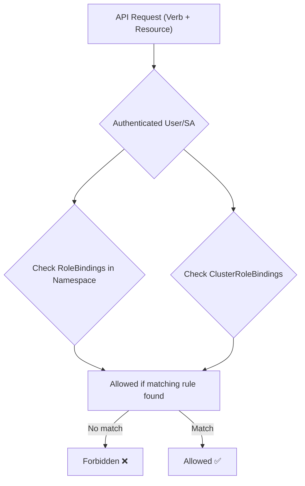

# 🧱 **Kubernetes RBAC (Role-Based Access Control) — Deep Dive for Admins**

> _“AuthN proves **who** you are — RBAC decides **what** you’re allowed to do.”_

---

## 🧩 **What Is RBAC?**

**RBAC** (Role-Based Access Control) is Kubernetes’ **authorization system** that defines what operations a user, Pod, or external tool can perform on which resources.

It answers:

> “Is this authenticated identity allowed to perform this action on this resource?”

Example:

> Can `system:serviceaccount:dev:webapp-sa` list Pods in namespace `dev`?

RBAC rules are evaluated by the **API Server** **after authentication** succeeds.

---

## 🧠 **RBAC Core Components Overview**

<div align="center" style="background-color: #141a19ff;color: #a8a5a5ff; border-radius: 10px; border: 2px solid">

| Concept                | Purpose                                                                           | Scope         | Example                               |
| ---------------------- | --------------------------------------------------------------------------------- | ------------- | ------------------------------------- |
| **Role**               | Defines permissions within a specific **namespace**                               | Namespaced    | Can list Pods in `dev`                |
| **ClusterRole**        | Defines permissions cluster-wide (or can be reused across namespaces)             | Cluster-level | Can list Nodes, manage all namespaces |
| **RoleBinding**        | Grants a Role’s permissions to a **subject** (user, group, SA) within a namespace | Namespaced    | Binds a Role to a ServiceAccount      |
| **ClusterRoleBinding** | Grants a ClusterRole’s permissions to a **subject** cluster-wide                  | Cluster-level | Give admins full access               |

</div>

---

<div align="center">
  
</div>

---

## ⚔️ **Roles vs ClusterRoles**

Let’s compare them side by side 👇

<div align="center" style="background-color: #141a19ff;color: #a8a5a5ff; border-radius: 10px; border: 2px solid">

| Feature                                            | **Role**           | **ClusterRole**                       |
| -------------------------------------------------- | ------------------ | ------------------------------------- |
| Scope                                              | Specific Namespace | Entire Cluster                        |
| Can manage namespaced resources?                   | ✅ Yes             | ✅ Yes                                |
| Can manage non-namespaced resources (e.g., Nodes)? | ❌ No              | ✅ Yes                                |
| YAML Kind                                          | `Role`             | `ClusterRole`                         |
| Used with Binding                                  | `RoleBinding`      | `ClusterRoleBinding` (or RoleBinding) |

</div>

---

### 1️⃣ Example: Role (Namespace-Scoped)

**using yaml:**

```yaml
apiVersion: rbac.authorization.k8s.io/v1
kind: Role
metadata:
  namespace: dev
  name: pod-reader
rules:
  - apiGroups: [""]
    resources: ["pods", "services"]
  - apiGroups: ["apps"]
    resources: ["deployments"]
    verbs: ["get", "list"]
```

✅ Allows reading Pods only in namespace `dev`.

**using kubectl dry-run:**

```bash
kubectl create role pod-reader \
  --namespace=dev \
  --verb=get,list \
  --resource=pods,services,deployments.apps \
  --dry-run=client -o yaml > pod-reader.yaml
```

```bash
kubectl apply -f pod-reader.yaml
```

✅ Same result.

---

### 2️⃣ Example: ClusterRole (Cluster-Scoped)

**using yaml:**

```yaml
apiVersion: rbac.authorization.k8s.io/v1
kind: ClusterRole
metadata:
  name: cluster-admin
rules:
  - apiGroups: ["*"]
    resources: ["*"]
    verbs: ["*"]
```

✅ Can do _anything_ on _any resource_ in _any namespace_.

**using kubectl dry-run:**

```bash
kubectl create clusterrole cluster-admin \
  --verb="*" \
  --resource="*" \
  --dry-run=client -o yaml > cluster-admin.yaml
```

```bash
kubectl apply -f cluster-admin.yaml
```

✅ Same result.

---

## ⚔️ **RoleBinding vs ClusterRoleBinding**

<div align="center" style="background-color: #141a19ff;color: #a8a5a5ff; border-radius: 10px; border: 2px solid">

| Feature          | **RoleBinding**                         | **ClusterRoleBinding**                   |
| ---------------- | --------------------------------------- | ---------------------------------------- |
| Scope            | Namespace-specific                      | Cluster-wide                             |
| Links to         | Role or ClusterRole                     | ClusterRole only                         |
| Grants access to | A specific namespace                    | All namespaces                           |
| Example usage    | Give a Pod read access in one namespace | Give DevOps team admin access everywhere |

</div>

---

### 1️⃣ Example: RoleBinding (Namespace-Scoped)

**using yaml:**

```yaml
apiVersion: rbac.authorization.k8s.io/v1
kind: RoleBinding
metadata:
  name: read-pods
  namespace: dev
subjects:
  - kind: ServiceAccount
    name: webapp-sa
    namespace: dev
roleRef:
  kind: Role
  name: pod-reader
  apiGroup: rbac.authorization.k8s.io
```

✅ Binds `pod-reader` Role to `webapp-sa` in the same namespace.

**using kubectl dry-run:**

```bash
kubectl create rolebinding read-pods \
  --role=pod-reader \
  --serviceaccount=dev:webapp-sa \
  --namespace=dev \
  --dry-run=client -o yaml > read-pods.yaml
```

```bash
kubectl apply -f read-pods.yaml
```

✅ Same result.

---

### 2️⃣ Example: ClusterRoleBinding (Cluster-Wide)

**using yaml:**

```yaml
apiVersion: rbac.authorization.k8s.io/v1
kind: ClusterRoleBinding
metadata:
  name: admin-binding
subjects:
  - kind: User
    name: dev@example.com
    apiGroup: rbac.authorization.k8s.io
roleRef:
  kind: ClusterRole
  name: cluster-admin
  apiGroup: rbac.authorization.k8s.io
```

✅ Gives user `dev@example.com` full cluster-admin privileges.

**using kubectl dry-run:**

```bash
kubectl create clusterrolebinding admin-binding \
  --user=dev@example.com \
  --clusterrole=cluster-admin \
  --dry-run=client -o yaml > admin-binding.yaml
```

```bash
kubectl apply -f admin-binding.yaml
```

✅ Same result.

---

### ⁉️ **RBAC Subjects (Who Gets Access)**

RBAC **subjects** define _who_ is being granted access.

<div align="center" style="background-color: #141a19ff;color: #a8a5a5ff; border-radius: 10px; border: 2px solid">

| Subject Type          | Description                                          | Example Identifier                    |
| --------------------- | ---------------------------------------------------- | ------------------------------------- |
| 👤 **User**           | Human or service identity (from OIDC, cert CN, etc.) | `dev@example.com`                     |
| 👥 **Group**          | Collection of users                                  | `system:masters`, `dev-team`          |
| 🤖 **ServiceAccount** | Non-human identity within Kubernetes                 | `system:serviceaccount:dev:webapp-sa` |

</div>

Example ServiceAccount subject inside RoleBinding:

```yaml
subjects:
  - kind: ServiceAccount
    name: webapp-sa
    namespace: dev
```

Example User subject inside RoleBinding/ClusterRoleBinding:

```yaml
subjects:
  - kind: User
    name: dev@example.com
    apiGroup: rbac.authorization.k8s.io
```

Example Group subject inside RoleBinding/ClusterRoleBinding:

```yaml
subjects:
  - kind: Group
    name: dev-team
    apiGroup: rbac.authorization.k8s.io
```

---

## 🧭 **Real-World RBAC Patterns**

### 🧩 Pattern 1 — **Namespace Isolation**

Each app team gets its own namespace + Role/RoleBinding.

```yaml
Role: can manage Pods, Deployments, Services in their namespace only
RoleBinding: binds Role to the team’s ServiceAccount
```

✅ Prevents cross-namespace interference.

---

### 🧩 Pattern 2 — **Centralized Read-Only ClusterRole**

Create one `ClusterRole` like `view-all`:

```yaml
apiVersion: rbac.authorization.k8s.io/v1
kind: ClusterRole
metadata:
  name: view-all
rules:
  - apiGroups: [""]
    resources: ["pods", "services", "configmaps"]
    verbs: ["get", "list", "watch"]
```

Then bind it to multiple namespaces using `RoleBinding`:

```yaml
kind: RoleBinding
metadata:
  name: viewer
  namespace: dev
roleRef:
  kind: ClusterRole
  name: view-all
  apiGroup: rbac.authorization.k8s.io
subjects:
  - kind: ServiceAccount
    name: monitor-sa
    namespace: dev
```

✅ Reuse one `ClusterRole` across many namespaces.

---

### 🧩 Pattern 3 — **External CI/CD Access**

External automation tools (GitHub Actions, Jenkins, ArgoCD) use:

- A **ServiceAccount**
- Bound to a **ClusterRole** or `Role` depending on required scope
- Token manually generated via:

  ```bash
  kubectl create token cicd-bot -n dev
  ```

✅ Allows external tools to `kubectl apply` safely using least privilege.

---

## ⚙️ **How Kubernetes Evaluates RBAC**

When a request reaches the API Server:

1. ✅ AuthN identifies the user/SA (e.g., `system:serviceaccount:dev:webapp-sa`)
2. ✅ AuthZ (RBAC) checks:

   - **Verb** → what action? (`get`, `list`, `delete`)
   - **Resource** → which object? (`pods`, `deployments`)
   - **Namespace** → where?
   - **Binding** → does any RoleBinding or ClusterRoleBinding grant that permission?

If yes → ✅ Allowed
If not → ❌ Forbidden (`Error from server (Forbidden)`)

---

## 🧪 **Debugging RBAC Access**

<div align="center" style="background-color: #141a19ff;color: #a8a5a5ff; border-radius: 10px; border: 2px solid">

| Command                                                                        | Purpose                               |
| ------------------------------------------------------------------------------ | ------------------------------------- |
| `kubectl auth can-i list pods -n dev`                                          | Check if you can list Pods            |
| `kubectl auth can-i delete nodes`                                              | Check cluster-level permissions       |
| `kubectl auth can-i --as system:serviceaccount:dev:webapp-sa list pods -n dev` | Simulate another identity             |
| `kubectl get clusterrolebindings`                                              | List all cluster role bindings        |
| `kubectl describe rolebinding <name>`                                          | Inspect role-to-subject relationships |

</div>

---

## 🔴 **Common RBAC Troubleshooting Patterns**

### ❌ Error: “Forbidden: User ... cannot list resource ...”

**Fix:**

- Check `kubectl auth whoami`
- Inspect related Role/RoleBinding
- Verify correct namespace
- Ensure subject kind/name match exactly

### ⚠️ Mistake: Using `ClusterRoleBinding` when you meant namespaced Role

- Over-grants access to all namespaces
- Fix: Use RoleBinding bound to Role in that namespace

### ⚙️ Debugging tip:

```bash
kubectl get rolebinding,clusterrolebinding -A | grep <subject-name>
```

### 🚫 Mistake: Edit Pod Service Account

you can't edit service account for existing Pod, you must delete and recreate the pod:

```bash
kubectl delete pod <pod-name>
kubectl create pod <pod-name> --image=nginx --restart=Never --serviceaccount=<service-account-name>
```

> 🎁 **Tip:** For Deployments you can change the `spec.template.spec.serviceAccountName` without deleting and recreating the Deployment, because the Deployment controller will trigger a new rollout with the new service account.

### 🚫 Mistake: `automountServiceAccountToken: false`

this prevents the service account from being mounted into the Pod, so the Pod can’t access the service account secret.

> 🎁 **Tip:** You can fix this by setting `automountServiceAccountToken: true` and then deleting and recreating the Pod.

---

## 🧩 **Default ClusterRoles in Kubernetes**

<div align="center" style="background-color: #141a19ff;color: #a8a5a5ff; border-radius: 10px; border: 2px solid">

| Default ClusterRole | Description                             |
| ------------------- | --------------------------------------- |
| `cluster-admin`     | Full access to everything               |
| `admin`             | Namespace admin access                  |
| `edit`              | Can modify most objects in namespace    |
| `view`              | Read-only namespace access              |
| `system:node`       | Used by kubelets                        |
| `system:discovery`  | Used for unauthenticated discovery APIs |

</div>

You can inspect all:

```bash
kubectl get clusterroles
kubectl describe clusterrole admin
```

---

## 🎨 **RBAC Evaluation Diagram**

<div align="center" style="background-color: #141a19ff;color: #a8a5a5ff; border-radius: 10px; border: 2px solid">



</div>

---

## ✅ **Summary Table**

<div align="center" style="background-color: #141a19ff;color: #a8a5a5ff; border-radius: 10px; border: 2px solid">

| Concept                | Description                                       | Example                               |
| ---------------------- | ------------------------------------------------- | ------------------------------------- |
| **Role**               | Namespace-specific permissions                    | Read Pods in `dev`                    |
| **ClusterRole**        | Cluster-wide permissions                          | Admin across all namespaces           |
| **RoleBinding**        | Connects Role/ClusterRole to subject in namespace | `webapp-sa` → `pod-reader`            |
| **ClusterRoleBinding** | Connects ClusterRole to subject across cluster    | `dev@example.com` → `cluster-admin`   |
| **Subjects**           | User, Group, or ServiceAccount                    | `system:serviceaccount:dev:webapp-sa` |
| **Check Access**       | `kubectl auth can-i`                              | Test permissions                      |

</div>

---

## 🏁 **Key Takeaways**

- ✅ **AuthN** identifies, **RBAC** authorizes
- ✅ **Roles** are namespaced; **ClusterRoles** are global
- ✅ **Bindings** connect identities (subjects) to roles
- ✅ Always follow **least privilege** principle
- ✅ Use `kubectl auth can-i` to test
- ✅ Keep RBAC YAMLs under version control

---

Would you like the **next section** to cover **advanced RBAC strategies** — like:

- Aggregated ClusterRoles (`rbac.authorization.k8s.io/aggregate-to-*`)
- Impersonation (`--as`, `--as-group`)
- and Dynamic access troubleshooting patterns (via `audit logs` and `who-can`)
  ?

That’s where senior-level Kubernetes admins really shine.
