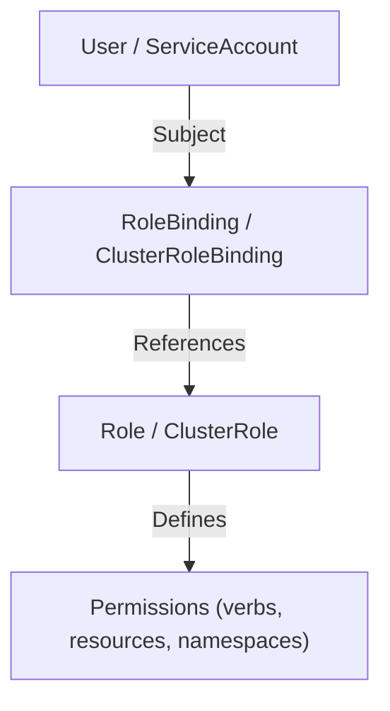
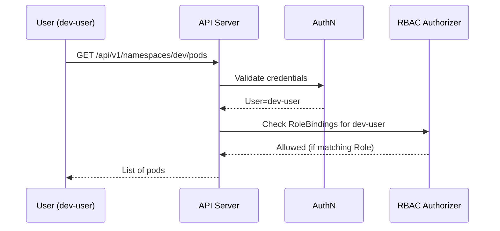

# 🔐 **RBAC (Role-Based Access Control) in Kubernetes**

> _“Kubernetes RBAC maps users and service accounts to specific actions they can perform on specific resources.”_

---

## 🧩 1. What RBAC Does

Once the API server knows **who** you are (from certs, tokens, or OIDC),
it asks:

> “Does this user have permission to perform this action on this resource?”

The **RBAC Authorizer** checks:

- **Subject** → user / group / service account
- **Verb** → get, list, create, update, delete, etc.
- **Resource** → pod, deployment, secret, etc.
- **Namespace** → optional scope

If the rule matches → ✅ allowed
If not → ❌ forbidden

---

## ⚙️ 2. RBAC Building Blocks

Let’s visualize it first:

<div align="center" style="background-color: #141a19ff;color: #a8a5a5ff; border-radius: 10px; border: 2px solid">



</div>

### There are four key RBAC objects:

| RBAC Object            | Scope        | Purpose                                                               |
| ---------------------- | ------------ | --------------------------------------------------------------------- |
| **Role**               | Namespaced   | Defines permissions within a namespace                                |
| **ClusterRole**        | Cluster-wide | Defines permissions across all namespaces or cluster-scoped resources |
| **RoleBinding**        | Namespaced   | Assigns a Role to a user/service account within a namespace           |
| **ClusterRoleBinding** | Cluster-wide | Assigns a ClusterRole to a user/service account across the cluster    |

---

## 🧱 3. Role Example (Namespace Scoped)

A **Role** defines what actions are allowed **within a single namespace**.

```yaml
apiVersion: rbac.authorization.k8s.io/v1
kind: Role
metadata:
  name: pod-reader
  namespace: dev
rules:
  - apiGroups: [""]
    resources: ["pods"]
    verbs: ["get", "list", "watch"]
```

This says:

> “In the `dev` namespace, allow listing, getting, and watching pods.”

---

## 🧩 4. RoleBinding Example (Namespace Scoped)

A **RoleBinding** connects a **Role** to **subjects** (users, groups, or ServiceAccounts).

```yaml
apiVersion: rbac.authorization.k8s.io/v1
kind: RoleBinding
metadata:
  name: read-pods
  namespace: dev
subjects:
  - kind: User
    name: dev-user
    apiGroup: rbac.authorization.k8s.io
roleRef:
  kind: Role
  name: pod-reader
  apiGroup: rbac.authorization.k8s.io
```

✅ `dev-user` can now `get`, `list`, and `watch` pods in the `dev` namespace.

---

## 🌍 5. ClusterRole Example (Cluster-Wide)

A **ClusterRole** works across the entire cluster or for cluster-scoped resources.

```yaml
apiVersion: rbac.authorization.k8s.io/v1
kind: ClusterRole
metadata:
  name: cluster-reader
rules:
  - apiGroups: [""]
    resources: ["pods", "nodes", "namespaces"]
    verbs: ["get", "list", "watch"]
```

This allows viewing Pods, Nodes, and Namespaces — across the cluster.

---

## 🌐 6. ClusterRoleBinding Example (Cluster-Wide)

A **ClusterRoleBinding** grants a **ClusterRole** to one or more subjects.

```yaml
apiVersion: rbac.authorization.k8s.io/v1
kind: ClusterRoleBinding
metadata:
  name: cluster-read-access
subjects:
  - kind: User
    name: admin@company.com
    apiGroup: rbac.authorization.k8s.io
  - kind: ServiceAccount
    name: cicd-bot
    namespace: dev
roleRef:
  kind: ClusterRole
  name: cluster-reader
  apiGroup: rbac.authorization.k8s.io
```

✅ Both `admin@company.com` and the `cicd-bot` SA can read cluster-wide resources.

---

## 🔍 7. How Kubernetes Checks RBAC Rules

When you send a request:

```bash
kubectl get pods -n dev
```

Internally:



If no match is found → HTTP `403 Forbidden`.

---

## 🔧 8. `kubectl auth` — The Best RBAC Debugger

Check your current identity:

```bash
kubectl auth whoami
```

Simulate access:

```bash
kubectl auth can-i list pods -n dev
```

Impersonate another user or SA:

```bash
kubectl auth can-i delete pods -n dev --as system:serviceaccount:dev:cicd-bot
```

See what Roles apply in a namespace:

```bash
kubectl get rolebindings.rbac.authorization.k8s.io -n dev
```

---

## 🧠 9. Built-In ClusterRoles

Kubernetes comes with several **predefined ClusterRoles** for convenience:

| Role            | Description                             |
| --------------- | --------------------------------------- |
| `cluster-admin` | Full control over everything            |
| `admin`         | Namespace admin (manage most resources) |
| `edit`          | Edit objects but not RBAC               |
| `view`          | Read-only access                        |

Example: Grant a ServiceAccount full cluster control

```bash
kubectl create clusterrolebinding cicd-admin \
  --clusterrole=cluster-admin \
  --serviceaccount=dev:cicd-bot
```

---

## 📦 10. API Groups in RBAC Rules

In Roles/ClusterRoles, you’ll often see `apiGroups`.
They map to which API endpoints a resource belongs to:

| API Group                   | Example Resources                     |
| --------------------------- | ------------------------------------- |
| `""` (core)                 | pods, services, secrets, configmaps   |
| `apps`                      | deployments, statefulsets, daemonsets |
| `batch`                     | jobs, cronjobs                        |
| `rbac.authorization.k8s.io` | roles, rolebindings                   |
| `networking.k8s.io`         | ingresses, networkpolicies            |

Example — allow managing Deployments:

```yaml
rules:
  - apiGroups: ["apps"]
    resources: ["deployments"]
    verbs: ["get", "list", "create", "update", "delete"]
```

---

## 🧰 11. Verbs (Actions You Can Authorize)

Common verbs used in RBAC rules:

| Verb               | Meaning                           |
| ------------------ | --------------------------------- |
| `get`              | Read a single resource            |
| `list`             | Read a collection of resources    |
| `watch`            | Subscribe to resource changes     |
| `create`           | Create a resource                 |
| `update`           | Modify a resource                 |
| `patch`            | Partial update                    |
| `delete`           | Delete a resource                 |
| `deletecollection` | Delete all resources of that type |

---

## 🧩 12. Example — Developer Access Only to Their Namespace

### Role

```yaml
apiVersion: rbac.authorization.k8s.io/v1
kind: Role
metadata:
  namespace: dev
  name: developer
rules:
  - apiGroups: [""]
    resources: ["pods", "services", "configmaps"]
    verbs: ["get", "list", "create", "update", "delete"]
```

### RoleBinding

```yaml
apiVersion: rbac.authorization.k8s.io/v1
kind: RoleBinding
metadata:
  name: dev-access
  namespace: dev
subjects:
  - kind: User
    name: dev-user@company.com
    apiGroup: rbac.authorization.k8s.io
roleRef:
  kind: Role
  name: developer
  apiGroup: rbac.authorization.k8s.io
```

✅ Result:

- User can fully manage resources in `dev`
- Has **no access** to `prod`

---

## 🌍 13. Example — Read-Only Access Across Cluster

### ClusterRole

```yaml
apiVersion: rbac.authorization.k8s.io/v1
kind: ClusterRole
metadata:
  name: readonly
rules:
  - apiGroups: [""]
    resources: ["pods", "services", "namespaces"]
    verbs: ["get", "list", "watch"]
```

### ClusterRoleBinding

```yaml
apiVersion: rbac.authorization.k8s.io/v1
kind: ClusterRoleBinding
metadata:
  name: readonly-binding
subjects:
  - kind: Group
    name: view-only
    apiGroup: rbac.authorization.k8s.io
roleRef:
  kind: ClusterRole
  name: readonly
  apiGroup: rbac.authorization.k8s.io
```

✅ All users in group `view-only` can view (but not edit) cluster resources.

---

## 🚫 14. Common Pitfalls

❌ Giving `cluster-admin` to everyone (bypasses RBAC)
❌ Mixing Role and ClusterRole scopes incorrectly
❌ Forgetting to bind the Role (permissions alone don’t grant access)
❌ Forgetting `apiGroups` → access denied
❌ Typos in verbs or resource names

---

## 🧠 15. Best Practices

✅ Use **Roles** for namespace-scoped apps
✅ Use **ClusterRoles** for cluster-scoped resources (nodes, PVs, CRDs)
✅ Bind **least privilege** needed
✅ Use **Groups** for humans, **ServiceAccounts** for automation
✅ Regularly audit with:

```bash
kubectl get clusterrolebindings --sort-by=.metadata.name
```

✅ Disable direct `cluster-admin` usage for CI/CD unless required

---

## 🧭 16. Quick Recap (RBAC Flow)

```mermaid
graph LR
A[User / SA] --> B[RoleBinding / ClusterRoleBinding]
B --> C[Role / ClusterRole]
C --> D[Permissions (verbs, resources, apiGroups, namespaces)]
D --> E[Kubernetes API Server -> Allow/Deny]
```

- **Authentication** = verifies identity
- **RBAC** = verifies action permission

---

Would you like me to continue next with a deep dive into
🧠 **Advanced RBAC Topics** — such as:

- Role aggregation
- Impersonation (`--as` feature)
- RBAC for CRDs
- Auditing and troubleshooting RBAC decisions?
