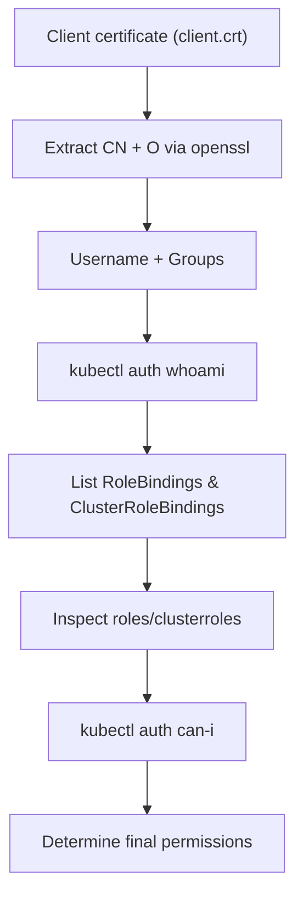

# 🛡️ Validating Your K8s Identity & Permissions Using Client Certificates

_*How to discover your “whoami” and “what-can-I-do” in a Kubernetes cluster using TLS client authentication*_

---

When you authenticate to Kubernetes using **client certificates**, Kubernetes determines your identity entirely from:

- **CN** → Your username
- **O** → Your group(s)

Kubernetes does **not** validate passwords or tokens for cert users — the identity is extracted from the certificate itself, and RBAC defines what you can do.

This topic explains how to inspect your identity, see what groups you belong to, and retrieve all RBAC objects that grant you permissions.

---

## 1️⃣ Step 1 — Extract Your Username & Groups From the Client Certificate

Your client certificate is usually passed to kubectl (or curl) via:

- `--client-certificate=client.crt`
- `--client-key=client.key`

To inspect identity (CN + O fields):

```bash
openssl x509 -in client.crt -noout -subject
```

Example output:

```ini
subject= /CN=john.doe/O=dev-team/O=backend-engineers
```

Kubernetes interprets this as:

- **Username:** `john.doe`
- **Groups:**

  - `dev-team`
  - `backend-engineers`

> ⚠️ IMPORTANT
> Kubernetes **does not** look at the email, givenName, OU, etc.
> Only **CN** and **O** are used for identity.

---

## 2️⃣ Step 2 — Validate Your Identity Using the Kubernetes API

Kubernetes exposes an endpoint to echo your authenticated identity:

```bash
kubectl auth whoami --all
```

Output example:

```ini
USERNAME
john.doe

GROUPS
system:authenticated
dev-team
backend-engineers
```

This verifies:

- Your certificate is valid
- Kubernetes recognized your username
- Your groups were parsed correctly
- You are part of `system:authenticated`

---

## 3️⃣ Step 3 — Find All RoleBindings for Your User & Groups

Kubernetes RBAC uses:

- **RoleBindings** → Namespace-scoped permissions
- **ClusterRoleBindings** → Cluster-wide permissions

You need to check both.

---

### 🔍 3A — List RoleBindings that reference you directly

```bash
kubectl get rolebindings --all-namespaces -o json \
  | jq '.items[] | select(.subjects[]?.name == "john.doe") | .metadata.name'
```

---

### 🔍 3B — List RoleBindings that reference your groups

For group `dev-team`:

```bash
kubectl get rolebindings --all-namespaces -o json \
  | jq '.items[] | select(.subjects[]?.name == "dev-team") | .metadata.name'
```

Repeat for each group discovered from your certificate.

---

### 🔍 3C — List ClusterRoleBindings that reference you

```bash
kubectl get clusterrolebindings -o json \
  | jq '.items[] | select(.subjects[]?.name == "john.doe") | .metadata.name'
```

---

### 🔍 3D — List ClusterRoleBindings for your groups

```bash
kubectl get clusterrolebindings -o json \
  | jq '.items[] | select(.subjects[]?.name == "dev-team") | .metadata.name'
```

This reveals any **ClusterRoles** (like `cluster-admin`, `view`, `edit`, etc.) that you inherit.

---

## 4️⃣ Step 4 — View Exact Permissions Granted by Each Role

Once you find the Roles or ClusterRoles bound to your identity:

### View a Role:

```bash
kubectl get role <role-name> -n <ns> -o yaml
```

### View a ClusterRole:

```bash
kubectl get clusterrole <name> -o yaml
```

Look at:

- `rules`
- verbs (`get`, `list`, `create`)
- resources (`pods`, `deployments`)
- resourceNames
- API groups

---

## 5️⃣ Step 5 — Validate “What Can I Do?” (Recommended)

Kubernetes provides a built-in ability test:

### 📌 Check ANY action:

```bash
kubectl auth can-i create pods
```

### 📌 For specific namespace:

```bash
kubectl auth can-i delete deployments -n prod
```

### 📌 For specific resourceName:

```bash
kubectl auth can-i get secret my-secret -n dev
```

### 📌 As another user (admin-only):

```bash
kubectl auth can-i create pods --as alice
```

---

## 6️⃣ Step 6 — Validate Identity When Using Curl

If you are calling the API manually:

```bash
curl -k \
  --cert client.crt \
  --key client.key \
  https://<api-server>/apis/authentication.k8s.io/v1/tokenreviews
```

Or check:

```bash
curl -k \
  --cert client.crt \
  --key client.key \
  https://<api-server>/api/v1
```

Kubernetes logs will show your user identity.

---

## 📘 End-to-End Workflow (Cheat Sheet)

<div align="center" style="background-color: #141a19ff;color: #a8a5a5ff; border-radius: 10px; border: 2px solid">



</div>

---

## 🏁 Final Summary

To validate your Kubernetes identity & permissions using client certificates:

- ✔️ Extract identity (CN = username, O = groups)
- ✔️ Validate who Kubernetes thinks you are
- ✔️ Enumerate RoleBindings and ClusterRoleBindings
- ✔️ Review Role & ClusterRole definitions
- ✔️ Validate permissions via `kubectl auth can-i`

This gives a **complete, precise** picture of your access inside the cluster.
