# 👤 **K8s Authentication - Account Types**

## 📖 **What Is Authentication (AuthN)?**

**Authentication** is the process of verifying _who_ is making a request to the Kubernetes API Server.

Every single command or API call — whether it’s from:

- `kubectl`
- a Pod inside the cluster
- a CI/CD system
- or a monitoring agent

…must first **prove its identity** to the API Server before anything else happens.

---

## ⚙️ **High-Level Flow**

When a request hits the API server (port 6443):

```bash
kubectl get pods
```

This happens internally:

```mermaid
sequenceDiagram
    participant Client as User/Pod
    participant API as API Server
    participant AuthN as Authentication Module
    Client->>API: HTTPS request (with token/cert)
    API->>AuthN: Verify who is this?
    AuthN-->>API: "Authenticated as system:serviceaccount:default:app-sa"
    API-->>Client: Request accepted → move to authorization
```

<div align="center" style="background-color: #141a19ff;color: #a8a5a5ff; border-radius: 10px; border: 2px solid">



</div>

---

## 👥 **Two Core Identity Types**

Kubernetes distinguishes between **User Accounts** (for humans) and **Service Accounts** (for machines).

<div align="center" style="background-color: #141a19ff;color: #a8a5a5ff; border-radius: 10px; border: 2px solid">

| Account Type           | Who Uses It                                | Where Managed       | Lifetime                     |
| ---------------------- | ------------------------------------------ | ------------------- | ---------------------------- |
| **🧔🏻‍♂️ User Account** | Humans (admins, developers, CI/CD systems) | Outside the cluster | Long-lived (manual rotation) |
| **🤖 Service Account** | Pods, controllers, apps                    | Inside the cluster  | Short-lived (auto-managed)   |

</div>

Let’s explore both 👇

---

## 🧔🏻‍♂️ **User Accounts (External Identities)**

### 🧠 Concept:

Kubernetes itself **doesn’t store or manage users** like Linux or AWS IAM.
Instead, it delegates that responsibility to **external identity systems**.

So, “users” are simply **identities that present valid credentials** — like certificates, tokens, or OIDC tokens.

---

### 🧩 1. Common Authentication Methods for Users

<div align="center" style="background-color: #141a19ff;color: #a8a5a5ff; border-radius: 10px; border: 2px solid">

| Method                          | How it Works                            | Typical Use                             |
| ------------------------------- | --------------------------------------- | --------------------------------------- |
| **Client Certificates (X.509)** | TLS certificate signed by cluster CA    | Cluster admins, developers              |
| **Static Token File**           | Predefined bearer token file            | Demos or static systems                 |
| **Bootstrap Tokens**            | Short-lived tokens for joining nodes    | kubeadm bootstrap                       |
| **OpenID Connect (OIDC)**       | Delegates login to an identity provider | Corporate SSO, Okta, Entra ID, Keycloak |
| **Webhook Token Authenticator** | External custom auth backend            | Enterprises or custom IAM               |

</div>

---

### 📝 Example 1 — Certificate-based User

Let’s say you create a user called `dev`:

```bash
## 1. generate private key for the user
openssl genrsa -out dev.key 2048
## 2. generate csr(certificate signing request) for the user
openssl req -new -key dev.key -out dev.csr -subj "/CN=dev/O=devteam"
## 3. sign csr with ca cert of the your k8s cluster
openssl x509 -req -in dev.csr -CA ca.crt -CAkey ca.key -CAcreateserial -out dev.crt -days 365
```

> 🚨 **Kubernetes now recommends using the built-in `CertificateSigningRequest` (CSR) API to sign user certificates instead of manually accessing the cluster CA.** This approach is more secure, auditable, and aligns with modern RBAC and automation practices.

---

Now, you add it to your kubeconfig:

```yaml
users:
  - name: dev
    user:
      client-certificate: /home/dev/dev.crt
      client-key: /home/dev/dev.key
```

When `kubectl` sends a request:

- It presents this cert over HTTPS.
- The API Server checks it against the CA (`--client-ca-file` flag in `kube-apiserver`).
- If valid, it authenticates the user as `dev` in group `devteam`.

You can verify:

```bash
kubectl auth whoami
# → USER: dev
#   GROUPS: devteam
```

---

### 📝 Example 2 — OIDC (OpenID Connect) User

In cloud or enterprise environments, users are authenticated using **OIDC tokens** from identity providers like Entra ID, Google, Okta, etc.

Your kubeconfig will look like:

```yaml
users:
  - name: oidc-user
    user:
      auth-provider:
        name: oidc
        config:
          idp-issuer-url: https://accounts.google.com
          client-id: my-k8s-app
          id-token: eyJhbGciOiJSUzI1NiIsInR5cCI6IkpXVCJ9...
          refresh-token: 1//0gABCDxyz
```

The API server validates the token signature using the OIDC provider’s public keys.

✅ This enables **single sign-on (SSO)** and **centralized identity management**.

---

## 🤖 **Service Accounts (Internal Identities)**

Service Accounts are **managed by Kubernetes itself** and used by workloads (Pods, controllers, etc.) to authenticate automatically to the API server.

---

### 🧩 How They Work (Behind the Scenes)

1. Each namespace has a default ServiceAccount:

   ```bash
   kubectl get serviceaccount
   NAME      SECRETS   AGE
   default   1         1h
   ```

2. When you create a Pod, if you don’t specify one, Kubernetes attaches:

   ```yaml
   spec:
     serviceAccountName: default
   ```

3. The API server **automatically injects** a JWT token (and CA cert) into the Pod at:

   ```ini
   /var/run/secrets/kubernetes.io/serviceaccount/
   ```

   Example:

   ```ini
   token
   ca.crt
   namespace
   ```

4. Inside the Pod, any client (like `kubectl` or an SDK) can authenticate by reading this token.

---

### 🔍 Token Example (Decoded JWT)

```bash
cat /var/run/secrets/kubernetes.io/serviceaccount/token | cut -d "." -f2 | base64 -d
```

Output:

```json
{
  "iss": "kubernetes/serviceaccount",
  "kubernetes.io/serviceaccount/namespace": "default",
  "kubernetes.io/serviceaccount/secret.name": "app-sa-token",
  "kubernetes.io/serviceaccount/service-account.name": "app-sa",
  "kubernetes.io/serviceaccount/service-account.uid": "ab123"
}
```

✅ The API server now knows the Pod’s identity:
`system:serviceaccount:default:app-sa`

---

### 🧩 Creating Custom Service Accounts

```bash
kubectl create serviceaccount app-sa
```

Attach it to a Pod:

```yaml
apiVersion: v1
kind: Pod
metadata:
  name: demo
spec:
  serviceAccountName: app-sa
  containers:
    - name: curl
      image: curlimages/curl
      command: ["sleep", "3600"]
```

Now inside the Pod:

```bash
kubectl exec -it demo -- cat /var/run/secrets/kubernetes.io/serviceaccount/token
```

You’ll see a JWT unique to `app-sa`.

---

### 🧩 Service Account Token Types

<div align="center" style="background-color: #141a19ff;color: #a8a5a5ff; border-radius: 10px; border: 2px solid">

| Type                                 | Description                               | Example Use                                          |
| ------------------------------------ | ----------------------------------------- | ---------------------------------------------------- |
| **Legacy Tokens**                    | Static, long-lived JWT (stored in Secret) | Older clusters (<1.24)                               |
| **Bound ServiceAccount Tokens**      | Dynamic, short-lived tokens, auto-rotated | Modern clusters (≥1.24)                              |
| **Projected Service Account Tokens** | Scoped tokens with expiration             | Advanced security (e.g., for Vault or external APIs) |

</div>

---

### 📝 Real-Life Use Case Example

Let’s say you have a CI/CD Job in your cluster that deploys applications.
It can use a **ServiceAccount with RBAC permissions** to talk to the API securely:

```yaml
apiVersion: v1
kind: ServiceAccount
metadata:
  name: deployer
---
apiVersion: rbac.authorization.k8s.io/v1
kind: ClusterRoleBinding
metadata:
  name: deployer-admin
roleRef:
  kind: ClusterRole
  name: cluster-admin
  apiGroup: rbac.authorization.k8s.io
subjects:
  - kind: ServiceAccount
    name: deployer
    namespace: ci
```

✅ This `deployer` Pod can now manage resources cluster-wide — securely authenticated with its own token.

---

## 🧠 **Special System Identities**

Kubernetes also has a few **built-in system accounts** automatically used by control-plane components.

<div align="center" style="background-color: #141a19ff;color: #a8a5a5ff; border-radius: 10px; border: 2px solid">

| Identity                            | Description                                               |
| ----------------------------------- | --------------------------------------------------------- |
| `system:admin`                      | Full admin access (used by `kubectl` in admin kubeconfig) |
| `system:serviceaccount:<ns>:<name>` | Any Pod’s identity                                        |
| `system:node:<nodename>`            | Kubelet identity                                          |
| `system:kube-controller-manager`    | Controller manager                                        |
| `system:kube-scheduler`             | Scheduler                                                 |
| `system:anonymous`                  | Unauthenticated requests (rare, dangerous)                |

</div>

---

## 🧩 **Verifying Your Identity**

### 🔹 Check current user

```bash
kubectl auth whoami
```

Output:

```ini
USER: system:serviceaccount:default:app-sa
GROUPS:
- system:serviceaccounts
- system:serviceaccounts:default
```

### 🔹 Check if a user can perform an action

```bash
kubectl auth can-i delete pods --as dev --namespace test
```

Output:

```ini
no
```

---

## 🧰 **Security Best Practices for Authentication**

- ✅ **Use OIDC or Cloud IAM** for user accounts — don’t create static certs manually.
- ✅ **Use short-lived tokens** for service accounts (Bound Tokens).
- ✅ **Never hardcode service account tokens** in Pods or scripts.
- ✅ **Separate service accounts per application** — least privilege principle.
- ✅ **Disable anonymous access** on API server:

```bash
--anonymous-auth=false
```

---

## 🏁 **Summary**

<div align="center" style="background-color: #141a19ff;color: #a8a5a5ff; border-radius: 10px; border: 2px solid">

| Concept             | Description                                   |
| ------------------- | --------------------------------------------- |
| **User Account**    | External identity (human/CI/CD)               |
| **Service Account** | Internal identity (Pod or controller)         |
| **Auth Mechanisms** | Certificates, tokens, OIDC, webhooks          |
| **API Server Role** | Verifies and issues identity via CA or JWT    |
| **Modern Tokens**   | Short-lived, auto-rotated for better security |

</div>

---

## 🎯 Next Step

Now that you fully understand **Authentication and account types**, the next logical step is:

➡️ **Authorization & RBAC Deep Dive**
We’ll see:

- How roles map to these accounts
- How `Role` and `ClusterRole` work
- How `RoleBinding` and `ClusterRoleBinding` link identities to permissions
