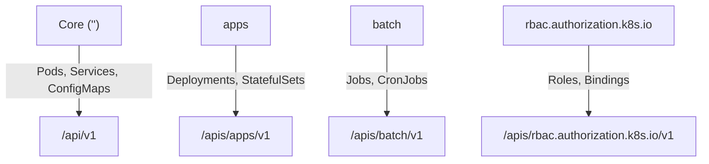

# 🔗 **How API Groups Connect to RBAC Rules (with Real Examples)**

> _“RBAC rules must point to the right API folder — or Kubernetes won’t know which resource you mean.”_

---

## ⁉️ **Why API Groups Matter in RBAC**

When Kubernetes evaluates an RBAC rule, it looks at **three key things**:

1. ✅ **Which API group**
2. ✅ **Which resource (Pods, Deployments, etc.)**
3. ✅ **Which verb (get, list, create, delete, etc.)**

If you specify the **wrong API group**, Kubernetes won’t match your rule —
even if the resource name looks right.

So for example:

```yaml
apiGroups: [""]
resources: ["deployments"]
verbs: ["list"]
```

❌ This rule does **nothing** — because Deployments aren’t in the **core group** (`""`).  
They live in the **apps** group!

---

## 🧠 **Rule Matching Example**

Here’s how Kubernetes maps resources to their API group:

<div align="center" style="background-color: #141a19ff;color: #a8a5a5ff; border-radius: 10px; border: 2px solid">

| Resource    | API Group                   | Correct RBAC entry                         |
| ----------- | --------------------------- | ------------------------------------------ |
| Pods        | `""` (core)                 | `apiGroups: [""]`                          |
| Deployments | `apps`                      | `apiGroups: ["apps"]`                      |
| Jobs        | `batch`                     | `apiGroups: ["batch"]`                     |
| Roles       | `rbac.authorization.k8s.io` | `apiGroups: ["rbac.authorization.k8s.io"]` |
| Ingress     | `networking.k8s.io`         | `apiGroups: ["networking.k8s.io"]`         |

</div>

---

## 📝 **Example 1 — Give Read Access to Pods**

Pods belong to the **core API group**, which is represented by `""`.

```yaml
rules:
  - apiGroups: [""]
    resources: ["pods"]
    verbs: ["get", "list"]
```

✅ Works perfectly.  
If you accidentally write `apiGroups: ["apps"]`, it will **not** match any Pod resource.

---

## 📝 **Example 2 — Give Access to Deployments**

Deployments belong to the **apps/v1** API group.

```yaml
rules:
  - apiGroups: ["apps"]
    resources: ["deployments"]
    verbs: ["get", "list", "create", "delete"]
```

✅ Correct.  
❌ `apiGroups: [""]` won’t work here.

---

## 📝 **Example 3 — Access Jobs and CronJobs**

Jobs and CronJobs live in the **batch** API group.

```yaml
rules:
  - apiGroups: ["batch"]
    resources: ["jobs", "cronjobs"]
    verbs: ["get", "list", "delete"]
```

✅ Correct  
❌ Common mistake: writing `apiGroups: ["apps"]` for Jobs — that fails silently.

---

## 📝 **Example 4 — Manage RBAC Objects**

To give someone permission to manage Roles and RoleBindings,
you must use the **rbac.authorization.k8s.io** API group.

```yaml
rules:
  - apiGroups: ["rbac.authorization.k8s.io"]
    resources: ["roles", "rolebindings"]
    verbs: ["get", "list", "create", "delete"]
```

✅ Without that group name, RBAC rules themselves can’t be accessed.

---

## 🧩 **How It Looks in a Role Definition**

Let’s combine a few into one realistic example 👇

```yaml
apiVersion: rbac.authorization.k8s.io/v1
kind: Role
metadata:
  name: webapp-manager
  namespace: dev
rules:
  # Core group: Pods & Services
  - apiGroups: [""]
    resources: ["pods", "services"]
    verbs: ["get", "list", "create", "delete"]

  # apps group: Deployments
  - apiGroups: ["apps"]
    resources: ["deployments"]
    verbs: ["get", "list", "update"]

  # batch group: Jobs
  - apiGroups: ["batch"]
    resources: ["jobs"]
    verbs: ["create", "list", "delete"]
```

✅ This Role lets a `ServiceAccount` manage Pods, Services, Deployments, and Jobs — each from its correct group.

---

## 🧠 **How to Find the Correct API Group**

Whenever you’re unsure which API group a resource belongs to, just run:

```bash
kubectl api-resources | grep <resource>
```

Example:

```bash
kubectl api-resources | grep deploy
```

Output:

```ini
deployments          deploy       apps/v1             true         Deployment
```

✅ So the `apiGroup` for Deployments is `apps`.

---

## ⚙️ **Version Doesn’t Matter in RBAC (Usually)**

In RBAC rules, you only specify the **API group**, not the version.

So this works for any version under the same group:

```yaml
apiGroups: ["autoscaling"]
resources: ["horizontalpodautoscalers"]
verbs: ["get", "list"]
```

✅ Works for both `autoscaling/v1` and `autoscaling/v2`.

---

## 🧩 **🔍 Example: Multi-Group Access**

If your Role needs access to multiple API groups:

```yaml
rules:
  - apiGroups: ["", "apps", "batch"]
    resources: ["pods", "deployments", "jobs"]
    verbs: ["get", "list"]
```

✅ Compact and clean — covers all three groups in one rule.

---

## 🧭 **Visual Summary**

<div align="center" style="background-color: #141a19ff;color: #a8a5a5ff; border-radius: 10px; border: 2px solid">



</div>

---

## ✅ **TL;DR Summary Table**

<div align="center" style="background-color: #141a19ff;color: #a8a5a5ff; border-radius: 10px; border: 2px solid">

| Resource                   | API Group                   | Correct `apiGroups` Entry                  |
| -------------------------- | --------------------------- | ------------------------------------------ |
| Pods, Services, ConfigMaps | `""` (core)                 | `apiGroups: [""]`                          |
| Deployments, ReplicaSets   | `apps`                      | `apiGroups: ["apps"]`                      |
| Jobs, CronJobs             | `batch`                     | `apiGroups: ["batch"]`                     |
| Roles, RoleBindings        | `rbac.authorization.k8s.io` | `apiGroups: ["rbac.authorization.k8s.io"]` |
| Ingress, NetworkPolicy     | `networking.k8s.io`         | `apiGroups: ["networking.k8s.io"]`         |
| HorizontalPodAutoscaler    | `autoscaling`               | `apiGroups: ["autoscaling"]`               |

</div>

---

## 🧠 **Common RBAC Troubleshooting Tip**

> “My Role says it allows listing Pods, but I still get Forbidden!”

✅ Check:

1. You used the right API group

   - Pods → `""`
   - Deployments → `apps`

2. The RoleBinding namespace matches the Pod’s namespace
3. The ServiceAccount name in the binding matches the Pod’s identity
