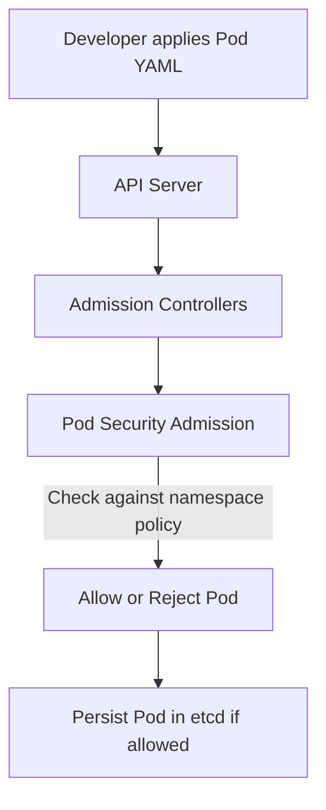

# 🧱 Pod Security Admission (PSA) — Kubernetes 1.25+ Security Gatekeeper

## 🧭 What It Is

**Pod Security Admission (PSA)** is a **built-in Kubernetes admission controller** that enforces **security standards for Pods** at the **namespace level**.
It replaced the **PodSecurityPolicy (PSP)** feature, which was deprecated in Kubernetes 1.21 and fully removed in **1.25**.

You can think of PSA as:

> 🧍‍♂️“A security bouncer standing at your cluster’s door, deciding whether your Pods are secure enough to enter.”

---

## 🧩 How It Works — The Admission Flow

Here’s the typical lifecycle when you create a Pod:



The **PodSecurity Admission controller** intercepts pod creation/update requests and checks the Pod’s configuration against a **selected security level**.

---

## 🏛️ The Three Pod Security Standards (Profiles)

PSA enforces one of **three predefined standards**, defined by the **[Pod Security Standards (PSS)](https://kubernetes.io/docs/concepts/security/pod-security-standards/)**:

| Profile        | Description                                                   | Example Use                   |
| -------------- | ------------------------------------------------------------- | ----------------------------- |
| **Privileged** | No restrictions — full power for trusted system workloads.    | kube-system, CNI, CSI drivers |
| **Baseline**   | Restricts known privilege escalations, allows common app use. | General apps                  |
| **Restricted** | Strongly locks down Pods to follow least privilege.           | Production workloads          |

---

## ⚙️ Enforcing at Namespace Level

PSA is controlled using **namespace labels**:

```bash
kubectl label namespace my-app \
  pod-security.kubernetes.io/enforce=restricted \
  pod-security.kubernetes.io/enforce-version=latest
```

You can apply **three modes** per namespace:

| Mode        | Behavior                              |
| ----------- | ------------------------------------- |
| **enforce** | Blocks Pods that violate the level    |
| **audit**   | Allows but logs violations            |
| **warn**    | Allows but shows warnings to the user |

💡 **Best practice**: Start with `audit` and `warn` before enabling `enforce`.

Example with all three:

```bash
kubectl label ns dev \
  pod-security.kubernetes.io/enforce=restricted \
  pod-security.kubernetes.io/warn=baseline \
  pod-security.kubernetes.io/audit=baseline \
  pod-security.kubernetes.io/enforce-version=v1.29
```

---

## 🔍 Example: Pod Rejection

Let’s say you apply a Pod that runs as root:

```yaml
apiVersion: v1
kind: Pod
metadata:
  name: insecure-pod
spec:
  containers:
    - name: nginx
      image: nginx
      securityContext:
        runAsUser: 0
```

If your namespace has:

```bash
pod-security.kubernetes.io/enforce=restricted
```

Then:

```bash
kubectl apply -f insecure-pod.yaml
```

You’ll get:

```ini
Error from server (Forbidden): pods "insecure-pod" is forbidden: violates PodSecurity "restricted:latest": runAsUser=0 (container "nginx" must not set runAsUser=0)
```

---

## 🔐 What PSA Checks

| Security Aspect      | Restricted Rules                            |
| -------------------- | ------------------------------------------- |
| Privilege Escalation | `allowPrivilegeEscalation=false`            |
| Running as root      | Must not run as UID 0                       |
| Host namespaces      | `hostPID`, `hostIPC`, `hostNetwork` = false |
| Volume types         | Disallows `hostPath`                        |
| Capabilities         | Must drop all unnecessary caps              |
| SELinux, seccomp     | Must use defined profiles                   |

---

## 🧠 When to Use What

| Environment       | Recommended Mode    | Recommended Level |
| ----------------- | ------------------- | ----------------- |
| Dev               | `warn` or `audit`   | baseline          |
| Staging           | `audit` + `enforce` | baseline          |
| Prod              | `enforce`           | restricted        |
| System Namespaces | `enforce`           | privileged        |

---

## 🛠️ Verification Commands

To **see namespace PSA settings**:

```bash
kubectl get ns dev -o jsonpath='{.metadata.labels}'
```

To **simulate enforcement**:

```bash
kubectl apply --dry-run=server -f pod.yaml
```

To **see violations logged**:

- Use `kubectl describe pod`
- Or view **Audit logs** if `audit` mode is active

---

## 🚀 Advanced Tip — Combine with OPA/Gatekeeper or Kyverno

PSA is **coarse-grained** (namespace-level).
For **fine-grained rules**, you can combine it with:

| Tool               | Use Case                           |
| ------------------ | ---------------------------------- |
| **OPA Gatekeeper** | Custom policies (JSON, YAML, Rego) |
| **Kyverno**        | Kubernetes-native YAML policies    |
| **Falco**          | Runtime threat detection           |

---

## 🧩 Quick Summary

| Feature         | Pod Security Admission                                           |
| --------------- | ---------------------------------------------------------------- |
| Replacement for | PodSecurityPolicy                                                |
| Enforced on     | Namespace level                                                  |
| Profiles        | Privileged, Baseline, Restricted                                 |
| Modes           | Enforce, Audit, Warn                                             |
| Config          | Namespace labels                                                 |
| Best combo      | PSA (baseline/restricted) + OPA/Kyverno for fine-grained control |

---

Would you like me to show you a **hands-on lab** next — where you deploy three namespaces (`dev`, `staging`, `prod`) with different PSA modes and test secure/violating Pods — or a **visual comparison** between PSA and PodSecurityPolicy (PSP)?
