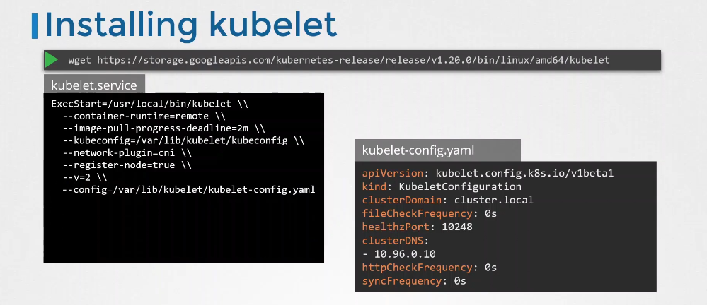
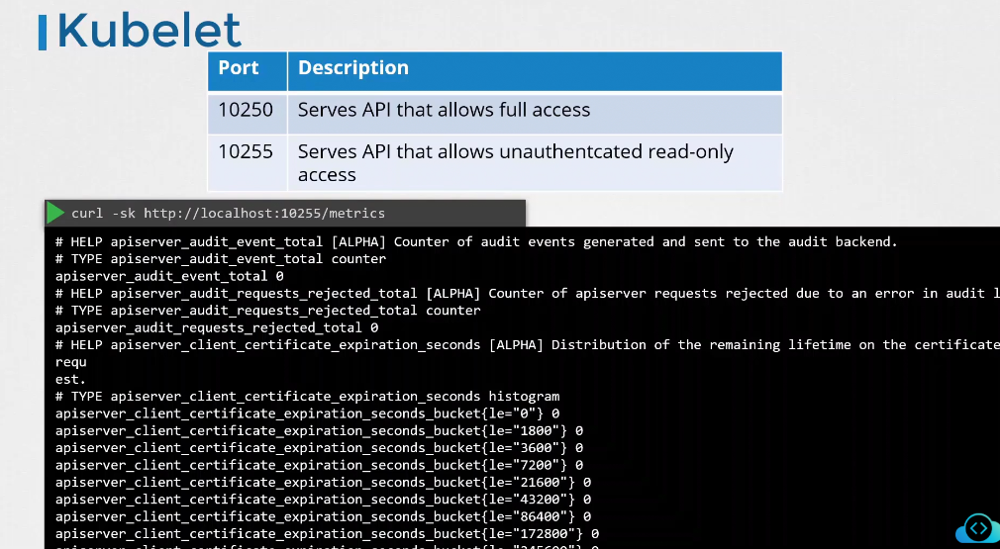

# 🤖 **Kubelet**

## 📖 What is the Kubelet?

The **kubelet** is the Kubernetes **node agent**.

It runs on **every worker node** and is responsible for:

- Registering the node to the API server
- Creating and managing pods
- Reporting node & pod status
- Managing containers via container runtime (Docker/Containerd/CRI-O)
- Handling liveness/readiness probes
- Pulling secrets + configmaps (if allowed)

**If kubelet is not running → the node is not part of the cluster.**

---

## 📦 How is the Kubelet Installed?

There are two common ways:

### 🅰️ Using kubeadm (most common)

kubeadm installs the kubelet and creates the required config files:

```bash
apt-get install -y kubelet kubeadm kubectl
```

### 🅱️ Manual installation

Download the kubelet binary:

```bash
curl -LO https://storage.googleapis.com/kubernetes-release/release/v1.xx.xx/bin/linux/amd64/kubelet
chmod +x kubelet
mv kubelet /usr/bin/
```

But **you must manually provide its configs**.

---

<div align="center" style="background-color:#EBEBEB; border-radius: 10px; border: 2px solid">
  
</div>

---

## 🚀 **kubeadm Creates These Files for You**

`kubeadm init` generates:

```ini
/etc/kubernetes/kubelet.conf                → real kubeconfig
/etc/kubernetes/bootstrap-kubelet.conf      → bootstrap
/var/lib/kubelet/config.yaml                → KubeletConfiguration
```

And kubeadm starts kubelet with systemd unit:

```ini
ExecStart=/usr/bin/kubelet \
  --config=/var/lib/kubelet/config.yaml \
  --kubeconfig=/etc/kubernetes/kubelet.conf \
  --bootstrap-kubeconfig=/etc/kubernetes/bootstrap-kubelet.conf
```

After CSR approval, kubelet updates `/etc/kubernetes/kubelet.conf` with real cert.

---

<div align="center" style="background-color:#EBEBEB; border-radius: 10px; border: 2px solid">
  
</div>

---

## 📒 The Three Important Kubelet Config Files

Here’s the simplest way to understand them:

---

### 🟦 **1. --bootstrap-kubeconfig**

_Used only the FIRST time kubelet starts._

This file contains:

- API server address
- Cluster CA
- **Bootstrap token** (temporary)

Example:

```ini
/etc/kubernetes/bootstrap-kubelet.conf
```

```yaml
apiVersion: v1
kind: Config
clusters:
  - cluster:
      certificate-authority: /etc/kubernetes/pki/ca.crt
      server: https://10.0.0.1:6443
    name: kubernetes
users:
  - name: kubelet-bootstrap
    user:
      token: abcdef.0123456789abcdef
contexts:
  - context:
      cluster: kubernetes
      user: kubelet-bootstrap
    name: bootstrap
current-context: bootstrap
```

- ✔ Kubelet uses this to request a certificate from the API server (CSR).
- ✔ After kubelet gets its real certificate, **bootstrap kubeconfig is never used again.**

---

### 🟩 **2. --kubeconfig**

_The kubelet’s real identity — AFTER CSR is approved._

This file contains:

- kubelet **client certificate**
- private key
- API server URL
- cluster CA

Example:

```ini
/etc/kubernetes/kubelet.conf
```

```yaml
apiVersion: v1
kind: Config
clusters:
  - cluster:
      certificate-authority: /etc/kubernetes/pki/ca.crt
      server: https://10.0.0.1:6443
    name: kubernetes
users:
  - name: system:node:worker-1
    user:
      client-certificate: /var/lib/kubelet/pki/kubelet-client-current.pem
      client-key: /var/lib/kubelet/pki/kubelet-client-current.pem
contexts:
  - context:
      cluster: kubernetes
      user: system:node:worker-1
    name: system:node:worker-1-context
current-context: system:node:worker-1-context
```

- ✔ Used for ALL communication with the API server **after** bootstrap.
- ✔ Rotates automatically unless disabled.

---

### 🟧 **3. --config**

_The main kubelet settings._

This is NOT about authentication.
This file controls kubelet behavior:

- cgroups
- eviction policies
- TLS rotation
- kubelet server ports
- container runtime
- authentication settings

Example:

```ini
/var/lib/kubelet/config.yaml
```

```yaml
apiVersion: kubelet.config.k8s.io/v1beta1
kind: KubeletConfiguration
authentication:
  anonymous:
    enabled: false
  x509:
    clientCAFile: /etc/kubernetes/pki/ca.crt
tlsCertFile: /var/lib/kubelet/pki/kubelet.crt
tlsPrivateKeyFile: /var/lib/kubelet/pki/kubelet.key
rotateCertificates: true
```

This always stays the same file — even after bootstrap.

---

## 🧪 **How to Verify Which Credentials Kubelet Uses Now**

```bash
ps -ef | grep kubelet
```

Check if:

### 🔹 Using bootstrap?

```ini
/etc/kubernetes/bootstrap-kubelet.conf
```

→ Means kubelet has not yet received its signed cert.

### 🔹 Using real kubeconfig?

```ini
/etc/kubernetes/kubelet.conf
```

→ Means bootstrap completed.

### 🔹 Check actual client cert:

```bash
openssl x509 -in /var/lib/kubelet/pki/kubelet-client-current.pem -noout -text
```

---

## 🔌 **kubelet ports**

<div align="center" style="background-color:#EBEBEB; border-radius: 10px; border: 2px solid">
  
</div>

---

<div align="center" style="background-color:#EBEBEB; border-radius: 10px; border: 2px solid">
  
</div>

---

## 🛡️ **Kubelet Security Options**

### 📌 **1. Disable anonymous access**

From kubelet.service file in `/etc/systemd/system/kubelet.service`:

```ini
[Service]
ExecStart=/usr/bin/kubelet \
    --anonymous-auth=false \
    ...
```

From kubelet.config.yaml file in `/var/lib/kubelet/config.yaml`:

```yaml
apiVersion: kubelet.config.k8s.io/v1beta1
kind: KubeletConfiguration
authentication:
  anonymous:
    enabled: false
```

---

### 📌 **2. Require cert-based AuthN**

From kubelet.service file in `/etc/systemd/system/kubelet.service`:

```ini
[Service]
ExecStart=/usr/bin/kubelet \
    --client-ca-file=/etc/kubernetes/pki/ca.crt \
    ...
```

From kubelet.config.yaml file in `/var/lib/kubelet/config.yaml`:

```yaml
apiVersion: kubelet.config.k8s.io/v1beta1
kind: KubeletConfiguration
authentication:
  anonymous:
    enabled: false
  x509:
    clientCAFile: /etc/kubernetes/pki/ca.crt
```

---

### 📌 **3. Using Webhook mode for AuthZ**

From kubelet.service file in `/etc/systemd/system/kubelet.service`:

```ini
[Service]
ExecStart=/usr/bin/kubelet \
    --authorization-mode=Webhook \
    ...
```

From kubelet.config.yaml file in `/var/lib/kubelet/config.yaml`:

```yaml
apiVersion: kubelet.config.k8s.io/v1beta1
kind: KubeletConfiguration
authorization:
  mode: Webhook
```

---

### 📌 **4. Disable metric endpoint for readonly** (port=10255)

From kubelet.service file in `/etc/systemd/system/kubelet.service`:

```ini
[Service]
ExecStart=/usr/bin/kubelet \
    --read-only-port=0 \
    ...
```

From kubelet.config.yaml file in `/var/lib/kubelet/config.yaml`:

```yaml
apiVersion: kubelet.config.k8s.io/v1beta1
kind: KubeletConfiguration
server:
  read-only-port: 0
```

---

## 🎉 **Final Kubelet Configuration File**

```yaml
apiVersion: kubelet.config.k8s.io/v1beta1
kind: KubeletConfiguration
authentication:
  anonymous:
    enabled: false
  x509:
    clientCAFile: /etc/kubernetes/pki/ca.crt
authorization:
  mode: Webhook
server:
  read-only-port: 0
```
