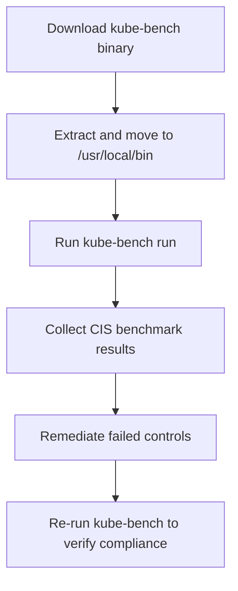

# 🪫 **Kube-bench**

## 📖 **What Is `kube-bench`?**

`kube-bench` is an **open-source tool** by [Aqua Security](https://github.com/aquasecurity/kube-bench) that checks whether your Kubernetes cluster complies with the **CIS Kubernetes Benchmark**.

- It **reads cluster configuration files** (like API server, controller, kubelet).
- Then it runs **tests mapped to CIS control IDs** (e.g., 1.2.7, 4.2.1).
- Finally, it prints **PASS/FAIL** results.

> Notes:
>
> - ✅ Used in **CKS exams**
> - ✅ Works on **control plane** and **worker nodes**
> - ✅ No CIS membership required
> - ✅ Supports **EKS, GKE, AKS, Minikube, kubeadm** clusters

---

<div align="center" style="background-color: #EBEBEB; border-radius: 10px; border: 2px solid">
  
</div>

---

## 📦 **Installation Options**

You can install `kube-bench` in **three common ways**:

<div align="center" style="background:#343739ff; border-radius:20px">

| Method                    | Best For                                | Command              |
| ------------------------- | --------------------------------------- | -------------------- |
| 🔹 1. Binary Download     | Fastest, offline setup                  | Recommended for CKS  |
| 🔹 2. Containerized (Pod) | When you can’t install binaries         | `kubectl run` method |
| 🔹 3. Helm Chart          | Production clusters (CI/CD or auditing) | `helm install`       |

</div>

---

> We’ll cover the **binary method** first (most common and CKS-relevant).

---

### 🧑🏻‍💻 **1. Install kube-bench as Binaries**

#### 🔹 **Step 1: Check OS & Architecture**

```bash
uname -s
uname -m
```

Example output:

```ini
Linux
x86_64
```

---

#### 🔹 **Step 2: Download Latest Release**

Visit the [kube-bench GitHub Releases Page](https://github.com/aquasecurity/kube-bench/releases).

Or use `curl` directly:

```bash
curl -L https://github.com/aquasecurity/kube-bench/releases/latest/download/kube-bench_$(uname -s)_$(uname -m).tar.gz -o kube-bench.tar.gz
```

This command automatically downloads the right binary for your OS/architecture.

---

#### 🔹 **Step 3: Extract the Binary**

```bash
tar -xzf kube-bench.tar.gz
```

You’ll now see:

```ini
kube-bench
cfg/
README.md
LICENSE
```

---

#### 🔹 **Step 4: Move Binary to PATH**

```bash
sudo mkdir -p /etc/kube-bench

sudo mv kube-bench /usr/local/bin/
sudo cp -r cfg /etc/kube-bench/
```

---

#### 🔹 **Step 5: Verify Installation**

```bash
kube-bench version
```

Expected output:

```ini
kube-bench version 0.7.1
```

✅ Now `kube-bench` is installed system-wide.

---

### 🫛 **2. Install kube-bench as Pod**

If you can’t install binaries (like on managed clusters — EKS, GKE, AKS), you can run it as a pod instead.

```bash
kubectl run kube-bench --rm -it \
  --image=aquasec/kube-bench:latest \
  --restart=Never \
  --command -- kube-bench
```

✅ This runs `kube-bench` inside a container and prints CIS compliance results for your cluster.

---

### 🪖 **3. Install kube-bench as Helm**

If you want to run it regularly across all nodes:

```bash
helm repo add aqua https://aquasecurity.github.io/helm-charts/
helm install kube-bench aqua/kube-bench
```

This creates Kubernetes Jobs that run `kube-bench` on each node and store results as logs.

---

## ⚙️ **Run kube-bench**

### 🧪 Basic Scan

```bash
sudo kube-bench run
```

Output:

```ini
== Summary ==
9 checks PASS
3 checks FAIL
2 checks WARN
```

### Example Failed Check

```ini
[FAIL] 1.2.7 Ensure that the --authorization-mode argument is not set to AlwaysAllow
```

---

## 📃 **Use kube-bench Config Profiles**

Each Kubernetes distribution has slightly different configs.  
`kube-bench` automatically detects the environment, but you can override manually:

<div align="center" style="background:#343739ff; border-radius:20px">

| Platform          | Command                                            |
| ----------------- | -------------------------------------------------- |
| kubeadm (default) | `kube-bench --config-dir cfg --benchmark cis-1.24` |
| EKS               | `kube-bench --benchmark eks-1.0`                   |
| GKE               | `kube-bench --benchmark gke-1.0`                   |
| AKS               | `kube-bench --benchmark aks-1.0`                   |
| OpenShift         | `kube-bench --benchmark rh-1.0`                    |

</div>

---

## 📊 **Report Output**

By default, results print to the console, but you can export them as JSON:

```bash
sudo kube-bench run --json > report.json
```

Example snippet:

```json
{
  "section": "1.2 API Server",
  "test_number": "1.2.7",
  "desc": "Ensure that the --authorization-mode argument is not set to AlwaysAllow",
  "state": "FAIL",
  "remediation": "Edit the API server manifest and set --authorization-mode=Node,RBAC"
}
```

---

## 🧩 **Common Locations and Fix Examples**

<div align="center" style="background:#343739ff; border-radius:20px">

| Control   | Description                                | Remediation                                                                      |
| --------- | ------------------------------------------ | -------------------------------------------------------------------------------- |
| **1.2.7** | `--authorization-mode=AlwaysAllow`         | Change to `--authorization-mode=Node,RBAC`                                       |
| **4.2.6** | Kubelet anonymous auth enabled             | Set `--anonymous-auth=false`                                                     |
| **1.3.2** | Controller Manager certs not owned by root | `chown root:root /etc/kubernetes/pki/controller-manager.key`                     |
| **2.2.1** | Etcd data not encrypted                    | Configure encryption provider in `/etc/kubernetes/manifests/kube-apiserver.yaml` |

</div>

---

## 🖼️ **Visual Summary**

<div align="center" style="background:#343739ff; border-radius:20px">



</div>

---

## 📚 **Quick Reference Commands**

<div align="center" style="background:#343739ff; border-radius:20px">

| Task         | Command                                                                                                                                      |
| ------------ | -------------------------------------------------------------------------------------------------------------------------------------------- |
| Download     | `curl -L https://github.com/aquasecurity/kube-bench/releases/latest/download/kube-bench_$(uname -s)_$(uname -m).tar.gz -o kube-bench.tar.gz` |
| Extract      | `tar -xzf kube-bench.tar.gz`                                                                                                                 |
| Move         | `sudo mv kube-bench /usr/local/bin/`                                                                                                         |
| Run          | `sudo kube-bench run`                                                                                                                        |
| Run as Pod   | `kubectl run kube-bench --rm -it --image=aquasec/kube-bench:latest --restart=Never --command -- kube-bench`                                  |
| JSON output  | `sudo kube-bench run --json > report.json`                                                                                                   |
| Helm install | `helm install kube-bench aqua/kube-bench`                                                                                                    |

</div>

---

> ⚠️ Notes for CKS Exam:
>
> ✅ You won’t install it via Helm — use **binary or pod method only.**  
> ✅ Don’t spend time fixing all failures — fix only the one the question asks.  
> ✅ Always focus on:
>
> - API server flags (`--anonymous-auth`, `--authorization-mode`)
> - Kubelet configuration
> - Etcd security
> - Network and pod policies
