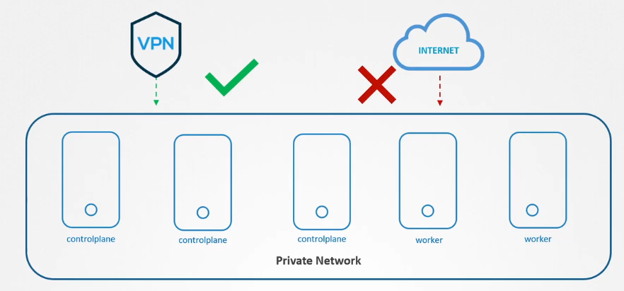
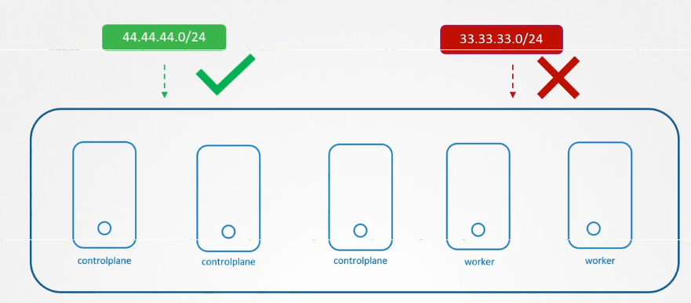

# 🔒 **Limit Node Access**

## 🌐 **Limiting Access to k8s Cluster Network**

### 🪈 **Using VPN**

by make cluster run on private network, and make admins connect to it via vpn.

<div align="center" style="background-color:#F1F1F1; border-radius: 10px; border: 2px solid">
  
</div>

---

### ⛔ **Using Firewall**

<div align="center" style="background-color:#F1F1F1; border-radius: 10px; border: 2px solid">
  
</div>

---

## 🧑🏻‍💼 **Manage User Accounts in Linux**

### 👩‍💻 **Account Types**

#### 1️⃣ **Super Account**

- Has unlimited access and full control over the system. This account is used for all administrative tasks and has the highest privileges. Only one account should have a UID of 0.
- eg. `root`
- Typical UID Range = `0`

#### 2️⃣ **System Account**

- Created during OS installation to run essential operating system components and functions in the background. They usually do not have a login shell or home directory.
- eg. `bin`, `daemon`, `mail`
- Typical UID Range = `1-99`

#### 3️⃣ **Service Account**

- Created dynamically when a specific service or application (like a web or database server) is installed to manage its operations and resources securely. Similar to system accounts, but created by applications, not the core OS.
- eg. `nginx`, `http`, `mysql`
- Typical UID Range = `100-999`

#### 4️⃣ **User Account**

- Accounts for human users for daily, non-administrative work. Access is limited to their home directory and specific resources. Can gain temporary admin access via sudo.
- eg. `hady`, `john_doe`
- Typical UID Range = `1000-60000`

---

### 📂 **Important Linux Files**

#### 📌 `/etc/passwd`

```bash
# <user-name>:<password-x>:<user-id>:<group-id>:<comment>:<home-dir>:<default-shell>
grep -i ^hady /etc/passwd
## hady:x:1000:1000::/home/hady:/bin/bash
```

#### 📌 `/etc/shadow`

```bash
# <user-name>:<encrypted-password>:<last-password-change>:<min-password-age>:<max-password-age>:<password-expiration-warning>:<password-inactivity-period>:<account-expiration-date>:<reserved-field>
grep -i ^hady /etc/shadow
## hady:$y$j9T$3OE4Q0RM7DqiJQ3FkR.ZW/$5rjmCu1RUKvt1lsfM4Wr8GnGo0FY.dXILU59vCiWSkA:19932:0:99999:7:::
```

#### 📌 `/etc/group`

```bash
# <group-name>:<password-x>:<group-id>:<user-list>
grep -i ^hady /etc/group
## admin:x:115:hady
## netdev:x:116:hady,syslog
## docker:x:1001:hady,islam
```

---

### 👜 **Useful Linux Commands**

#### 📌 `id`

used to display user information and its groups membership such as:

- User ID
- Group ID
- Group List

Example:

```bash
id
# uid=1000(hady) gid=1000(hady) groups=1000(group1),1001(group2)
```

#### 📌 `who`

used to display information about currently logged in users.

Example:

```bash
who
# hady     pts/1        2025-11-16 08:13
```

#### 📌 `last`

used to display information about the last logged in users.

Example:

```bash
last
# hady     pts/1                         Sun Jul 28 07:03 - crash  (00:11)
```

---

#### 📌 **Prevent users from shell**

```bash
usermod -s /bin/nologin hady
```

```bash
grep -i ^hady /etc/passwd
## hady:x:1000:1000::/home/hady:/bin/nologin
```

---

#### 📌 **Remove users from group**

```bash
deluser hady admin
```

```bash
id hady
## uid=1000(hady) gid=1000(hady) groups=1000(docker) # no admin group
```

---

#### 📌 **Change user password**

```bash
passwd hady
```

#### 📌 **Create User**

```bash
useradd hady -d /home/hady -s /bin/bash -m -g 1000 -G 1000,1001 -u 1000
```

```bash
grep -i ^hady /etc/passwd
## hady:x:1000:1000::/home/hady:/bin/bash
```

---

#### 📌 **Create Group**

```bash
groupadd hady -g 1000
```

```bash
grep -i ^hady /etc/group
## hady:x:1000:
```

---

#### 📌 **Delete User**

```bash
userdel hady
## or
deluser hady
```

```bash
grep -i ^hady /etc/passwd
## No such file or directory
```

#### 📌 **Delete Group**

```bash
groupdel hady
## or
delgroup hady
```
