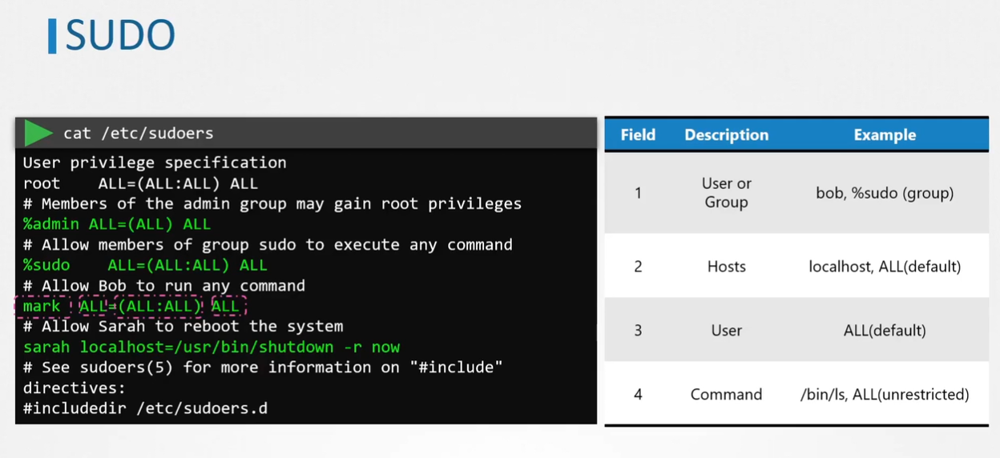

# 🔐 Privilege Escalation in Linux

_By Preventing Direct Root Access and Using `sudo`_

---

## 🚫 Disable Direct Root SSH Access

To reduce attack surface and enforce least privilege, disable root login over SSH:

```bash
sudo vim /etc/ssh/sshd_config
PermitRootLogin no
```

Then restart SSH:

```bash
sudo systemctl restart sshd
```

This ensures users must authenticate as themselves and escalate privileges only when necessary.

---

## ✅ Use `sudo` for Controlled Privilege Escalation

Instead of logging in as root, users can run privileged commands using `sudo`. This provides:

- **Auditability**: Logs every sudo command
- **Granular control**: Limit which commands each user can run
- **Security**: No need to share the root password

---

<div align="center" style="background-color:#F1F1F1; border-radius: 10px; border: 2px solid">
  
</div>

---

## 🧾 Understanding the `sudoers` File

The `sudoers` file defines who can run what as root or other users. Always edit it safely:

```bash
sudo visudo
```

This prevents syntax errors that could lock out all sudo access.

### 🔍 Anatomy of a `sudoers` Rule

```text
<user> <host>=<run-as-user>:<run-as-group> <command>
```

### 🧪 Examples

```text
# Allow user 'hady' to run any command as any user
hady ALL=(ALL:ALL) ALL

# Allow group 'admin' full sudo access
%admin ALL=(ALL) ALL

# Allow 'sarah' to reboot only
sarah ALL=(ALL) /usr/bin/shutdown -r now
```

### Add User to the `sudoers` file

```bash
vim /etc/sudoers
# Add user 'bob' to the sudoers file
# bob ALL=(ALL) NOPASSWD:ALL
```

> Note:
>
> - `NOPASSWD:` allows the user to run the command without a password prompt.
> - `ALL` allows the user to run the command on any host.

---

## 📁 Modular Rules with `/etc/sudoers.d/`

Instead of editing `/etc/sudoers` directly, place custom rules in:

```bash
/etc/sudoers.d/custom_rules
```

Example:

```text
bob ALL=(ALL) NOPASSWD: /bin/systemctl restart nginx
```

This allows `bob` to restart nginx without a password prompt.

---

## 🧠 Best Practices

- ✅ Use groups for scalable access control
- ✅ Limit commands to what's necessary
- ✅ Avoid `NOPASSWD` unless automation requires it
- ✅ Keep rules modular in `/etc/sudoers.d/`
- ✅ Always use `visudo` to edit safely
