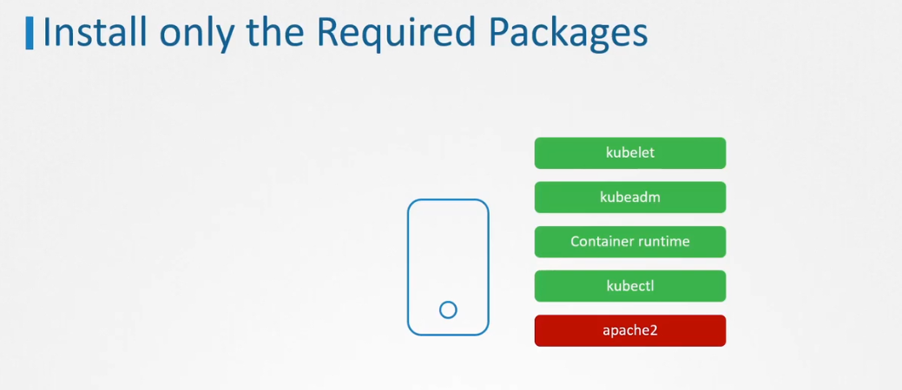
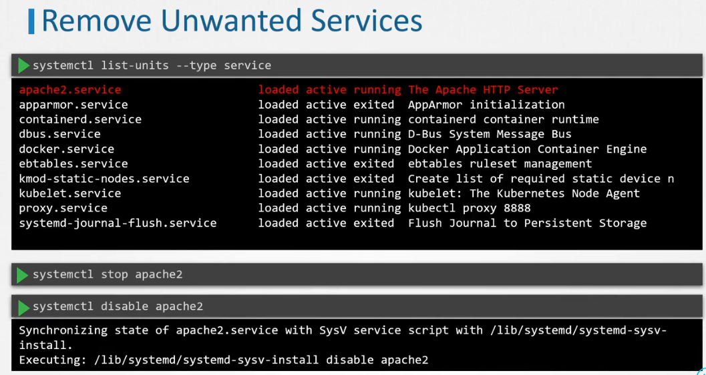
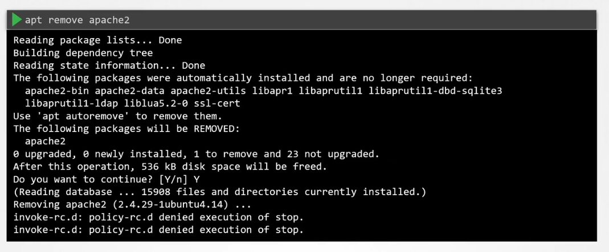

# 👴🏻 **Remove Obsolete Packages and Services**

## 📌 **Install only the Required Packages**

<div align="center" style="background-color:#F1F1F1; border-radius: 10px; border: 2px solid">
  
</div>

```bash
# List all installed packages
apt list --installed | grep -v "lib"
```

---

## 📌 **Remove Unwanted Services**

<div align="center" style="background-color:#F1F1F1; border-radius: 10px; border: 2px solid">
  
</div>

<div align="center" style="background-color:#F1F1F1; border-radius: 10px; border: 2px solid">
  
</div>

```bash
# List all active services
systemctl list-unit --type=service
```

```bash
# Stop the service
systemctl stop <service>

# Disable and stop the service
systemctl disable <service>

# Remove the service
systemctl status <service>
rm /lib/systemd/system/<service>.service
```

---

## 📚 **References**

Download the CIS benchmark PDFs from the below link:

- <https://www.cisecurity.org/cis-benchmarks/>

Go to the `Operating Systems` section and search for the `Distribution Independent Linux`. Expand it to see more options, then download CIS Benchmark.
