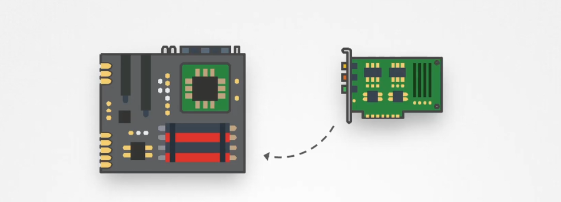

# 🔐 **Restricting Kernel Modules**

## 📖 **What Are Kernel Modules?**

Think of **kernel modules** as **plug-ins for the Linux kernel**.

- The **Linux kernel** is the core of the operating system — it talks to your hardware and manages system resources.
- **Kernel modules** are pieces of code that can be **loaded into the kernel at runtime** to add features like:
  - Support for new filesystems (e.g., `cramfs`)
  - Device drivers (e.g., `usb_storage`)
  - Network protocols

They’re useful, but also risky — because **malicious modules can be used to take over the system**.

---

<div align="center" style="background-color:#F1F1F1; border-radius: 10px; border: 2px solid">
  
</div>

---

## ⁉️ **Why Restrict Kernel Modules**

For the **CKS exam**, the goal is to **prevent attackers from loading malicious modules** or **removing existing ones**.

---

## 🔍 **Inspect Current Module State**

- View loaded modules:

  ```bash
  lsmod
  ```

- Check if a module is blacklisted:

  ```bash
  cat /etc/modprobe.d/blacklist.conf
  ```

---

## 🧱 **Blacklist Specific Modules at Boot**

To block risky modules (e.g., `cramfs`, `usb_storage`) from loading:

### ➤ Option A: modprobe Blacklist

Create or edit:

```bash
sudo vim /etc/modprobe.d/blacklist.conf
```

Add:

```text
blacklist cramfs
blacklist usb_storage
```

✅ _Prevents these modules from being auto-loaded by modprobe._

---

## 🔒 **Disable All Module Loading After Boot**

To lock the kernel from loading or unloading any modules:

```bash
echo 1 > /proc/sys/kernel/modules_disabled
```

✅ _Once set, no new modules can be loaded or removed until reboot._

---

## 📋 **Audit Module Load/Unload Attempts**

Use `auditctl` to log suspicious activity:

```bash
auditctl -a always,exit -F arch=b64 -S init_module
auditctl -a always,exit -F arch=b64 -S delete_module
```

✅ _Tracks who tries to load or remove kernel modules._

---

## ✅ CKS Exam Tips

| Task                       | Command / File                                 | Purpose                        |
| -------------------------- | ---------------------------------------------- | ------------------------------ |
| Block specific modules     | `module_blacklist=...` in GRUB                 | Prevents loading at boot       |
| Blacklist modules          | `/etc/modprobe.d/blacklist.conf`               | Prevents modprobe auto-loading |
| Disable all module loading | `echo 1 > /proc/sys/kernel/modules_disabled`   | Locks kernel post-boot         |
| Audit module activity      | `auditctl -a ... -S init_module/delete_module` | Detects load/unload attempts   |
| View loaded modules        | `lsmod`                                        | See active kernel modules      |
