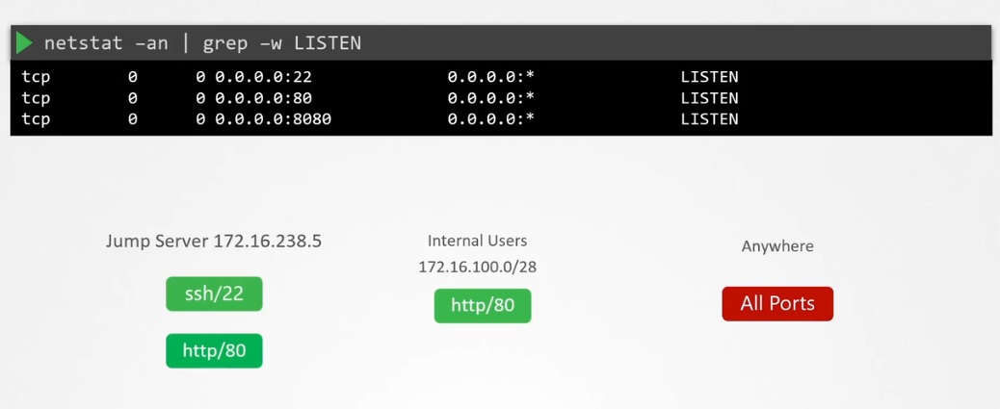

# UFW (Uncomplicated Firewall)

**UFW (Uncomplicated Firewall)** is a simple command-line tool for managing a Linux system’s firewall, built on top of `iptables`. It’s designed to make firewall configuration easy and user-friendly — perfect for securing your server with minimal effort.

---

## 🔐 What UFW Does

- Controls **incoming and outgoing network traffic**
- Allows or blocks **specific ports, IPs, or services**
- Helps enforce **least privilege access** to your system

---

<div align="center" style="background-color:#F1F1F1; border-radius: 10px; border: 2px solid">
  
</div>

---

## 📦 Install UFW

```bash
sudo apt-get install ufw

# Enable UFW
systemctl enable ufw

# Start UFW
systemctl start ufw
```

---

## 🚀 Basic UFW Commands

### ✅ Enable UFW

```bash
sudo ufw enable
```

### ❌ Disable UFW

```bash
sudo ufw disable
```

### 🔍 Check Status

```bash
sudo ufw status verbose
```

---

## 📥 Allow or Deny Traffic

### Allow SSH (port 22)

```bash
sudo ufw allow ssh
# or
sudo ufw allow 22
```

### Allow HTTP and HTTPS

```bash
sudo ufw allow 80
sudo ufw allow 443
```

### Deny a Port

```bash
sudo ufw deny 23
```

---

## 🎯 Advanced Rules

### Allow from Specific IP

```bash
sudo ufw allow from 192.168.1.100
```

### Allow from IP to Specific Port

```bash
sudo ufw allow from 192.168.1.100 to any port 22
```

### Delete a Rule

```bash
sudo ufw delete allow 22
```

---

## 🧱 Default Policies

Set default behavior for unmatched traffic:

```bash
sudo ufw default deny incoming
sudo ufw default allow outgoing
```

✅ _This blocks all incoming traffic unless explicitly allowed._

---

## 🧠 CKS Tip

- UFW is often used in **system hardening**.
- Know how to **allow only necessary ports** (e.g., SSH, app ports).
- Combine with **audit logs** to detect unauthorized access attempts.
