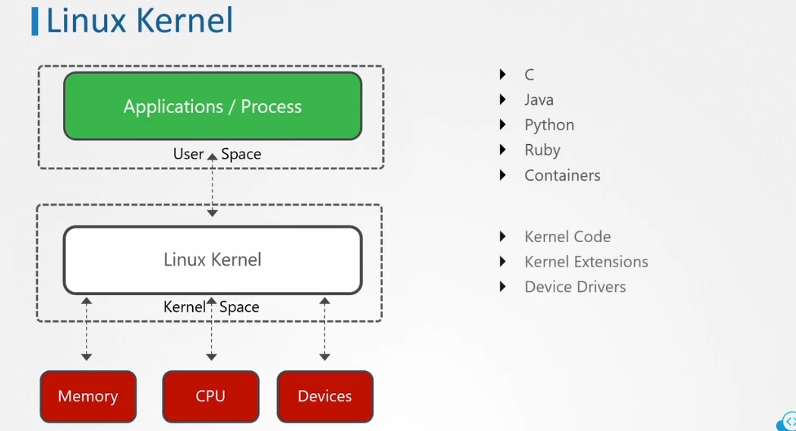
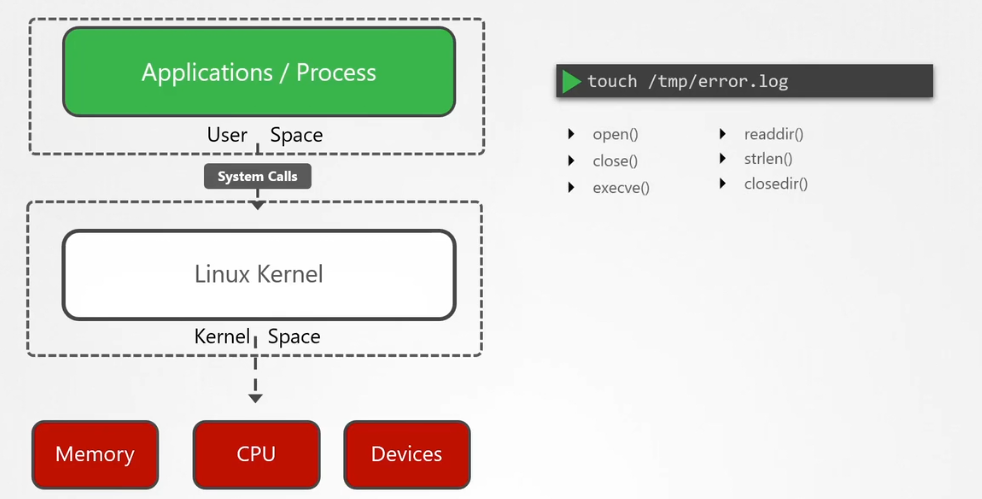

# 📞 **Linux syscalls**

## 🔧 What Is the Linux Kernel?

The **Linux kernel** is the **core of the operating system**. It runs in a special, privileged memory area called **kernel space**, and it’s responsible for:

- Managing **hardware** (CPU, memory, disks, network, etc.)
- Handling **process scheduling**
- Managing **system calls** (how programs request services from the OS)
- Enforcing **security and isolation**

Think of it as the **bridge between your applications and the hardware**.

---

## 👤 What Is an Application Process?

An **application process** is any program you run — like `nginx`, `curl`, or `python`. These run in **user space**, which is:

- A **restricted environment** with no direct access to hardware
- Protected from other processes and the kernel
- Where most of your code and tools live

---

## 🔄 How They Work Together

When an application needs to do something privileged — like read a file, open a socket, or allocate memory — it **can’t do it directly**. Instead, it:

1. **Makes a syscall** (system call), like `open()`, `read()`, or `write()`
2. The syscall **traps into the kernel**
3. The **kernel performs the action** (e.g., reads a file from disk)
4. The **result is returned** to the application

This keeps the system **secure and stable**, because:

- Apps can’t crash the system directly
- The kernel enforces **access control and isolation**

---

<div align="center" style="background-color:#F1F1F1; border-radius: 10px; border: 2px solid">
  
</div>

---

## 📖 What Are Syscalls?

**Syscalls (system calls)** are how programs talk to the Linux kernel.  
Examples include:

- `read()` → read data from a file
- `write()` → write to a file or screen
- `open()` → open a file
- `execve()` → run a program

Every time you run a command, it makes syscalls behind the scenes.

---

<div align="center" style="background-color:#F1F1F1; border-radius: 10px; border: 2px solid">
  
</div>

---

## 🔍 What Is `strace`?

`strace` is a tool that **shows you all the syscalls** a command or process makes.  
It’s like watching the program talk to the kernel in real time.

---

## 🧪 Tracing a Command

```bash
strace echo hello
```

🔎 Output:

```ini
execve("/bin/echo", ["echo", "hello"], ...) = 0
write(1, "hello\n", 6) = 6
```

✅ Shows how `echo` calls `execve()` and `write()` to print text.

---

### 📊 Summary Mode

```bash
strace -c echo hello
```

✅ Gives a **summary** of how many syscalls were made and how long they took.

---

## 🧬 Tracing a Running Process

### Step 1: Find the PID

```bash
pidof nginx
```

### Step 2: Attach `strace` to It

```bash
strace -p <pid>
```

```bash
## Example:
piddof nginx
strace -p $(piddof nginx)
```

✅ This shows live syscall activity for that process.

---

## 🧠 CKS Tip

- Use `strace` to debug why a command fails (e.g., missing file, permission denied).
- Use `-e trace=network,file` to filter syscall types.
- Combine with `auditd` for deeper syscall logging.
