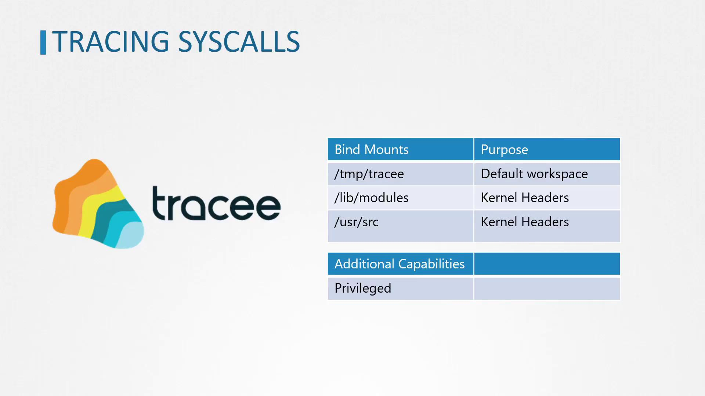

# 🕵️‍♂️ **Tracee by AquaSecurity**

**Tracee** is a **runtime security tool** built by Aqua Security that uses **eBPF** to detect **malicious behavior, suspicious syscalls, or abnormal activity** inside your Kubernetes cluster or Linux hosts.

Think of it as:

> “A security camera watching every container and kernel event in real time.”

It is extremely important for **CKS**, especially under the topics:

- Detecting malicious runtime behavior
- Monitoring syscalls
- eBPF-based detection
- Incident response
- Threat hunting

---

<div align="center" style="background-color:#F1F1F1; border-radius: 10px; border: 2px solid">
  
</div>

---

## ⁉️ **How Tracee Works**

- **Runs in kernel space** via eBPF
- **Captures syscall-level events** (e.g., `execve`, `open`, `ptrace`)
- **Applies behavioral rules** to detect anomalies like:
  - Fileless execution
  - Kernel module loading
  - Privilege escalation attempts
- **Outputs events** to logs, webhooks, or SIEM tools

✅ _No need to modify the kernel or install agents — Tracee runs safely and efficiently._

---

## 🧩 **Tracee = 3 Major Pieces**

Tracee has 3 core concepts:

```ini
┌──────────────────────────────┐
│ 1. Tracee-ebpf               │  ← collects events directly from kernel
│   (eBPF probe)               │
└──────────────────────────────┘
               ↓  sends events
┌──────────────────────────────┐
│ 2. Tracee-rules              │  ← analyzes suspicious patterns
│   (rules engine)             │
└──────────────────────────────┘
               ↓ alerts
┌──────────────────────────────┐
│ 3. Outputs & Integrations    │  ← stdout, JSON, files, SIEM, etc
└──────────────────────────────┘
```

---

## ⚙️ **1. Tracee-ebpf — Kernel-level Syscall Recorder**

This part observes kernel events using **eBPF**.

It can detect:

### 🔧 Syscalls

- `open`, `execve`, `mount`, `ptrace`, `setns`

### 📦 Container Actions

- A container starts
- A new process inside container
- Privilege escalation attempts

### 🛠️ File modifications

- `/etc/passwd` altered
- `/etc/hosts` manipulated

### 🔐 Security-sensitive activity

- Reverse shell execution
- New capabilities requested
- Unusual network connections
- Syscalls restricted by Seccomp

Tracee-ebpf gives you **raw visibility** into everything happening.

---

## 📜 **2. Tracee-rules — Detects Real Threats**

Raw events are too many.
So Tracee applies **security rules** like:

- Detect reverse shell
- Detect container escape
- Detect privilege escalation
- Detect mount syscall in container
- Detect file dropped in sensitive directory
- Detect writing to `.ssh` keys
- Detect process hiding (LD_PRELOAD, ptrace)

Rules are written in **Rego (OPA)**, a common exam topic.

Example rule:

```rego
package tracee.risk

reverse_shell {
    input.eventName == "execve"
    input.args.argv[_] == "/bin/sh"
    input.args.argv[_] == "-c"
    input.args.argv[_] contains "nc"
}
```

This detects a reverse shell launched using netcat.

---

## 📤 **3. Output → What You See**

Tracee can output data in:

- pretty console logs
- JSON (most common)
- File
- Webhook
- SIEM (Splunk/Elastic)
- stdout (CKS uses this)

---

## 📥 **Installation**

The simplest CKS exam-safe way is:

### **Run Tracee as a container**

```bash
docker run --rm \
  --privileged \
  -v /etc/os-release:/etc/os-release \
  -v /tmp/tracee:/tmp/tracee \
  -v /etc/os-release:/etc/os-release-host:ro \
  aquasec/tracee:latest
```

But **CKS wants Kubernetes usage**, so use DaemonSet.

### **Kubernetes DaemonSet deployment**

```bash
https://github.com/aquasecurity/tracee
```

This runs Tracee on **every node**, monitoring all containers.

---

## 🧲 **Tracee + Seccomp Relationship**

This is the important link for CKS:

### **Tracee = Detect**

Tracee sees that a dangerous syscall happened.

### **Seccomp = Prevent**

Seccomp blocks that syscall from executing.

Together:

```ini
Detect attacker’s action → prevent with Seccomp → confirm via Tracee logs
```

This is a **critical CKS concept**.

---

## 🔥 Top 10 Attacks Tracee Detects

| Attack                         | Example syscall             |
| ------------------------------ | --------------------------- |
| Reverse shell                  | `execve("nc -e /bin/sh")`   |
| Privilege escalation           | `setresuid`, `capset`       |
| Container escape               | `unshare`, `setns`, `clone` |
| Writing to sensitive dirs      | `/etc/shadow`, `/root/.ssh` |
| Suspicious file download       | `curl … \| sh`              |
| Kernel module loading          | `init_module`               |
| Process injection              | `ptrace`                    |
| Overwriting binaries           | `/bin/bash` changed         |
| Unexpected network connections | High-priv ports             |
| Mounting host filesystem       | `mount("/dev/sda")`         |

---

## 🧪 **Simple CKS Lab: Detect mount syscall inside container**

### 1. Deploy Tracee

```bash
kubectl apply -f tracee-daemonset.yaml
kubectl logs -f daemonset/tracee -n tracee
```

### 2. Vulnerable pod

```bash
kubectl run attacker --image=ubuntu -- sleep infinity
kubectl exec -it attacker -- bash
```

### 3. Try mount

```bash
mount -t proc proc /mnt
```

### 4. Tracee alerts

```ini
ALERT: mount syscall detected in container
```

Perfect runtime detection.

---

## 📌 Memory Cheat Sheet

| Concept               | Meaning                                  |
| --------------------- | ---------------------------------------- |
| Tracee-ebpf           | Collect kernel events                    |
| Tracee-rules          | Detect threats using Rego                |
| eBPF                  | Efficient kernel-level monitoring        |
| Seccomp vs Tracee     | Prevent vs Detect                        |
| DaemonSet             | Best way to run Tracee in K8s            |
| Most common exam task | Detect reverse shell or container escape |
