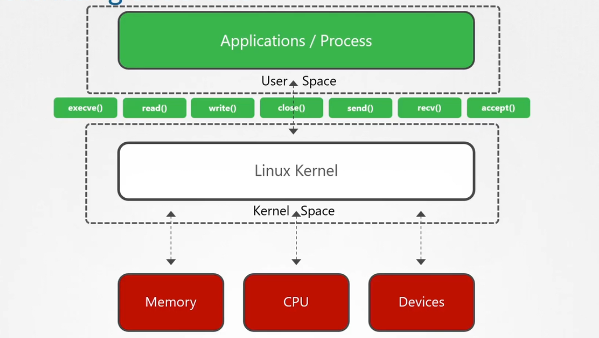

# ⛔ **SECCOMP (Secure Computation)**

_Restrict Allowing Executed Syscalls!_

> 😭 By Default, Linux Kernal allows any syscall to be invoked by a any process running inside user space.

---



---

> 😊 Seccomp (**SECure COMPuting**) is a **Linux kernel feature** that lets you **restrict which system calls** (syscalls) a container or process is allowed to make.  
> 💭 It’s like a **firewall for syscalls** — helping reduce the attack surface.

---

## ⁉️ **Why Seccomp Matters for CKS**

✔ Blocks dangerous syscalls like:

- `mount`
- `setns`
- `unshare`
- `ptrace`
- `clone` with privileged flags

> ✔ Prevents attacker from escaping container  
> ✔ Reduces surface area of kernel attack  
> ✔ Enforces “least privilege” at syscall level  
> ✔ Mandatory knowledge for CKS exam

---

## 🔎 **How Seccomp Works (Simple)**

You attach a **seccomp profile (JSON)** to:

- A **Pod**
- Individual **containers**

This profile tells the kernel:

> “This container is only allowed to use this list of syscalls.”

Any other syscall → **blocked** → process gets **killed** or **denied**.

---

## 🤹🏻‍♂️ **Seccomp Modes**

| Numeric | Mode Name               | Description                                                               |
| ------- | ----------------------- | ------------------------------------------------------------------------- |
| `0`     | `SECCOMP_MODE_DISABLED` | Seccomp is **off** — all syscalls are allowed                             |
| `1`     | `SECCOMP_MODE_STRICT`   | Only allows `read()`, `write()`, `exit()`, and `sigreturn()`              |
| `2`     | `SECCOMP_MODE_FILTER`   | Uses **BPF filters** to allow/block specific syscalls (most common today) |

---

### 🔎 Mode 0: Disabled

- No syscall filtering
- Full access to kernel APIs
- Risky in production

---

### 🔎 Mode 1: Strict

- Only allows:
  - `read()`
  - `write()`
  - `exit()`
  - `sigreturn()`
- Used for very simple, static programs
- Rarely used today

---

### 🔎 Mode 2: Filter (BPF-based)

- Most common in **Docker**, **Kubernetes**, and **sandboxed apps**
- Uses **BPF rules** to allow/block syscalls
- Example: block `ptrace`, `mount`, `clone`, etc.

---

Absolutely, Hady — here’s a clean, example-driven explanation of **Seccomp profiles in Docker**, perfect for CKS prep and onboarding docs:

---

## 🧩 **Seccomp Profiles in Docker?**

A **Seccomp profile** is a JSON file that defines **which syscalls a container is allowed or denied**.  
Docker uses these profiles to apply **syscall filtering** via the Linux kernel’s **Seccomp filter mode (mode 2)**.

✅ Think of it as a **syscall firewall** for containers.

---

### 🔐 Why Use Seccomp Profiles?

- Reduce attack surface by **blocking dangerous syscalls**
- Prevent container escape techniques (e.g., `ptrace`, `kexec_load`)
- Enforce **least privilege** at the syscall level

---

### 📦 Default Behavior in Docker

Docker applies a **default Seccomp profile** unless you override it.

```bash
docker run ubuntu
```

> ✅ This uses `/usr/share/docker/seccomp.json` internally, which blocks ~44 risky syscalls.

---

### 🧾 Use a Custom Seccomp Profile

#### 1. Create `seccomp-profile.json`

```json
{
  "defaultAction": "SCMP_ACT_ALLOW",
  "syscalls": [
    {
      "names": ["ptrace", "kexec_load"],
      "action": "SCMP_ACT_ERRNO"
    }
  ]
}
```

✅ This profile allows everything **except** `ptrace` and `kexec_load`.

---

#### 2. Run Docker with the Profile

```bash
docker run --security-opt seccomp=/path/to/seccomp-profile.json ubuntu
```

✅ Docker will apply your custom syscall filter.

---

## 🧩 **Seccomp Profiles in Kubernetes**

There are **three main types**:

| Profile           | Description                            |
| ----------------- | -------------------------------------- |
| `unconfined`      | No restrictions (default in older k8s) |
| `runtime/default` | Recommended default seccomp profile    |
| Custom JSON file  | Your own fine-grained rules            |

---

## 🧱 **Where Seccomp Profiles Live?**

On **nodes**, not inside containers.

Default directory on most clusters:

```ini
/var/lib/kubelet/seccomp/
```

You manually copy your JSON profile there.

---

## 📝 **Example Seccomp Profile (Very Common in CKS)**

This is a simple “deny all syscalls except a few” profile:

```json
{
  "defaultAction": "SCMP_ACT_ERRNO",
  "syscalls": [
    {
      "names": ["clone", "fork", "execve"],
      "action": "SCMP_ACT_ALLOW"
    }
  ]
}
```

Meaning:

- **defaultAction = deny everything**
- Only allow:

  - `clone`
  - `fork`
  - `execve`

---

## 🏷️ **Enable Seccomp on a Pod**

### 1️⃣ Using Pod annotations (old method)

```yaml
annotations:
  seccomp.security.alpha.kubernetes.io/pod: runtime/default
```

### 2️⃣ Using securityContext (NEW and recommended)

```yaml
securityContext:
  seccompProfile:
    type: RuntimeDefault
```

### 3️⃣ Using a custom profile

```yaml
securityContext:
  seccompProfile:
    type: Localhost
    localhostProfile: profiles/my-seccomp.json
```

This refers to:

```ini
/var/lib/kubelet/seccomp/profiles/my-seccomp.json
```

---

## 📦 **Full Pod Example Using Custom Seccomp Profile**

```yaml
apiVersion: v1
kind: Pod
metadata:
  name: seccomp-demo
spec:
  containers:
    - name: app
      image: nginx
      securityContext:
        seccompProfile:
          type: Localhost
          localhostProfile: profiles/restricted.json
```

---

## 🛠️ **Testing Your Seccomp Profile (VERY USEFUL FOR EXAM)**

Run interactive shell and test dangerous syscalls:

```bash
strace ls
```

Run a forbidden syscall:

```bash
unshare --mount
```

If restricted → container dies or syscall returns EPERM.

---

## ⛔ Common Dangerous Syscalls (Often Blocked)

- `unshare()` → break namespaces
- `setns()` → enter another namespace
- `mount()` → mount host filesystem
- `ptrace()` → spy on host processes
- `clone()` with flags → create privileged processes

---

## 🎓 **Exam-Focused Steps (What You Actually Do)**

You will get tasks like:

### **Task Example**

> Create a seccomp profile that blocks `unshare` and apply it to a pod.

### Steps:

1️⃣ Create profile

```bash
sudo vi /var/lib/kubelet/seccomp/block-unshare.json
```

Add:

```json
{
  "defaultAction": "SCMP_ACT_ALLOW",
  "syscalls": [
    {
      "names": ["unshare"],
      "action": "SCMP_ACT_ERRNO"
    }
  ]
}
```

2️⃣ Apply it in Pod:

```yaml
securityContext:
  seccompProfile:
    type: Localhost
    localhostProfile: block-unshare.json
```

3️⃣ Run the pod and test:

```bash
kubectl exec -it test -- unshare --mount
```

Should return:

```ini
Operation not permitted
```

Perfect.

---

## 🪙 **Quick Memory Guide (KodeKloud Style)**

- ✔ Seccomp restricts **syscalls**, not permissions
- ✔ Profiles = **JSON** files placed on the **node**
- ✔ Enable via `securityContext.seccompProfile`
- ✔ `RuntimeDefault` = secure & recommended
- ✔ `Unconfined` = no protection (avoid)
- ✔ Use `Localhost` for custom profiles
- ✔ Deny by default, allow only required syscalls
