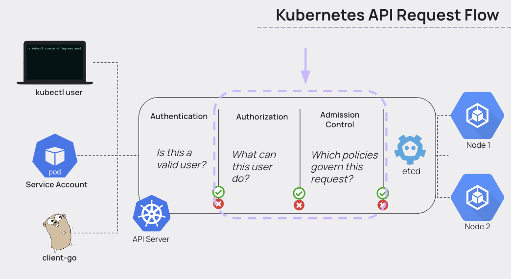
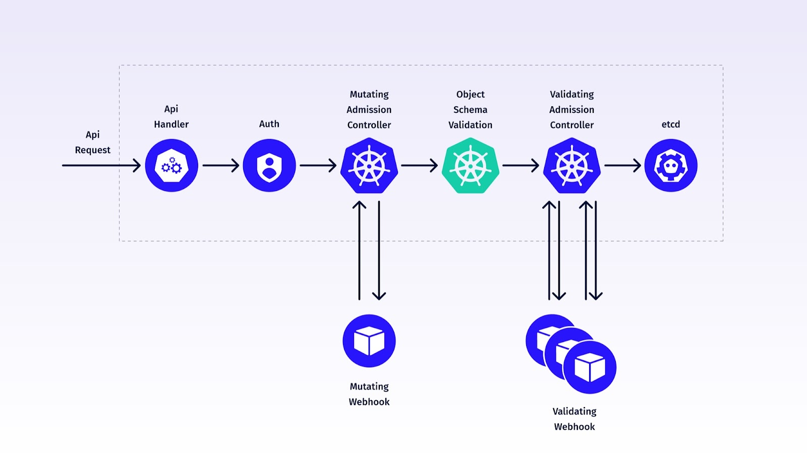

# 🚥 **Admission Controllers in Kubernetes**

## 📖 **What is an Admission Controller?**

When you send a request to the API server (e.g., `kubectl apply -f pod.yaml`), Kubernetes processes it in **stages**:

1. **Authentication** → Who are you?
2. **Authorization (RBAC, ABAC, etc.)** → Are you allowed to do this?
3. **Admission Control** →

   - Can we **mutate** your request? (add defaults, enforce policies)
   - Should we **allow or reject** it based on policies?

Only **after** all of this, the object is stored in **etcd**.

> 💡 Think of Admission Controllers as “smart gatekeepers” that run **just before** objects are persisted:
>
> - some **modify** your request (mutating)
> - some **validate** your request (validating)
> - some do **both**

---

<div align="center" style="background-color:#F1F1F1; border-radius: 10px; border: 2px solid">
  
</div>

---

## 🎭 **Types of Admission Controllers**

### 🅰️ **Mutating Admission Controllers**

- Can **change** the incoming object before it’s stored.
- Example: add default resource requests/limits, inject sidecars, set labels.

Mutating controllers run **first**.

### 🅱️ **Validating Admission Controllers**

- Can **only allow or deny** a request.
- Example: reject pods without resource limits, deny hostPath volumes, enforce label policies.

Validating controllers run **after** mutating ones.

---

<div align="center" style="background-color:#F8F7FD; border-radius: 10px; border: 2px solid">
  
</div>

---

### 🎯 **In-tree vs Dynamic**

Kubernetes supports:

1. **In-tree (built-in) admission controllers**

   - Compiled into the API server
   - Enabled/disabled via `--enable-admission-plugins=...`
   - Enabled Example: `--enable-admission-plugins=NamespaceLifecycle,LimitRanger`
   - Disabled Example: `--disable-admission-plugins=NamespaceLifecycle,LimitRanger`

2. **Dynamic (webhook-based) admission controllers**

   - **MutatingAdmissionWebhook**
   - **ValidatingAdmissionWebhook**
   - You write a webhook server; Kubernetes calls it to make decisions.

---

## 🤹🏻 **Built-in Admission Controllers**

There are many built-in controllers, but for CKS / admin work, you should know the **most relevant** ones:

### 🔐 Security & Policy

- **`NamespaceLifecycle`**

  - Prevents creation of resources in non-existent namespaces
  - Prevents deleting `default`, `kube-system`, etc. while objects still exist in them

- **`LimitRanger`**

  - Applies default CPU/memory requests/limits from `LimitRange` objects
  - Rejects pods that violate them

- **`ResourceQuota`**

  - Ensures usage stays within `ResourceQuota` in a namespace
  - Rejects when CPU/memory/pods exceed configured limits

- **`PodSecurity`**

  - Enforces **Pod Security Admission** (the successor of PodSecurityPolicy)
  - Enforces Baseline/Restricted profiles based on namespace labels

- **`NodeRestriction`**

  - Limits what kubelets can change (e.g., which Node/Pod objects they can modify)

---

### 📦 Image & Registry

- **`ImagePolicyWebhook`**

  - Allows external webhook to approve/deny images
  - Example: only allow images from trusted registry

---

### 📁 Defaulting

- **`DefaultStorageClass`**

  - Automatically sets default classes if not specified.

- **`DefaultIngressClass`**

---

### 🔁 Webhook-based

- **`MutatingAdmissionWebhook`**

  - Calls external services to **modify** requests (e.g., inject sidecars, add labels)

- **`ValidatingAdmissionWebhook`**

  - Calls external services to **approve/deny** requests (policy engines, etc.)

---

## ⚙️ **How to Configure Built-in Admission Controllers**

For kubeadm-like clusters, the **API server** is a static pod defined in:

```bash
/etc/kubernetes/manifests/kube-apiserver.yaml
```

Inside the command section you’ll find flags like:

```yaml
- --enable-admission-plugins=NamespaceLifecycle,LimitRanger,ServiceAccount,ResourceQuota,MutatingAdmissionWebhook,ValidatingAdmissionWebhook,PodSecurity
- --disable-admission-plugins=SomePlugin
```

### 🪜 To enable an admission controller:

1. Edit file:

   ```bash
   sudo nano /etc/kubernetes/manifests/kube-apiserver.yaml
   ```

2. Add it to `--enable-admission-plugins` (comma-separated list).

3. Save → kubelet automatically restarts the API server pod.

4. Verify:

   ```bash
   kubectl get pod -n kube-system | grep apiserver
   ```

### 📝 Example Show Enabled Admission Controller

```bash
kubectl exec kube-apiserver-kind-control-plane -n kube-system \
-- kube-apiserver -h | grep enable-admission-plugins
```

### 📝 Example Enable Admission Controller

in `/etc/kubernetes/manifests/kube-apiserver.yaml`:

```yaml
spec:
  containers:
    - name: kube-apiserver
      args:
        - --enable-admission-plugins=NodeRestriction,PodSecurityPolicy
```

### 📝 Example Disable Admission Controller

in `/etc/kubernetes/manifests/kube-apiserver.yaml`:

```yaml
spec:
  containers:
    - name: kube-apiserver
      args:
        - --disable-admission-plugins=NodeRestriction,PodSecurityPolicy
```

---

## ⚙️ **How to Configure Custom Admission: Mutating & Validating Webhooks**

This is where **custom admission controllers** come in.

Conceptually:

1. You write a **web server** that:

   - receives admission review requests (JSON)
   - evaluates them (e.g., using custom logic, OPA, etc.)
   - responds with “allowed/denied” and optionally “patches”

2. You deploy that server in-cluster (Deployment + Service).

3. You create one of:

   - `MutatingWebhookConfiguration`
   - `ValidatingWebhookConfiguration`

These tell the API server:

> “Whenever someone creates/updates X kind in Y group & version, send me a webhook request first.”

---

> 🚨 Order is very important as:
>
> - First Mutating Admission Controller
> - Second Validating Admission Controller

### 📝 1. Mutating Admission Controllers Sample

```yaml
apiVersion: admissionregistration.k8s.io/v1
kind: MutatingWebhookConfiguration
metadata:
  name: demo-webhook
webhooks:
  - name: webhook-server.webhook-demo.svc
    clientConfig:
      service:
        name: webhook-server
        namespace: webhook-demo
        path: "/mutate"
      caBundle: LS0tLS1CRUdJTiBDRVJUSUZJQ0FURS0tLS...
    rules:
      - operations: ["CREATE"]
        apiGroups: [""]
        apiVersions: ["v1"]
        resources: ["pods"]
    admissionReviewVersions: ["v1beta1"]
    sideEffects: None
```

### 📝 2. Validating Admission Controllers Sample

```yaml
apiVersion: admissionregistration.k8s.io/v1
kind: ValidatingWebhookConfiguration
metadata:
  name: demo-webhook
webhooks:
  - name: webhook-server.webhook-demo.svc
    clientConfig:
      service:
        name: webhook-server
        namespace: webhook-demo
        path: "/validate"
      caBundle: LS0tLS1CRUdJTiBDRVJUSUZJQ0FURS0tLS...
    rules:
      - operations: ["CREATE"]
        apiGroups: [""]
        apiVersions: ["v1"]
        resources: ["pods"]
    admissionReviewVersions: ["v1beta1"]
    sideEffects: None
```

---

## ✍🏻 **Hands-On - Custom Admission Webhook**

### 🎯 Goal

Create a **validating webhook** that **rejects any pod** that:

- does NOT set resource limits for **all containers**

This is a very common real-world + exam-style policy.

---

### 🔹 Step 1 — Simple Webhook Server Logic (Conceptual)

Web server does:

1. Accept HTTPS POST on `/validate`
2. Parse `AdmissionReview` JSON
3. Look at `request.object.spec.containers[*].resources.limits`
4. If any container lacks limits → respond with `allowed=false` + message
5. Else → allowed=true

You’d typically write this in Go or Python.

I’ll outline a Go-like pseudocode to show the structure, not full boilerplate.

```go
func handleValidate(w http.ResponseWriter, r *http.Request) {
    var review v1.AdmissionReview
    json.NewDecoder(r.Body).Decode(&review)

    req := review.Request

    // We only care about Pods
    if req.Kind.Kind != "Pod" {
        allowed := true
        sendResponse(w, review, allowed, "")
        return
    }

    var pod v1.Pod
    json.Unmarshal(req.Object.Raw, &pod)

    for _, c := range pod.Spec.Containers {
        if c.Resources.Limits == nil || len(c.Resources.Limits) == 0 {
            msg := fmt.Sprintf("container %s must set resource limits", c.Name)
            sendResponse(w, review, false, msg)
            return
        }
    }

    sendResponse(w, review, true, "")
}
```

`sendResponse` would wrap the decision into an `AdmissionReview` response.

---

### 🔹 Step 2 — TLS for Webhook

Kubernetes requires **HTTPS** webhooks, so you:

1. Generate a server certificate & key
2. Store them in a Secret
3. Mount them into the webhook pod
4. Reference the CA bundle in the webhook configuration

In a lab, you can use:

- self-signed certs
- `openssl` or `cfssl` to generate them
- or skip full details if concept is more important than hands-on TLS.

---

### 🔹 Step 3 — Deploy Webhook Server as a Deployment + Service

Example (simplified):

```yaml
apiVersion: apps/v1
kind: Deployment
metadata:
  name: pod-validator
  namespace: webhook-system
spec:
  replicas: 1
  selector:
    matchLabels:
      app: pod-validator
  template:
    metadata:
      labels:
        app: pod-validator
    spec:
      containers:
        - name: webhook
          image: myrepo/pod-validator:latest
          args:
            - "--tls-cert-file=/tls/tls.crt"
            - "--tls-private-key-file=/tls/tls.key"
          volumeMounts:
            - name: tls
              mountPath: /tls
              readOnly: true
      volumes:
        - name: tls
          secret:
            secretName: pod-validator-tls
---
apiVersion: v1
kind: Service
metadata:
  name: pod-validator-svc
  namespace: webhook-system
spec:
  selector:
    app: pod-validator
  ports:
    - port: 443
      targetPort: 8443
```

The container listens on port 8443; Service exposes 443.

---

### 🔹 Step 4 — Create ValidatingWebhookConfiguration

This is how we “register” our webhook with the API server.

```yaml
apiVersion: admissionregistration.k8s.io/v1
kind: ValidatingWebhookConfiguration
metadata:
  name: pod-validator-webhook
webhooks:
  - name: pod-validator.webhook.mycompany.com
    admissionReviewVersions: ["v1"]
    sideEffects: None
    failurePolicy: Fail
    rules:
      - apiGroups: [""]
        apiVersions: ["v1"]
        operations: ["CREATE", "UPDATE"]
        resources: ["pods"]
    clientConfig:
      service:
        namespace: webhook-system
        name: pod-validator-svc
        path: /validate
      caBundle: <BASE64-ENCODED-CA>
```

Key points:

- `rules` restrict which resources+verbs trigger the webhook (here: Pods)
- `failurePolicy: Fail` means if webhook is down, requests will fail
- `caBundle` must match the CA that signed the webhook server’s TLS cert

---

### 🔹 Step 5 — Test the Webhook

Now try to create a pod **without** limits:

```yaml
apiVersion: v1
kind: Pod
metadata:
  name: bad-pod
spec:
  containers:
    - name: c1
      image: nginx
```

Apply:

```bash
kubectl apply -f bad-pod.yaml
```

Expected result:

```text
Error from server (Forbidden): admission webhook "pod-validator.webhook.mycompany.com" denied the request: container c1 must set resource limits
```

Now try a “good” pod:

```yaml
apiVersion: v1
kind: Pod
metadata:
  name: good-pod
spec:
  containers:
    - name: c1
      image: nginx
      resources:
        limits:
          cpu: "500m"
          memory: "256Mi"
```

Apply:

```bash
kubectl apply -f good-pod.yaml
```

Should succeed ✅

---

## ✍🏻 **Hands-On - Custom Mutating Webhook**

we created a **mutating** webhook, we could:

- automatically **add** resource limits when not specified
- inject labels or annotations
- inject a sidecar container (e.g., Envoy, Istio, Vault agent, etc.)

Difference:

- Use `MutatingWebhookConfiguration`
- Response includes a **JSON patch** to modify the object

Example patch (concept):

```json
[
  {
    "op": "add",
    "path": "/spec/containers/0/resources/limits",
    "value": { "cpu": "500m", "memory": "256Mi" }
  }
]
```

---

## 📋 **Notes**

### 📌 **Deprecated Admission Controllers**

Please be aware that the `NamespaceExists` and `NamespaceAutoProvision` admission controllers have been **deprecated** and are now **succeeded by** the `NamespaceLifecycle` admission controller.

The `NamespaceLifecycle` admission controller **ensures that any requests made to a non-existent namespace are rejected**, and it **safeguards the default namespaces**, including `default`, `kube-system`, and `kube-public`, from being deleted.

---

## 🔚 **Summary**

- Admission controllers run **after authz**, **before** persisting to etcd
- Types:

  - Built-in (compiled into API server)
  - Dynamic (webhook-based)

- Two behaviors:

  - **Mutating** (modify request)
  - **Validating** (allow/deny request)

- Configure built-in controllers via `--enable-admission-plugins` in `kube-apiserver.yaml`
- Configure webhooks via:

  - Webhook server (Deployment + Service + TLS)
  - `{Mutating,Validating}WebhookConfiguration` objects

- Custom admission controllers are just **web servers** that:

  - Accept `AdmissionReview` JSON
  - Decide allowed/denied
  - Optionally return patches

---

If you’d like, I can next:

- Give you a **fully working minimal Go or Python webhook example**
- Show how to use **kubectl port-forward** to debug webhooks
- Compare **OPA Gatekeeper vs custom webhooks** as policy engines
