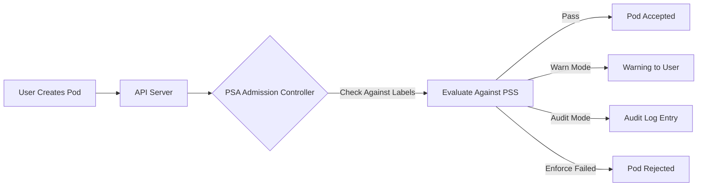

# 🚀 Kubernetes Security Controls Explained (PSP vs PAC vs PSS vs PSA)

_*Your Ultimate Visual + Practical Explanation*_

Kubernetes security evolved dramatically over the last few years. To secure Pods properly, you must understand **four major concepts**:

- **PSP — Pod Security Policy (Deprecated ❌)**
- **PSS — Pod Security Standards (Privileged / Baseline / Restricted)**
- **PSA — Pod Security Admission (the new built-in admission controller)**
- **PAC — Policy-as-Code solutions (Kyverno, OPA, Gatekeeper)**

This guide explains all four in your preferred enhanced style. Enjoy! 😄

---

## ❌ 1. Pod Security Policy (PSP) — _The Old, Confusing Giant_ (Deprecated)

### 🎯 What PSP Was

A **cluster-level admission controller** used to enforce Pod security settings before Pods were created.

It controlled things like:

- Running as root
- Privileged containers
- Host networking
- Linux capabilities
- seccomp/apparmor
- hostPath mounts
- and much more

In theory, PSP was great.  
In practice… PSP was a **mess**. 😅

---

### 😫 Problems With PSP (Why It Was Removed)

#### 🔸 1. Hard to Understand

- Nobody could easily tell **which PSP applied** to which Pod.
- It felt like debugging invisible ghosts 👻.

#### 🔸 2. Too Many Foot-guns

- Users often got overly permissive PSPs _just to make things work_, defeating security.

#### 🔸 3. No Audit / Dry-Run Mode

- You couldn’t test if a Pod would break before applying PSP.

#### 🔸 4. Didn’t Support Modern Runtime Needs

- Things like Kata containers, gVisor, runtime classes were difficult.

#### 🔸 5. Enabled Too Late in Kubernetes’ History

- Clusters couldn’t enable PSP by default without breaking everything.

---

### ⚠️ PSP Deprecation Timeline

| Kubernetes Version | Status                 |
| ------------------ | ---------------------- |
| v1.21              | PSP deprecated         |
| v1.25              | PSP removed completely |

---

## 📃 PSS — Pod Security Standards

**PSS is NOT an admission controller.**
It’s a **specification**, a **set of 3 security profiles** that Kubernetes recommends.

Think of PSS as:
👉 “Security levels describing what Pods are allowed to do.”

These levels are **cumulative**.

---

### ⚙️ The Three PSS Levels

| Level             | Purpose               | Summary                               |
| ----------------- | --------------------- | ------------------------------------- |
| **Privileged** 🔥 | For system components | Everything allowed                    |
| **Baseline** ⚖️   | Safe defaults         | No privilege escalation               |
| **Restricted** 🔒 | Maximum security      | Non-root, read-only FS, seccomp, etc. |

---

### 🔥 Privileged (Most Permissive)

Used for:

- CNI plugins
- CSI drivers
- low-level daemons
- debugging

Allows everything including:

- `privileged: true`
- host networking
- host volumes
- host PID/IPC

---

### ⚖️ Baseline (Standard Default)

Blocks:

- Privilege escalation
- Adding Linux capabilities
- hostPath
- hostPID
- hostIPC
- hostNetwork

---

### 🔒 Restricted (Production Hardening)

Requires:

- `runAsNonRoot: true`
- read-only root filesystem
- seccomp runtime default
- drops all capabilities
- avoids host namespace usage

Used for:

- Payments systems
- PII data services
- Regulated industries

---

## 🧲 2. PSA — Pod Security Admission

**PSA is the built-in admission controller released to replace PSP.**

Think of PSA as:
👉 “Enforce PSS via Namespace labels.”

PSA enforces PSS using **three modes**:

---

### 🎮 PSA Modes

#### 1️⃣ Enforce Mode 🚫

- Violating Pod is **rejected**
- Strongest enforcement

#### 2️⃣ Audit Mode 📝

- Pod allowed
- Violation logged in audit events

#### 3️⃣ Warn Mode ⚠️

- Pod allowed
- User gets CLI warnings

---

### 🏷️ PSA Namespace Labels

| Mode    | Label                                | Value                              |
| ------- | ------------------------------------ | ---------------------------------- |
| Enforce | `pod-security.kubernetes.io/enforce` | privileged / baseline / restricted |
| Audit   | `pod-security.kubernetes.io/audit`   | privileged / baseline / restricted |
| Warn    | `pod-security.kubernetes.io/warn`    | privileged / baseline / restricted |

Multiple modes can exist on the same namespace.

---

### 📦 Example

#### Enforce Strict Policy

```yaml
pod-security.kubernetes.io/enforce: restricted
```

Any Pod failing Restricted PSS = ❌ rejected.

#### Audit Violations

```yaml
pod-security.kubernetes.io/audit: baseline
```

Violations appear in logs but Pods run.

#### Warn Users

```yaml
pod-security.kubernetes.io/warn: privileged
```

Users see warnings, but Pods run.

---

### 🧩 PSA Exemptions — The VIP Pass 🎫

Sometimes certain entities need to bypass PSA rules.

#### 1️⃣ User Exemptions

Whitelisted usernames bypass checks.

Used for:

- CI/CD pipelines
- Admin automation

#### 2️⃣ RuntimeClass Exemptions

Some runtimes (e.g., gVisor) might require exemptions.

#### 3️⃣ Namespace Exemptions

System namespaces often exempted:

- `kube-system`
- `kube-public`

So that CNIs / CSIs work.

---

## 🤖 3. PAC — Policy as Code (Kyverno, OPA, Gatekeeper, jsPolicy)

PAC = **write rules in code and enforce them through admission controllers**.

Think of PAC as:
👉 “Build your own Kubernetes security guard with custom rules.”

---

### 🎯 Why PAC Became Popular

Because PSP was limited and too static.

PAC tools offer:

- Custom policies
- JSON/YAML-based rule definition
- Auditing
- Mutations
- Validation
- Exceptions
- Reusable libraries

---

### ⭐ Popular PAC Tools

#### 🔹 **Kyverno**

- Kubernetes-native
- Policies written in YAML
- Easy for ops teams
- Mutation + Validation + Generation

#### 🔹 **OPA + Gatekeeper**

- Rego policy language
- Extremely flexible
- Enterprise-grade compliance

#### 🔹 **jsPolicy**

- Write policies in JavaScript
- Fun for web dev teams

---

### 🤔 When Should You Use PAC?

- Multi-team clusters
- Strict compliance (PCI, SOC2)
- Complex rules
- Custom logic (e.g., image registry restrictions)
- When PSA is not enough

---

## 🔄 Migration Strategy: PSP ➝ PSA (Your Easy Roadmap)

Here is a simple, structured migration plan:

1. **Inventory PSPs**
   Identify privileged, baseline-like, and restricted-like settings.

2. **Enable PSA in Audit Mode First**
   No breakage, just logs.

3. **Review Violations**
   List workloads that won’t pass Baseline/Restricted.

4. **Fix Pod Specs**
   Update securityContext settings.

5. **Enable Warn Mode**
   Warn users before forcing changes.

6. **Enable Enforce**
   Start with Baseline → Restricted later.

7. **Roll out gradually**
   Namespace by namespace.

8. **Communicate**
   Dev teams must understand why Pods fail.

---

## 🔍 Visual Diagram

### _How PSA Works Internally_



---

## 🧪 Example Pods for Each PSS Level

### 🔥 Privileged

```yaml
securityContext:
  privileged: true
```

### ⚖️ Baseline

```yaml
securityContext:
  allowPrivilegeEscalation: false
```

### 🔒 Restricted

```yaml
securityContext:
  allowPrivilegeEscalation: false
  runAsNonRoot: true
  readOnlyRootFilesystem: true
  seccompProfile:
    type: RuntimeDefault
```

---

## 🧠 When to Use PSP, PAC, PSS, PSA? (Final Cheat Sheet)

| Feature            | PSP          | PSA                      | PAC (OPA/Kyverno)        |
| ------------------ | ------------ | ------------------------ | ------------------------ |
| Deprecated?        | Yes          | No                       | No                       |
| Enforces security? | Yes          | Yes                      | Yes                      |
| Built-in?          | Yes (old)    | Yes                      | No                       |
| Flexible?          | ❌           | ⚠️ Medium                | ✔️ Very                  |
| Custom rules?      | Limited      | No                       | ✔️ Yes                   |
| Best for           | Old clusters | Simple built-in security | Enterprise-grade control |

---

## 🎁 Final Summary

- **PSP** → Old, confusing, removed
- **PSS** → Security specification (Privileged, Baseline, Restricted)
- **PSA** → Admission controller enforcing PSS with namespace labels
- **PAC** → Custom rules (Kyverno, OPA, Gatekeeper)

Together, **PSS + PSA** give Kubernetes a simple, built-in security model.
For maximum enterprise flexibility → **PAC solutions**.
