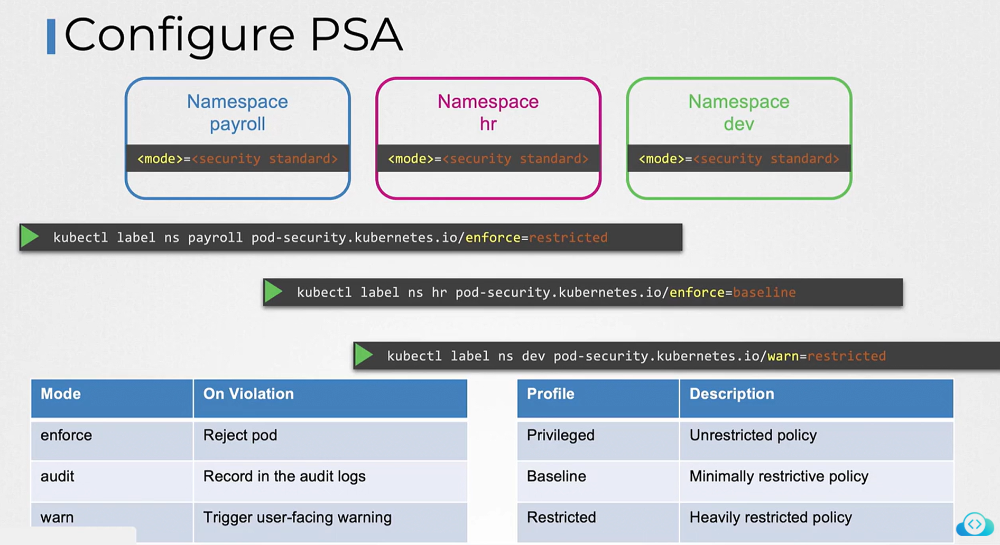
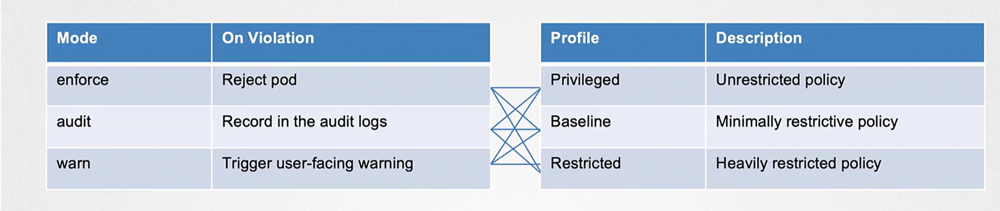
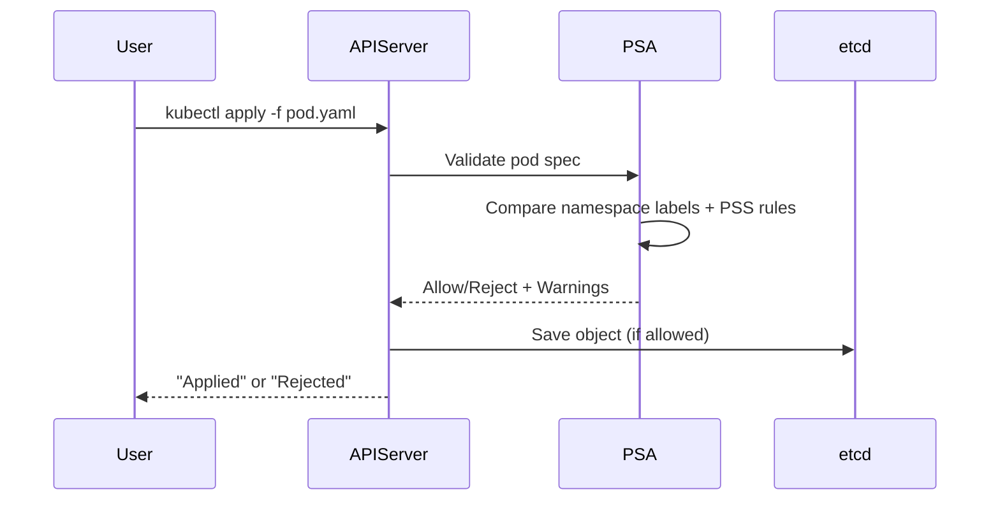

# 🔐 **Pod Security Admission (PSA)**

_The modern, built-in way to enforce pod security in Kubernetes._

---

## 🌟 **What is Pod Security Admission (PSA)?**

PSA is a **built-in Kubernetes Admission Controller** that evaluates every Pod creation/update request and checks whether it meets the **Pod Security Standards (PSS)**:

- 🔥 **Privileged** (least secure)
- ⚖️ **Baseline** (default)
- 🔒 **Restricted** (most secure)

💡 PSA **does not require any external tools or webhooks**.
It works **entirely through namespace labels**.

Think of PSA as a **bouncer at a club**:

<div align="center" style="background-color: #1a2325ff; border-radius: 10px; border: 2px solid">

| Mode        | Behavior                          | Analogy                                            |
| ----------- | --------------------------------- | -------------------------------------------------- |
| **Enforce** | Blocks Pods that violate PSS      | “You’re not allowed in.” 🚫                        |
| **Warn**    | Lets Pod run but prints a warning | “I’ll allow it, but don’t do that again.” ⚠️       |
| **Audit**   | Logs violation in audit logs      | “I won’t tell you, but I’ll tell your manager.” 📝 |

</div>

---

<div align="center" style="background-color:#F1F1F1; border-radius: 10px; border: 2px solid">
  
</div>

---

<div align="center" style="background-color:#F1F1F1; border-radius: 10px; border: 2px solid">
  
</div>

---

## ⚙️ 2. How PSA Works Internally

Here’s how Kubernetes decides whether to accept your Pod:

<div align="center" style="background-color: #1a2325ff; border-radius: 10px; border: 2px solid">



</div>

---

## ✍🏻 **Hands-on: Real Practical Examples**

Below is a **step-by-step guide you can try on any real cluster** (Minikube, Kind, AKS, EKS, GKE).

---

## 🔹 Step 1 — Create a New Namespace

```bash
kubectl create namespace demo-psa
```

Check:

```bash
kubectl get ns demo-psa --show-labels
```

You will see no PSA labels yet.

---

## 🔹 Step 2 — Apply Restricted Policy (Enforce Mode)

```bash
kubectl label namespace demo-psa \
  pod-security.kubernetes.io/enforce=restricted
```

Verify:

```bash
kubectl get ns demo-psa --show-labels
```

Output should include:

```ini
pod-security.kubernetes.io/enforce=restricted
```

---

## 🔹 Step 3 — Try to Create an Insecure Pod (It Will Fail!)

> ❌ This Pod violates Restricted PSS because it runs as root.

### insecure-pod.yaml

```yaml
apiVersion: v1
kind: Pod
metadata:
  name: insecure
  namespace: demo-psa
spec:
  containers:
    - name: app
      image: nginx
      securityContext:
        runAsUser: 0
```

Apply:

```bash
kubectl apply -f insecure-pod.yaml
```

🔥 **PSA will reject it**:

```ini
Error: pods "insecure" is forbidden:
violates PodSecurity "restricted": runAsUser=0 (must be non-root)
```

> 🧠 PSA just saved you.

---

## 🔹 Step 4 — Create a Pod That Complies With Restricted PSS

### secure-pod.yaml

```yaml
apiVersion: v1
kind: Pod
metadata:
  name: secure
  namespace: demo-psa
spec:
  securityContext:
    seccompProfile:
      type: RuntimeDefault
  containers:
    - name: app
      image: nginx
      securityContext:
        runAsNonRoot: true
        allowPrivilegeEscalation: false
        readOnlyRootFilesystem: true
```

Apply:

```bash
kubectl apply -f secure-pod.yaml
```

Success! 🎉

```bash
kubectl get pods -n demo-psa
```

---

## 🔹 Step 5 — Adding Warn Mode

Let’s now add warnings instead of strict rejection.

```bash
kubectl label namespace demo-psa \
  pod-security.kubernetes.io/warn=baseline --overwrite
```

Now try the insecure Pod again:

```bash
kubectl apply -f insecure-pod.yaml
```

You will see:

```ini
Warning: violates PodSecurity "baseline": host namespaces are not allowed
```

But the Pod will **still run** ✔️

---

## 🔹 Step 6 — Adding Audit Mode

Audit mode writes logs in the audit system of your cluster.

```bash
kubectl label namespace demo-psa \
  pod-security.kubernetes.io/audit=privileged --overwrite
```

Try again:

```bash
kubectl apply -f insecure-pod.yaml
```

The Pod runs, but audit logs will contain entries like:

```ini
audit.k8s.io: violation: privileged rule violated by Pod insecure
```

---

## 🔹 Step 7 — Exemptions

You can bypass PSA for:

- Users
- Namespaces
- Runtime classes

Example: Exempt `system:serviceaccount:my-team:ci-bot`

### kube-apiserver flags:

```ini
--admission-control-config-file=/etc/kubernetes/psa-config.yaml
```

### psa-config.yaml

```yaml
apiVersion: apiserver.config.k8s.io/v1
kind: AdmissionConfiguration
plugins:
  - name: PodSecurity
    configuration:
      apiVersion: pod-security.admission.config.k8s.io/v1
      exemptions:
        usernames:
          - system:serviceaccount:my-team:ci-bot
        namespaces:
          - kube-system
        runtimeClassNames:
          - my-custom-runtime
```

This bot/user/runtime can bypass PSA checks.

---

## 🔹 Step 8 — PSA in Real Projects

Below are **real-world practical examples**.

---

### 📝 Example 1 — Lock Down Production Namespace

```bash
kubectl label ns prod \
  pod-security.kubernetes.io/enforce=restricted \
  pod-security.kubernetes.io/warn=baseline \
  pod-security.kubernetes.io/audit=privileged
```

Meaning:

| Mode    | Policy     | Effect                      |
| ------- | ---------- | --------------------------- |
| Enforce | restricted | Block insecure Pods         |
| Warn    | baseline   | Warn developers             |
| Audit   | privileged | Track deeply insecure specs |

---

### 📝 Example 2 — Open Namespace for Dev

```bash
kubectl label ns dev \
  pod-security.kubernetes.io/enforce=baseline
```

Developers can deploy almost anything except privileged containers.

---

### 📝 Example 3 — System Namespace

```bash
kubectl label ns kube-system \
  pod-security.kubernetes.io/enforce=privileged
```

Allows CNIs, CSIs, kube-proxies.

---

## 👨‍💻 **PSA Debugging Tips**

### 🔍 **See PSA Evaluation Results**

```bash
kubectl apply -f pod.yaml --dry-run=server
```

This will display warnings but not create the Pod.

---

### 🔍 **Check PSA Labels on Namespace**

```bash
kubectl get ns <name> --show-labels
```

---

### 🔍 **Show Why a Pod Was Rejected**

`kubectl describe pod <name>`

You’ll find:

```ini
Error from admission controller 'PodSecurity': ...
```

---

### 🔍 **Check Audit Logs (EKS/GKE/AKS)**

Look in:

```ini
/var/log/kubernetes/audit.log
```

Or cloud provider Logs Explorer.

---

## 🎉 **Final PSA Cheat Sheet**

<div align="center" style="background-color: #1a2325ff; border-radius: 10px; border: 2px solid">

| ITEM       | DEFINITION                                     |
| ---------- | ---------------------------------------------- |
| PSA        | Built-in admission controller for pod security |
| PSS        | Standards (Privileged, Baseline, Restricted)   |
| Labels     | How you configure PSA                          |
| Modes      | Enforce, Warn, Audit                           |
| Exemptions | Allow bypassing PSA                            |

</div>

---

## 🎁 Want More Hands-On?

I can also generate:

- ✅ A **full PSA lab** using Kind
- ✅ A **PSA migration plan** (PSP → PSA)
- ✅ A **GitHub-ready PSA demo folder**
- ✅ PSA + Kyverno hybrid architecture

Just tell me what you'd like next!
