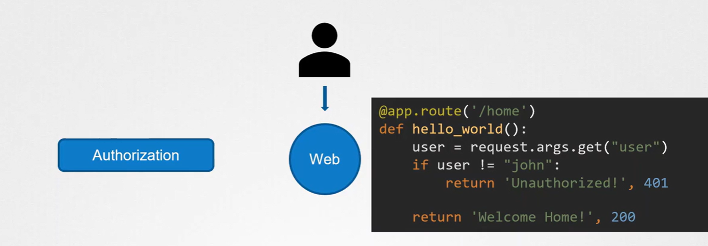
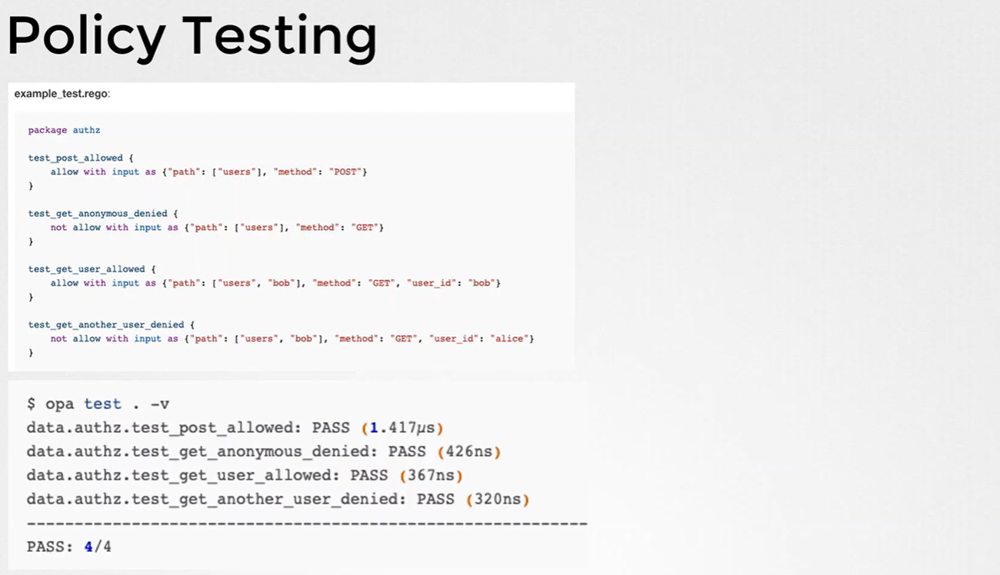
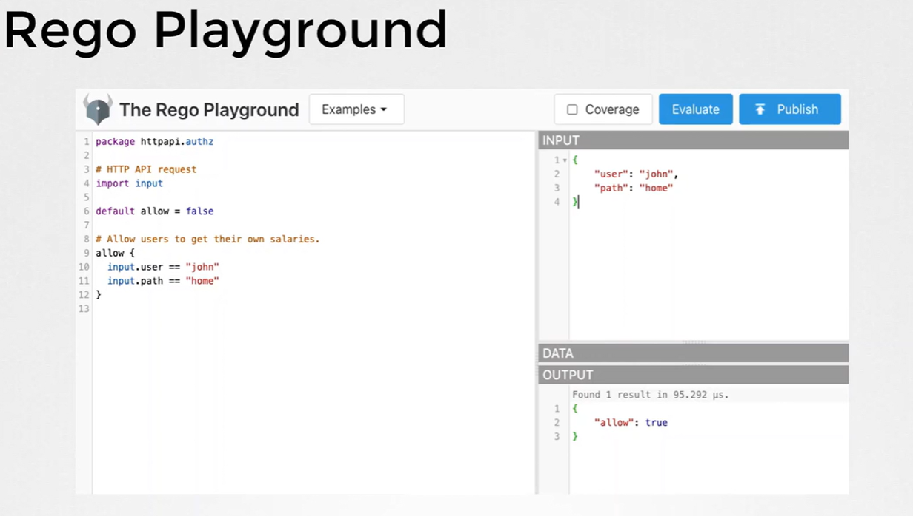

# OPA

## Why?

## Without OPA




### With OPA


---

## OPA Components

---

## OPA without K8s

### Install Binaries

```bash
wget https://openpolicyagent.org/download/opa_linux_amd64 -O opa
chmod +x opa

./opa run --server &
# will print:
# {
#   "level": "warning",
#   "msg": "OPA running with uid or gid 0. Running OPA with root privileges is not recommended.",
#   "time": "2025-11-17T12:44:03Z"
# }
```

## OPA with K8s

## References

- <https://openpolicyagent.org/docs/>  
   

- <https://openpolicyagent.org/docs/policy-testing/>  
   

- <https://play.openpolicyagent.org/>  
   
