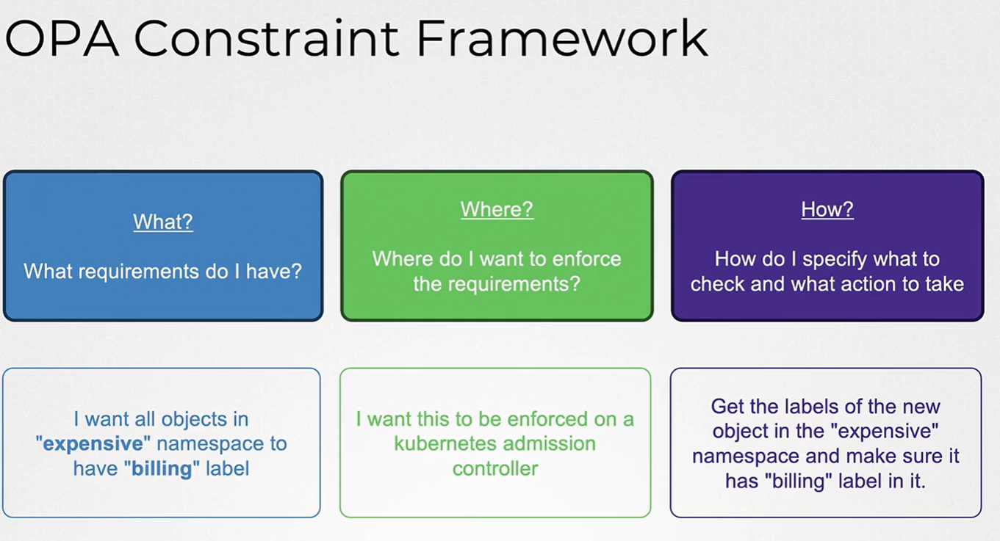
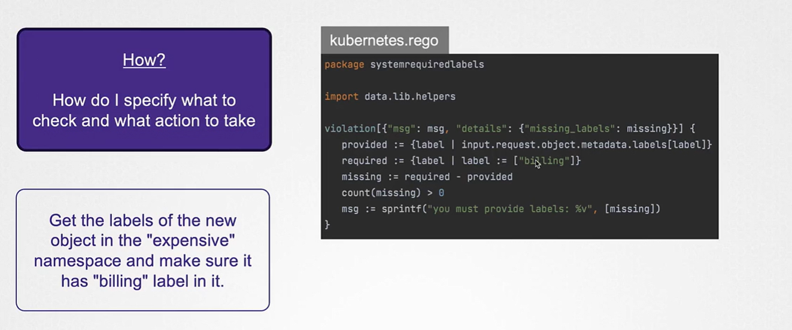
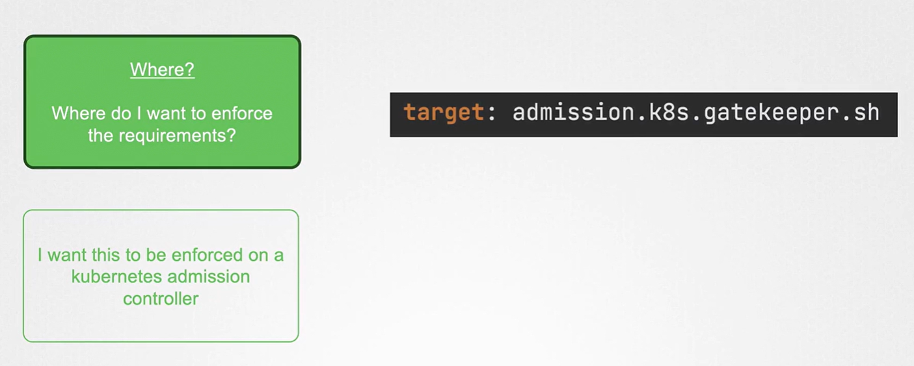
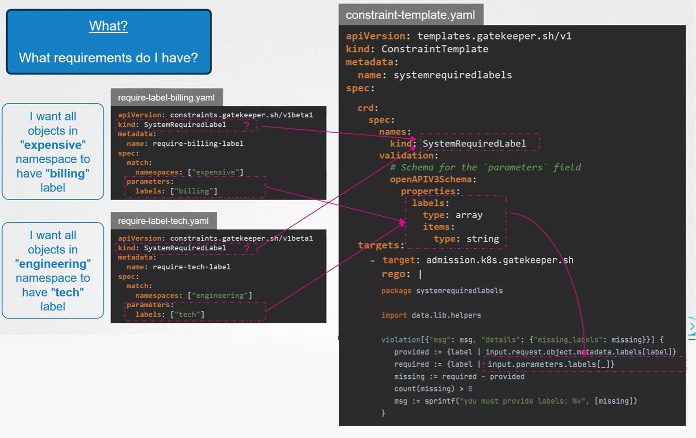

# 👮🏻 OPA Gatekeeper: The Complete, Hands-On Guide

_The Kubernetes-native way to enforce OPA policies using CRDs._

---

## 📖 **What is OPA Gatekeeper?**

**Gatekeeper** is a Kubernetes-native admission controller based on **OPA + Rego**, designed specifically for Kubernetes policy enforcement.

OPA alone = a generic policy engine
Gatekeeper = **OPA + Kubernetes glue**, making policy-as-code truly Kubernetes-native.

Gatekeeper adds:

- Custom Resource Definitions (CRDs)
- Kubernetes-style configuration (YAML-first)
- Audit functionality
- Mutation support
- Enforcement modes
- Better observability
- Constraint libraries
- The ability to scope and reuse policies

Think of Gatekeeper as:

👉 _“OPA, but built FOR Kubernetes.”_

---

<div align="center" style="background-color:#F1F1F1; border-radius: 10px; border: 2px solid">
  
</div>

## ❓ **Why Gatekeeper Instead of Plain OPA?**

### 🔥 OPA alone as an admission webhook is powerful… but painful:

- ❌ You must write your own webhook server
- ❌ You must manage certificates
- ❌ You must handle admission reviews manually
- ❌ You must bundle policies as ConfigMaps
- ❌ Hard to test
- ❌ Hard to manage at scale

Gatekeeper solves all this.

---

## 🌟 What Gatekeeper Provides (Beyond OPA)

| Feature                      | OPA         | Gatekeeper     |
| ---------------------------- | ----------- | -------------- |
| Rego policy language         | ✔️          | ✔️             |
| Admission control            | ✔️ (manual) | ✔️ (automatic) |
| Kubernetes CRDs for policies | ❌          | ✔️             |
| ConstraintTemplates          | ❌          | ✔️             |
| Constraints                  | ❌          | ✔️             |
| Audit capability             | ❌          | ✔️             |
| Mutation                     | ❌          | ✔️             |
| Kubernetes-native mgmt       | ❌          | ✔️             |
| Community policy library     | ❌          | ✔️ Tons        |

Gatekeeper turns policy management into **declarative Kubernetes objects**.

---

## 🔬 **Gatekeeper Core Concepts** (The Heart of It)

Gatekeeper uses two CRDs:

---

### 1. 🔧 **ConstraintTemplate**

Defines:

- A reusable **Rego policy**
- Input schema
- Parameters the user can configure

It is like a **class**.

---

### 2. 🔒 **Constraint**

Defines:

- The actual instance of the policy
- Which resources it applies to
- Parameter values

It is like an **object of the class**.

---

## 🏗️ **Architecture of Gatekeeper** (Visual)

<div align="center" style="background-color:#F1F1F1; border-radius: 10px; border: 2px solid">
  
</div>

---

<div align="center" style="background-color:#F1F1F1; border-radius: 10px; border: 2px solid">
  
</div>

---

<div align="center" style="background-color:#F1F1F1; border-radius: 10px; border: 2px solid">
  
</div>

---

<div align="center" style="background-color:#F1F1F1; border-radius: 10px; border: 2px solid">
  
</div>

---

## 📦 **Install with kubectl**

```bash
kubectl apply -f https://raw.githubusercontent.com/open-policy-agent/gatekeeper/master/deploy/gatekeeper.yaml
```

Verify installation:

```bash
kubectl get pods -n gatekeeper-system
```

Expected:

- gatekeeper-controller-manager
- gatekeeper-audit
- gatekeeper-webhook

---

## 📝 **Example 1 - “Deny Pods Using hostPath”**

Let's create:

1. **ConstraintTemplate** → defines the Rego policy
2. **Constraint** → applies the rule to Pods

---

### 🔹 1. ConstraintTemplate: `k8sdenyhostpath.yaml`

```yaml
apiVersion: templates.gatekeeper.sh/v1beta1
kind: ConstraintTemplate
metadata:
  name: k8sdenyhostpath # 👈 Your custom name
spec:
  crd:
    spec:
      names:
        kind: K8sDenyHostPath # 👈 Your custom kind (used in Constraint)
  targets:
    - target: admission.k8s.gatekeeper.sh
      rego: |
        package k8sdenyhostpath   # 👈 Your custom Rego package name

        violation[{"msg": msg}] {
          input.review.kind.kind == "Pod"
          container := input.review.object.spec.containers[_]
          volume := input.review.object.spec.volumes[_]
          volume.hostPath
          msg := sprintf("hostPath volumes are forbidden: %v", [volume.hostPath.path])
        }
```

Apply:

```bash
kubectl apply -f k8sdenyhostpath.yaml
```

---

### 🔹 2. Constraint: `deny-hostpath.yaml`

```yaml
apiVersion: constraints.gatekeeper.sh/v1beta1
kind: K8sDenyHostPath # 👈 Must match the kind from the Template
metadata:
  name: deny-host-path
spec:
  match:
    kinds:
      - apiGroups: [""]
        kinds: ["Pod"]
```

Apply:

```bash
kubectl apply -f deny-hostpath.yaml
```

---

### 🔹 3. Try to Create a Pod With hostPath

#### bad-pod.yaml

```yaml
apiVersion: v1
kind: Pod
metadata:
  name: bad-pod
spec:
  containers:
    - name: busybox
      image: busybox
      command: ["sleep", "3600"]
  volumes:
    - name: host-data
      hostPath:
        path: /etc
```

Apply:

```bash
kubectl apply -f bad-pod.yaml
```

Output:

```ini
Error: admission webhook "validation.gatekeeper.sh" denied the request:

hostPath volumes are forbidden: /etc
```

🔥 **Gatekeeper blocked it!**

---

## 📝 **Example 2 — Do Not Allow `:latest` Tag Images**

This is one of the most common compliance rules.

---

### 🔹 1. ConstraintTemplate

```yaml
apiVersion: templates.gatekeeper.sh/v1beta1
kind: ConstraintTemplate
metadata:
  name: k8sdenylatesttag # 👈 Your custom name
spec:
  crd:
    spec:
      names:
        kind: K8sDenyLatestTag # 👈 Your custom kind (used in Constraint)
  targets:
    - target: admission.k8s.gatekeeper.sh
      rego: |
        package k8sdenylatesttag    # 👈 Your custom Rego package name

        violation[{"msg": msg}] {
          container := input.review.object.spec.containers[_]
          endswith(container.image, ":latest")
          msg := sprintf("Image %v uses 'latest' tag, which is not allowed.", [container.image])
        }
```

---

### 🔹 2. Constraint

```yaml
apiVersion: constraints.gatekeeper.sh/v1beta1
kind: K8sDenyLatestTag # 👈 Must match the kind from the Template
metadata:
  name: no-latest-tag
spec:
  match:
    kinds:
      - apiGroups: [""]
        kinds: ["Pod"]
```

---

### 🔹 3. Try Deploying a Pod With `:latest`

```bash
kubectl apply -f - <<EOF
apiVersion: v1
kind: Pod
metadata:
  name: latest-pod
spec:
  containers:
  - name: nginx
    image: nginx:latest
EOF
```

Result:

```ini
Error: Image nginx:latest uses 'latest' tag, which is not allowed.
```

---

## 📃 **Gatekeeper Audit Mode**

Audit runs periodically and checks **existing** resources, not just new ones.

View audit violations:

```bash
kubectl get k8sdenyhostpath.constraints.gatekeeper.sh deny-host-path -o yaml
```

You will see a list under:

```yaml
status:
  violations:
```

This helps enforce policies retroactively.

---

## 📝 **Gatekeeper Mutation** (Optional Feature)

Gatekeeper can **modify resources** before they are accepted.

Example uses:

- Add labels
- Add seccompProfile
- Force `runAsNonRoot=true`
- Insert default annotations

Mutation is done using:

- `Assign` (basic mutation)
- `AssignMetadata`

Example: Force all namespaces to have a label:

```yaml
apiVersion: mutations.gatekeeper.sh/v1beta1
kind: AssignMetadata
metadata:
  name: add-team-label
spec:
  match:
    kinds:
      - apiGroups: [""]
        kinds: ["Namespace"]
  location: "metadata.labels.team"
  value: "devops"
```

---

## 🔩 `Gatekeeper` vs `PSA` vs `Kyverno`

| Feature           | Gatekeeper                 | PSA                   | Kyverno               |
| ----------------- | -------------------------- | --------------------- | --------------------- |
| Built-in?         | No                         | Yes                   | No                    |
| Language          | Rego                       | No language           | YAML-based            |
| Mutation          | ✔️                         | ❌                    | ✔️ Strong             |
| Audit             | ✔️                         | ✔️                    | ✔️                    |
| CRDs for policies | ✔️                         | ❌                    | ✔️                    |
| Best for          | Large orgs, Rego expertise | Baseline pod security | Simpler YAML policies |

---

## 📦 **Directory Structure for Gatekeeper Policies**

A clean layout:

```ini
gatekeeper/
  templates/
    k8sdenylatesttag.yaml
    k8sdenyhostpath.yaml
  constraints/
    no-latest-tag.yaml
    deny-host-path.yaml
  samples/
    bad-pod.yaml
```

---

## 🎁 **Final Summary**

- **Gatekeeper = OPA + Kubernetes CRDs**
- Policies written as **ConstraintTemplates**
- Rules applied via **Constraints**
- Gatekeeper acts as **validating webhook**
- Audit tracks existing violations
- Mutation modifies resources before saving
- Ideal for **enterprise Kubernetes governance**
