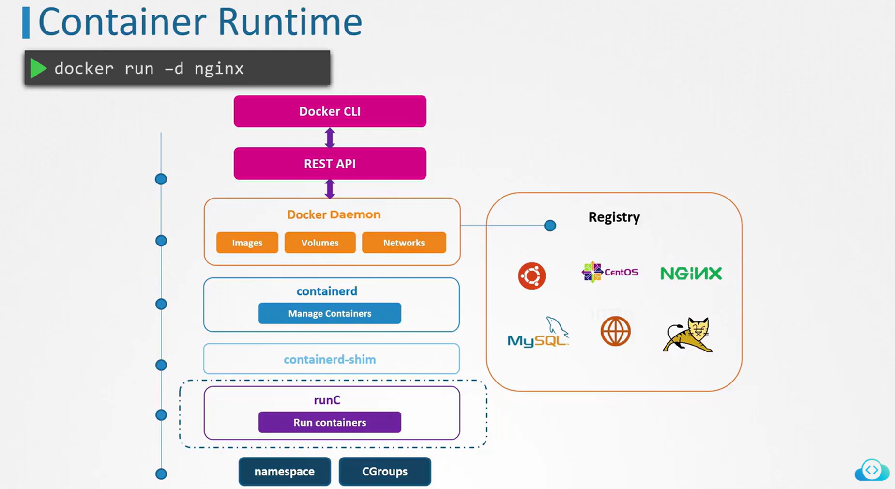
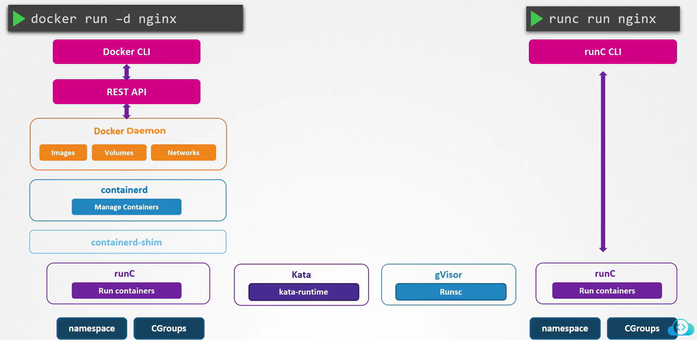
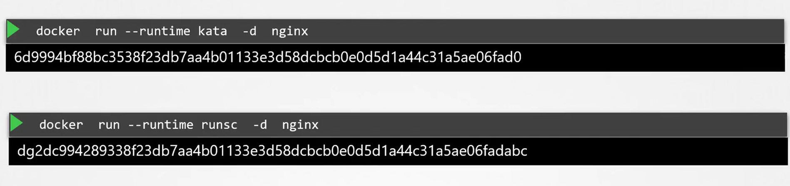
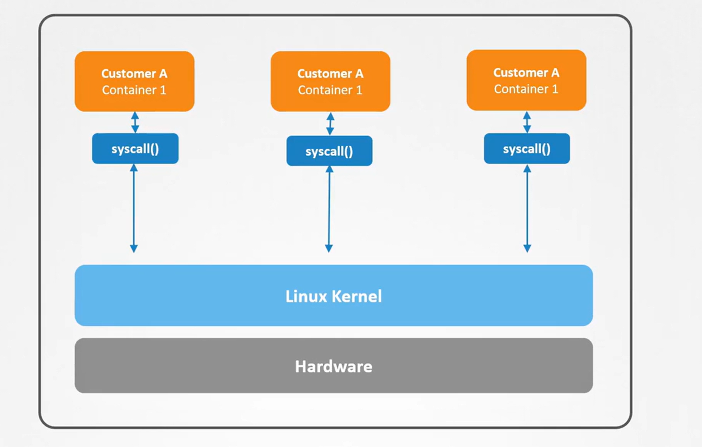
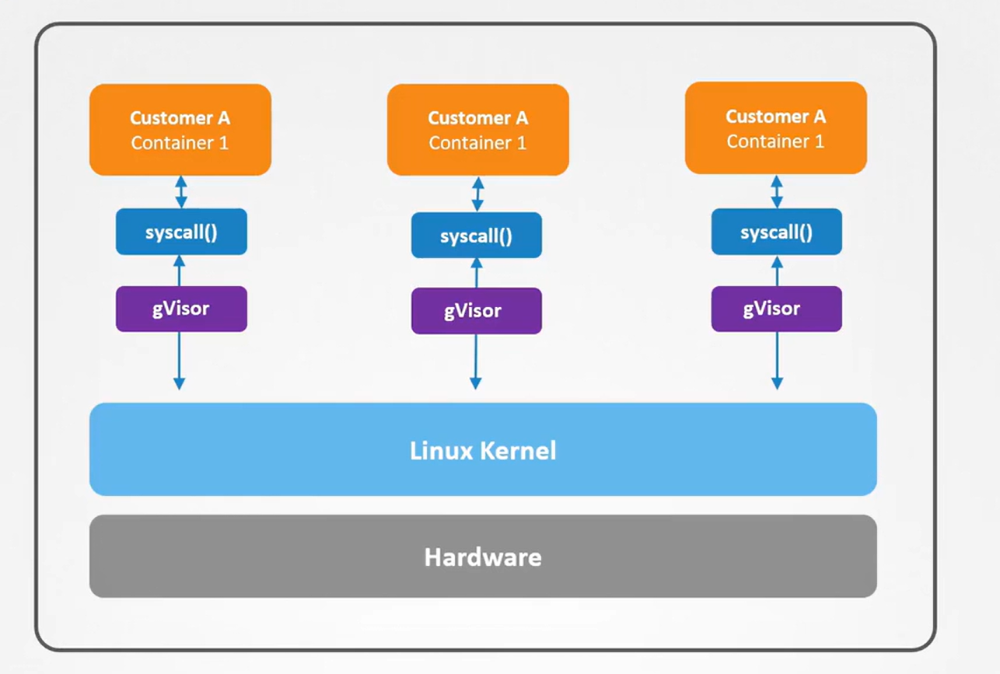
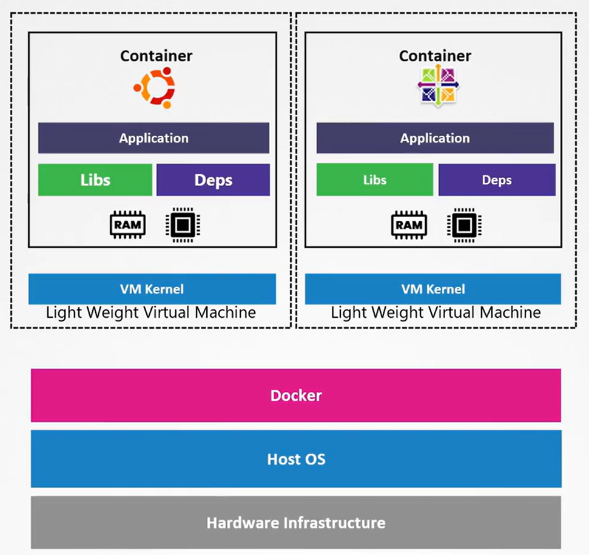
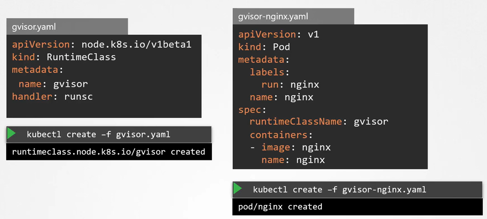

# 🛡️ **Container Sandboxing in Kubernetes**

**(Simple Explanation + Full Picture + Real-World Tools + Hands-On)!**

---

Container sandboxing = **adding extra isolation layers** so that even if a container is compromised, the attacker **cannot escape to the host**.

Think of it as:  
👉 _“Run this untrusted container, but keep it inside a super-secure jail.”_

Traditional Linux containers (Docker, containerd CRI-O) rely on:

- namespaces
- cgroups
- seccomp
- AppArmor/SELinux
- capabilities

These are strong, but **not enough** for untrusted workloads like:

- user-supplied code (e.g., CI pipelines)
- ML training untrusted images
- SaaS multi-tenancy
- WebAssembly workloads

For these cases, Kubernetes uses **sandboxed runtimes**.

---

## 🌐 **The Big Picture — What Sandboxing Means**

A “sandboxed” container is run inside an additional isolation layer:

<div align="center" style="background-color: #141a19ff;color: #a8a5a5ff; border-radius: 10px; border: 2px solid">

| Sandbox Technology  | Extra Isolation Layer                           |
| ------------------- | ----------------------------------------------- |
| **gVisor**          | Userspace kernel + syscall interception         |
| **Kata Containers** | Lightweight VM (per pod)                        |
| **Wasm / Wasmtime** | No syscalls at all; secure WebAssembly sandbox  |
| **Sysbox**          | Enhanced runc with extra isolation              |
| **Firecracker**     | MicroVM technology used by AWS Lambda / Fargate |

</div>

---

> These replace **runc** (the default OCI runtime).  
> Kubernetes groups these under **General Purpose Sandbox Runtimes** in CRI.

---

<div align="center" style="background-color:#F1F1F1; border-radius: 10px; border: 2px solid">
  
</div>

---

<div align="center" style="background-color:#F1F1F1; border-radius: 10px; border: 2px solid">
  
</div>

---

<div align="center" style="background-color:#F1F1F1; border-radius: 10px; border: 2px solid">
  
</div>

---

## 🤔 **Why Do We Need Container Sandboxing?**

### Without sandboxing

Attacker escapes via:

- kernel vulnerabilities
- syscalls not blocked by seccomp
- misconfigured AppArmor
- Linux capabilities allowed by mistake
- privileged containers

### With sandboxing

Even if the container is compromised:

- kernel is NOT directly exposed
- syscalls are filtered or emulated
- host filesystem/kernel stays inaccessible
- container breakout becomes extremely difficult

---

## 🧩 **Kubernetes Sandboxing Options** (2025)

Kubernetes supports multiple sandboxing runtimes through **runtimeClass**.

### 🔹 1. `gVisor` (Google)

**How it works:**  
gVisor implements a **userspace kernel** (“runsc”) that intercepts syscalls and handles them inside userspace, not the host kernel.

- Pod → gVisor userspace kernel → host
- Host kernel sees almost nothing from the container

<div align="center" style="background-color:#F1F1F1; border-radius: 10px; border: 2px solid">
  
</div>

---

<div align="center" style="background-color:#F1F1F1; border-radius: 10px; border: 2px solid">
  
</div>

---

<div align="center" style="background-color:#F1F1F1; border-radius: 10px; border: 2px solid">
  
</div>

---

**Pros:**

- ✔ Very strong syscall isolation
- ✔ Fast startup
- ✔ Great for multi-tenancy
- ✔ Supported by GKE, Anthos, containerd

**Cons:**

- ✖ Heavier than runc
- ✖ Some syscalls unsupported → some apps break

---

### 🔹 2. `Kata Containers`

**How it works:**

- used techniques of nested VMs (VM inside VM)
- Your container runs inside a short-lived VM.
- Each pod gets its own **lightweight microVM** (Firecracker/QEMU/NEMU).

<div align="center" style="background-color:#F1F1F1; border-radius: 10px; border: 2px solid">
  
</div>

---

**Pros:**

- ✔ VM-level isolation
- ✔ Excellent for hostile workloads
- ✔ Works with containerd & CRI-O

**Cons:**

- ✖ Higher memory usage
- ✖ Slightly slower startup
- ✖ More ops overhead
- ✖ Not supported by many of cloud providers

AWS Fargate and Lambda use similar isolation (Firecracker).

---

### 🔹 3. `WebAssembly` (Wasm)

This is **2025-level hot topic**.

- No syscalls → host kernel invisible
- Memory-safe
- Great for serverless workloads
- Sandbox by design

Examples:

- wasmtime
- containerd-wasm-shim
- Spin
- wasmCloud

**Pros:**

- ✔ Ultra-secure
- ✔ Binary size tiny
- ✔ Perfect for multi-tenant functions

**Cons:**

- ✖ Can't run normal Linux apps
- ✖ Ecosystem still growing

---

## ✍🏻 **How Kubernetes Selects a Sandbox Runtime**

Using **RuntimeClass**:

```yaml
apiVersion: node.k8s.io/v1
kind: RuntimeClass
metadata:
  name: gvisor
handler: runsc
```

Then assign to a Pod:

```yaml
apiVersion: v1
kind: Pod
metadata:
  name: sandboxed
spec:
  runtimeClassName: gvisor
  containers:
    - name: app
      image: nginx
```

> That’s it.  
> Kubernetes schedules this pod using gVisor instead of runc.

---

> 🚨 runtimeClassName is a field in the Pod spec, not the Container spec.

---

## 📝 **1. Hands-On Sandboxing with gVisor**

### 1️⃣ Install gVisor

```bash
sudo apt update && sudo apt install -y gvisor
```

### 2️⃣ Enable in containerd

Edit:

```ini
/etc/containerd/config.toml
```

Add:

```toml
[plugins."io.containerd.grpc.v1.cri".containerd.runtimes.runsc]
  runtime_type = "io.containerd.runsc.v1"
```

Reload:

```bash
sudo systemctl restart containerd
```

### 3️⃣ Create a RuntimeClass

```yaml
apiVersion: node.k8s.io/v1
kind: RuntimeClass
metadata:
  name: gvisor
handler: runsc
```

Apply:

```bash
kubectl apply -f runtimeclass.yaml
```

### 4️⃣ Run a sandboxed pod

```yaml
apiVersion: v1
kind: Pod
metadata:
  name: secure-nginx
spec:
  runtimeClassName: gvisor
  containers:
    - name: nginx
      image: nginx
```

Apply:

```bash
kubectl apply -f nginx-gvisor.yaml
```

### 5️⃣ Verify it’s using gVisor

On the node:

```bash
ps aux | grep runsc
```

Or see detailed runtime:

```bash
kubectl get pod secure-nginx -o wide
```

---

<div align="center" style="background-color:#F1F1F1; border-radius: 10px; border: 2px solid">
  
</div>

---

## 📝 **2. Hands-On Sandboxing with Kata Containers**

### 1️⃣ Install Kata

```bash
sudo apt install kata-runtime
```

### 2️⃣ Add Kata to containerd

Add to containerd:

```toml
[plugins."io.containerd.grpc.v1.cri".containerd.runtimes.kata]
  runtime_type = "io.containerd.kata.v2"
```

Reload:

```bash
sudo systemctl restart containerd
```

### 3️⃣ Create a RuntimeClass

RuntimeClass:

```yaml
apiVersion: node.k8s.io/v1
kind: RuntimeClass
metadata:
  name: kata
handler: kata
```

Apply:

```bash
kubectl apply -f runtimeclass.yaml
```

### 4️⃣ Run a sandboxed pod

Pod:

```yaml
spec:
  runtimeClassName: kata
```

Apply:

```bash
kubectl apply -f nginx-kata.yaml
```

### 5️⃣ Verify it’s using Kata

On the node:

```bash
ps aux | grep kata
```

Or see detailed runtime:

```bash
kubectl get pod secure-nginx -o wide
```

---

Boom → container runs in a VM.

---

## ⚔️ **Container Sandboxing vs Traditional Security**

<div align="center" style="background-color: #141a19ff;color: #a8a5a5ff; border-radius: 10px; border: 2px solid">

| Feature                | runc    | gVisor | Kata    | Wasm             |
| ---------------------- | ------- | ------ | ------- | ---------------- |
| Runs in VM?            | ❌      | ❌     | ✅      | ❌ (own sandbox) |
| Syscall isolation      | Low     | High   | Highest | No syscalls      |
| Speed                  | Fastest | Fast   | Medium  | Fast             |
| Workload compatibility | 100%    | ~80%   | 100%    | Low              |

</div>

---

## 🎯 **When to Use Which?**

### 👉🏻 **Use gVisor for:**

- CI pipelines running untrusted code
- Multi-tenant SaaS
- Enterprise clusters needing syscall isolation

### 👉🏻 **Use Kata for:**

- Zero-trust clusters
- Regulated industries (finance, healthcare)
- Hosting third-party workloads

### 👉🏻 **Use WebAssembly for:**

- Serverless functions
- Tiny workloads
- High-isolation multi-tenancy

---

## 📌 **CKS Exam Must-Know Summary**

- ✔ Sandboxing adds isolation on top of namespaces/cgroups
- ✔ Runtimes: **gVisor, Kata Containers, Firecracker, Wasm**
- ✔ Kubernetes uses **RuntimeClass** to choose runtime
- ✔ Sandboxing protects **host kernel** from container breakout
- ✔ Perfect for multi-tenant workloads
