# 🏢 Multi Tenant in k8s Cluster (for Saas Workloads)

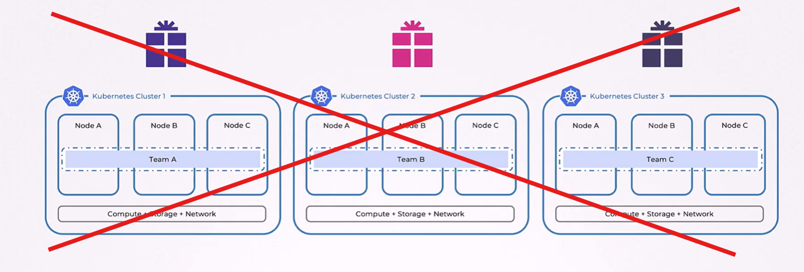

## 🔴 Challenges

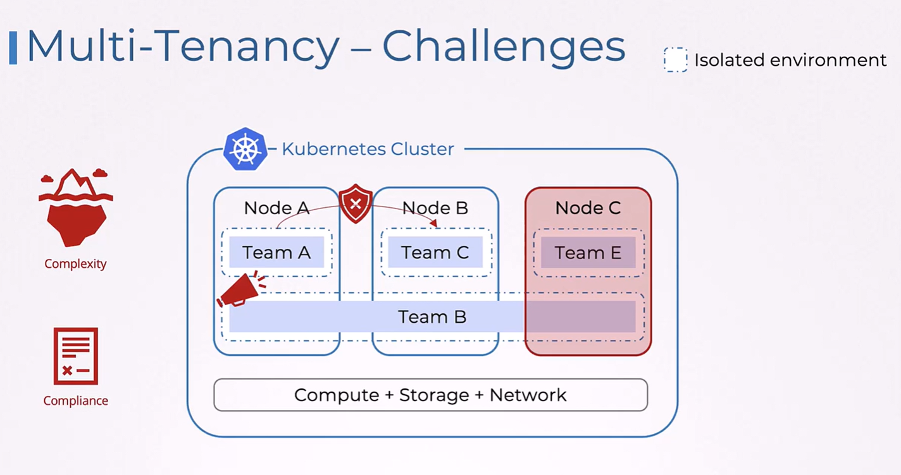

## 🟢 Advantage

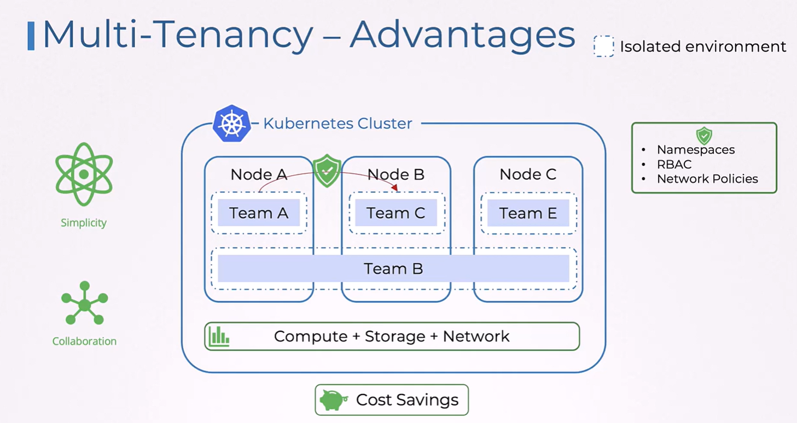

## Types of Multi-tenancy

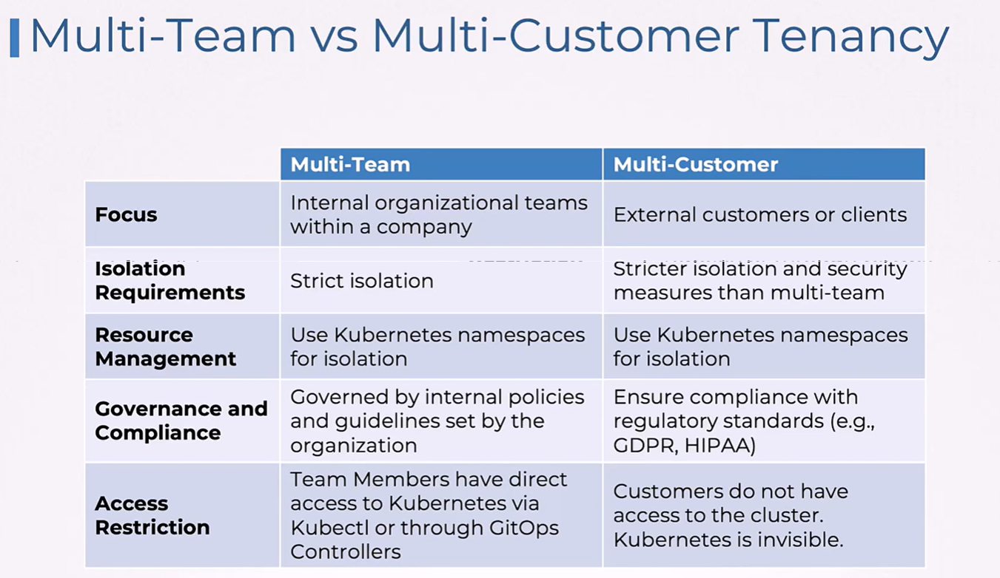

### Multi-Team Tenancy

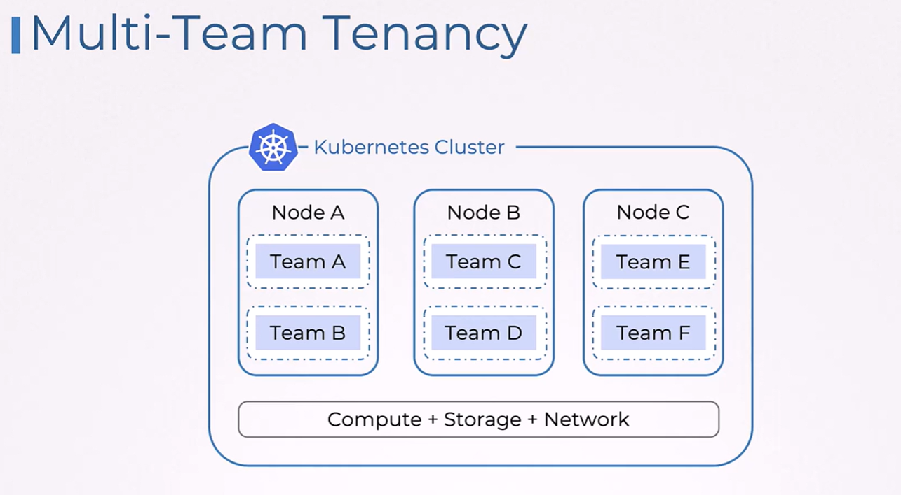

---

### Multi-Customer Tenancy

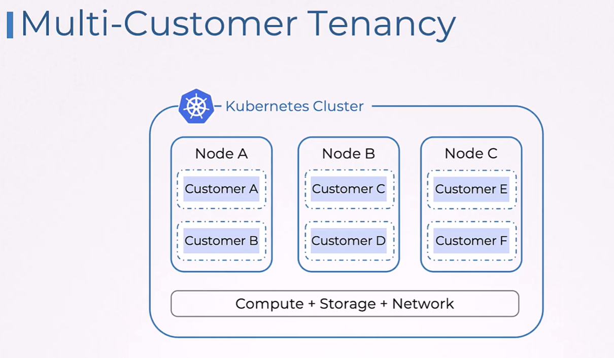

---

## 🎚️ What is Isolation

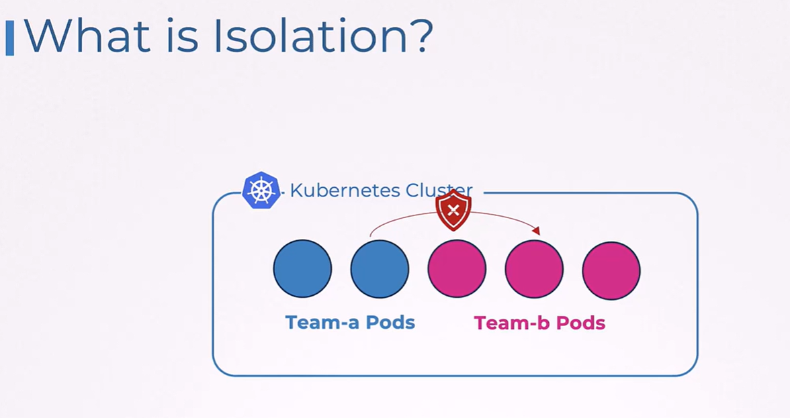

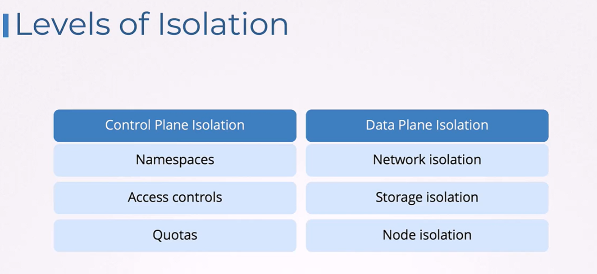

### Namespace Isolation

### Pod/Container Isolation

### Network Isolation

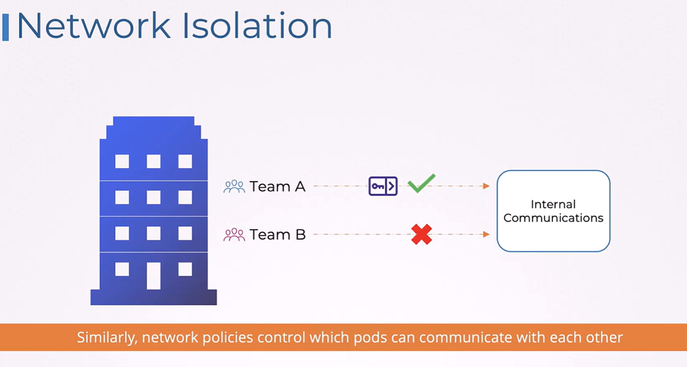

### Node Isolation

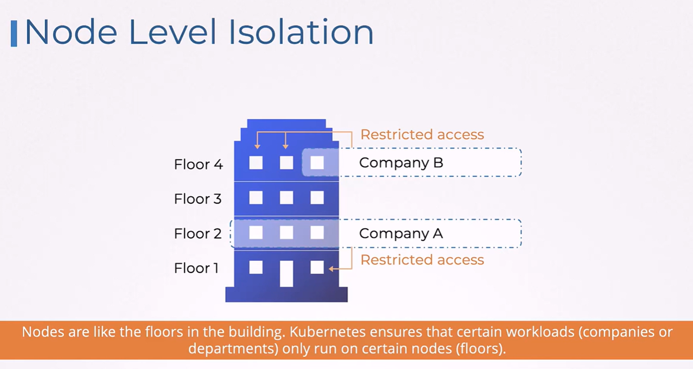

---

## Type of Isolation

### Hard Isolation

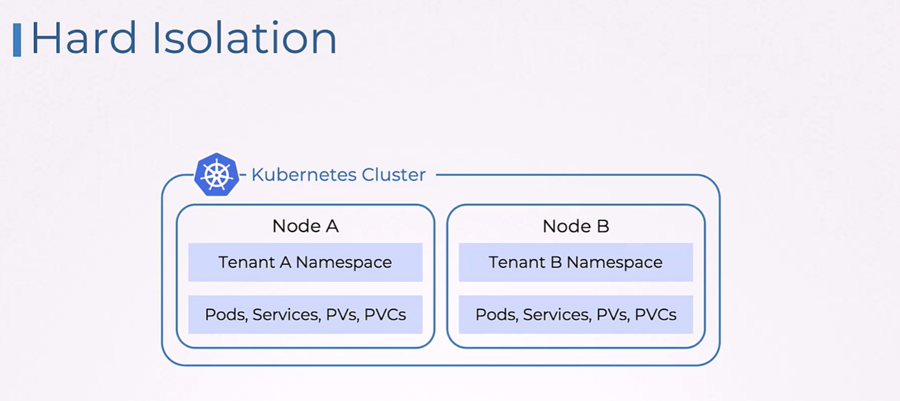

### Soft Isolation

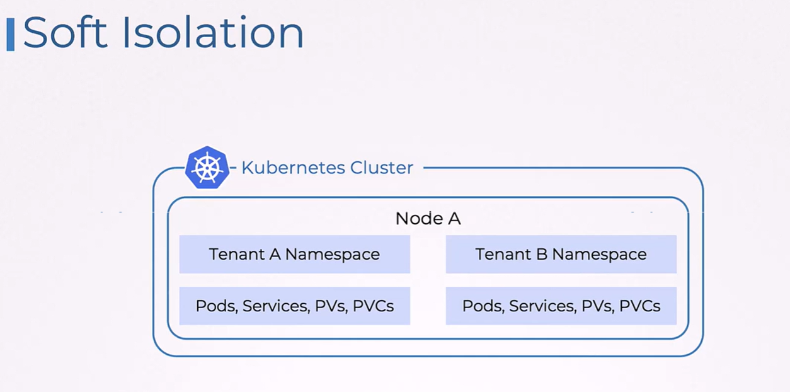

---

## Isolation Levels

### 🧠 1. Control Plane Isolation

Achieved by:

#### 1. Namespace

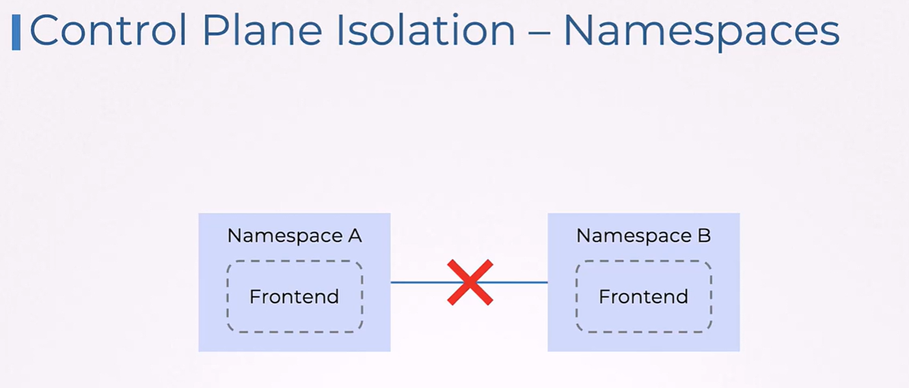

#### 2. Access Control

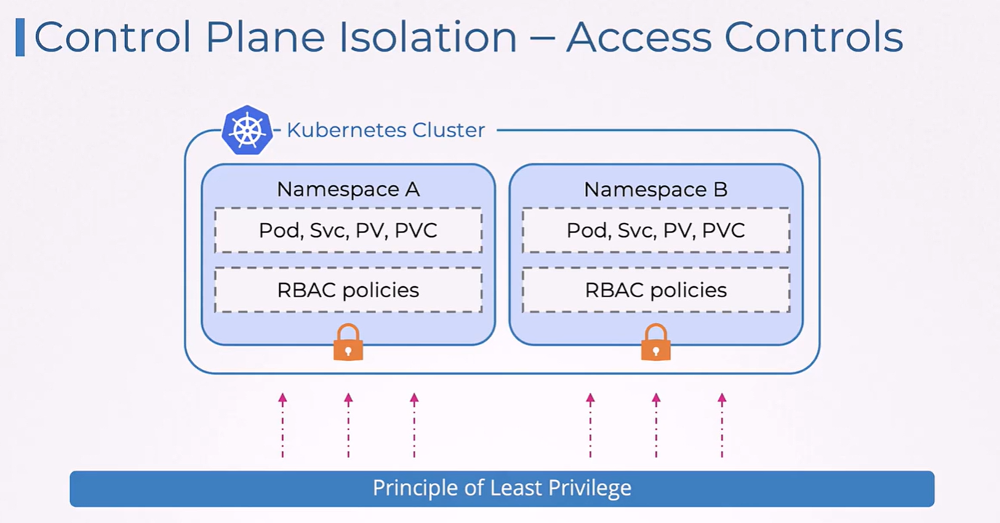

#### 3. Resource Quota

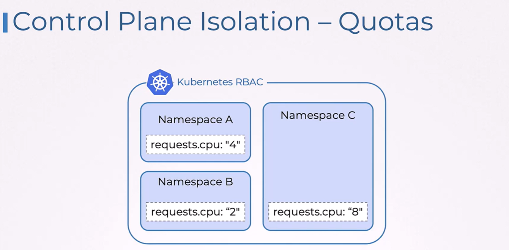

---

### 📦 2. Data Plane Isolation

Achieved by:

#### 1. Network Policy

#### 2. Storage

#### 3. Taints and Toleration
