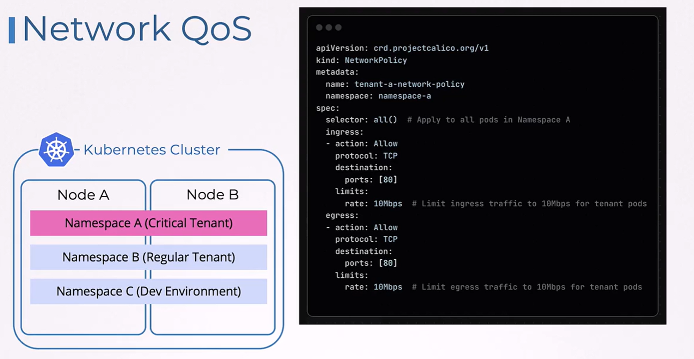
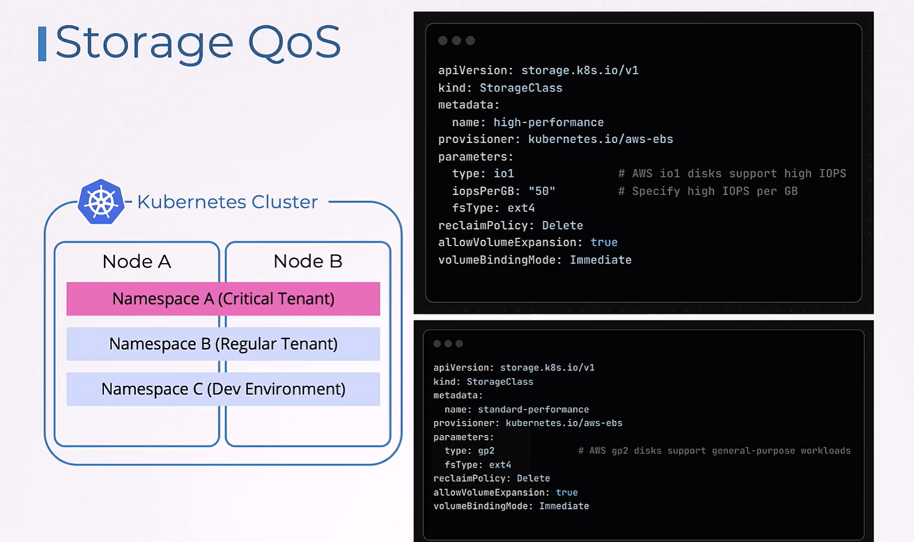

# 🏛️ **Quality of Service (QoS) — The Big Picture**

Quality of Service simply means:

> **How Kubernetes guarantees or limits resources (CPU, memory, network, storage) for workloads.**

There are **4 types** of QoS you must understand:

1. **Pod QoS (Kubernetes built-in classification)**
2. **Compute QoS (CPU/MEM behavior using Requests/Limits)**
3. **Network QoS (Bandwidth shaping)**
4. **Storage QoS (IOPS / throughput limits)**

Let’s break them down clearly.

---

## 1️⃣ **POD QoS (OFFICIAL KUBERNETES QOS CLASSES)**

💡 _This is what Kubernetes uses to decide WHICH PODS TO EVICT first when resources run low._

There are **three** classes:

---

### 🥇 **1. Guaranteed QoS**

**Condition:** Every container has _both_ CPU and Memory **requests = limits**.

```yaml
resources:
  requests:
    cpu: "500m"
    memory: "256Mi"
  limits:
    cpu: "500m"
    memory: "256Mi"
```

> ✔ Highest protection  
> ✔ Not evicted unless node is dying  
> ✔ Best for critical workloads

---

### 🥈 **2. Burstable QoS**

**Condition:** Requests are set, but requests ≠ limits
(or some limits are missing)

```yaml
resources:
  requests:
    cpu: "200m"
    memory: "100Mi"
  limits:
    cpu: "500m"
    memory: "300Mi"
```

> ✔ Guaranteed minimum resources  
> ✔ Can burst up to limit  
> ❌ Evicted before Guaranteed

---

### 🥉 **3. BestEffort QoS**

**Condition:** No requests & no limits.

```yaml
resources: {}
```

> ✔ Uses leftover resources  
> ❌ Always first to be evicted  
> ✔ Good for batch/low priority jobs

---

### ⭐ **EVICTION PRIORITY**

```ini
BestEffort  →  Burstable  →  Guaranteed
```

---

## 2️⃣ **COMPUTE QoS (CPU + MEMORY BEHAVIOR)**

This is NOT the same as Pod QoS.

Compute QoS defines **runtime behavior** using Requests & Limits.

---

### ⚙️ CPU QoS

| Setting         | Meaning                       |
| --------------- | ----------------------------- |
| **CPU Request** | Minimum guaranteed CPU        |
| **CPU Limit**   | Maximum CPU before throttling |

Example:

```yaml
resources:
  requests:
    cpu: "500m"
  limits:
    cpu: "1"
```

**Runtime effect:**

- Pod always gets **500m**
- Pod can use up to **1 CPU**
- Beyond 1 CPU → **throttled**

---

### 🧠 MEMORY QoS

| Setting            | Meaning                         |
| ------------------ | ------------------------------- |
| **Memory Request** | Scheduling guarantee            |
| **Memory Limit**   | Hard cap (OOM kill if exceeded) |

Example:

```yaml
resources:
  requests:
    memory: "512Mi"
  limits:
    memory: "1Gi"
```

**Runtime effect:**

- Pod must have at least 512Mi available on its node
- Exceed 1Gi → **OOMKilled**

---

## 3️⃣ **NETWORK QoS (BANDWIDTH SHAPING)**

Kubernetes itself does NOT enforce network QoS,
but CNI plugins do (Calico, Cilium, OpenShift SDN).

---

<div align="center" style="background-color:#F1F1F1; border-radius: 10px; border: 2px solid">

</div>

---

### 🎛️ Example: Calico Bandwidth Limiting

```yaml
apiVersion: v1
kind: Pod
metadata:
  name: limited-net
  annotations:
    kubernetes.io/ingress-bandwidth: "10M"
    kubernetes.io/egress-bandwidth: "5M"
spec:
  containers:
    - name: app
      image: nginx
```

> ✔ Limits incoming traffic to **10 Mbps**  
> ✔ Limits outgoing traffic to **5 Mbps**

Under the hood, it uses Linux **tc** (traffic control).

---

## 4️⃣ **STORAGE QoS (IOPS / THROUGHPUT)**

Implemented at **StorageClass level**, usually by cloud providers.

---

<div align="center" style="background-color:#F1F1F1; border-radius: 10px; border: 2px solid">

</div>

---

### 💾 Example: AWS EBS GP3 QoS

```yaml
apiVersion: storage.k8s.io/v1
kind: StorageClass
metadata:
  name: gp3-performance
parameters:
  type: gp3
  iops: "6000"
  throughput: "250"
```

> ✔ Controls disk speed  
> ✔ Helps isolate noisy neighbors  
> ✔ Useful for databases, Kafka, Elasticsearch

---

## 🎯 **THE COMPLETE QOS MATRIX**

| QoS Type        | Purpose            | Who Controls It?         | Example                             |
| --------------- | ------------------ | ------------------------ | ----------------------------------- |
| **Pod QoS**     | Eviction priority  | kube-scheduler & kubelet | Guaranteed / Burstable / BestEffort |
| **Compute QoS** | CPU/memory shaping | Linux Cgroups            | CPU throttling / OOM                |
| **Network QoS** | Bandwidth shaping  | CNI plugins              | Limit ingress/egress                |
| **Storage QoS** | IOPS/throughput    | StorageClass / cloud     | GP3 IOPS = 6000                     |

---

## 🧠 SIMPLE VISUAL SUMMARY

```ini
      ┌───────────────────────────────┐
      │           QoS Types           │
      └───────────────────────────────┘
               │
               ├── Pod QoS (Eviction)
               │     ├ Guaranteed
               │     ├ Burstable
               │     └ BestEffort
               │
               ├── Compute QoS (CPU/MEM)
               │     ├ CPU throttling
               │     └ Memory OOM cap
               │
               ├── Network QoS
               │     └ Bandwidth limits
               │
               └── Storage QoS
                     └ IOPS / throughput limits
```

---

## 🎉 **DONE — Now it’s clean, crisp, categorized, and exam-ready.**

If you want, I can generate a **1-page cheat-sheet diagram** summarizing all QoS categories (like your Azure ones).
