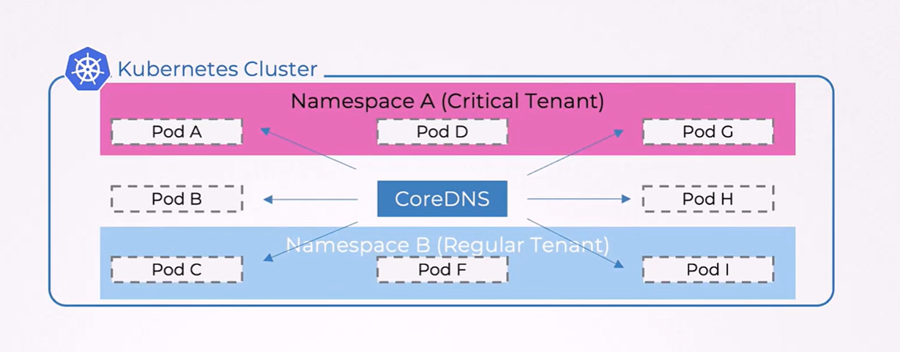
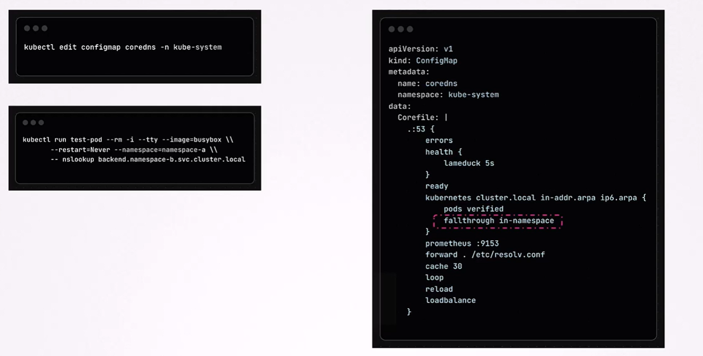

# 🚀 **DNS Isolation in Multi-Tenant K8s Clusters**

Multi-tenant Kubernetes clusters host workloads belonging to different customers, business units, or security tiers.
In such environments, **DNS isolation** becomes a critical security requirement to ensure that tenant A cannot discover or resolve tenant B’s internal service names.

Below is a structured breakdown of the entire lifecycle of this behavior.

---

## 🟦 **Default Kubernetes DNS Behavior (Before Isolation)**

By default, **CoreDNS provides cluster-wide DNS resolution**:

---

<div align="center" style="background-color:#F1F1F1; border-radius: 10px; border: 2px solid">

</div>

---

### ✔ Any Pod → can resolve → Any Service in the cluster

This includes:

- Services in **other namespaces**
- Pod IPs in **other namespaces**
- Headless services
- Newly added namespaces and services

Kubernetes does **not** enforce a DNS boundary between namespaces.

---

## 📝 **Example of Default Behavior**

Assume Namespace B has a service:

```ini
backend.namespace-b.svc.cluster.local
```

From a pod inside Namespace A, the following works **by default**:

```bash
nslookup backend.namespace-b.svc.cluster.local
```

❗ Result: **Successful resolution**, even though Namespace A should not access Namespace B.

---

## 🤔 **Why This Default Behavior Is a Problem in Multi-Tenant Clusters**

### ▪ **Information Leakage**

A tenant can enumerate:

- Internal service names of other tenants
- Pod names
- Application structure (e.g., db, redis, admin-api)

### ▪ **Reconnaissance Risk**

Even if NetworkPolicies block traffic, DNS still reveals:

- Which tenants exist
- Which services they run
- Potential attack surfaces

### ▪ **Compliance Violations**

Industries requiring strict isolation cannot allow name resolution across tenants.

### **In multi-tenant Kubernetes → default DNS = too open.**

---

## 🟦 **Visualizing the Default DNS Flow**

```ini
Kubernetes Cluster
 ├── Namespace A (Critical Tenant)
 │      Pods: A, D, G  → DNS queries → CoreDNS
 │
 ├── Namespace B (Regular Tenant)
 │      Pods: C, F, I  → DNS queries → CoreDNS
 │
 └── CoreDNS (shared DNS server)
```

Under default settings:

- A Pod from Namespace A **can request DNS records of Namespace B**
- CoreDNS **will answer** because it has global visibility

This is the behavior BEFORE isolation.

---

## 🎯 **Goal: Enforce DNS Isolation**

We want:

### ✔ Each namespace resolves ONLY its own:

- Services
- Pods
- Endpoints

### ✕ No cross-namespace DNS visibility

Meaning:

A pod in Namespace A **must NOT** resolve:

```ini
*.namespace-b.svc.cluster.local
```

This is true DNS isolation.

---

## ❓ **How CoreDNS Enables DNS Isolation**

CoreDNS provides two key directives that achieve isolation:

---

### 🔧 **1. `pods verified`**

Ensures CoreDNS only responds to DNS queries for pods **belonging to the same namespace as the requester**.

**Function:**

- Checks pod IP → checks requester's namespace → rejects if mismatch.

---

### 🔧 **2. `fallthrough in-namespace`**

Controls how DNS queries are passed through the plugin chain.

Meaning:

> “Only allow resolution to continue if the lookup is within the same namespace.  
> Reject everything else.”

---

## 🔧 **CoreDNS Configuration**

Below is the modified block from your screenshot:

```yaml
kubernetes cluster.local in-addr.arpa ip6.arpa {
pods verified
fallthrough in-namespace
}
```

<div align="center" style="background-color:#F1F1F1; border-radius: 10px; border: 2px solid">

</div>

---

### 🔍 What each part means:

| Directive                  | Purpose                                                       |
| -------------------------- | ------------------------------------------------------------- |
| `kubernetes cluster.local` | Enables Kubernetes service discovery                          |
| `pods verified`            | Ensures pod DNS answers only if pod belongs to same namespace |
| `fallthrough in-namespace` | DNS continues only if namespace matches requester             |
| `in-addr.arpa ip6.arpa`    | Reverse DNS (IPv4 & IPv6) for Pod IPs                         |

This enforces **strict namespace-level DNS boundaries**.

---

## ✍🏻 **Implementation Steps**

### **Step 1 — Open the CoreDNS ConfigMap**

```bash
kubectl edit configmap coredns -n kube-system
```

### **Step 2 — Modify the Kubernetes plugin block**

Add:

```yaml
pods verified
fallthrough in-namespace
```

```yaml
apiVersion: v1
kind: ConfigMap
metadata:
  name: coredns
  namespace: kube-system
data:
  Corefile: |
    Corefile: |
    :53 {
        errors
        health {
            lameduck 5s
        }
        ready
        kubernetes cluster.local in-addr.arpa ip6.arpa {
            pods verified
            fallthrough in-namespace
        }
        prometheus :9153
        forward . /etc/resolv.conf
        cache 30
        loop
        reload
        loadbalance
    }
```

### **Step 3 — Restart CoreDNS**

```bash
kubectl rollout restart deployment coredns -n kube-system
```

---

## 🧪 **Testing DNS Isolation (Post-Configuration)**

Test from Namespace A:

```bash
kubectl run test-pod --rm -i -t --image=busybox \
  --restart=Never --namespace=namespace-a \
  -- nslookup backend.namespace-b.svc.cluster.local
```

### 🔍 Expected BEFORE isolation:

```ini
Server:    10.96.0.10
Address:   10.96.0.10#53

Name: backend.namespace-b.svc.cluster.local
Address: 10.233.45.12
```

### 🔒 Expected AFTER isolation:

```ini
Server:    10.96.0.10
Address:   10.96.0.10#53

** server can't find backend.namespace-b.svc.cluster.local: NXDOMAIN
```

Meaning:

✔ Namespace A cannot discover Namespace B
✔ DNS isolation is successfully enforced

---

## 🔚 **Summary**

**By default, Kubernetes DNS is cluster-scoped**. Any pod can resolve any service in any namespace, causing information leakage in multi-tenant environments.

To enforce DNS isolation:

- Modify CoreDNS using:

  - `pods verified`
  - `fallthrough in-namespace`

This restricts DNS resolution so a pod can only resolve services **within its own namespace**.

Testing with `nslookup` confirms that cross-namespace DNS queries are rejected, ensuring clean, compliant, and secure multi-tenant DNS boundaries.
