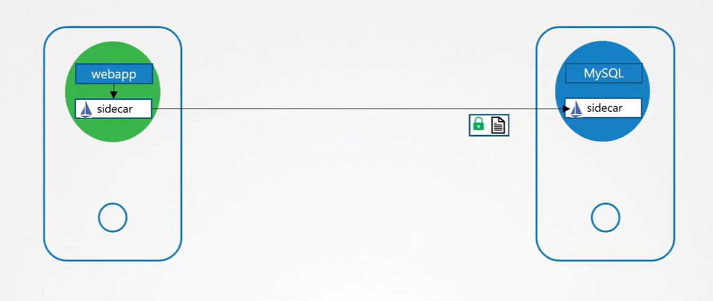

# 🔐 **Pod to Pod encryption**

We’ll cover:

- 1️⃣ What Pod-to-Pod Encryption Even Means
- 2️⃣ How Kubernetes Normally Sends Traffic
- 3️⃣ Why Normal Kubernetes Traffic Is _NOT_ Encrypted
- 4️⃣ How Istio Encrypts Pod-to-Pod Traffic (FULL DETAILS)
- 5️⃣ How Cilium Encrypts Pod-to-Pod Traffic (FULL DETAILS)
- 6️⃣ When to Use Which

Everything from scratch, with simple explanations first, then deep-dive.

---

## 📖 **What Does Pod-to-Pod Encryption Mean?**

Imagine two pods:

```ini
Pod A →→→→ Pod B
```

By default in Kubernetes:

- Their traffic travels **unencrypted**
- Anyone with access to the node’s network can sniff it (tcpdump)
- Bad actors or misconfigured nodes can see all data

**Pod-to-pod encryption** means:

> “Encrypt all network traffic between pods—even inside the cluster.”

This protects the cluster in case:

- A node is compromised
- A rogue pod is deployed
- Someone captures packets on the network

---

## 🕸️ **How Kubernetes Normally Sends Traffic (Without Encryption)**

When Pod A talks to Pod B:

1. Pod A sends traffic to the node’s virtual interface (veth)
2. The CNI plugin (Calico, Flannel, Cilium, etc.) routes it
3. Traffic goes plaintext over the node-to-node network
4. Delivered to Pod B

**No TLS, no certificates, no encryption.**

If you run:

```bash
tcpdump -i any
```

You will literally see the raw HTTP data.

---

## 🧨 **Why Kubernetes Traffic Is NOT Encrypted by Default**

Because K8s was designed assuming:

- Nodes are trusted
- Internal cluster network is private
- Workloads handle their own TLS

But in **multi-tenant clusters**, or real companies:

- Nodes are shared between teams
- Pods run untrusted workloads
- You want Zero-Trust Networking

Therefore:
K8s needs pod-to-pod encryption **at the platform level**, not at the app level.

---

## 1️⃣ **Istio — Pod-to-Pod Encryption**

Istio is a **service mesh**, not just encryption.



### ❓ What is a service mesh?

A system that sits between all services and controls:

- Security
- Traffic routing
- Observability
- Policies

Istio uses **sidecar proxies** (Envoy) injected into each pod.

Each pod becomes:

```ini
[APP Container] + [Envoy Sidecar Proxy]
```

### 📌 Key Concept: All traffic goes through Envoy

Envoy handles:

- TLS encryption
- Authentication
- Authorization
- Retries
- Load-balancing

The app **does NOT need to know TLS** at all.

---

### 🔐 **How Istio Enables Encryption (mTLS)**

Istio enables **mutual TLS (mTLS)** between pods.

Meaning:

- Pod A verifies Pod B identity
- Pod B verifies Pod A identity
- Traffic is encrypted end-to-end

### 🔬 Step-by-step internal flow

#### 🔹 1. Pod A (App → Envoy)

App sends a plain HTTP request to its sidecar:

```ini
HTTP → Envoy Proxy
```

#### 🔹 2. Envoy encrypts with mTLS

Envoy loads a certificate that:

- Istio generated automatically
- Rotates every 24 hours
- Is unique per workload

#### 🔹 3. Sends encrypted traffic to Envoy in Pod B

```ini
Envoy A → (mTLS Encrypted) → Envoy B
```

#### 🔹 4. Pod B (Envoy → App)

Envoy decrypts → forwards to the app as plaintext.

The workload **never handles TLS**.

---

### 🛠️ Istio Implementation (Practical)

#### 🔹 Step 1: Install Istio (with sidecar injection)

Using istioctl:

```bash
istioctl install --set profile=demo
```

Enable auto-injection for namespace:

```bash
kubectl label namespace default istio-injection=enabled
```

---

#### 🔹 Step 2: Create PeerAuthentication to enforce mTLS

```yaml
apiVersion: security.istio.io/v1beta1
kind: PeerAuthentication
metadata:
  name: default
  namespace: default
spec:
  mtls:
    mode: STRICT
```

This means:

- **All pods must use mTLS**
- Plaintext connections are rejected
- Everything is encrypted

---

#### 🔹 Step 3: Destination Rule to declare TLS usage

```yaml
apiVersion: networking.istio.io/v1alpha3
kind: DestinationRule
metadata:
  name: default
spec:
  host: "*.local"
  trafficPolicy:
    tls:
      mode: ISTIO_MUTUAL
```

👉 This tells Istio proxies to use mTLS.

---

### 🧠 Istio Summary (like you're 5 years old)

```ini
App → Envoy Proxy → Encrypted → Node Network → Envoy Proxy → App
```

You get:

- Encryption
- Authentication
- Authorization
- Observability
- Traffic policies
- Multi-tenant isolation

But with _sidecar overhead_.

---

## 🦈 **Cilium — Pod-to-Pod Encryption (From Zero → Deep Dive)**

Cilium is a **CNI plugin** using eBPF in the Linux kernel.

It provides:

- Networking
- Load-balancing
- Network policy
- Encryption

### ❓ How is Cilium different from Istio?

| Feature       | Istio        | Cilium          |
| ------------- | ------------ | --------------- |
| Purpose       | Service mesh | CNI plugin      |
| Layer         | L7 (proxy)   | L3 (kernel)     |
| Encryption    | mTLS         | WireGuard/IPsec |
| Uses sidecars | Yes          | No              |
| Performance   | Lower        | High            |

Cilium encrypts traffic **directly at node kernel level**, no proxies.

---

### 🔐 Cilium Encryption Methods

Cilium supports:

#### 1️⃣ **WireGuard** (Fastest, modern)

- Uses modern cryptography (Curve25519)
- Very fast (kernel-level)
- No user-space overhead
- Auto key rotation

#### 2️⃣ **IPsec (AES-GCM)** (Older, still secure)

- Uses IPsec tunnels
- eBPF accelerates IPsec

---

### 🕸️ How Cilium Encrypts Pod Traffic

#### Pod A → eBPF Encryption → WireGuard/IPsec → eBPF Decryption → Pod B

Let’s visualize:


Key differences from Istio:

- No sidecar
- No proxies
- No TLS certificates
- Encryption happens **before** traffic leaves the node

---

### 🛠️ Cilium Implementation Examples

#### ✔ Install Cilium with WireGuard enabled

```bash
helm install cilium cilium/cilium \
  --set encryption.enabled=true \
  --set encryption.type=wireguard
```

Cilium automatically:

- Creates a WireGuard interface (`cilium_wg`)
- Generates keys
- Distributes public keys to all nodes
- Encrypts all inter-node traffic

---

#### ✔ IPsec Example

```bash
helm install cilium cilium/cilium \
  --set encryption.enabled=true \
  --set encryption.type=ipsec
```

IPsec keys rotate automatically.

---

#### 📦 How to Test

Run tcpdump on worker nodes:

```bash
tcpdump -i any
```

You will see:

- Istio → encrypted TLS packets
- Cilium → WireGuard or IPsec ESP packets

Plaintext traffic becomes unreadable.

---

## 🎯 **When Should You Use Which?**

### ✔ Use **Istio** if you want:

- Zero-trust L7 authorization
- Service routing (canary, traffic split)
- Observability (metrics, tracing)
- Per-service identity
- Security with RBAC at L7 (URI, headers)

Istio is a **full service mesh**, not just encryption.

---

### ✔ Use **Cilium** if you want:

- Fast kernel-level encryption (WireGuard/IPsec)
- No sidecar overhead
- Best performance & lowest latency
- Simple “encrypt everything” solution
- Full eBPF-powered CNI networking

Cilium is a **high-performance networking stack**, not an application-level proxy.

---

## 🎁 Final Summary (Crystal-Clear)

```ini
ISTIO:
  - Uses Envoy sidecars
  - Provides mTLS (certificates)
  - Encrypts traffic at L7
  - Heavy but very powerful

CILIUM:
  - Uses eBPF + WireGuard/IPsec
  - Encrypts traffic at L3
  - No proxies
  - Fast / efficient / modern
```
