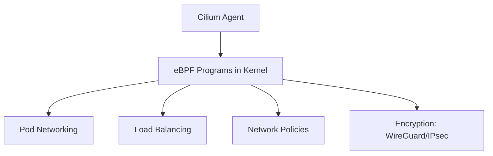
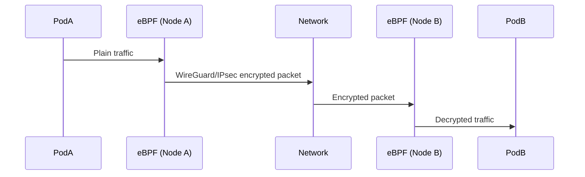

# 🦈 **Cilium Overview (Beginner → Expert)**

Cilium is a **CNI plugin** for Kubernetes.

That means:

> **Cilium is the component that connects pods to the cluster network.**

Every Kubernetes cluster needs a CNI:
Calico, Flannel, Weave, Azure CNI, Amazon VPC CNI, etc.

Cilium replaces these with a **high-performance, eBPF-based CNI**.

---

## 🚀 **Why Cilium?**

Because it's:

- ✔ Faster (kernel-level eBPF, no iptables)
- ✔ Safer (encryption, identity, network policies)
- ✔ Smarter (deep visibility, L7 awareness)

Cilium gives Kubernetes:

- Pod networking
- Load-balancing
- Network policies
- Pod-to-pod encryption
- API-level visibility (HTTP, gRPC)
- Service mesh (optional, without sidecars!)

---

## 🧠 **How Cilium Works — Simple Diagram**

```ini
Pod → virtual ethernet → Node → eBPF programs → Network
```

Instead of using iptables rules, Cilium replaces them with **eBPF**, a super-fast kernel technology.

---

## ✨ What is eBPF? (Super Simple)

eBPF = "tiny programs inside the Linux kernel".

They allow:

- super fast packet processing
- visibility without sidecars
- low overhead encryption
- custom logic per packet

Cilium uses eBPF to accelerate everything.

---

## 🧩 **Cilium Architecture (Simple Diagram)**



---

## 🔐 **Pod-to-Pod Encryption in Cilium (P2P Encryption)**

This is the main part of your question.

Cilium supports two ways to encrypt pod-to-pod traffic:

- 1️⃣ **WireGuard (Recommended — faster & modern)**
- 2️⃣ **IPsec (AES-GCM)**

You can pick either, but WireGuard is now the default.

---

## 🧠 **How Cilium Encrypts Traffic (Concept)**

Pod A wants to talk to Pod B:

### Normal Kubernetes (no encryption):

```ini
Pod A → NodeA → Network (PLAINTEXT) → NodeB → Pod B
```

### Cilium (with encryption):

```ini
Pod A → NodeA eBPF → (Encrypted WireGuard/IPsec) → NodeB eBPF → Pod B
```

- 🔒 The traffic leaving Node A is encrypted
- 🔓 Decrypted only when arriving at Node B
- 📦 Pod does not know encryption exists (transparent)

No code changes, no sidecars, no proxies.

---

## 🎯 **Why Cilium Encryption Is Amazing?**

| Feature            | Why it matters          |
| ------------------ | ----------------------- |
| No sidecars        | No resource overhead    |
| Kernel-level       | Very fast               |
| WireGuard          | State-of-the-art crypto |
| Easy configuration | Literally 1 line        |
| Works for all pods | Automatically encrypted |

---

## 🛠️ **Cilium Pod-to-Pod Encryption Implementation**

Now let’s do the hands-on part.

---

### ✔️ **Step 1: Install Cilium CLI**

```bash
curl -L --remote-name https://github.com/cilium/cilium-cli/releases/latest/download/cilium-linux-amd64.tar.gz
sudo tar xzvf cilium-linux-amd64.tar.gz -C /usr/local/bin
```

---

### ✔️ **Step 2: Install Cilium with WireGuard Enabled**

This is the recommended secure method:

#### Option A — Install with Helm

(used in real companies)

```bash
helm repo add cilium https://helm.cilium.io/

helm install cilium cilium/cilium \
  --namespace kube-system \
  --set encryption.enabled=true \
  --set encryption.type=wireguard
```

#### Option B — Using cilium-cli

(easiest for testing)

```bash
cilium install \
  --encryption wireguard
```

---

### 🧪 **What happens automatically?**

Cilium:

1. Creates a WireGuard interface on every node → `cilium_wg`
2. Generates private/public WireGuard keys
3. Exchanges public keys between nodes
4. Installs eBPF programs for encrypt/decrypt
5. Transparently encrypts ALL inter-node traffic

Nothing else required.

---

### ✔️ **Step 3: Verify Encryption**

Run:

```bash
cilium status
```

You should see:

```ini
Encryption: WireGuard enabled
```

And:

```bash
wg show
```

Shows WireGuard peers for each node.

---

### ✔️ **Step 4: Test Using tcpdump**

On any node:

```bash
tcpdump -i any
```

You’ll see **encrypted WireGuard packets**:

```ini
UDP / wireguard
encrypted
```

No plaintext HTTP.

---

### 🧪 **Optional: Switch to IPsec**

```bash
helm upgrade cilium cilium/cilium \
  --namespace kube-system \
  --set encryption.enabled=true \
  --set encryption.type=ipsec
```

This uses:

- AES-GCM
- XFRM kernel acceleration

Still fast, but WireGuard is better.

---

## 📌 **Where Does Encryption Actually Occur?**



---

## 🎉 **Summary**

## 🦈 What is Cilium?

A high-performance Kubernetes CNI using eBPF for:

- networking
- load balancing
- network security
- observability
- pod-to-pod encryption

### 🔐 How does Cilium encrypt traffic?

- Traffic from Pod A → encrypted **before leaving node**
- Traffic to Pod B → decrypted **when entering node**
- Pod is unaware (transparent)
- Uses **WireGuard** or **IPsec**

### 🛠️ How to enable?

```bash
cilium install --encryption wireguard
```

or

```bash
helm install cilium ... --set encryption.type=wireguard
```

### 💡 Benefits

- No sidecars
- No app changes
- Very fast (kernel level)
- Strong encryption
- Perfect for multi-tenant clusters

---

If you want, I can now explain:

- ✅ **Cilium vs Istio pod-to-pod encryption**
- ✅ **Cilium service mesh mode (without sidecars!)**
- ✅ **Cilium network policy examples**

Just tell me!
