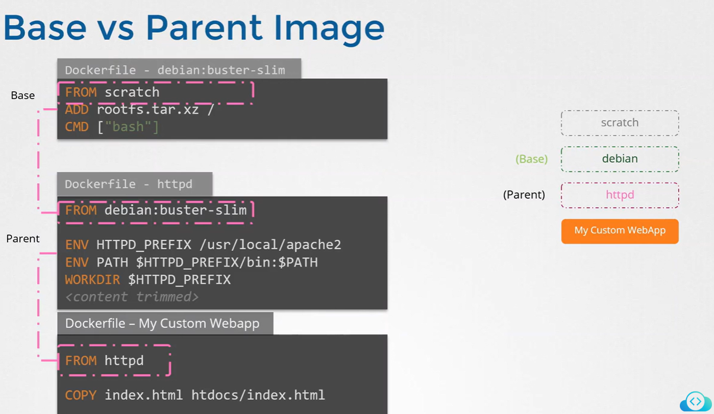
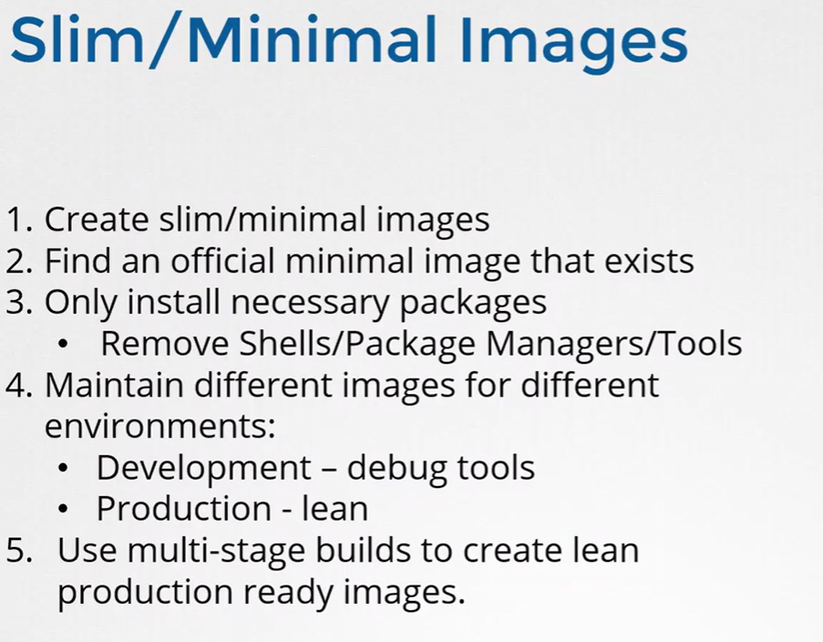
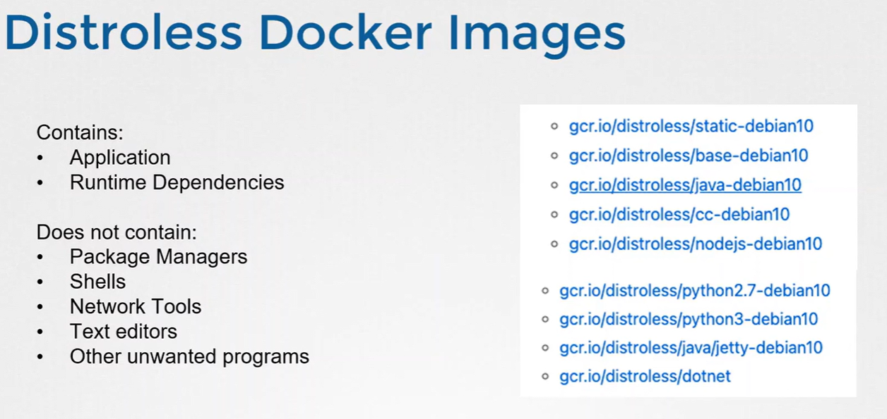
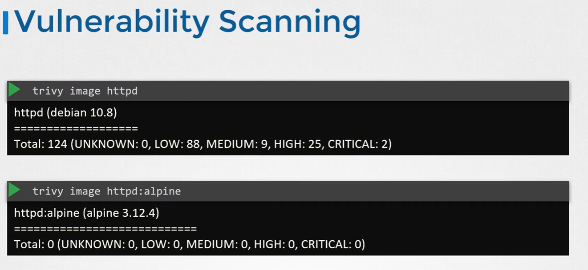

# 🦶 **Minimizing Base Image Footprint**

_(Explaining your diagrams)!_

Large base images mean:

- ❌ More vulnerabilities
- ❌ More packages you don’t use
- ❌ More attack surface

<div align="center" style="background-color:#F1F1F1; border-radius: 10px; border: 2px solid">

</div>

<div align="center" style="background-color:#F1F1F1; border-radius: 10px; border: 2px solid">

</div>

<div align="center" style="background-color:#F1F1F1; border-radius: 10px; border: 2px solid">

</div>

<div align="center" style="background-color:#F1F1F1; border-radius: 10px; border: 2px solid">

</div>

## ✔ Example: Same app, different base images

| Base Image         | Size   | Estimated CVEs |
| ------------------ | ------ | -------------- |
| ubuntu:latest      | 1200MB | ~300 CVEs      |
| python:3.10-slim   | 60MB   | ~25 CVEs       |
| python:3.10-alpine | 12MB   | ~3 CVEs        |

## Example

Bad:

```dockerfile
FROM ubuntu:latest
RUN apt install python3
```

Better:

```dockerfile
FROM python:3.10-slim
```

Best:

```dockerfile
FROM python:3.10-alpine
```

## Tools that help reduce footprint:

- **Trivy** → detect unused packages
- **Skopeo** → analyze container layers
- **Dive** → inspect container layers
- **Chainguard images** → minimal, hardened

---
