# 🔐 **Image Security in Kubernetes: Pulling Private Images Using `docker-registry` Secrets**

When your application Pods need to pull images from a **private container registry** (Docker Hub private repo, AWS ECR, Azure ACR, GCR, GitHub Container Registry, etc.), Kubernetes requires authentication.

This is achieved using a **Kubernetes Secret of type `kubernetes.io/docker-registry`** and referencing it via **`imagePullSecrets`**.

---

## ❓ **Why You Need an Image Pull Secret?**

_Kubernetes cannot pull private images without credentials._

If your registry is private, the image pull will fail:

```ini
Failed to pull image "myrepo/app:1.0": access denied
```

To fix this, Kubernetes must authenticate to the registry using:

- Username
- Password
- Registry URL
- (Optional) Email

These are stored securely in a **Secret**.

---

## 🔐 **1. Create a Secret of Type `docker-registry`**

### Command:

```bash
kubectl create secret docker-registry myregistrysecret \
  --docker-server=https://index.docker.io/v1/ \
  --docker-username=YOUR_USERNAME \
  --docker-password=YOUR_PASSWORD \
  --docker-email=YOUR_EMAIL
```

#### Explanation:

- `myregistrysecret` → the name your Pod will reference
- `--docker-server` → registry address
- Auth credentials are stored encoded inside `~/.docker/config.json` style

---

## 📦 **2. Create a Pod Using the Secret**

Below is a Deployment example:

```yaml
apiVersion: apps/v1
kind: Deployment
metadata:
  name: private-app
spec:
  replicas: 1
  selector:
    matchLabels:
      app: private-app
  template:
    metadata:
      labels:
        app: private-app
    spec:
      containers:
        - name: my-private-app
          image: myrepo/private-app:1.0
      imagePullSecrets:
        - name: myregistrysecret
```

### Key Field:

```yaml
imagePullSecrets:
  - name: myregistrysecret
```

This tells Kubernetes:
➡️ “Use this secret when pulling images for this Pod.”

---

## 🔁 **How Kubernetes Pulls a Private Image (Simple Diagram)**

```mermaid
---
config:
  theme: dark
  look: handDrawn
title: "Kubernetes Image Pull Flow"
---

flowchart TD
    A["🧠 Kubernetes"]
    B["🔐 imagePullSecrets<br>e.g., mysecret"]
    C["📦 Container Registry<br>e.g., Docker Hub"]
    D["🚀 Pod starts running"]

    A -->|1️⃣ Pod needs image| B
    B -->|2️⃣ Extracts registry credentials| C
    C -->|3️⃣ Authenticated pull| D
```



---

## 🏢 **3. Set Default Image Pull Secret for an Entire Namespace**

If every Pod in a namespace pulls from the same registry, you can avoid repeating `imagePullSecrets` in each Deployment.

### Create the secret as usual:

```bash
kubectl create secret docker-registry regcred \
  --docker-server=ghcr.io \
  --docker-username=myuser \
  --docker-password=mypassword
```

### Patch service account:

```bash
kubectl patch serviceaccount default \
  -p '{"imagePullSecrets": [{"name": "regcred"}]}'
```

Now all Pods using the `default` service account automatically use this secret.

---

## ✍🏻 **Example: Pulling Image from AWS ECR**

You can create a secret using an AWS token:

```bash
aws ecr get-login-password --region us-east-1 \
  | kubectl create secret docker-registry ecr-secret \
      --docker-server=<AWS_Account>.dkr.ecr.us-east-1.amazonaws.com \
      --docker-username=AWS \
      --docker-password-stdin
```

Then reference in Pod:

```yaml
imagePullSecrets:
  - name: ecr-secret
```

---

## ✍🏻 **Example: Pulling from Azure Container Registry (ACR)**

```bash
kubectl create secret docker-registry acr-secret \
  --docker-server=myregistry.azurecr.io \
  --docker-username=myregistry \
  --docker-password=$(az acr credential show -n myregistry --query "passwords[0].value" -o tsv)
```

Then use it:

```yaml
imagePullSecrets:
  - name: acr-secret
```

---

## 🔒 **Security Best Practices**

### ✔ 1. Never hardcode credentials in YAML

Always create secrets via CLI or sealed secrets.

### ✔ 2. Use least privilege

Use a registry-specific robot/token user.

### ✔ 3. Use namespace-level secret patches

Avoid repeating secrets in every manifest.

### ✔ 4. Rotate registry passwords regularly

### ✔ 5. Use cloud-native auth instead (preferred)

| Registry | Better Alternative                  |
| -------- | ----------------------------------- |
| AWS ECR  | IAM role for service account (IRSA) |
| GCR      | Workload Identity                   |
| ACR      | Managed Identity (AAD Pod Identity) |

These remove the need for Secrets entirely.

---

## 📌 **Summary**

- To pull images from _private_ registries, Kubernetes needs authentication.
- Create a **docker-registry secret** containing registry credentials.
- Reference it in Pods using **imagePullSecrets**.
- You can configure the **namespace default SA** to auto-use the secret.
- Works for Docker Hub, ECR, ACR, GCR, GHCR, Harbor, etc.
- Best practice: use **cloud-native authentication** when possible.

---

## 🚀 **Next Steps**

If you want, I can also provide:

- 📦 A full DevSecOps section: securing registries + image signing
- 🔐 Cosign + Notary v2 image signing with SBOM
- 🔍 A pipeline using Syft + Grype + KubeLinter
- 🛡️ How to avoid storing secrets with **SealedSecrets / External Secrets Operator**

Just tell me!
