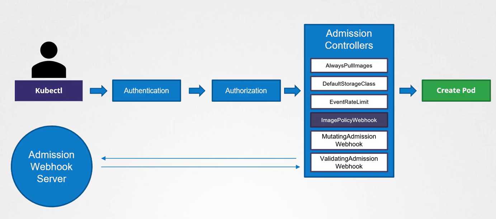
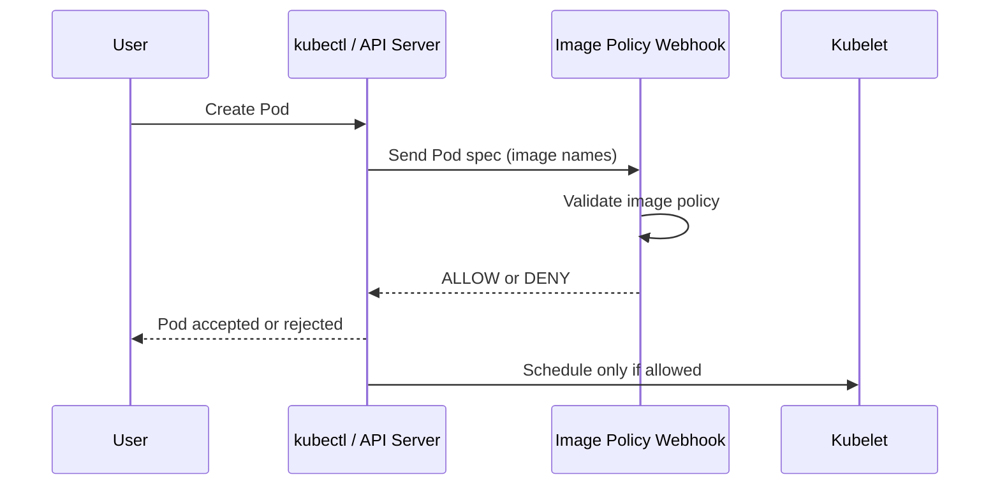

# 🔐 **Kubernetes Image Policy Webhook**

## **Secure What Images Are Allowed to Run in Your Cluster**

A **Kubernetes Image Policy Webhook** is an _admission controller_ that decides:

> **“Is this container image allowed to run?”**

It hooks into the **kube-apiserver** and validates image properties **before the Pod is created**.

---

<div align="center" style="background-color:#F1F1F1; border-radius: 10px; border: 2px solid">

</div>

---

## 🎯 **Why Use an Image Policy Webhook?**

Because Kubernetes by default allows **ANY image** from **ANY registry**, even:

- Untrusted registries
- Unsigned images
- Outdated images with CVEs
- Wrong tags like `latest`
- Images missing SBOM or attestation

The webhook lets you enforce rules like:

| Policy You Can Enforce        | Example                          |
| ----------------------------- | -------------------------------- |
| Allow only trusted registries | `mycorp.registry.io` only        |
| Disallow `latest` tag         | Must use `v1.2.3` etc            |
| Require signature             | Cosign-signed images             |
| Require SBOM                  | Image must have SBOM attestation |
| Block vulnerable images       | Reject image with CVSS > 7       |

---

## 🧠 **How Image Policy Webhook Works**

### **Admission Control Flow**



If the webhook returns **deny**, pod NEVER starts.

---

## 🏗️ **Webhook Components**

| Component                  | Purpose                                     |
| -------------------------- | ------------------------------------------- |
| **Webhook Server**         | Your custom policy logic (Go, Python, etc.) |
| **AdmissionConfiguration** | Tells kube-apiserver to use your webhook    |
| **ImageReview API**        | Request/response format                     |
| **Policy Logic**           | Defines allowed/blocked images              |

---

## 📦 **ImagePolicyWebhook API Request/Response**

### Request sent by API server:

```json
{
  "apiVersion": "imagepolicy.k8s.io/v1alpha1",
  "kind": "ImageReview",
  "spec": {
    "containers": [{ "image": "nginx:latest" }],
    "namespace": "default"
  }
}
```

### Webhook Response:

```json
{
  "apiVersion": "imagepolicy.k8s.io/v1alpha1",
  "kind": "ImageReview",
  "status": {
    "allowed": false,
    "reason": "latest tag is not allowed"
  }
}
```

If `allowed=false`, the Pod creation is rejected.

---

## 🧪 **Hands-On: Implement Image Policy Webhook (Step-by-Step)**

We will create a webhook that:

- 👉 **Blocks images using `latest` tag**
- 👉 **Blocks images not from our internal registry**

---

### 🥇 **Step 1 — Write a Simple Webhook Server**

We’ll write a small server in Python (Flask) to validate images.

📁 **webhook.py**

```python
from flask import Flask, request, jsonify

app = Flask(__name__)

ALLOWED_REGISTRY = "mycorp.registry.io"

@app.route("/imagepolicy", methods=["POST"])
def imagepolicy():
    req = request.get_json()
    images = [c["image"] for c in req["spec"]["containers"]]

    allowed = True
    reason = ""

    for image in images:
        # Block latest tag
        if image.endswith(":latest"):
            allowed = False
            reason = "latest tag is not allowed"

        # Allow only our registry
        if not image.startswith(ALLOWED_REGISTRY):
            allowed = False
            reason = "image must come from mycorp.registry.io"

    return jsonify({
        "apiVersion": "imagepolicy.k8s.io/v1alpha1",
        "kind": "ImageReview",
        "status": {
            "allowed": allowed,
            "reason": reason
        }
    })

if __name__ == "__main__":
    app.run(host="0.0.0.0", port=8443, ssl_context=("tls.crt", "tls.key"))
```

This validates registry + tag.

---

### 🥇 **Step 2 — Deploy Webhook Server as a Kubernetes Service**

Create Deployment:

```yaml
apiVersion: apps/v1
kind: Deployment
metadata:
  name: image-policy-webhook
spec:
  replicas: 1
  selector:
    matchLabels:
      app: image-policy-webhook
  template:
    metadata:
      labels:
        app: image-policy-webhook
    spec:
      containers:
        - name: webhook
          image: mycorp.registry.io/webhook:1.0
          ports:
            - containerPort: 8443
```

Create Service:

```yaml
apiVersion: v1
kind: Service
metadata:
  name: image-policy-webhook
spec:
  selector:
    app: image-policy-webhook
  ports:
    - port: 443
      targetPort: 8443
```

---

### 🥇 **Step 3 — Create Admission Controller Configuration**

Edit `/etc/kubernetes/apiserver` or kubeadm config.

📁 **admission_configuration.yaml**

```yaml
apiVersion: apiserver.config.k8s.io/v1
kind: AdmissionConfiguration
plugins:
- name: ImagePolicyWebhook
  configuration:
    imagePolicy:
      kubeConfigFile: /etc/kubernetes/pki/admission_kube_config.yaml
      allowTTL: 50
      denyTTL: 50
      retryBackoff: 500
      defaultAllow: false
# your other plugins
```

---

### 🥇 **Step 4 — Configure Webhook Authentication**

📁 **admission_kube_config.yaml**

```yaml
apiVersion: v1
kind: Config
clusters:
  - name: image-policy
    cluster:
      server: https://image-policy-webhook.default.svc:443
      insecure-skip-tls-verify: true
users:
  - name: image-policy
contexts:
  - context:
      cluster: image-policy
      user: image-policy
    name: image-policy
current-context: image-policy
```

---

### 🥇 **Step 5 — Enable the Admission Controller**

Edit kube-apiserver config:

```ini
--enable-admission-plugins=...,ImagePolicyWebhook
--admission-control-config-file=/etc/kubernetes/admission_configuration.yaml
```

Restart APIServer.

---

### 🧪 **Step 6 — TEST IT**

❌ Test forbidden image:

```yaml
apiVersion: v1
kind: Pod
metadata:
  name: test-bad
spec:
  containers:
    - name: test
      image: nginx:latest
```

Apply:

```ini
kubectl apply -f test.yaml
```

**Result:**

```ini
Error: the image "nginx:latest" is blocked: latest tag is not allowed
```

---

✔ Test allowed image:

```yaml
apiVersion: v1
kind: Pod
metadata:
  name: test-good
spec:
  containers:
    - name: test
      image: mycorp.registry.io/app:1.2.3
```

Result:

```ini
pod/test-good created
```

🎉 SUCCESS — webhook is working!

---

## 🛡️ **Real Enterprise Policies You Can Enforce**

### 1. Allow only signed images (Cosign)

- reject images missing signature
- extract signature from OCI registry

### 2. Allow only images with SBOM

- require CycloneDX or SPDX SBOM attestation

### 3. Block known CVE images

- integrate Grype in webhook
- reject CVSS > 7.0

### 4. Prevent drift

- enforce digests instead of tags
  (`nginx@sha256:abc...`)

### 5. Allow only internal registries

- block DockerHub & public images

### 6. Prevent “latest” tag

- enforce semantic version tags

---

## 🏆 **Comparison: Image Policy Webhook vs Other Security Tools**

| Feature                                    | ImagePolicyWebhook | Kyverno      | OPA Gatekeeper |
| ------------------------------------------ | ------------------ | ------------ | -------------- |
| Built-in in APIserver                      | ✅ Yes             | ❌ No        | ❌ No          |
| Validates IMAGE before POD starts          | ⭐ Best            | Moderate     | Moderate       |
| Prevents pulling from untrusted registries | ⭐ Excellent       | Good         | Good           |
| Signature/SBOM enforcement                 | Manual             | Easy         | Easy           |
| Easy to write?                             | ❌ Hard (code)     | ⭐ Very easy | Medium         |

**Enterprise clusters usually use Kyverno/Gatekeeper instead**, unless they need the strict built-in webhook flow.

---

## 🎓 **Final Summary (Easy to Memorize)**

### **Image Policy Webhook = “Gatekeeper for Container Images”**

- ✔ Enforces what images are allowed
- ✔ Runs before Pod creation
- ✔ Checks registry, tag, signature, SBOM, CVEs
- ✔ Returns allowed/denied
- ✔ Implemented as a webhook server
- ✔ Activated via Admission Controller
- ✔ Ideal for strict enterprises
