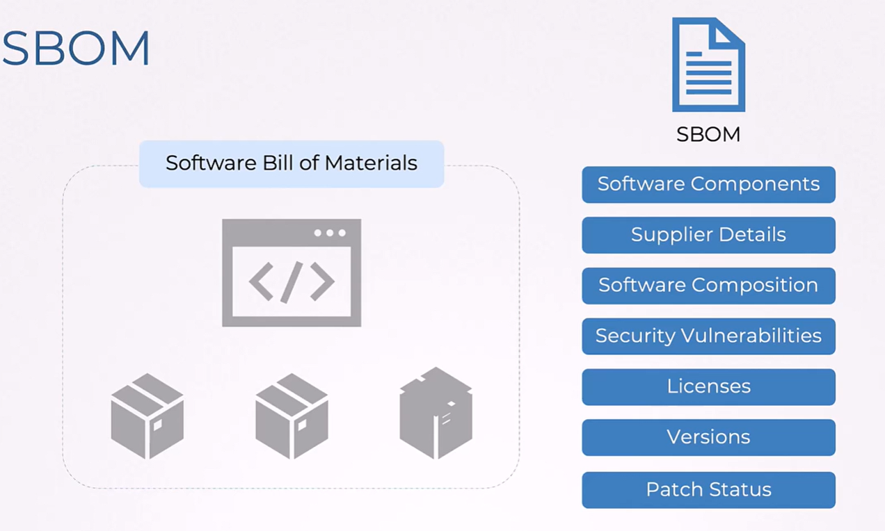
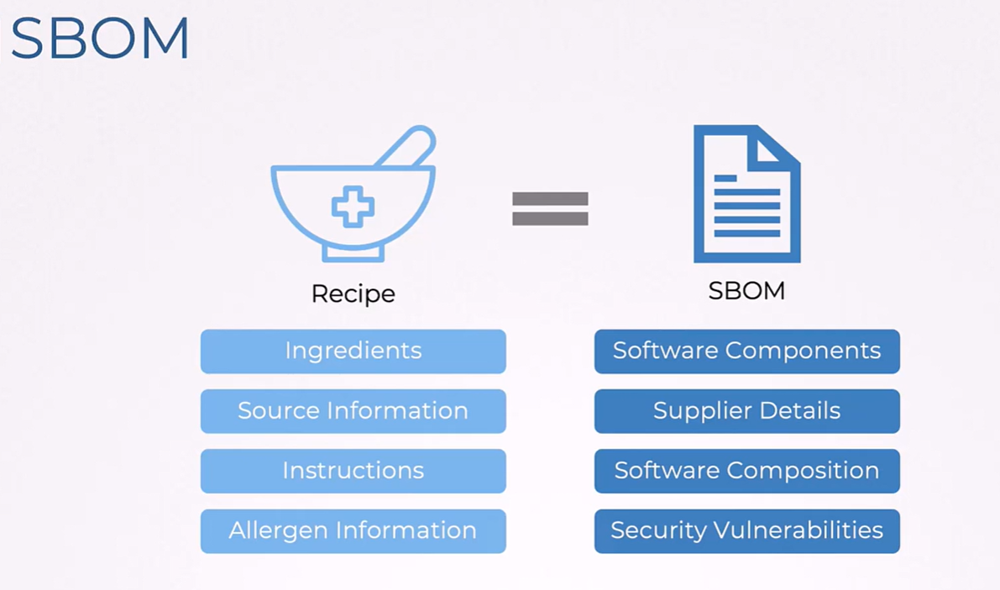
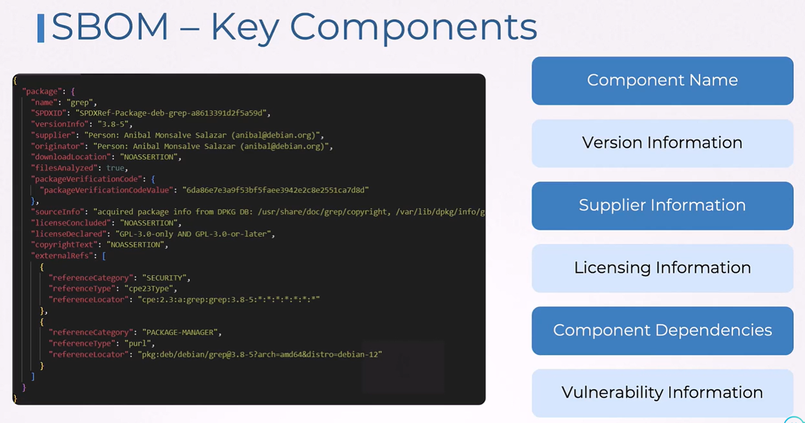
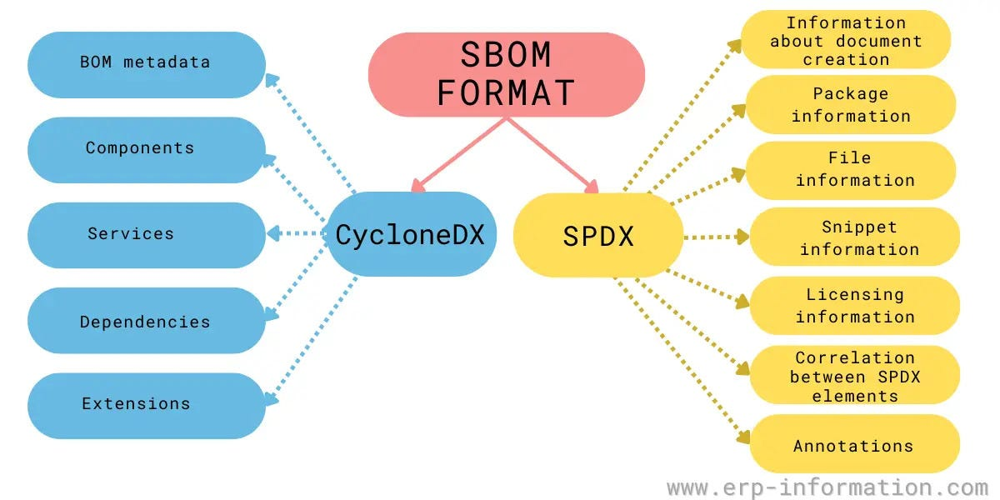
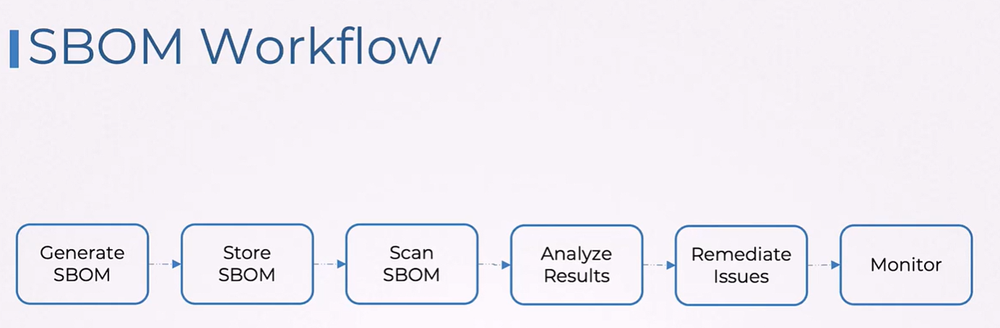
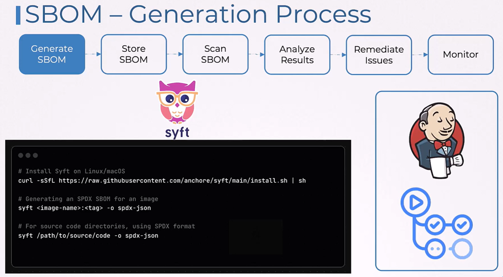
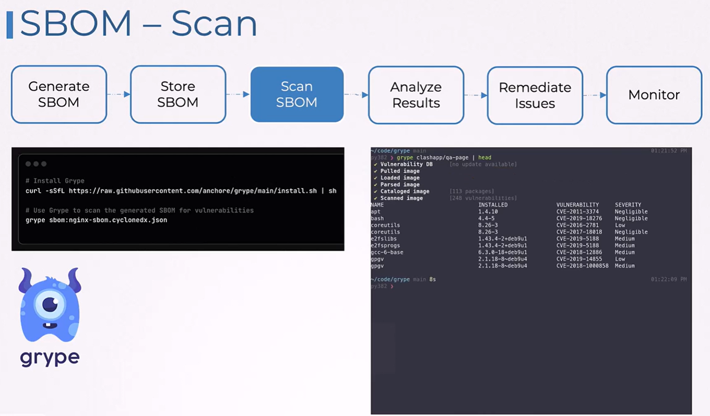
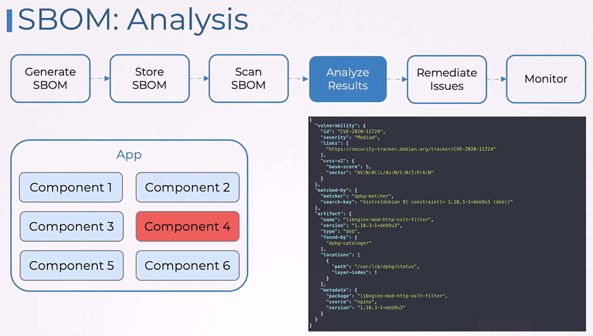
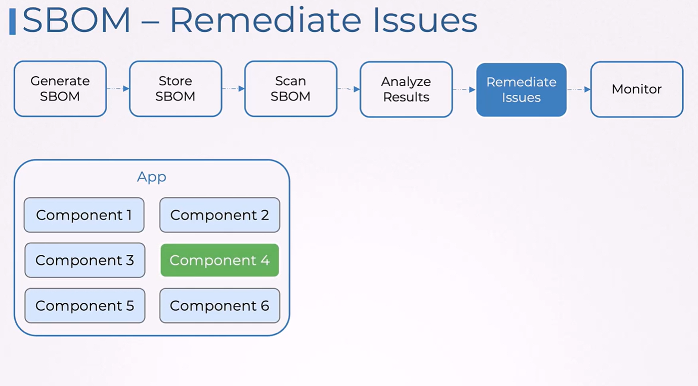

# 📃 Software Bill of Materials (SBOM)

A **Software Bill of Materials (SBOM)** is:

> **A complete list of all software components and dependencies that make up an application.**
> Including → libraries, OS packages, frameworks, licenses, versions, and metadata.

It acts like a **"nutritional label"** but for software.

---

<div align="center" style="background-color:#F1F1F1; border-radius: 10px; border: 2px solid">

</div>

---

<div align="center" style="background-color:#F1F1F1; border-radius: 10px; border: 2px solid">

</div>

---

## 📖 **What Is an SBOM?**

An SBOM contains **metadata** describing:

- Application information
- Package names
- Versions
- Dependencies
- Relationships
- Licenses
- Hashes (integrity)
- Supplier information

Example (VERY simple example):

```json
{
  "name": "payment-service",
  "version": "1.3.0",
  "components": [
    { "name": "openssl", "version": "1.1.1g", "license": "Apache-2.0" },
    { "name": "flask", "version": "1.1.2", "license": "BSD-3-Clause" }
  ]
}
```

Real SBOMs often contain **hundreds of components**.

---

## ❓ **Why is an SBOM Important?**

Modern software is **70–90% third-party dependencies** (Open Source, vendor libraries).
This introduces:

- Unknown vulnerabilities
- Hidden outdated packages
- License violations
- Dormant malware or supply-chain attacks

SBOMs solve this by providing transparency.

## ✅ **Benefits**

### ✔ **1. Quick Vulnerability Detection**

- If a CVE appears (example: `Log4Shell`), you immediately know which apps include it.

### ✔ **2. Dependency Governance**

- Understand exactly _what_ and _why_ is inside your software.

### ✔ **3. License Compliance**

- Detect GPL, LGPL, Apache, MIT, proprietary licenses.

### ✔ **4. Stronger Supply Chain Security**

- Required by:

  - US Executive Order 14028
  - NIST
  - DHS
  - Many federal & enterprise customers

---

## 🧩 **SBOM Components**

<div align="center" style="background-color:#F1F1F1; border-radius: 10px; border: 2px solid">

</div>

---

### ✔ Component name

- `openssl`, `log4j-core`, `libc6`

### ✔ Component type

- Library
- Container layer
- Application
- Kernel package

### ✔ Version

- Critical for identifying CVEs.

### ✔ Hashes (SHA-256 / SHA-512)

- You can verify no tampering occurred.

### ✔ Supplier / Owner

- Who created it?

  - Apache Foundation
  - RedHat
  - Docker

### ✔ Relationships

- Dependency graph:

  ```ini
  payment-service → flask → werkzeug → markupsafe
  ```

### ✔ License

- Know if you’re illegally using GPL software.

---

## 🧾 **SBOM Formats**

There are **two industry-standard formats**.

---

### 📄 1. **SPDX (Linux Foundation)**

- Origin: **Linux Foundation**
- Very detailed, heavy specification
- Used by:

  - Linux distributions
  - ISO standardization
  - Enterprises requiring legal/OS compliance

Example SPDX snippet:

```text
PackageName: flask
PackageVersion: 1.1.2
PackageSupplier: Python Software Foundation
PackageLicenseDeclared: BSD-3-Clause
```

---

### 🌀 2. **CycloneDX (OWASP)**

- Origin: **OWASP**
- Lightweight, fast
- Designed for security → CVE detection pipelines
- Used by:

  - GitHub
  - GitLab
  - Dependency-Track
  - Anchore Grype

Example CycloneDX JSON:

```json
{
  "bomFormat": "CycloneDX",
  "components": [{ "name": "flask", "version": "1.1.2", "type": "library" }]
}
```

---

### ⚔️ **SPDX vs CycloneDX**



---

| Feature        | SPDX                   | CycloneDX                        |
| -------------- | ---------------------- | -------------------------------- |
| **Origin**     | Linux Foundation       | OWASP                            |
| **Use Case**   | License compliance     | Security (CVE tracking)          |
| **Format**     | Tag/value              | JSON/XML/Protobuf                |
| **Complexity** | Heavy                  | Lightweight                      |
| **Tooling**    | Package-level tracking | App + container + infrastructure |

**For DevSecOps pipelines → CycloneDX is the most popular.**

---

## 🔨 **SBOM Tools**

**You can generate an SBOM (Software Bill of Materials) in three main ways: from source code, from binaries or from containers each method fits different stages of the software lifecycle and security needs.**

---

### 🔹 1. **From Source Code**

This method analyzes your codebase and dependencies directly.

🔧 Tools:

- **Syft** (`syft dir:.`)
- **CycloneDX CLI** (`cyclonedx-bom -o sbom.xml`)
- **FOSSA**, **Snyk**, **OWASP Dependency-Check**

✅ Pros:

- High visibility into declared dependencies
- Easy to integrate into CI/CD pipelines

⚠️ Cons:

- May miss runtime or transitive dependencies
- Language-specific (e.g., npm, pip, go.mod)

---

### 🔹 2. **From Binaries**

This scans compiled artifacts (e.g., `.exe`, `.jar`, `.so`) to infer components.

🔧 Tools:

- **Syft** (`syft file:myapp`)
- **Binary Analysis tools** like **Black Duck**, **Revenera**

✅ Pros:

- Works even without source code
- Useful for third-party or legacy software

⚠️ Cons:

- Lower accuracy
- Harder to trace back to original source

---

### 🔹 3. **From Container Images**

This inspects container layers to extract installed packages and libraries.

🔧 Tools:

- **Syft** (`syft docker:myimage`)
- **Trivy** (`trivy image --format cyclonedx`)
- **Anchore**, **Grype**

✅ Pros:

- Captures OS packages and runtime deps
- Ideal for production-ready artifacts

⚠️ Cons:

- May include unnecessary layers
- Doesn’t show build-time dependencies

---

## ♾️ **SBOM Workflows**

A secure SBOM pipeline has **6 steps**:

---

<div align="center" style="background-color:#F1F1F1; border-radius: 10px; border: 2px solid">

</div>

---

### 1️⃣ Generate SBOMs

<div align="center" style="background-color:#F1F1F1; border-radius: 10px; border: 2px solid">

</div>

---

Generate SBOMs during build time.

Tools:

- ✔ Trivy

  ```bash
  trivy sbom --format cyclonedx --output sbom.json .
  ```

- ✔ Syft

  ```bash
  syft . -o cyclonedx-json > sbom.json
  ```

- ✔ Docker built-in (Docker SBOM)

  ```bash
  docker sbom myapp:latest
  ```

---

### 2️⃣ Store SBOMs

<div align="center" style="background-color:#F1F1F1; border-radius: 10px; border: 2px solid">

</div>

---

SBOMs must be **stored securely**.

Options:

- OCI registry (Harbor, ECR, GCR, ACR)
- Dependency-Track
- GitHub Artifacts
- S3 bucket
- Databases

Example:  
Store SBOM as OCI artifact:

```bash
oras push registry/repo/myapp-sbom:1.0 sbom.json
```

---

### 3️⃣ Scan SBOMs

<div align="center" style="background-color:#F1F1F1; border-radius: 10px; border: 2px solid">

</div>

---

Tools read SBOMs and find vulnerabilities:

- **Grype**
- **Dependency-Track**
- **OpenVEX**
- **Trivy**

Example:

```bash
grype sbom:sbom.json
```

Output (example):

```ini
CVE-2022-1234  flask 1.1.2 → upgrade to 2.3.0
```

---

### 4️⃣ Analyze SBOMs

<div align="center" style="background-color:#F1F1F1; border-radius: 10px; border: 2px solid">

</div>

---

Analysis includes:

- ✔ CVE trends

  - Which dependencies are most problematic?

- ✔ License risks

  - GPL code? MIT? Apache?

- ✔ Version risk

  - Outdated packages?

- ✔ Dependency graph

  - Which app includes what?

  - Example graph:

    ```ini
    payment-service
    ├── flask 1.1.2 (CVE-2022-1234)
    └── openssl 1.1.1g (CVE-2021-3712)
    ```

---

### 5️⃣ Remediate SBOM Findings

<div align="center" style="background-color:#F1F1F1; border-radius: 10px; border: 2px solid">

</div>

---

Typical actions:

- ✔ Upgrade vulnerable package

  - `flask → 2.0.3`

- ✔ Switch base image

  - `ubuntu → alpine`

- ✔ Remove unused libraries

  - Detected by `syft` or `trivy`

- ✔ Add security patches

  - (especially for OS-level packages)

---

### 6️⃣ Monitor SBOMs

Once stored, keep monitoring:

- If new vulnerability shows up
- If a package becomes unmaintained
- If a license changes
- If a dependency version is deprecated

Tools:

- OWASP Dependency Track
- Anchore Enterprise
- Snyk Monitor
- GitHub Dependabot

Example:
Dependency Track continuously alerts:

```ini
New CVE found affecting component "openssl 1.1.1g"
Affected projects: payment-service, identity-service
```

---

## ✍🏻 **Practical End-to-End SBOM Example**

Let’s generate → store → scan → analyze an SBOM for a Node.js app.

### 🔹 **1. Generate SBOM**

```bash
syft node-app/ -o cyclonedx-json > sbom.json
```

### 🔹 **2. Scan for vulnerabilities**

```bash
grype sbom:sbom.json
```

Output (example):

```ini
CVE-2022-3517 lodash 4.17.19 — critical
```

### 🔹 **3. Fix dependency in `package.json`**

```json
"lodash": "^4.17.21"
```

### 🔹 **4. Regenerate SBOM**

```bash
syft node-app -o cyclonedx-json > sbom.json
```

### 🔹 **5. Upload SBOM to OCI registry**

```bash
oras push registry/apps/node-app-sbom:v2 sbom.json
```

### 🔹 **6. Continuous Monitoring**

Upload `sbom.json` to **Dependency Track** for continuous scanning.

---

## 🏁 **Summary**

| Topic                | Summary                                                       |
| -------------------- | ------------------------------------------------------------- |
| **SBOM**             | Full inventory of all software components                     |
| **Importance**       | Detect vulnerabilities, enforce licenses, secure supply chain |
| **Formats**          | SPDX (legal), CycloneDX (security)                            |
| **Generation Tools** | Syft, Trivy, Docker SBOM                                      |
| **Scanning Tools**   | Grype, Dependency-Track                                       |
| **Workflow**         | Generate → Store → Scan → Analyze → Remediate → Monitor       |
| **Value**            | Faster CVE response, transparency, compliance                 |

---

## ✅ If you want next:

I can also explain any of these topics in your preferred style:

- ✔ **SBOM in Kubernetes**
- ✔ **SBOM + SLSA + Sigstore (Cosign)**
- ✔ **How to sign SBOMs with Cosign**
- ✔ **How SBOMs integrate into CI/CD (GitHub, GitLab, Azure, Jenkins)**
- ✔ **SBOMs for containers vs applications vs dependencies**

Just tell me!
