# 🛡️ **Grype – Vulnerability Scanner for Container Images & SBOMs**

**Grype** is an **open-source vulnerability scanner** created by **Anchore**.
It scans:

- **Container images**
- **Filesystem directories**
- **SBOM files**
- **Repositories (OCI registries)**

…to detect **known vulnerabilities (CVEs)** using a continuously updated vulnerability database.

Think of **Syft** + **Grype** as:

- **Syft** → “What is inside the image?” (inventory of packages)
- **Grype** → “Are those packages vulnerable?” (security scan)

---

## ⭐ Why Grype Is Important

Modern DevOps pipelines require:

- ✔ Secure container images
- ✔ Automated vulnerability scanning
- ✔ Early detection during CI/CD
- ✔ Compliance (NIST, SOC2, PCI, etc.)

Grype gives fast, accurate scans that work **locally**, **in CI**, or as part of your **Kubernetes security pipeline**.

---

## 📦 What Grype Scans

Grype can scan **any of the following**:

| Type                           | Example                             |
| ------------------------------ | ----------------------------------- |
| **Container Images**           | `grype nginx:latest`                |
| **Local Docker Images**        | `grype docker:nginx:latest`         |
| **SBOM files**                 | `grype sbom:./sbom.json`            |
| **File systems / directories** | `grype /app`                        |
| **OCI registries**             | `grype registry:myrepo/myimage:1.0` |

---

## 🔍 How Grype Finds Vulnerabilities

Grype uses these vulnerability sources:

- **Anchore Feed Service (default)**
- **NVD (National Vulnerability Database)**
- **Github Security Advisories**
- **Distro databases** (Alpine, Debian, Ubuntu, RHEL)
- **Language ecosystems**:

  - Python (PyPI)
  - Node.js (npm)
  - Java (Maven)
  - Go modules
  - Ruby gems
  - Rust crates

Grype automatically updates its vulnerability database **every day**.

---

## 🧪 **Grype Flow (Simple Diagram)**

```mermaid
---
config:
  theme: dark
  look: handDrawn
title: "SBOM-Based Vulnerability Scanning"
---

flowchart TD
    A["📦 Image or SBOM"]
    B["🧾 Syft SBOM<br><i>(optional — Grype can generate internally)</i>"]
    C["🧠 Grype<br>Vulnerability Database"]
    D["📊 Vulnerability Report"]

    A -->|Inventory of Packages| B
    B -->|Match packages to CVEs| C
    C --> D
```



---

## 🚀 **Installation**

### macOS (Homebrew)

```bash
brew install grype
```

### Linux (script)

```bash
curl -sSfL https://raw.githubusercontent.com/anchore/grype/main/install.sh \
  | sudo sh
```

### Windows

```bash
choco install grype
```

---

## 🧨 Basic Usage (Very Easy)

### 1️⃣ Scan a Docker Image

```bash
grype nginx:latest
```

### 2️⃣ Scan a local SBOM generated by Syft

```bash
syft myapp:1.0 -o json > sbom.json
grype sbom:sbom.json
```

### 3️⃣ Scan a local directory

```bash
grype .
```

### 4️⃣ Scan an image stored in a registry

```bash
grype registry:myrepo/myimage:latest
```

---

## 🏷️ What a Grype Output Looks Like

Example:

```ini
NAME          INSTALLED  FIXED-IN   TYPE       VULNERABILITY
openssl       1.1.1n     1.1.1t     apk        CVE-2023-0286
busybox       1.31.1     1.33.0     binary     CVE-2021-42377
libxml2       2.9.10     2.9.12     rpm        CVE-2022-23308
```

Each row shows:

- Package name
- Installed version
- Vulnerable version
- Package type
- CVE ID
- Severity (low/medium/high/critical)

---

## ⚙️ Output Formats

You can export in many formats:

```bash
grype nginx:latest -o table
grype nginx:latest -o json
grype nginx:latest -o cyclonedx-json
grype nginx:latest -o sarif
```

SARIF is supported by GitHub Security Center.

---

## 🤝 **Using Syft + Grype Together (Best Practice)**

### Step 1 — Generate SBOM with Syft

```bash
syft myimage:latest -o json > sbom.json
```

### Step 2 — Scan with Grype

```bash
grype sbom:sbom.json -o table
```

This is the best practice because:

- SBOM remains immutable
- Same SBOM can be scanned many times
- Compliance requires generated SBOMs for each build

---

## 🧩 Integration with CI/CD

You can integrate Grype into:

- **GitHub Actions**
- **GitLab CI**
- **Azure DevOps**
- **Jenkins**
- **Harness**
- **CircleCI**

Example GitHub Action:

```yaml
steps:
  - uses: anchore/grype-action@v1
    with:
      image: myapp:latest
      fail-on: critical
```

This pipeline fails if critical vulnerabilities exist.

---

## 🔐 Policy Enforcement (Fail Build if Vulns Found)

Example:

```bash
grype nginx:latest --fail-on high
```

Supported levels:

`negligible | low | medium | high | critical`

---

## 🧊 Example Use Cases

### ✔ DevSecOps Pipeline Enforcement

Break CI builds on high vulnerabilities.

### ✔ Kubernetes Image Admission

Scan before deploying to cluster.

### ✔ Security Compliance Reports

Generate daily/weekly vulnerability reports.

### ✔ Supply Chain Protection

Use SBOM → Compare → Scan → Enforce.

---

## 🆚 **Grype vs. Trivy (Quick Comparison)**

| Feature             | Grype            | Trivy       |
| ------------------- | ---------------- | ----------- |
| SBOM-first workflow | ⭐ Strong        | Good        |
| Accuracy            | ⭐ High          | High        |
| Speed               | Medium           | Fast        |
| Scan Filesystem     | Yes              | Yes         |
| Scan Git Repos      | No               | Yes         |
| Policy engine       | Basic            | Advanced    |
| Ecosystem scanning  | Strong with Syft | Very strong |

---

## 🎯 Summary (Easy to Remember)

- **Grype = Vulnerability Scanner**
- **Syft = SBOM Generator**
- Grype scans:

  - Images
  - SBOMs
  - Filesystems
  - Registries

- Supports many output formats
- Perfect for DevSecOps pipelines
- Uses well-known vulnerability databases
- Fast, accurate, open-source

---

If you'd like, I can also give you:

✅ Full Diagram-based Explanation
✅ Grype vs Syft Cheat Sheet
✅ Step-by-step practical labs (Docker + CI/CD)
✅ How to integrate Grype into Azure DevOps or GitHub Actions

Just tell me!
