# 🎨 **Trivy**

_A simple yet powerful vulnerability scanner for containers, IaC, SBOMs, filesystems, Git repos, Kubernetes, and cloud._

---

## 📖 **What Is Trivy?**

**Trivy** (by Aqua Security) is an **all-in-one security scanner** used to scan:

| Scan Target                          | Purpose                                       |
| ------------------------------------ | --------------------------------------------- |
| **Container Images**                 | Detect CVEs in OS packages & app dependencies |
| **File System**                      | Scan local projects                           |
| **Git Repos**                        | Pre-commit security scanning                  |
| **SBOMs**                            | Analyze existing SBOM files                   |
| **Kubernetes Clusters**              | Audit running workloads                       |
| **IaC (Terraform, Kubernetes YAML)** | Detect misconfigurations                      |
| **AWS, GCP, Azure**                  | Cloud security posture management             |

🎯 **You can think of Trivy as:**

> “The Swiss Army Knife of DevSecOps scanning.”

---

<div align="center" style="background-color:#F1F1F1; border-radius: 10px; border: 2px solid">

</div>

---

<div align="center" style="background-color:#F1F1F1; border-radius: 10px; border: 2px solid">

</div>

---

<div align="center" style="background-color:#F1F1F1; border-radius: 10px; border: 2px solid">

</div>

---

## 🧠 **Why DevOps Engineers Use Trivy**

- ✔ Lightning fast
- ✔ Low setup (no DB install — auto updates)
- ✔ Scans OS + dependencies (npm, pip, go, jars, Rust, etc.)
- ✔ Integrated with GitHub Actions / GitLab / Azure DevOps
- ✔ Produces **SBOMs** (CycloneDX / SPDX)
- ✔ Free & open-source

---

## 🔥 **Trivy Architecture (Simple View)**

```mermaid
---
config:
  theme: dark
  look: handDrawn
title: "Trivy CLI Vulnerability Scan"
---

flowchart TD
    A["🐳 Trivy CLI / Docker"]
    B["📥 Fetch Vulnerability DB"]
    C["🔍 Scan Artifact<br>(Image / Filesystem / IaC)"]
    D["📊 Output CVEs<br>+ Severity + Fix"]

    A --> B
    B --> C
    C --> D
```

<div align="center" style="background-color: #161414ff; border-radius: 10px; border: 2px solid">



</div>

---

## 🛠️ **Install Trivy**

### Linux / Mac:

```bash
brew install aquasecurity/trivy/trivy
```

### Docker:

```bash
docker run --rm aquasecurity/trivy:latest --help
```

---

## 🚢 **Scan a Docker Image (Most Common Use Case)**

### Example: scanning nginx

```bash
trivy image nginx:latest
```

Output (simplified):

```ini
CVE-2023-0464  HIGH      openssl 1.1.1f
CVE-2021-23017 HIGH      nginx 1.21
CVE-2022-0778  CRITICAL  openssl
```

🔎 **Trivy checks:**

- Alpine/Debian/Ubuntu packages
- Application libraries (npm, pip, jar)
- OS vulnerabilities
- Critical CVEs

---

## 📁 **Scan a Local File System (Application Source Code)**

```bash
trivy fs .
```

Use case:

- Scan your app before building a Docker image
- Pre-commit hooks
- Detect vulnerabilities in `package.json`, `requirements.txt`, etc.

---

## 🏗️ **Scan Infrastructure as Code (IaC)**

(Super useful for Terraform & Kubernetes YAML security)

### Scan Terraform:

```bash
trivy config terraform/
```

### Scan Kubernetes YAML:

```bash
trivy config k8s-manifests/
```

Example output:

```ini
K8S003: Containers should not run as root
K8S010: Image tag should not be 'latest'
```

---

## ☸️ **Scan a Kubernetes Cluster (Running Workloads)**

```bash
trivy k8s --report summary
```

Or scan a namespace:

```bash
trivy k8s --namespace dev deployment/myapp
```

Output:

```ini
deployment/myapp has 3 High vulnerabilities
```

🟦 Useful for:

- Cluster auditing
- Admission control integration
- Continuous compliance monitoring

---

## 📦 **Generate SBOM Using Trivy**

Trivy can output **CycloneDX** or **SPDX** SBOMs.

### Generate CycloneDX SBOM:

```bash
trivy image --format cyclonedx --output sbom.json myapp:1.0
```

### Generate SPDX SBOM:

```bash
trivy image --format spdx --output sbom.spdx myapp:1.0
```

---

## 🔐 **Scan an SBOM File**

If you already have an SBOM (from Syft, Docker Scout, etc.):

```bash
trivy sbom sbom.json
```

---

## 📦 **Trivy + Docker Registry Scanning**

### Scan images without pulling:

```bash
trivy image --remote registry.example.com/app:prod
```

Useful for:

- Private registries
- GitHub Container Registry
- AWS ECR / GCP GCR / Azure ACR

---

## 🧪 **Trivy in CI/CD (Example: GitHub Actions)**

`.github/workflows/trivy.yml`

```yaml
name: Trivy Scan
on: push

jobs:
  scan:
    runs-on: ubuntu-latest
    steps:
      - name: Checkout
        uses: actions/checkout@v3

      - name: Build Docker image
        run: docker build -t myapp:latest .

      - name: Run Trivy scan
        uses: aquasecurity/trivy-action@master
        with:
          image-ref: "myapp:latest"
          format: "table"
          exit-code: "1"
          severity: "CRITICAL,HIGH"
```

📌 **exit-code: 1 → pipeline fails for High/Critical CVEs**

Perfect for DevSecOps.

---

## 🔎 **Advanced: Scanning Only Critical / High Issues**

```bash
trivy image --severity HIGH,CRITICAL myapp:latest
```

---

## 🎯 **Advanced: Ignore a Specific CVE (Justification Required)**

Add file `.trivyignore`:

```ini
CVE-2022-12345
CVE-2021-44572
```

Then run:

```bash
trivy image myapp:latest
```

---

## 🧹 **Best Practices for Using Trivy in Production**

<div align="center" style="background-color:#F1F1F1; border-radius: 10px; border: 2px solid">

</div>

---

### ✔ 1. Scan early (shift left)

- Run Trivy in CI before building or deploying.

### ✔ 2. Fail pipeline for High/Critical

- Use severity thresholds.

### ✔ 3. Generate SBOMs automatically

- Store them in artifact registry.

### ✔ 4. Scan running clusters periodically (using Trivy Operator)

- Trivy Operator is available for Kubernetes.

### ✔ 5. Use minimal base images

<div align="center" style="background-color:#F1F1F1; border-radius: 10px; border: 2px solid;margin: 0 20px">

</div>

- Examples:

  - `distroless`
  - `alpine`
  - `ubi-micro`

### ✔ 6. Fix CVEs by upgrading:

- Base image
- OS packages
- Library versions

---

## 🧩 **Trivy vs Grype vs Clair**

| Feature              | Trivy | Grype  | Clair |
| -------------------- | ----- | ------ | ----- |
| Image scanning       | ✔     | ✔      | ✔     |
| SBOM generation      | ✔     | ✔      | ✖     |
| IaC scanning         | ✔     | ✖      | ✖     |
| File system scanning | ✔     | ✔      | ✖     |
| Kubernetes scanning  | ✔     | ✖      | ✔     |
| Speed                | Fast  | Medium | Slow  |
| Setup                | Easy  | Easy   | Hard  |

---

## 🏁 **Final Summary**

**Trivy is the most versatile and easiest vulnerability scanner in DevOps.**
You can scan:

- Docker images
- Kubernetes clusters
- IaC (Terraform / YAML)
- Filesystems
- SBOMs
- Repos
- Registries
- Cloud environments

With one tool.

And it works perfectly with CI/CD, DevSecOps, and Kubernetes admissions.

---

If you want, I can also provide:

- 🔸 **Hands-on example for Trivy Operator in Kubernetes**
- 🔸 **Trivy as an Admission Controller**
- 🔸 **Trivy vs Grype deep comparison**
- 🔸 **SBOM workflow using Trivy + Syft + Grype**

Just tell me **“continue”**!
