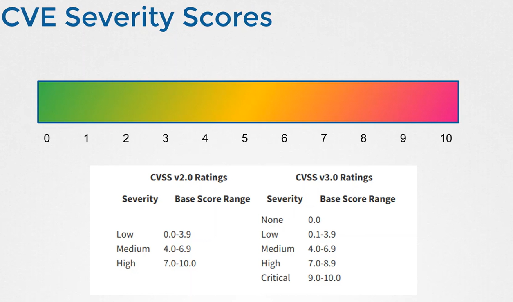
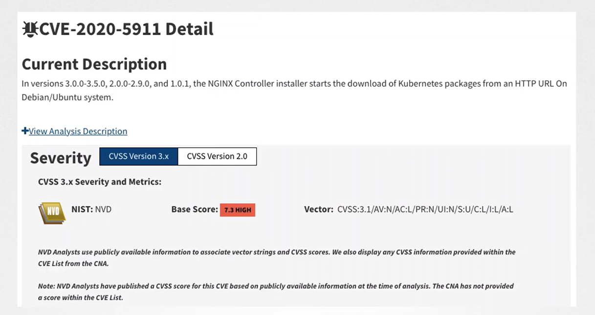

# 🛡️ **CVEs (Common Vulnerabilities and Exposures)**

_A foundational concept in security, DevOps, and cloud._

---

## ✅ **What is a CVE?**

A **CVE (Common Vulnerabilities and Exposures)** is a **public identifier for a cybersecurity vulnerability**.  
Think of it as a **serial number for a known security flaw**.

Example CVE ID:

```ini
CVE-2023-5458
```

This ID uniquely identifies a vulnerability in software, libraries, operating systems, containers, etc.

📌 CVEs:

- Do NOT contain full technical details
- Are simply an **index** to vulnerabilities
- Are globally recognized and maintained

---

<div align="center" style="background-color:#F1F1F1; border-radius: 10px; border: 2px solid">

</div>

---

## 🏢 **Who Maintains CVEs?**

CVEs are managed by:

### ✔ MITRE Corporation

- They maintain the CVE database and assign IDs
- Sponsored by the U.S. Department of Homeland Security (DHS)

### ✔ Vendors and researchers

- Discover and report vulnerabilities
- Request CVE IDs
- Publish advisories

### ✔ National Vulnerability Database (NVD)

- Adds more details
- Assigns severity scores (CVSS)

---

## 🔥 **Components of a CVE Record**

A CVE record includes:

| Field              | Meaning                            |
| ------------------ | ---------------------------------- |
| **CVE ID**         | Unique identifier                  |
| **Description**    | Short summary of the vulnerability |
| **References**     | Links to vendor advisories         |
| **CVSS Score**     | Severity rating (0.0–10.0)         |
| **Published Date** | When it became public              |

---

## 🎯 **What CVEs Actually Represent**

A CVE can represent vulnerabilities such as:

- ✔ Buffer overflow
- ✔ Arbitrary code execution
- ✔ Privilege escalation
- ✔ SQL injection
- ✔ Remote code execution (RCE)
- ✔ Zero-day vulnerabilities
- ✔ Misconfigurations in software
- ✔ Vulnerable third-party libraries
- ✔ Container image vulnerabilities

---

## 🚦 **CVSS — How CVEs Are Scored**

CVEs are rated using **CVSS (Common Vulnerability Scoring System)**:

| Score | Severity |
| ----- | -------- |
| 0–3.9 | Low      |
| 4–6.9 | Medium   |
| 7–8.9 | High     |
| 9–10  | Critical |

---

<div align="center" style="background-color:#F1F1F1; border-radius: 10px; border: 2px solid">

</div>

---

### 📃 Example:

<div align="center" style="background-color:#F1F1F1; border-radius: 10px; border: 2px solid">

</div>

---

## 🧊 **CVEs in Containers**

Tools like:

- **Trivy**
- **Grype**
- **Syft**
- **Anchore**
- **Docker Scout**
- **Clair**
- **Qualys**
- **JFrog Xray**

Scan:

- Container Images
- OS Packages
- Application libraries

And map them to CVEs.

Example output from Grype:

```ini
CVE-2023-12345  High   openssl 1.1.1f
CVE-2021-33574 Medium glibc   2.31
CVE-2020-1971  Critical openssl 1.1.1d
```

---

## ⁉️ **Why CVEs Matter in DevOps & Kubernetes**

### Because vulnerabilities come from:

- Base images
- Dependencies
- OS packages
- Kubernetes workloads
- Infrastructure (nodes, control plane)

### CVEs help with:

- ✔ Vulnerability management
- ✔ Hardening images
- ✔ Patching workloads
- ✔ CI/CD pipeline gatekeeping
- ✔ SBOM generation
- ✔ Compliance (NIST, ISO27001)
- ✔ Incident response

---

## ✍🏻 **Example: Finding CVEs Using Grype**

```bash
# scan a sbom report generated by syft
grype sbom.json --severities high,critical
```

Output:

```ini
CVE-2020-1971  Critical  openssl
CVE-2021-23017 High      nginx
```

---

## 🌍 **Where CVEs Are Listed**

| Platform                       | Purpose                 |
| ------------------------------ | ----------------------- |
| **MITRE CVE Database**         | Official identifiers    |
| **NVD**                        | CVSS scores, analysis   |
| **Vendor Advisories**          | Patches                 |
| **GitHub Security Advisories** | OSS vulnerabilities     |
| **Containers Scanners**        | Identify CVEs in images |

---

## ⚔️ **CVE vs CVSS vs CWE**

| Term     | Meaning                                     |
| -------- | ------------------------------------------- |
| **CVE**  | The vulnerability ID                        |
| **CVSS** | The severity score                          |
| **CWE**  | Root cause category (e.g., buffer overflow) |

Example:

- CVE: `CVE-2023-0001`
- CVSS: `9.8`
- CWE: `CWE-787 (Out-of-bounds Write)`

---

## 🧠 **Simple Analogy**

Think of CVEs like **product recall notices** for software.

- CVE = Product recall ID
- CVSS = Danger level
- Patch = Fix from the vendor
- Scanners = Tools that check if your product is affected

---

## 🏁 **15. Summary**

> A CVE is a publicly assigned ID for a security vulnerability.  
> DevOps teams use CVEs to identify risks in images, libraries, and dependencies.  
> Tools like Grype, Trivy, and Snyk detect CVEs.  
> The severity is rated using CVSS.  
> CVEs are essential for supply chain security, patch management, and compliance.
