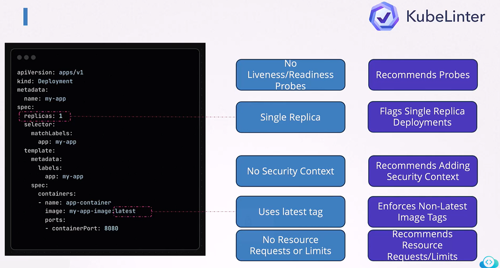
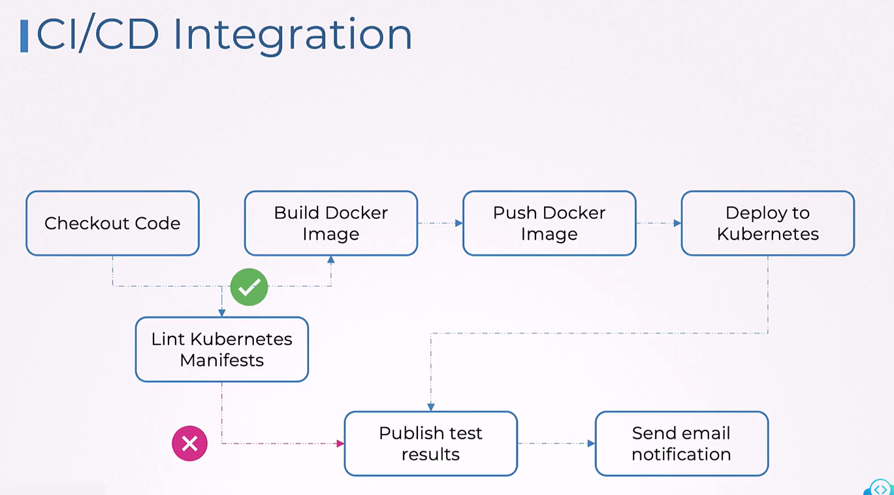

# 🧪 **KubeLinter – Kubernetes YAML Linting for Security & Best Practices**

**KubeLinter** is an **open-source static analysis tool** created by StackRox (now Red Hat ACS).
It scans your **Kubernetes YAML files and Helm charts** to detect:

- Misconfigurations
- Security risks
- Bad practices
- Missing recommended settings
- Incorrect or dangerous defaults

It works **before** your manifests reach Kubernetes — i.e., during **CI/CD**, PR reviews, or local development.

Think of **KubeLinter** as:

- ✔ “Security + Best-Practice Linter for Kubernetes Manifests”
- ✔ “Unit tests for your YAML files”
- ✔ “Prevent bad deployment configs _before_ they reach cluster”

---

<div align="center" style="background-color:#F1F1F1; border-radius: 10px; border: 2px solid">

</div>

---

## 🎯 **What KubeLinter Actually Checks**

KubeLinter has many built-in checks (called **linters**). Some examples:

### 🔐 **Security Checks**

- Containers running as **root**
- Missing `securityContext`
- Privileged containers
- Missing or insecure `PodDisruptionBudget`
- Containers with `hostNetwork`, `hostPID`, or `hostIPC`

### ⚙️ **Resource Checks**

- Missing CPU limits or memory limits
- No liveness/readiness probes
- Using “latest” tag for container images

### 🛡️ **Access Control Checks**

- Using `cluster-admin` role
- Pods with hostPath volumes
- Missing `networkPolicy`

### 🔄 **Deployment Checks**

- Deployment missing strategy
- StatefulSet without PodManagementPolicy
- CronJob missing concurrencyPolicy

---

## 🧰 **What KubeLinter Scans**

KubeLinter can lint:

| Item                                 | Example                           |
| ------------------------------------ | --------------------------------- |
| **Kubernetes YAML files**            | `deployment.yaml`, `service.yaml` |
| **Helm charts**                      | `helm lint` alternative           |
| **Directories**                      | `kubernetes-manifests/`           |
| **Rendered manifests**               | Using Helm template + kubeLinter  |
| **GitHub Actions / CI/CD pipelines** | PR checks                         |

---

## 💡 **Why You Need KubeLinter**

Kubernetes is powerful, but also easy to misconfigure.

Example:
You deploy a Pod that:

- Runs as root
- Has no resource limits
- Uses :latest tag
- Lacks readiness probes

… and it passes Kubernetes admission.
But it **fails production** or becomes a **security risk**.

KubeLinter catches these problems **before deployment**.

---

## 🧬 **How KubeLinter Works (Simple Diagram)**

```ini
     ┌──────────────────┐
     │ Kubernetes YAML  │
     │ or Helm Charts   │
     └───────┬──────────┘
             │
             ▼
   ┌──────────────────┐
   │   KubeLinter     │
   │ (static analysis)│
   └───────┬──────────┘
             │
     Apply 50+ built-in checks
             │
             ▼
   ┌──────────────────┐
   │ Linting Report   │
   │ (errors/warnings)│
   └──────────────────┘
```

---

## 🚀 **Installation**

### Linux / macOS

```bash
curl -s https://raw.githubusercontent.com/stackrox/kube-linter/main/install.sh | bash
```

### Homebrew

```bash
brew install kube-linter
```

### Windows

```bash
choco install kube-linter
```

---

## 🧪 **Basic Usage**

### 1️⃣ Lint a directory of manifests

```bash
kube-linter lint ./manifests
```

### 2️⃣ Lint a specific YAML file

```bash
kube-linter lint deployment.yaml
```

### 3️⃣ Lint a Helm chart

```bash
kube-linter lint ./charts/myapp
```

### 4️⃣ Show all built-in checks

```bash
kube-linter checks list
```

---

## 🔎 **Example – Scan a Deployment File**

Given a `deployment.yaml`:

```yaml
apiVersion: apps/v1
kind: Deployment
metadata:
  name: nginx
spec:
  replicas: 1
  template:
    spec:
      containers:
        - name: nginx
          image: nginx:latest
```

Run:

```bash
kube-linter lint deployment.yaml
```

**Output:**

```ini
Error: object has issues:
  [no-readiness-probe] container "nginx" has no readiness probe
  [latest-tag] container "nginx" uses a tag of "latest"
  [unset-cpu-requirements] container "nginx" has no CPU limits set
  [unset-memory-requirements] container "nginx" has no memory limits set
```

It tells you **exactly what to fix**.

---

## 🎛️ **Custom KubeLinter Config**

You can customize which checks are enabled.

Example: `.kube-linter.yaml`

```yaml
checks:
  include:
    - no-readiness-probe
    - no-liveness-probe
    - run-as-non-root
  exclude:
    - latest-tag
```

Run with:

```bash
kube-linter lint --config .kube-linter.yaml
```

---

## 🧩 **Helm + KubeLinter (Best Practice)**

For Helm charts:

```bash
helm template ./chart | kube-linter lint -
```

Or simply:

```bash
kube-linter lint ./chart
```

---

## 🧪 **Integrate KubeLinter in CI/CD**

<div align="center" style="background-color:#F1F1F1; border-radius: 10px; border: 2px solid">

</div>

---

### GitHub Actions

```yaml
name: KubeLinter

on: [push, pull_request]

jobs:
  lint:
    runs-on: ubuntu-latest
    steps:
      - uses: actions/checkout@v3
      - uses: stackrox/kube-linter-action@v1
        with:
          path: ./manifests
```

### Azure DevOps Pipeline

```yaml
- bash: |
    curl -s https://raw.githubusercontent.com/stackrox/kube-linter/main/install.sh | bash
    kube-linter lint ./manifests
  displayName: "Run KubeLinter"
```

---

## 🔐 **Key Checks (Beginner-Friendly List)**

### 🔥 Critical Security Checks

| Check                  | Meaning                              |
| ---------------------- | ------------------------------------ |
| `privileged-container` | container runs with full host access |
| `run-as-root`          | dangerous root user                  |
| `host-network`         | pod using host network               |
| `host-ports`           | exposes host-level ports             |
| `no-network-policy`    | pod has no network policy            |

### 🧱 Stability Checks

| Check                     | Meaning                        |
| ------------------------- | ------------------------------ |
| `no-readiness-probe`      | cannot know if app is ready    |
| `no-liveness-probe`       | cannot detect stuck containers |
| `min-replicas`            | replica count too low          |
| `deployment-has-hostpath` | unsafe hostPath volumes        |

### ⚙️ Resource Checks

| Check                       | Meaning                 |
| --------------------------- | ----------------------- |
| `unset-cpu-requirements`    | no CPU limit/request    |
| `unset-memory-requirements` | no memory limit/request |
| `latest-tag`                | image tag is “latest”   |

---

## 🧠 **KubeLinter vs. Other Tools**

| Tool               | Purpose                                 | Scan Type                 |
| ------------------ | --------------------------------------- | ------------------------- |
| **KubeLinter**     | Lint Kubernetes YAML for best practices | Static                    |
| **Kube-bench**     | CIS Benchmark compliance                | Runtime/Cluster           |
| **kube-hunter**    | Pen-test Kubernetes cluster             | Runtime/Attack simulation |
| **OPA Gatekeeper** | Policy enforcement in cluster           | Admission control         |
| **Kyverno**        | Validations + mutations                 | In-cluster enforcement    |

**KubeLinter = Pre-deployment YAML validator**
**Gatekeeper/Kyverno = In-cluster policy enforcement**

---

## 🎯 **Summary**

- **KubeLinter**: Static analysis tool for **Kubernetes YAML & Helm charts**
- Catches:

  - Security risks
  - Missing best practices
  - Incorrect manifests

- Supports:

  - YAML files
  - Helm charts
  - CI/CD pipelines

- Provides:

  - 50+ built-in checks
  - Custom rules
  - Clear actionable output

- Helps **prevent misconfigured deployments BEFORE they reach production**
