```mermaid
---
config:
  theme: dark
  look: handDrawn
title: "Falco Runtime Security in Kubernetes"
---

flowchart TD
    A["☸️ Kubernetes"]
    B["📦 Pod Runtime Activity"]
    C["🕵️ Falco (eBPF)<br>Monitors Syscalls"]
    D["📜 Applies Falco Rules"]
    E["🚨 Alerts / Actions"]

    A --> B
    B --> C
    C --> D
    D --> E
```

# 🐺 **Falco — Runtime Security for Kubernetes**

_Falco is the “security camera” of your containers and Kubernetes cluster._

---

## 📖 **What is Falco?**

**Falco** (originally by Sysdig, now a CNCF project) is a **runtime threat detection tool** for:

- Kubernetes clusters
- Linux hosts
- Containers
- Cloud-native workloads

Falco continuously monitors **syscalls** (system calls) in real time and triggers alerts when suspicious activity occurs.

---

<div align="center" style="background-color:#F1F1F1; border-radius: 10px; border: 2px solid">

</div>

---

<div align="center" style="background-color:#F1F1F1; border-radius: 10px; border: 2px solid">

</div>

---

## 🎥 **Think of Falco As:**

> “A security camera + intrusion detection system for your containers.”

Where tools like **Trivy** scan **images**,
**Falco** catches attacks **while containers are running**.

---

## 🔎 **What Falco Detects**

Falco detects behaviors such as:

- ✔ A container spawning a shell
- ✔ Unexpected file or directory changes
- ✔ Sensitive files being read
- ✔ Privilege escalation attempts
- ✔ Network connections to unknown IPs
- ✔ Writing to `/etc/passwd`
- ✔ Using `curl/wget` inside a pod
- ✔ Cryptomining indicators
- ✔ Exec into pods (`kubectl exec`)
- ✔ Kernel module loading (rootkits)

---

## ⁉️ **How Falco Actually Works**

Falco uses:

### **A. eBPF or Kernel Module (Syscall Capture)**

Falco attaches to the Linux kernel to watch system calls such as:

- `execve()`
- `open()`
- `read()`
- `write()`
- `connect()`

### **B. Rules Engine**

If a syscall violates a rule → **Alert**

### **C. Outputs**

- logs
- events
- Slack notifications
- Webhooks
- Alert managers
- SIEM (Splunk, ELK, Datadog)

---

## ⚙️ **Falco Architecture**

<div align="center" style="background-color:#F1F1F1; border-radius: 10px; border: 2px solid">

</div>

---

<div align="center" style="background-color: #141a19ff;color: #a8a5a5ff; border-radius: 10px; border: 2px solid">



</div>

---

## 📝 **Example Behaviors Falco Detects**

### 1️⃣ Container spawning a shell

❌ Dangerous behavior

```ini
Rule: Terminal shell in container
Condition: container.id != host and proc.name in (bash, sh, zsh)
Output: Container shell spawned
```

### 2️⃣ Writing to `/etc/shadow`

❌ Very suspicious

```ini
Rule: Modify shadow file
Condition: fd.name="/etc/shadow" and evt.type in (write)
```

### 3️⃣ Suspicious outbound network call

```ini
Rule: Contacting suspicious IP
Condition: evt.type=connect and fd.sip in (known_bad_ips)
```

---

## 📦 Installation

### 1️⃣ Install Falco as Systemd Service

> better of k8s comprimise and falco need to work independtly

```bash
# add falco repo
curl -s https://falco.org/repo/falcosecurity-3672BA8F.asc | sudo apt-key add -
echo "deb https://downloads.falco.org/packages/deb stable main" | sudo tee -a /etc/apt/sources.list.d/falcosecurity.list

# update
sudo apt-get update -y
sudo apt-get install -y linux-headers-$(uname -r)

# install falco
sudo apt-get install -y falco
sudo systemctl start falco
```

---

### 2️⃣ Install Falco as Kubernetes DaemonSet (use Helm)

```bash
helm repo add falcosecurity https://falcosecurity.github.io/charts
helm repo update
helm install falco falcosecurity/falco --namespace falco --create-namespace
```

---

## 🧪 **Test Falco** (Generate Alerts)

### If you installed Falco as a Systemd Service

See Service Profile:

```bash
sudo cat /lib/systemd/system/falco.service
```

Run:

```bash
sudo systemctl status falco
```

See Logs:

```bash
journalctl -u falco -f
```

---

### If you installed Falco as a Kubernetes DaemonSet

After installation, run:

```bash
kubectl exec -it <pod> -- bash
```

Falco will detect:

```ini
Falco alert: Terminal shell in container
```

Another test:

Inside a container:

```bash
touch /etc/shadow
```

Falco alert:

```ini
Falco alert: Write below etc detected (user=root)
```

---

## 📜 **Falco Rules (How You Customize Security)**

Falco uses rule files in YAML format:

### 🔹 Example: detect if a container uses `curl`

```yaml
- rule: Unexpected Curl Command
  desc: Detect curl in containers (data exfil)
  condition: evt.type=execve and container.id != host and proc.name=curl
  output: "Container using curl (user=%user.name container=%container.id)"
  priority: NOTICE
```

### 🔹 Example: prevent running as root

```yaml
- rule: Container Started As Root
  condition: container and user.uid=0
  output: "Pod running as root: %container.name"
  priority: WARNING
```

---

## 📦 **Falco Sidekick** (For Sending Alerts)

Falco can integrate with many outputs using **Falco Sidekick**:

### Install Sidekick

```bash
helm install falcosidekick \
     falcosecurity/falcosidekick \
     --namespace falco
```

### Sidekick Targets:

- Slack
- Teams
- Discord
- Kafka
- AWS SNS
- S3
- Webhook
- Elasticsearch
- Datadog
- Prometheus

---

## ⚔️ **Falco vs Other Tools**

| Tool               | Purpose                                         |
| ------------------ | ----------------------------------------------- |
| **Trivy**          | Scans vulnerabilities (CVE) in images/files/IaC |
| **Grype**          | Image CVE scanner                               |
| **KubeLinter**     | YAML static security checks                     |
| **Kubesec**        | YAML risk scoring                               |
| **Falco**          | Runtime detection (live monitoring)             |
| **OPA/Gatekeeper** | Admission control policies                      |

> 🧠 Think as:
> **Trivy/KubeLinter/Kubesec = Prevent security issues before deployment** > **Falco = Detect attacks after deployment**

---

## 🛡️ **Typical DevSecOps Workflow**

- 1️⃣ Build image -> Scan with Trivy
- 2️⃣ Validate YAML -> KubeLinter
- 3️⃣ Enforce policies -> OPA/Gatekeeper
- 4️⃣ Deploy
- 5️⃣ Monitor runtime -> Falco
- 6️⃣ Incident Response -> Alerting / dashboards

Falco is the **runtime** part of the pipeline.

---

## 🎯 When You Should Use Falco

Use Falco when you want:

- Real-time detection of suspicious actions
- Protection against zero-day attacks
- Monitoring of pod exec activity
- Defense against container escape attempts
- Detection of malicious scripts
- Runtime compliance & audit

Falco is essential for production-grade Kubernetes security.

---

## 🏁 Final Summary

<div align="center" style="background-color: #141a19ff;color: #a8a5a5ff; border-radius: 10px; border: 2px solid">

| Feature          | Explanation                                        |
| ---------------- | -------------------------------------------------- |
| **Falco**        | Runtime security engine for Kubernetes & nodes     |
| **Monitors**     | Syscalls (via eBPF)                                |
| **Detects**      | Suspicious behavior, privilege escalation, malware |
| **Strength**     | Zero-day behavior detection                        |
| **Rules**        | YAML-based, fully customizable                     |
| **Installation** | Helm-based DaemonSet                               |
| **Integrations** | Slack, SIEM, Prometheus, Webhooks                  |

</div>

> Falco is the **runtime security brain** of modern Kubernetes environments.

---

## 🔗 References:

- <https://falco.org/docs/getting-started/installation/>
- <https://github.com/falcosecurity/charts/tree/master/falco>
- <https://falco.org/docs/rules/supported-fields/>
- <https://falco.org/docs/rules/default-macros/>
- <https://falco.org/docs/configuration/>

---

If you want next:

- 🔸 **Falco + Falcosidekick with Slack notifications**
- 🔸 **How to write custom Falco rules**
- 🔸 **Falco vs eBPF security tools like Cilium Tetragon**
- 🔸 **Full hands-on setup for production clusters**

Just tell me!
