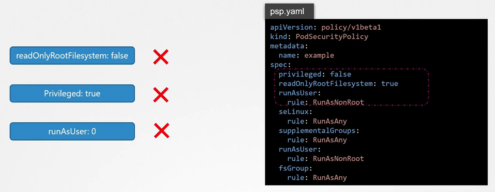
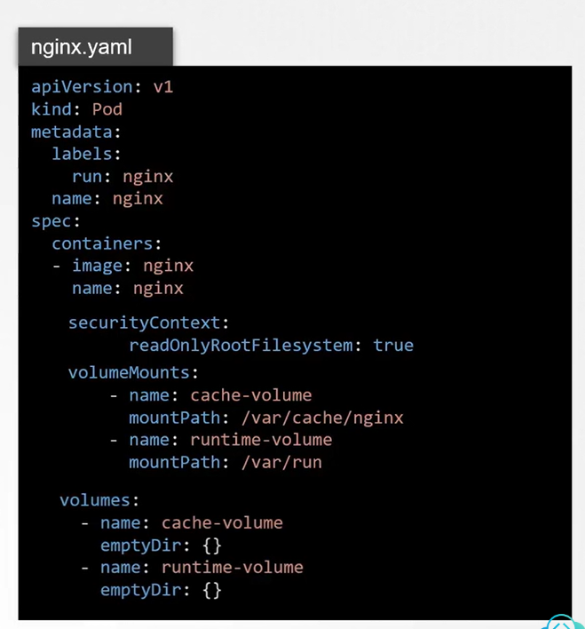

# 🧱 Ensure Immutability for Container at Runtime

Immutability means: once a container starts, **no changes to its filesystem, privileges, or behavior** are allowed. This protects against tampering, drift, and runtime exploits.

---

<div align="center" style="background-color:#F1F1F1; border-radius: 10px; border: 2px solid">

</div>

---

<div align="center" style="background-color:#F1F1F1; border-radius: 10px; border: 2px solid">

</div>

---

## 🔐 Core Strategies

| Strategy                          | Purpose                                    | Enforcement Method           |
| --------------------------------- | ------------------------------------------ | ---------------------------- |
| `readOnlyRootFilesystem: true`    | Prevent filesystem writes                  | Pod `securityContext`        |
| `privileged: false`               | Block host-level access                    | Pod `securityContext` + PSA  |
| `runAsNonRoot: true`              | Drop root privileges                       | Pod `securityContext`        |
| `allowPrivilegeEscalation: false` | Prevent privilege escalation               | Pod `securityContext`        |
| `capabilities.drop: ["ALL"]`      | Remove all Linux capabilities              | Pod `securityContext`        |
| Minimal base image (Distroless)   | Remove shells, compilers, package mgrs     | Dockerfile                   |
| `seccompProfile: RuntimeDefault`  | Block dangerous syscalls                   | Pod `securityContext`        |
| Image signing + digest pinning    | Ensure image integrity and reproducibility | CI/CD + Admission Controls   |
| Block `kubectl exec`              | Prevent shell access                       | RBAC + Admission Controllers |

---

## 🛡️ Policy Enforcement

### ✅ Pod Security Admission (PSA)

Use Kubernetes ≥1.25 built-in admission controller:

```bash
kubectl label ns secure \
  pod-security.kubernetes.io/enforce=restricted \
  pod-security.kubernetes.io/enforce-version=latest
```

> Blocks `privileged: true`, enforces `readOnlyRootFilesystem`, `runAsNonRoot`, etc.

---

### ✅ Kyverno / OPA Gatekeeper

Example Kyverno policy to block privileged pods:

```yaml
apiVersion: kyverno.io/v1
kind: ClusterPolicy
metadata:
  name: disallow-privileged
spec:
  validationFailureAction: enforce
  rules:
    - name: no-privileged
      match:
        resources:
          kinds: ["Pod"]
      validate:
        message: "Privileged containers are not allowed."
        pattern:
          spec:
            containers:
              - securityContext:
                  privileged: "false"
```

---

## 🧠 Summary Diagram (Textual)

```plaintext
Pod Spec ──> SecurityContext ──> Immutable Runtime
   │              │
   │              ├─ readOnlyRootFilesystem: true
   │              ├─ privileged: false
   │              ├─ runAsNonRoot: true
   │              ├─ drop capabilities
   │              └─ seccompProfile: RuntimeDefault
   │
   └─> Image ──> Signed + Pinned ──> Verified at Deploy
```

---

## 🔐 1. **Use Read-Only Root Filesystem**

Prevent writes to the container’s root filesystem:

### ✅ Kubernetes Pod Spec:

```yaml
securityContext:
  readOnlyRootFilesystem: true
```

### ✅ Docker CLI:

```bash
docker run --read-only ...
```

> This blocks writes to `/`, forcing apps to write only to explicitly mounted volumes (e.g., `/tmp`, `/var/log`).

---

## 🧱 2. **Avoid Writable Volumes Unless Necessary**

- Don’t mount `emptyDir`, `hostPath`, or PVCs unless the app truly needs them.
- If needed, mount them to **specific paths** (e.g., `/data`) — not `/` or `/var`.

---

## 🧑‍💻 3. **Run as Non-Root + Drop Capabilities**

Prevent privilege escalation and filesystem tampering:

```yaml
securityContext:
  runAsNonRoot: true
  capabilities:
    drop: ["ALL"]
```

---

## 🧬 4. **Use Distroless or Minimal Base Images**

- Avoid shells, package managers, and compilers in your image.
- Use [Distroless](https://github.com/GoogleContainerTools/distroless), [Wolfi](https://github.com/wolfi-dev), or [Alpine](https://alpinelinux.org) with care.

> No `bash`, no `apt`, no `curl` = no tampering.

---

## 🧪 5. **Use Seccomp + AppArmor Profiles**

- **Seccomp**: Restrict syscalls (e.g., block `mount`, `ptrace`, `chmod`)
- **AppArmor**: Restrict file access and execution

### Example:

```yaml
securityContext:
  seccompProfile:
    type: RuntimeDefault
```

---

## 🧰 6. **Use Image Signing + Verification**

- Sign images with **cosign** or **Notary**
- Enforce signature verification with **Kyverno**, **OPA Gatekeeper**, or **Sigstore policy-controller**

> Prevents tampered images from being deployed.

---

## 🧯 7. **Disable Exec and Shell Access**

- Block `kubectl exec` in production via RBAC
- Use admission controllers or PSP replacements to enforce

---

## 🧼 8. **Immutable Tags + Digest Pinning**

- Never use `:latest` — use immutable digests:

```yaml
image: myapp@sha256:abc123...
```

---

## 🧠 Summary Table

| Strategy                     | Enforces Immutability On     |
| ---------------------------- | ---------------------------- |
| `readOnlyRootFilesystem`     | Filesystem                   |
| Drop capabilities + non-root | Privilege boundaries         |
| Distroless base image        | Build-time attack surface    |
| Seccomp/AppArmor             | Syscall and file access      |
| Image signing                | Deployment integrity         |
| Digest pinning               | Image version control        |
| No exec/shell                | Runtime tampering prevention |
