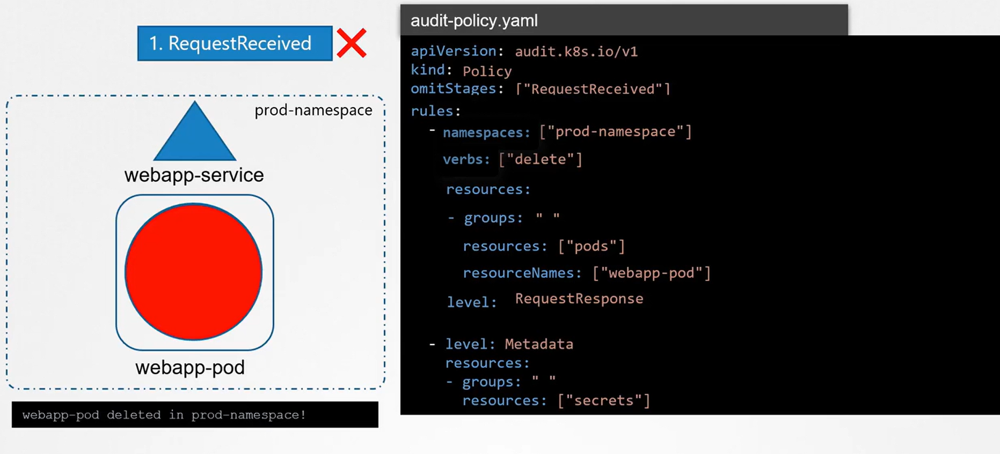
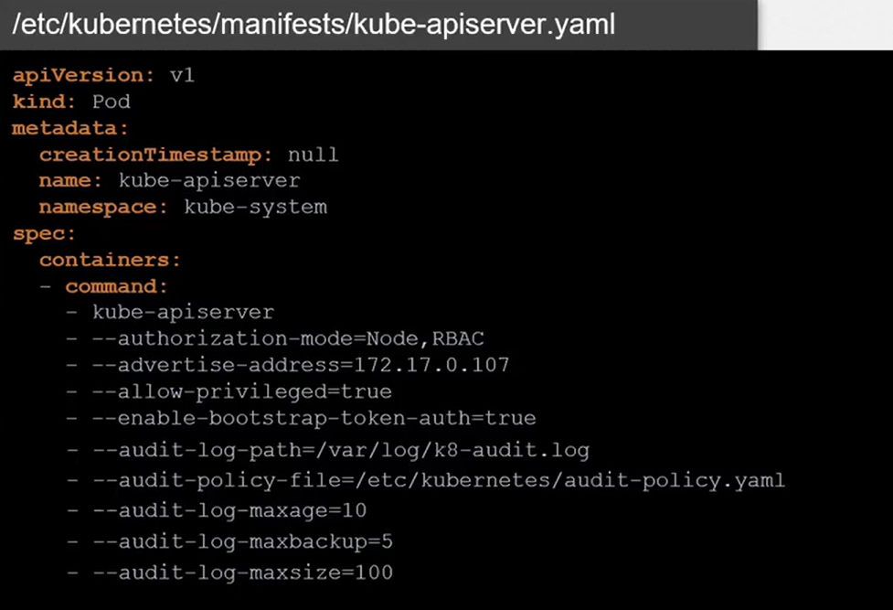
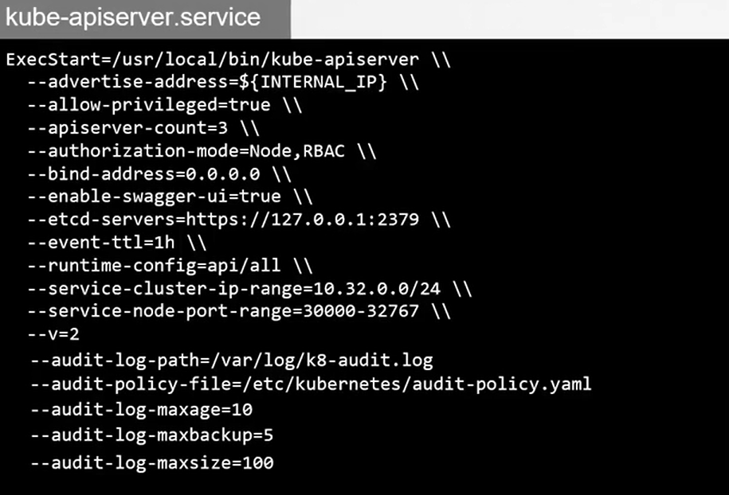

# 🔍 **Kubernetes Audit Logs**

## **Monitor Access, Track User Actions, and Strengthen Cluster Security**

Kubernetes **Audit Logs** record every request made to the Kubernetes API server.
They act like a **security camera** for your cluster.

They answer questions like:

- _“Who deleted that Deployment?”_
- _“Which user accessed this secret?”_
- _“Which pod started and why?”_
- _“What API calls came from that compromised service account?”_

Audit logging is **disabled by default** — you must enable it on the API server.

---

## 📖 **What Exactly Are Kubernetes Audit Logs?**

Kubernetes uses a **4-stage pipeline** to process API events:

### **1️⃣ Stage: RequestReceived**

API server got the request but hasn’t authenticated it yet.

### **2️⃣ Stage: RequestStarted**

Long-running requests (e.g., exec, logs) start.

### **3️⃣ Stage: RequestComplete**

Request is processed → succeeded or failed.

### **4️⃣ Stage: ResponseComplete**

Final response is sent.

Each event includes:

- **timestamp**
- **user identity (RBAC subject)**
- **impersonation info**
- **source IP**
- **verb** (`get`, `create`, `delete`, `patch`)
- **resource** (`pods`, `deployments`, `secrets`)
- **request + response status**

---

## ⚠️ **Why Audit Logs Are Critical**

| Problem                     | How Audit Logs Help             |
| --------------------------- | ------------------------------- |
| Suspicious pod creation     | Shows who created it + where    |
| Secret access               | Logs every GET on secrets API   |
| RBAC troubleshooting        | Shows denied actions            |
| Compliance (SOC2, ISO, PCI) | Full record of cluster activity |
| Forensics                   | Tracks attackers’ API calls     |

---

## ⚙️ **How to Enable Audit Logs (Control Plane)**

Audit logs require 2 components:

1. **Audit Policy File** → What to log
2. **Audit Log Backend** → Where to store logs

---

### 📄 **1. Create Audit Policy File**

Create a file:
`/etc/kubernetes/audit-policy.yaml`

Example **practical and secure** audit policy:

```yaml
apiVersion: audit.k8s.io/v1
kind: Policy

# Don't spam logs
omitStages: ["RequestReceived"]

rules:
  # 1. Log every change event
  - level: Metadata
    verbs: ["create", "update", "patch", "delete"]
    resources:
      - group: ""
        resources: ["pods", "services", "configmaps"]
      - group: "apps"
        resources: ["deployments", "daemonsets", "statefulsets"]

  # 2. Log secret access (very important)
  - level: Request
    resources:
      - group: ""
        resources: ["secrets"]

  # 3. Log failed requests (RBAC denied)
  - level: RequestResponse
    verbs: ["get", "list", "watch"]
    userGroups: ["system:unauthenticated"]

  # 4. Default: don't log every read
  - level: None
    resources:
      - group: ""
        resources: ["events"]
```

---

### 🏗️ **2. Start API Server with Audit Flags**

Add these flags to **kube-apiserver**:

```bash
--audit-policy-file=/etc/kubernetes/audit-policy.yaml
--audit-log-path=/var/log/kubernetes/audit.log
--audit-log-maxage=10
--audit-log-maxbackup=5
--audit-log-maxsize=100
```

On **kubeadm** clusters → edit manifest:

```bash
sudo vim /etc/kubernetes/manifests/kube-apiserver.yaml
```

Add flags under `command:`.

---

## ⚡ **Implementation Summary**

<div align="center" style="background-color:#F1F1F1; border-radius: 10px; border: 2px solid">

</div>

---

<div align="center" style="background-color:#F1F1F1; border-radius: 10px; border: 2px solid">

</div>

---

<div align="center" style="background-color:#F1F1F1; border-radius: 10px; border: 2px solid">

</div>

---

## 📂 **Where Audit Logs Are Stored**

Default path:

```ini
/var/log/kubernetes/audit.log
```

You read it like:

```bash
cat /var/log/kubernetes/audit.log | jq .
```

---

## 📝 **Example Logged Events (Very Useful Examples)**

### **Example: Who deleted a deployment?**

Search logs:

```bash
grep "delete" /var/log/kubernetes/audit.log | grep "Deployment"
```

Example output:

```json
{
  "user": { "username": "admin" },
  "verb": "delete",
  "objectRef": { "resource": "deployments", "name": "nginx" },
  "sourceIPs": ["192.168.4.20"],
  "responseStatus": { "code": 200 }
}
```

---

### **Example: Detect secret access**

```bash
grep "secrets" audit.log
```

Output:

```json
{
  "user": { "username": "ci-service-account" },
  "verb": "get",
  "objectRef": { "resource": "secrets", "name": "prod-db-credentials" }
}
```

---

### **Example: See denied RBAC actions**

```bash
grep '"code":403' audit.log
```

---

## 🔔 **Send Audit Logs to External SIEM (Highly Recommended)**

You can ship logs using:

- Fluent Bit → Elasticsearch/Opensearch/Splunk
- Loki → Grafana dashboard
- Filebeat → Logstash

Example Fluent Bit configuration:

```ini
[INPUT]
    Name tail
    Path /var/log/kubernetes/audit.log

[OUTPUT]
    Name  es
    Host  elasticsearch
    Port  9200
    Index k8s-audit
```

---

## ✅ **Best Practices for Kubernetes Audit Logging**

| Best Practice                                   | Reason                   |
| ----------------------------------------------- | ------------------------ |
| Don’t log full secrets                          | Prevent leakage          |
| Store logs off the cluster                      | For incident response    |
| Monitor for _exec into pods_                    | Common attacker behavior |
| Monitor for _creation of high-privileged roles_ | Privilege escalation     |
| Monitor for _token requests_                    | ServiceAccount abuse     |

---

## 🧪 How to Test Your Audit Setup

### Create a pod:

```bash
kubectl run nginx --image=nginx
```

Then check logs:

```bash
grep nginx audit.log | jq .
```

### Access a secret:

```bash
kubectl get secret default-token -o yaml
```

Check logs:

```bash
grep secrets audit.log
```

---

## 🎉 **Final Summary**

Kubernetes Audit Logs let you:

- Track every API request
- Identify who changed what
- Monitor secret reads
- Detect suspicious activity
- Troubleshoot RBAC
- Meet compliance requirements

They require:

1. **Audit Policy File**
2. **API Server flags**
3. **Log backend**
4. **Optional forwarding to SIEM**
