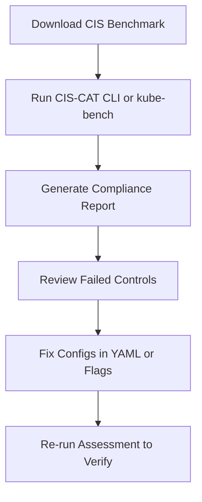

# 🧩 CIS Benchmarks & CIS-CAT Tools – Complete Documentation

<div align="center" style="background-color: #fff; border-radius: 10px; border: 2px solid">
  
</div>

<div align="center" style="background-color: #fff; border-radius: 10px; border: 2px solid">
  
</div>

<div align="center" style="background-color: #fff; border-radius: 10px; border: 2px solid">
  
</div>

---

## 🛡️ **CIS Benchmarks Overview**

### 📖 **What are CIS Benchmarks?**

The **CIS (Center for Internet Security) Benchmarks** are a collection of **security best practices and configuration standards** used globally to harden systems such as:

- Operating Systems (Linux, Windows, macOS)
- Cloud environments (AWS, Azure, GCP)
- Applications (Docker, Kubernetes, MySQL, etc.)

Each benchmark provides:

- **Control IDs** (e.g., 1.1.1, 1.2.3)
- **Audit commands** (to check compliance)
- **Rationale** (why it matters)
- **Remediation steps** (how to fix)
- **Scoring** (weighted compliance impact)

---

### 🎯 **Purpose**

The CIS Benchmarks help organizations:

- Prevent misconfigurations and security gaps.
- Measure compliance (e.g., PCI-DSS, ISO 27001).
- Standardize security posture across servers and clusters.

---

### 📝 **Benchmark Structure Example**

<div align="center" style="background:#343739ff; border-radius:20px">

| Control ID | Description                              | Level   | Audit                | Remediation                          |
| ---------- | ---------------------------------------- | ------- | -------------------- | ------------------------------------ |
| **1.1.1**  | Ensure `/etc/passwd` permissions are 644 | Level 1 | `stat /etc/passwd`   | `chmod 644 /etc/passwd`              |
| **1.2.7**  | API server should not use `AlwaysAllow`  | Level 1 | Check manifest flags | Use `--authorization-mode=Node,RBAC` |

</div>

---

### 📥 **Download Benchmarks**

1. Go to: [https://www.cisecurity.org/cis-benchmarks/#kubernetes](https://www.cisecurity.org/cis-benchmarks/#kubernetes)
2. Under **Server Software → Virtualization**, select **Kubernetes**.
3. Expand and download **CIS Kubernetes Benchmark v1.6.0** (or latest).
4. Use similar steps for:

   - **Ubuntu Linux**
   - **Docker**
   - **Windows Server**

---

### 🧩 **Popular Benchmarks**

<div align="center" style="background:#343739ff; border-radius:20px">

| Platform     | Benchmark File                           | Version |
| ------------ | ---------------------------------------- | ------- |
| Ubuntu 22.04 | CIS_Ubuntu_Linux_22.04_LTS_Benchmark.pdf | v1.1.0  |
| Kubernetes   | CIS_Kubernetes_Benchmark.pdf             | v1.6.0  |
| Docker       | CIS_Docker_Community_Benchmark.pdf       | v1.4.0  |

</div>

---

## 🔨 **CIS-CAT**

### 📖 **What is CIS-CAT?**

**CIS-CAT (CIS Configuration Assessment Tool)** automates checking your system against the CIS Benchmark controls.
It’s available in two editions:

<div align="center" style="background:#343739ff; border-radius:20px">

| Edition                  | Description                                            | License             |
| ------------------------ | ------------------------------------------------------ | ------------------- |
| **CIS-CAT Pro Assessor** | Full-featured CLI tool with reporting and remote scans | Requires membership |
| **CIS-CAT Lite**         | Free, limited tool for local assessments               | Free to download    |

</div>

---

### 🅰️ **Install CIS-CAT Lite (Free Version)**

#### **Step 1: Download**

Go to: [https://learn.cisecurity.org/cis-cat-lite](https://learn.cisecurity.org/cis-cat-lite)
Fill out the form and download `CIS-CAT-Lite-vX.Y.Z.zip`.

#### **Step 2: Extract**

```bash
mkdir -p ~/cis-cat-lite
cd ~/cis-cat-lite
unzip ~/Downloads/CIS-CAT-Lite-vX.Y.Z.zip
```

#### **Step 3: Run**

```bash
cd CIS-CAT-Lite
./CIS-CAT-Lite.sh
```

---

### 🅱️ **Run CIS-CAT Lite on Ubuntu Server**

1. Choose **Option 1: Run a Local Assessment**.
2. Select **Ubuntu Linux Benchmark** when prompted.
3. The tool scans the server’s configuration.
4. Reports are generated under:

   ```ini
   CIS-CAT-Lite/output/reports/
   ```

**Example Files:**

```ini
Ubuntu_Assessment_2025-11-10.html
Ubuntu_Assessment_2025-11-10.csv
```

---

### 🧾 **View the Report**

Open the HTML report in your browser.

**Sections:**

- **Summary** → Total Passed / Failed
- **Overall Score** → Compliance percentage
- **Failed Controls** → Details of issues
- **Remediation Steps** → Commands or configs to fix

---

### 🧪 **Example Output Snippet**

```ini
Control: 1.1.1 Ensure permissions on /etc/passwd are configured
Status: FAIL
Detected: Permissions 666
Remediation: chmod 644 /etc/passwd
```

✅ After fixing, re-run CIS-CAT to verify improvement.

---

### ⚙️ **Optional: CIS-CAT Pro Assessor CLI**

If you have CIS membership:

```bash
cd /opt/cis-cat/Assessor-CLI
sudo ./Assessor-CLI.sh \
-benchmark benchmarks/CIS_Ubuntu_Linux_22.04_LTS_Benchmark_v1.1.0-xccdf.xml \
-report
```

📊 Reports will appear in:

```ini
/opt/cis-cat/Assessor-CLI/output/reports/
```

---

### 💡 **Tip**

Add a `cron` job to run weekly:

```bash
sudo crontab -e
```

```ini
0 2 * * 0 /opt/cis-cat/Assessor-CLI/Assessor-CLI.sh -benchmark benchmarks/CIS_Ubuntu_Linux_22.04_LTS_Benchmark_v1.1.0-xccdf.xml -report
```

---

## ☸️ **CIS Benchmarking for Kubernetes Cluster**

### 🎯 **Goal**

To assess and harden your **Kubernetes control plane and worker nodes** based on the **CIS Kubernetes Benchmark**.

---

### 🧩 **A. Download Kubernetes Benchmark**

1. Visit [https://www.cisecurity.org/cis-benchmarks/#kubernetes](https://www.cisecurity.org/cis-benchmarks/#kubernetes)
2. Download **CIS Kubernetes Benchmark v1.6.0 (or later)**.
3. Optionally, if you’re a member, download the **Assessor XML file** from SecureSuite.

---

### 🧩 **B. Install CIS-CAT (Pro Version Recommended)**

If you have SecureSuite:

```bash
cd /opt/cis-cat/Assessor-CLI
sudo ./Assessor-CLI.sh -v
```

Otherwise, use **kube-bench** for a similar open-source check:

```bash
curl -L https://github.com/aquasecurity/kube-bench/releases/latest/download/kube-bench_$(uname -s)_$(uname -m).tar.gz -o kube-bench.tar.gz
tar -xzf kube-bench.tar.gz
sudo mv kube-bench /usr/local/bin/
```

---

### 🧪 **C. Run Kubernetes Assessment**

#### Option 1: CIS-CAT Pro Assessor

```bash
sudo ./Assessor-CLI.sh \
-benchmark benchmarks/CIS_Kubernetes_Benchmark_v1.24.0-xccdf.xml \
-report
```

#### Option 2: kube-bench (Open Source)

```bash
sudo kube-bench run
```

---

### 🧾 **Example Output (kube-bench)**

```ini
== Summary ==
12 checks PASS
5 checks FAIL
3 checks WARN
```

Example failed check:

```ini
[FAIL] 1.2.7 Ensure that the --authorization-mode argument is not set to AlwaysAllow
```

✅ **Fix:**
Edit `/etc/kubernetes/manifests/kube-apiserver.yaml`:

```yaml
- --authorization-mode=Node,RBAC
```

---

### 🧱 **Common K8s CIS Controls to Practice**

<div align="center" style="background:#343739ff; border-radius:20px">

| Area         | Control                     | Example Fix                         |
| ------------ | --------------------------- | ----------------------------------- |
| API Server   | `--anonymous-auth=false`    | Disable anonymous access            |
| API Server   | `--authorization-mode=RBAC` | Avoid `AlwaysAllow`                 |
| Kubelet      | `--read-only-port=0`        | Disable unauthenticated port        |
| Kubelet      | `--anonymous-auth=false`    | Require cert-based auth             |
| Etcd         | File permissions 600        | Secure `/etc/kubernetes/pki/etcd`   |
| Audit Logs   | Enable audit policy         | `/etc/kubernetes/audit-policy.yaml` |
| Pod Security | Enforce restricted profile  | PodSecurityAdmission                |

</div>

---

### 📃 **Report Analysis**

Output is stored under:

```ini
/opt/cis-cat/Assessor-CLI/output/reports/Kubernetes_Assessment_<date>.html
```

View sections:

- Cluster summary
- Failed controls
- Node-level details
- Fix recommendations

---

### 🖼️ **Visual Workflow**

<div align="center" style="background:#343739ff; border-radius:20px">



</div>

---

## ✅ Summary

<div align="center" style="background:#343739ff; border-radius:20px">

| Area               | Tool                      | Command Example                                       | Output              |
| ------------------ | ------------------------- | ----------------------------------------------------- | ------------------- |
| Ubuntu Server      | CIS-CAT Lite              | `./CIS-CAT-Lite.sh`                                   | HTML report         |
| Ubuntu Server      | CIS-CAT Pro               | `./Assessor-CLI.sh -benchmark CIS_Ubuntu.xml -report` | Compliance score    |
| Kubernetes Cluster | kube-bench or CIS-CAT Pro | `sudo kube-bench run`                                 | Pass/Fail results   |
| Audit Reports      | HTML/CSV                  | `output/reports/*.html`                               | Full CIS compliance |

</div>
